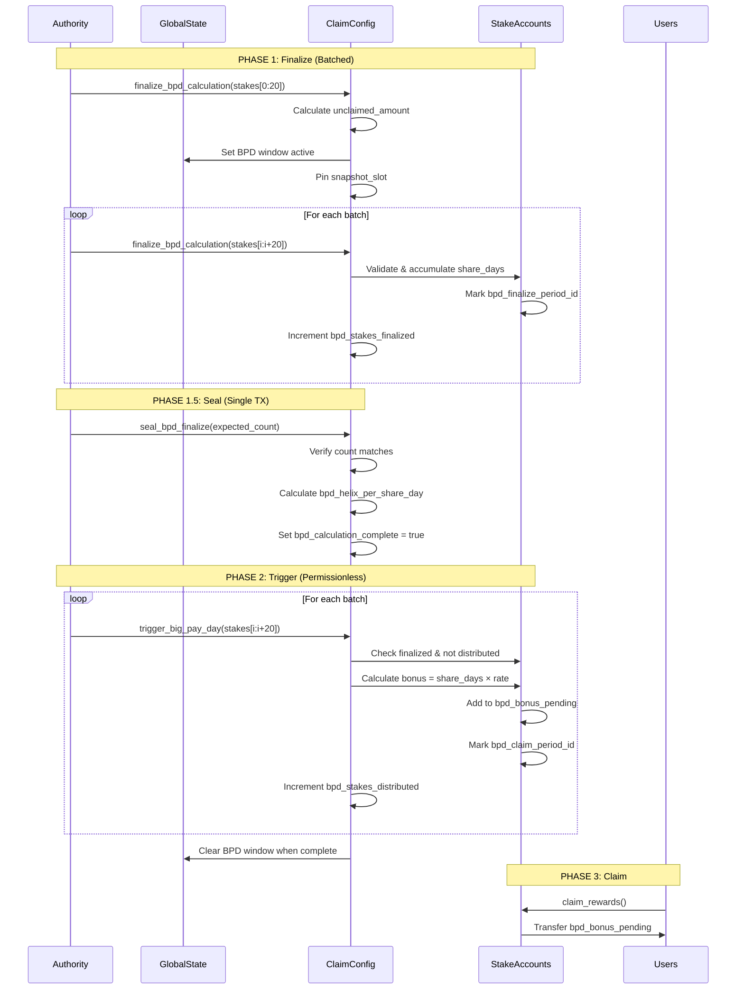

# BPD Architecture Documentation

## Summary

Comprehensive technical documentation of the Big Pay Day (BPD) system architecture, including 3-phase batched distribution flow, data structures, security fixes timeline, operational procedures, and known tech debt.

## System Architecture

### Three-Phase Distribution Flow

**Phase 1: Finalize (Authority-Only, Batched)**
- Instruction: `finalize_bpd_calculation`
- Batch size: 20 stakes per transaction
- Purpose: Accumulate total share-days across all eligible stakes

**Phase 1.5: Seal (Authority-Only, Single TX)**
- Instruction: `seal_bpd_finalize`
- Purpose: Calculate and lock the distribution rate
- Formula: `rate = (unclaimed_amount × PRECISION) / total_share_days`

**Phase 2: Trigger (Permissionless, Batched)**
- Instruction: `trigger_big_pay_day`
- Batch size: 20 stakes per transaction
- Purpose: Distribute bonuses using pre-calculated rate

**Phase 3: Claim (User-Initiated)**
- Instruction: `claim_rewards` (not analyzed)
- Purpose: Transfer `bpd_bonus_pending` to user wallets

### Process Flow Diagram



---

## Data Structures

### ClaimConfig (184 bytes)
```rust
pub struct ClaimConfig {
    // Core claim period
    merkle_root: [u8; 32],
    total_claimable: u64,
    total_claimed: u64,
    start_slot: u64,
    end_slot: u64,
    claim_period_id: u32,

    // BPD accumulation state
    bpd_total_share_days: u128,        // Sum of all share-days
    bpd_helix_per_share_day: u128,     // Locked rate
    bpd_remaining_unclaimed: u64,      // Decrements per batch
    bpd_snapshot_slot: u64,            // Pinned for consistency

    // BPD completion tracking
    bpd_stakes_finalized: u32,         // Count of finalized stakes
    bpd_stakes_distributed: u32,       // Count of distributed stakes
    bpd_calculation_complete: bool,    // Rate locked?
    big_pay_day_complete: bool,        // All distributed?
}
```

### StakeAccount (117 bytes)
```rust
pub struct StakeAccount {
    // Core stake data
    user: Pubkey,
    stake_id: u64,
    staked_amount: u64,
    t_shares: u64,
    start_slot: u64,
    end_slot: u64,
    is_active: bool,

    // BPD tracking
    bpd_bonus_pending: u64,            // Accumulated bonus
    bpd_finalize_period_id: u32,       // Counted in finalize?
    bpd_claim_period_id: u32,          // Distributed to?

    // DEPRECATED (layout compatibility)
    bpd_eligible: bool,
    claim_period_start_slot: u64,
}
```

---

## Security Fixes Timeline

### Phase 3.2 - Original CRIT Fixes
**CRIT-1: Per-batch rate calculation**
- Problem: First caller could calculate rate with only their stake, drain pool
- Fix: Split into finalize (accumulate) + seal (calculate rate)

**CRIT-2: Duplicate distribution**
- Problem: Stakes could receive BPD multiple times
- Fix: Track `bpd_claim_period_id` per stake

### Phase 3.3 - Post-Audit Hardening
**M-1: Griefing via permissionless finalize**
- Problem: Attacker could cherry-pick stakes or spam batches
- Fix: Made `finalize_bpd_calculation` authority-only

**HIGH-2: BPD window timing**
- Problem: Users could unstake during BPD, manipulate shares
- Fix: Activate `bpd_window_active` on first finalize batch

**H-1: Zero-bonus resubmission**
- Problem: Stakes with 0 bonus could inflate counters
- Fix: Mark zero-bonus stakes as processed

**MED-1: Unsafe casting**
- Problem: `bonus_u128 as u64` silently truncates overflow
- Fix: Use `try_from` with error handling

**Additional Improvements**:
- Counter-based completion (`distributed >= finalized`) prevents rounding exploits
- Snapshot slot pinning ensures consistent days_staked across batches
- Finalize phase duplicate prevention via `bpd_finalize_period_id`

---

## Operational Procedures

### Authority Workflow

**Step 1: Monitor Claim Period End**
```bash
# Check if claim period ended
solana epoch-info
# Compare current slot with claim_config.end_slot
```

**Step 2: Count Eligible Stakes**
```typescript
// Off-chain script using getProgramAccounts
const stakes = await connection.getProgramAccounts(
  programId,
  {
    filters: [
      { dataSize: 117 },  // StakeAccount size
      { memcmp: { offset: 89, bytes: '1' } },  // is_active = true
      // Add start_slot range filters
    ]
  }
);
const count = stakes.length;
```

**Step 3: Run Finalize Batches**
```bash
# Process all stakes in batches of 20
anchor run finalize-bpd --stakes-file eligible-stakes.json
# Repeat until bpd_stakes_finalized reaches expected count
```

**Step 4: Seal the Rate**
```bash
anchor run seal-bpd --expected-count 1247
```

**Step 5: Trigger Distribution (Optional)**
```bash
# Authority can trigger, or wait for community
anchor run trigger-bpd --stakes-file eligible-stakes.json
```

### Batch Sizing Examples

| Eligible Stakes | Finalize TXs | Trigger TXs | Estimated Cost |
|----------------|--------------|-------------|----------------|
| 100 | 5 | 5 | ~1 SOL |
| 1,000 | 50 | 50 | ~10 SOL |
| 10,000 | 500 | 500 | ~100 SOL |

---

## Known Issues & Tech Debt

### Critical Issues
- ❌ **abort_bpd broken** - Doesn't reset individual stake markings

### Operational Concerns
- ⚠️ No incentive for permissionless trigger calls
- ⚠️ Off-chain count mismatch blocks seal
- ⚠️ Silent account skipping (hard to debug)

### Code Quality
- 📝 Eligibility checks duplicated between finalize and trigger
- 📝 Deprecated fields consume 9 bytes per stake (bpd_eligible, claim_period_start_slot)
- 📝 Event truncation for u128 values (theoretical issue)

### Future Improvements
- Consider minimum stake size to reduce dust DOS risk
- Add trigger reward mechanism for permissionless completion
- Extract shared eligibility validation logic
- Add operational events for skipped accounts

---

## Testing Recommendations

**Critical Test Cases**:
1. ✅ Normal flow: finalize → seal → trigger
2. ✅ Duplicate prevention: resubmit same stake
3. ✅ Zero-bonus handling
4. ❌ **abort_bpd state leak** (proves HIGH issue)
5. ✅ Counter-based completion with rounding
6. ✅ Arithmetic limits: max t_shares × max days
7. ⚠️ Off-chain count mismatch scenario
8. ⚠️ BPD window unstaking block

**Load Testing**:
- Test with 10,000+ stakes to validate batch processing
- Measure compute usage per batch
- Test RPC performance for getProgramAccounts

Documentation for [[bpd-comprehensive-analysis-feb-9-2026.md]]
