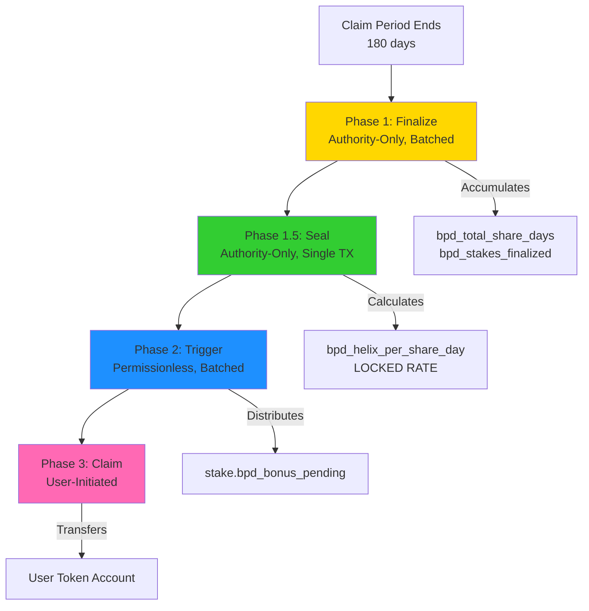

# BPD System: Comprehensive Security & Code Analysis

## Summary

Completed three-phase analysis of the Big Pay Day (BPD) distribution system:
1. **Security Analysis**: Identified 1 HIGH severity issue in `abort_bpd`, 1 MEDIUM operational risk, 2 LOW issues
2. **Documentation**: Created comprehensive architecture and operational guide
3. **Code Review**: Reviewed 5 instruction files with detailed quality assessment

**Overall Verdict**: CONDITIONAL - Core BPD distribution is production-ready, but `abort_bpd` instruction has critical flaw.

## Key Findings

### 🔴 CRITICAL: abort_bpd State Inconsistency (HIGH)
The `abort_bpd` instruction resets global BPD state but **does not reset** individual `bpd_finalize_period_id` fields on already-processed stakes. Result: Stakes counted before abort are **permanently excluded** from restarted BPD.

**Recommendation**: Remove `abort_bpd` instruction entirely or completely rewrite with stake iteration.

### ⚠️ seal_bpd_finalize Off-Chain Trust (MEDIUM)
Requires authority to provide correct `expected_finalized_count` via off-chain `getProgramAccounts`. RPC inconsistencies can block completion.

### ✅ Core Security: Verified Secure
- Arithmetic safety: All checked operations, safe u128→u64 casting
- Duplicate prevention: Three-layer protection (finalize ID + trigger ID + zero-bonus handling)
- Authority gating: Proper constraints on sensitive operations
- BPD window: Prevents unstaking during distribution

## Files Analyzed

**Instructions (5 files)**:
- `programs/helix-staking/src/instructions/finalize_bpd_calculation.rs` (188 lines) - ⭐4.5/5
- `programs/helix-staking/src/instructions/seal_bpd_finalize.rs` (77 lines) - ⭐5/5
- `programs/helix-staking/src/instructions/trigger_big_pay_day.rs` (264 lines) - ⭐4/5
- `programs/helix-staking/src/instructions/abort_bpd.rs` (62 lines) - ⭐2/5 **BROKEN**
- `programs/helix-staking/src/instructions/free_claim.rs` (364 lines) - ⭐5/5

**State Files (2 files)**:
- `programs/helix-staking/src/state/claim_config.rs`
- `programs/helix-staking/src/state/stake_account.rs`

## Detailed Findings

For detailed analysis, see child nodes:
- [[bpd-security-analysis-feb-9-2026.md]] - Security vulnerabilities and mitigations
- [[bpd-architecture-documentation-feb-9-2026.md]] - System architecture and operational guide
- [[bpd-code-review-feb-9-2026.md]] - Line-by-line code quality assessment

## Architecture Overview

### NOTES

**Complexity Score**: ⚠️ **HIGH** (9/10)
- Most complex subsystem in Helix staking protocol
- 3-phase batched architecture with cross-phase state dependencies
- Multiple counter-based completion checks
- Authority-gating mixed with permissionless phases
- Historical security fixes add cognitive load (deprecated fields, fix comments)

**What Makes It Complex**:
1. Phase separation requires understanding global state machine
2. Duplicate prevention uses two separate tracking fields
3. Arithmetic uses u128 for intermediate calculations, u64 for storage
4. Batch processing requires careful PDA validation and iteration
5. Snapshot slot pinning for consistency across batches
6. Counter-based completion to prevent rounding exploits

**Technical Debt**:
- Code duplication between finalize and trigger eligibility checks
- Deprecated fields on StakeAccount (bpd_eligible, claim_period_start_slot)
- Silent account skipping on validation failures (hard to debug)
- No incentive mechanism for permissionless trigger calls

Analyzed [[free-claim-and-bpd.md]]
