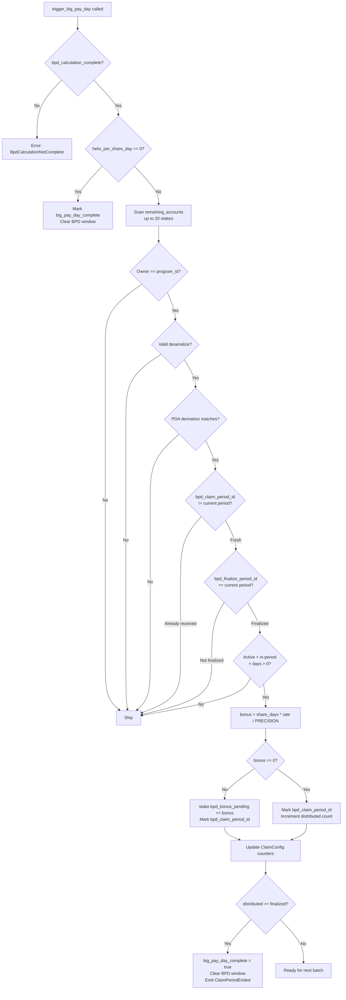

# BPD Distribution & Abort

## Permissionless batched bonus distribution to stakes and authority-gated emergency abort

After the finalize phase computes the global BPD rate, `trigger_big_pay_day` distributes bonuses to individual stakes proportionally. It is permissionless (anyone can crank it). The `abort_bpd` instruction is an authority-only emergency escape hatch.

### Instruction: `trigger_big_pay_day`

**Source:** `programs/helix-staking/src/instructions/trigger_big_pay_day.rs`

### Distribution Flow



### Account Constraints

- **caller**: Any `Signer` (permissionless -- designed to be cranked by bots or the frontend)
- **claim_config**: `claim_period_started`, `!big_pay_day_complete`, `bpd_calculation_complete` (must be sealed first)
- **remaining_accounts**: Up to 20 StakeAccount PDAs (read-write)

### Per-Stake Bonus Calculation

```
share_days = t_shares * min(snapshot_slot, end_slot) - start_slot) / slots_per_day
bonus_u128 = share_days * bpd_helix_per_share_day / PRECISION
bonus = u64::try_from(bonus_u128)   // MED-1: safe cast instead of 'as u64'
```

### Dual Anti-Duplicate System

Two separate period-tracking fields on `StakeAccount` prevent different classes of exploits:

| Field | Set By | Purpose |
|-------|--------|---------|
| `bpd_finalize_period_id` | `finalize_bpd_calculation` | Marks stake as "counted in share-days total" |
| `bpd_claim_period_id` | `trigger_big_pay_day` | Marks stake as "received BPD bonus" |

**CRIT-NEW-1 enforcement**: `trigger_big_pay_day` requires `bpd_finalize_period_id == claim_period_id` before distributing. This ensures only stakes that were included in the denominator (share-days total) can receive a numerator (bonus). Without this, an attacker could inject stakes into trigger that were not counted during finalize, inflating distributions.

### Completion Logic

Counter-based: `bpd_stakes_distributed >= bpd_stakes_finalized`. This avoids rounding-based completion bugs and provides a deterministic "are we done?" check. When complete:
1. `big_pay_day_complete = true`
2. `bpd_remaining_unclaimed = 0`
3. `global_state.set_bpd_window_active(false)` (re-enables unstaking)
4. Emits `ClaimPeriodEnded` event

**Over-distribution guard (MED-3):** `bpd_remaining_unclaimed.checked_sub(batch_distributed)` returns `HelixError::BpdOverDistribution` if bonuses exceed the pool. This is a safety net against rate calculation rounding errors.

### Zero-Bonus Handling (H-1 Fix)

Stakes with `bonus == 0` (due to rounding or tiny share-days) still get their `bpd_claim_period_id` set and `bpd_stakes_distributed` incremented. Without this fix, zero-bonus stakes would never be marked as processed, causing them to be resubmitted infinitely and preventing completion.

---

### Instruction: `abort_bpd`

**Source:** `programs/helix-staking/src/instructions/abort_bpd.rs`

**Account constraints:**
- **authority**: Must be `Signer` and match `global_state.authority` (via `has_one`)
- **global_state**: Mutable (to clear BPD window)
- **claim_config**: Mutable (to reset BPD state)

**Precondition:** `global_state.is_bpd_window_active() == true` (HelixError::BpdWindowNotActive)

**Effect -- full BPD state reset:**
```
bpd_calculation_complete = false
bpd_helix_per_share_day = 0
bpd_total_share_days = 0
bpd_snapshot_slot = 0
bpd_stakes_finalized = 0
bpd_stakes_distributed = 0
bpd_remaining_unclaimed = 0
global_state.set_bpd_window_active(false)
```

Emits `BpdAborted { claim_period_id, stakes_finalized, stakes_distributed }`.

### Notable Gotchas

- **abort_bpd does NOT reset per-stake fields**: `bpd_finalize_period_id` and `bpd_claim_period_id` on individual `StakeAccount`s are NOT cleared by abort. If a new BPD cycle is started with the same `claim_period_id`, stakes already marked will be skipped. This is a known HIGH severity issue -- an abort mid-distribution can leave some stakes marked as "already received" even though their bonuses in `bpd_bonus_pending` were never actually committed to a completed cycle.
- **Permissionless trigger is a feature**: Anyone can crank `trigger_big_pay_day` because the rate is pre-calculated and stakes must be finalize-marked. There is no economic advantage to front-running or reordering because the rate is global and fixed.
- **Rounding dust**: Due to integer division in the rate calculation, the sum of all individual bonuses may be slightly less than `bpd_remaining_unclaimed`. The counter-based completion handles this gracefully -- it does not require the pool to reach exactly zero.
- **Empty batch returns Ok(())**: If all 20 accounts in a trigger batch are ineligible (already received, not finalized, etc.), the instruction succeeds silently. The caller must track `bpd_stakes_distributed` off-chain to know when to stop.
- **Bonus stored, not minted**: `trigger_big_pay_day` adds bonus to `stake.bpd_bonus_pending` -- it does NOT mint tokens. The actual minting happens when the user unstakes (in `end_stake` or similar). This is a deferred-mint pattern.

[[free-claim-and-bpd.md]]
