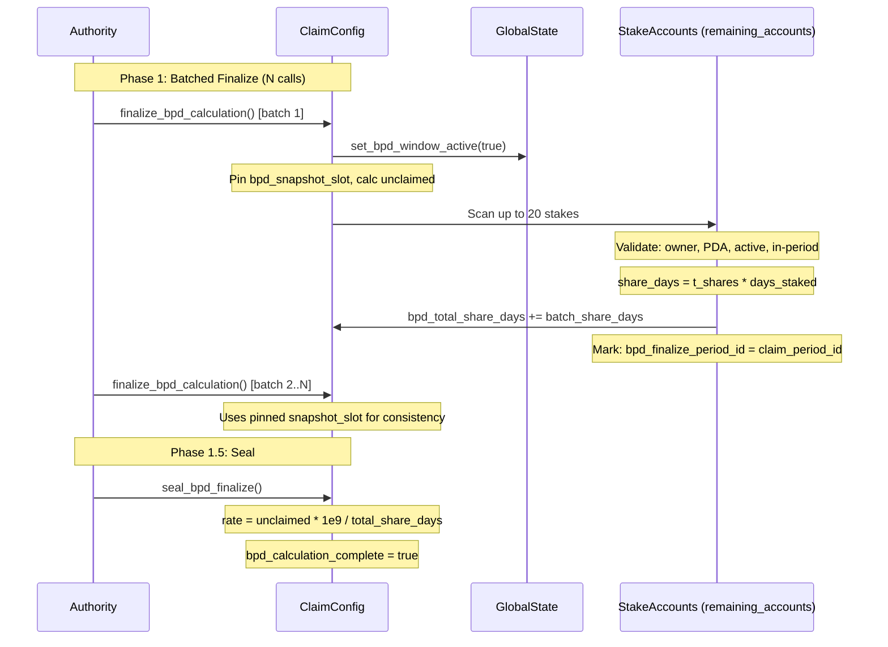

# BPD Finalize Phase

## Authority-gated batched scan of all stakes to accumulate share-days and compute the BPD distribution rate

After the 180-day claim period ends, the unclaimed token pool must be distributed to eligible stakers. The finalize phase scans all stakes in batches of 20, accumulates `t_shares * days_staked` (share-days), then a separate `seal_bpd_finalize` call computes the global rate. This two-step design prevents the critical "first-batch-drains-pool" attack.

### Instructions

**Source files:**
- `programs/helix-staking/src/instructions/finalize_bpd_calculation.rs`
- `programs/helix-staking/src/instructions/seal_bpd_finalize.rs`

### Phase Diagram

### finalize_bpd_calculation

**Account constraints:**
- **caller**: Must match `global_state.authority` (M-1 fix: prevents griefing by arbitrary callers)
- **claim_config**: `claim_period_started == true`, `bpd_calculation_complete == false`, `big_pay_day_complete == false`
- **remaining_accounts**: Up to 20 StakeAccount PDAs (read-write)

**Per-stake validation pipeline:**
1. `account_info.owner == program_id` (ownership check)
2. `data.len() >= StakeAccount::LEN` (skip un-migrated)
3. `StakeAccount::try_deserialize` succeeds (valid Anchor discriminator)
4. `stake.bpd_finalize_period_id != claim_period_id` (CRIT-NEW-1: duplicate prevention)
5. PDA re-derivation: `create_program_address([STAKE_SEED, user, stake_id, bump])` matches account key
6. `is_active == true`
7. `start_slot >= claim_config.start_slot` (created during or after period start)
8. `start_slot <= claim_config.end_slot` (created before period ended)
9. `days_staked > 0` where `days_staked = (min(snapshot_slot, end_slot) - start_slot) / slots_per_day`

**First-batch initialization:**
- Detects first batch when `bpd_remaining_unclaimed == 0 && bpd_total_share_days == 0 && bpd_snapshot_slot == 0`
- Calculates `unclaimed = total_claimable - total_claimed`
- Pins `bpd_snapshot_slot = clock.slot` for consistent days_staked across all batches
- Activates BPD window via `global_state.set_bpd_window_active(true)` (HIGH-2: blocks unstaking)

**Zero unclaimed fast path:** If `unclaimed == 0`, immediately sets `bpd_calculation_complete = true` and clears the BPD window.

### seal_bpd_finalize

**Account constraints:**
- **authority**: Must match `global_state.authority`
- **claim_config**: Same guards as finalize (`claim_period_started`, `!bpd_calculation_complete`, `!big_pay_day_complete`)

**Logic:**
1. Verifies claim period has ended (`clock.slot > end_slot`)
2. Requires `bpd_stakes_finalized > 0` (HIGH-2: ensures finalization actually processed stakes)
3. If `bpd_total_share_days == 0`: sets rate to 0, marks complete (edge case: stakes existed but had 0 share-days)
4. Otherwise: `bpd_helix_per_share_day = (unclaimed * PRECISION) / total_share_days` where `PRECISION = 1e9`
5. Sets `bpd_calculation_complete = true`

### Why Two Steps?

The original design computed the rate inside `finalize_bpd_calculation` itself. This was **critically vulnerable**: an attacker could call finalize with just 1 stake in the first batch, causing the rate to be computed from only that stake's share-days, allowing it to drain the entire unclaimed pool. The seal step ensures the authority explicitly confirms all stakes have been scanned before the rate is locked.

### Notable Gotchas

- **Authority-gated finalize (M-1 fix)**: Originally permissionless, which allowed griefing -- anyone could submit junk accounts or strategically incomplete batches.
- **bpd_finalize_period_id tracking (CRIT-NEW-1)**: Each stake is marked with the current `claim_period_id` after finalization. This prevents the same stake from being counted twice if submitted in multiple batches.
- **Snapshot slot pinning**: All batches use the same `bpd_snapshot_slot` for days_staked calculation. Without this, later batches would calculate different days_staked for the same stake, breaking rate consistency.
- **BPD window blocks unstaking**: While BPD finalize/trigger is in progress, `global_state.is_bpd_window_active()` returns true, which prevents `unstake` operations. This ensures share-days calculations remain valid.
- **u128 for share-days and rate**: Both `bpd_total_share_days` and `bpd_helix_per_share_day` are stored as u128 to handle the cross-multiplication of large stake counts, t_shares, and days.
- **Invalid accounts silently skipped**: Accounts that fail any validation step are `continue`d past, not rejected. This means the caller must ensure they pass valid stakes or they waste compute without error.
- **Batch size of 20**: `MAX_STAKES_PER_FINALIZE = 20` is hardcoded. For a protocol with 10,000 eligible stakes, finalization requires 500 transactions.

[[free-claim-and-bpd.md]]
