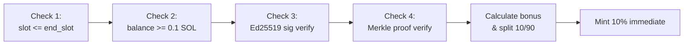

# Free Claim & Merkle Verification

## Ed25519-signed Merkle proof claim with tiered speed bonuses and 10/90 vesting split

The `free_claim` instruction is the user-facing entry point for the airdrop. It verifies wallet ownership via Ed25519 introspection, validates a Merkle inclusion proof, calculates a time-based speed bonus, and splits the result into an immediate mint (10%) and a vesting schedule (90%).

### Instruction: `free_claim`

**Source:** `programs/helix-staking/src/instructions/free_claim.rs`

**Parameters:**
| Param | Type | Purpose |
|-------|------|---------|
| `snapshot_balance` | `u64` | SOL balance in lamports from the snapshot |
| `proof` | `Vec<[u8; 32]>` | Merkle proof siblings (max 20 deep) |

### Account Constraints

- **claimer**: `Signer`, pays rent for `ClaimStatus` PDA
- **snapshot_wallet**: `UncheckedAccount` but constrained to `== claimer.key()` (MEDIUM-3 fix: no delegation)
- **claim_config**: Must have `claim_period_started == true`
- **claim_status**: `init` with seeds `[CLAIM_STATUS_SEED, merkle_root[0..8], snapshot_wallet]` -- the `init` constraint is the double-claim guard (second call fails because PDA exists)
- **claimer_token_account**: ATA for HELIX mint, owned by claimer
- **mint**: PDA-derived HELIX mint
- **instructions_sysvar**: Must be `ix_sysvar::ID` (for Ed25519 introspection)

### Security Pipeline (4 Checks)



**Check 3 -- Ed25519 Introspection (MEV prevention):**
- The instruction immediately preceding `free_claim` must be an Ed25519 program instruction
- Extracts the public key and message from Ed25519 instruction data at specific byte offsets
- Message format: `"HELIX:claim:{pubkey}:{amount}"` -- binds the signature to a specific wallet and balance
- The signed pubkey must match `snapshot_wallet`
- This prevents MEV bots from front-running claims because they cannot forge the Ed25519 signature

**Check 4 -- Merkle Proof:**
- Leaf: `keccak256(snapshot_address || amount_le_bytes || claim_period_id_le_bytes)`
- Walks up the tree using sorted-pair hashing (smaller hash left, larger right)
- Final hash must match `claim_config.merkle_root`
- Max proof depth: 20 (supports 1M+ claimants)

### Speed Bonus Calculation

| Window | Days Elapsed | Bonus (bps) | Effect |
|--------|-------------|-------------|--------|
| Week 1 | 0-7 | 2000 | +20% |
| Weeks 2-4 | 8-28 | 1000 | +10% |
| After day 28 | 29+ | 0 | Base only |

**Formula:**
```
days_elapsed = (current_slot - start_slot) / slots_per_day
base_amount = mul_div(snapshot_balance, 10000, 10)  // HELIX_PER_SOL conversion
bonus_amount = mul_div(base_amount, bonus_bps, 10000)
total = base_amount + bonus_amount
immediate = mul_div(total, 1000, 10000)   // 10%
vesting = total - immediate                // 90%
```

All arithmetic uses `mul_div` (u128 intermediates) to prevent overflow on large balances (ADDL-1, ADDL-2, ADDL-3 fixes).

### Vesting Split

- **10% minted immediately** via CPI to `token_2022::mint_to`
- **90% recorded in ClaimStatus** for linear vesting over 30 days
- `vesting_end_slot = current_slot + (30 * slots_per_day)`
- `withdrawn_amount` initialized to `immediate_amount` (counts as already withdrawn)

### ClaimStatus State (76 bytes)

Per-user PDA seeded with merkle root prefix + wallet:

```
is_claimed (1) | claimed_amount (8) | claimed_slot (8) | bonus_bps (2)
withdrawn_amount (8) | vesting_end_slot (8) | snapshot_wallet (32) | bump (1)
```

### Notable Gotchas

- **Double-claim prevention is structural**: The `init` constraint on `claim_status` PDA means a second claim for the same wallet + merkle root will fail at the Anchor account initialization level. No explicit "already claimed" check needed.
- **snapshot_wallet == claimer enforced**: MEDIUM-3 fix removed delegation support. A wallet can only claim its own snapshot balance.
- **Ed25519 instruction ordering**: The Ed25519 verify must be at index `current_ix_index - 1`. If a user bundles other instructions between Ed25519 and free_claim, verification fails.
- **Decimal conversion subtlety**: SOL has 9 decimals, HELIX has 8 decimals. The `HELIX_PER_SOL = 10_000` and division by 10 handles the decimal shift: `balance_lamports * 10000 / 10 = balance * 1000`.
- **Merkle root prefix in PDA seed**: Only the first 8 bytes of the merkle root are used in the ClaimStatus PDA seed. This allows future claim periods with different roots to create separate ClaimStatus accounts per user.

[[free-claim-and-bpd.md]]
