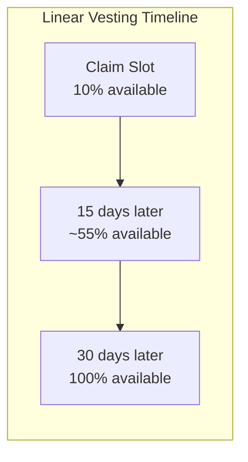

# Vesting System

## Linear 30-day vesting with partial withdrawals of the 90% locked portion

The `withdraw_vested` instruction allows claimers to withdraw their vested tokens progressively over a 30-day period. 10% was minted immediately during `free_claim`; the remaining 90% unlocks linearly slot-by-slot.

### Instruction: `withdraw_vested`

**Source:** `programs/helix-staking/src/instructions/withdraw_vested.rs`

**Parameters:** None (all state is read from `ClaimStatus`)

### Account Constraints

- **claimer**: `Signer`, must match `claim_status.snapshot_wallet` (HelixError::Unauthorized)
- **claim_status**: PDA with seeds `[CLAIM_STATUS_SEED, merkle_root[0..8], snapshot_wallet]`, must have `is_claimed == true`
- **claimer_token_account**: ATA for HELIX, owned by claimer
- **mint**: PDA-derived HELIX mint (mutable for minting)
- **mint_authority**: PDA signer for CPI

### Vesting Curve



**Formula:**
```
immediate = mul_div(claimed_amount, 1000, 10000)  // 10%
vesting_portion = claimed_amount - immediate        // 90%

if current_slot >= vesting_end_slot:
    total_vested = claimed_amount                    // 100%
elif current_slot <= claimed_slot:
    total_vested = immediate                         // 10% only
else:
    elapsed = current_slot - claimed_slot
    duration = vesting_end_slot - claimed_slot
    unlocked_vesting = mul_div(vesting_portion, elapsed, duration)
    total_vested = immediate + unlocked_vesting

available = total_vested - withdrawn_amount
```

### Key Logic

1. **Cumulative tracking**: `withdrawn_amount` tracks total ever withdrawn (including the initial 10%). Each call computes `total_vested - withdrawn_amount` to get the newly available portion.

2. **State update before CPI** (reentrancy prevention): `claim_status.withdrawn_amount` is updated _before_ the `mint_to` CPI call. Even though Solana's runtime prevents reentrancy, this follows defense-in-depth.

3. **Idempotent calls**: If a user calls `withdraw_vested` twice in quick succession with no slots elapsed between them, the second call returns `HelixError::NoVestedTokens` because `available == 0`.

4. **Post-vesting full withdrawal**: After `vesting_end_slot`, `total_vested = claimed_amount`, so all remaining tokens become available in one final withdrawal.

### Overflow Protection

All arithmetic uses `mul_div` with u128 intermediates (MED-2 fix). For a max HELIX supply scenario:
- `claimed_amount` up to ~2^63
- `elapsed * vesting_portion` computed in u128 before division
- Safe `checked_sub` on `total_vested - withdrawn_amount`

### State Transitions

| Field | After free_claim | After partial withdraw | After full vesting |
|-------|-----------------|----------------------|-------------------|
| `claimed_amount` | total (base+bonus) | unchanged | unchanged |
| `withdrawn_amount` | = immediate (10%) | += available | = claimed_amount |
| `vesting_end_slot` | claimed_slot + 30d | unchanged | unchanged |

### Notable Gotchas

- **No partial amount parameter**: Users cannot choose how much to withdraw. The instruction always withdraws the maximum available vested amount. This simplifies accounting but means users get all-or-nothing per call.
- **Minting, not transferring**: Vested tokens are minted on demand via `token_2022::mint_to`, not held in escrow. This means the total supply increases as users vest. The `total_claimable` budget on `ClaimConfig` is an accounting limit, not enforced on-chain per-withdrawal.
- **No expiry on vesting**: Even after the 180-day claim period ends and BPD runs, vested tokens remain claimable indefinitely. There is no deadline to complete vesting withdrawals.
- **slots_per_day affects vesting duration**: The 30-day vesting window was calculated at claim time using `global_state.slots_per_day`. If `slots_per_day` is later changed, already-created vesting schedules are unaffected (the `vesting_end_slot` is absolute).

[[free-claim-and-bpd.md]]
