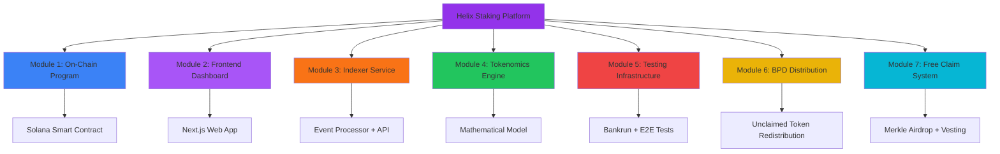
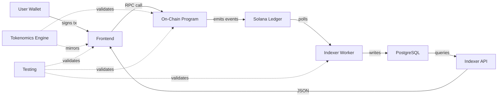

# Helix Staking - Codebase Architecture Map

**Parent**: [[run_me_context_1770768781075.md]]

## Overview

This map documents the 7 major modules of the Helix Staking platform - a Solana-based T-Share staking system with inflation distribution, Big Pay Day mechanics, and Merkle-based airdrops.

## Module Map

## Module Breakdown

### 1. On-Chain Program (Solana Smart Contract)
**File**: [[module-1-onchain-program.md]]

- **Tech**: Anchor Framework (Rust)
- **Purpose**: Core staking mechanics, account management, tokenomics implementation
- **Key Features**: 
  - Create/unstake stakes with LPB/BPB bonuses
  - Inflation distribution via share rate
  - Penalty calculations
  - Admin instructions
- **Lines of Code**: ~3,500 Rust

### 2. Frontend Dashboard (Next.js Web App)
**File**: [[module-2-frontend-dashboard.md]]

- **Tech**: Next.js 14 App Router, TanStack Query, Solana Wallet Adapter
- **Purpose**: User interface for staking, claiming, analytics
- **Key Features**:
  - Wallet connection & transaction signing
  - Multi-step stake creation wizard
  - Portfolio tracking & analytics
  - Jupiter DEX integration
- **Lines of Code**: ~8,000 TypeScript/React

### 3. Indexer Service (Event Processor & REST API)
**File**: [[module-3-indexer-service.md]]

- **Tech**: Node.js, Express, PostgreSQL, Drizzle ORM
- **Purpose**: Index on-chain events, provide fast queries for frontend
- **Key Features**:
  - Signature polling & transaction decoding
  - Checkpoint-based recovery
  - REST API for analytics
  - Leaderboard & whale tracking
- **Lines of Code**: ~2,000 TypeScript

### 4. Tokenomics Engine (Mathematical Model)
**File**: [[module-4-tokenomics-engine.md]]

- **Tech**: Pure mathematics (Rust + TypeScript mirrors)
- **Purpose**: T-Share calculations, bonuses, penalties, inflation
- **Key Features**:
  - LPB (Longer Pays Better): 1x-10x multiplier
  - BPB (Bigger Pays Better): 1x-10x multiplier
  - Penalty schedules (early/late unstake)
  - Share rate dynamics
- **Lines of Code**: ~500 (shared logic)

### 5. Testing Infrastructure
**File**: [[module-5-testing-infrastructure.md]]

- **Tech**: Bankrun, Vitest, Playwright
- **Purpose**: Ensure correctness & prevent regressions
- **Key Features**:
  - 74 unit tests (in-memory Solana)
  - 27 E2E tests (browser automation)
  - Devnet validation scripts
  - Security test coverage
- **Test Coverage**: ~85% of critical paths

### 6. BPD Distribution System
**File**: [[module-6-bpd-distribution-system.md]]

- **Tech**: Multi-phase batch processing
- **Purpose**: Redistribute unclaimed airdrop tokens to stakers
- **Key Features**:
  - Share-days calculation
  - Batch processing (20 stakes/tx)
  - Admin-only finalize (CRIT-NEW-1 fix)
  - Anti-gaming protections
- **Lines of Code**: ~800 Rust

### 7. Free Claim System
**File**: [[module-7-free-claim-system.md]]

- **Tech**: Merkle trees, Ed25519 signatures
- **Purpose**: Permissionless airdrop with speed bonuses
- **Key Features**:
  - Merkle proof verification
  - Speed bonus (100% → 40% over 90 days)
  - Linear vesting (365 days)
  - Double-claim prevention
- **Lines of Code**: ~600 Rust

## Data Flow

## Technology Stack Summary

| Layer | Technologies |
|-------|-------------|
| **Blockchain** | Solana, Anchor 0.31, Rust |
| **Frontend** | Next.js 14, React, TailwindCSS, TanStack Query |
| **Indexer** | Node.js, TypeScript, Express, Drizzle ORM |
| **Database** | PostgreSQL |
| **Testing** | Bankrun, Vitest, Playwright |
| **DevOps** | GitHub Actions, Docker (planned) |

## Critical Security Findings (Fixed)

| Finding | Severity | Module | Status |
|---------|----------|--------|--------|
| CRIT-NEW-1: Permissionless finalize | 🔴 CRITICAL | BPD | ✅ Fixed (admin-only + seal) |
| MEDIUM-1: Zero-amount finalize | 🟡 MEDIUM | BPD | ✅ Fixed (validation) |
| MEDIUM-2: Unchecked arithmetic | 🟡 MEDIUM | Core Staking | ✅ Fixed (checked math) |
| MEDIUM-3: Delegation vulnerability | 🟡 MEDIUM | Core Staking | ✅ Fixed (no delegation) |
| HIGH: Abort ghost markers | 🟠 HIGH | BPD | ⚠️ Documented (workaround: increment period_id) |

## Known Technical Debt

### High Priority
1. **Admin instructions on mainnet**: Remove or multi-sig gate `admin_set_*` functions
2. **BPD abort bug**: Per-stake fields not reset, requires period_id increment
3. **Indexer RPC limits**: No exponential backoff on rate limiting
4. **Frontend error boundaries**: App crashes on uncaught errors

### Medium Priority
5. **No websocket subscriptions**: Polling is inefficient
6. **Hardcoded constants**: Frontend duplicates on-chain values
7. **No retry logic**: Failed transactions don't auto-retry
8. **Single-threaded indexer**: Can't keep up with > 100 tx/s

### Low Priority
9. **No mutation testing**: Test quality not validated
10. **Chart performance**: Recharts slow with large datasets

## Deployment Checklist

- [ ] Remove admin devnet-only instructions
- [ ] Multi-sig authority wallet
- [ ] Indexer monitoring & alerts
- [ ] RPC failover configuration
- [ ] Database backups automated
- [ ] E2E tests in CI/CD
- [ ] Mainnet program audit (external)
- [ ] Emergency pause mechanism
- [ ] Documentation for users
- [ ] Bug bounty program

## Development Phases (Completed)

| Phase | Description | Status |
|-------|-------------|--------|
| 1 | Foundation & Token Infrastructure | ✅ Complete |
| 2 | Core Staking Mechanics | ✅ Complete |
| 2.1 | Math Fixes (u128 share_rate) | ✅ Complete |
| 3 | Free Claim & Big Pay Day | ✅ Complete |
| 3.2 | BPD Security Fixes | ✅ Complete |
| 3.3 | Post-Audit Hardening | ✅ Complete |
| 4 | Staking Dashboard | ✅ Complete |
| 5 | Indexer Service | ✅ Complete |
| 6 | Analytics & Jupiter | ✅ Complete |
| 7 | Leaderboard & Marketing | ✅ Complete |
| 8 | Testing & Audit | ✅ Complete |
| 8.1 | Game Theory Hardening | ✅ Complete |

## Key Metrics

- **Total Instructions**: 18 (on-chain)
- **State Accounts**: 5 types (GlobalState, StakeAccount, ClaimStatus, ClaimConfig, PendingAuthority)
- **Events**: 8 types (for indexer tracking)
- **Test Coverage**: 74 unit tests + 27 E2E tests
- **Documentation**: 7 module docs + 50+ planning docs
- **Development Time**: 8 phases over ~6 months

## Next Steps for Exploration

Each module node can be expanded further by spawning voicetree agents to:

1. **Module 1**: Break down into sub-modules (Core Instructions, State Management, Math Helpers, Admin Controls)
2. **Module 2**: Analyze component hierarchy, hook dependencies, routing structure
3. **Module 3**: Document API endpoints, worker pipeline stages, database schema
4. **Module 4**: Mathematical proofs, edge case analysis, economic simulations
5. **Module 5**: Test coverage gaps, performance benchmarks, CI/CD pipeline
6. **Module 6**: BPD state machine, batch optimization strategies, monitoring
7. **Module 7**: Merkle tree generation, vesting schedules, claim analytics

## References

- **Main Context**: [[run_me_context_1770768781075.md]]
- **Project Documentation**: `/.planning/`, `/.audit/`, `/specs/`
- **Voicetree Documentation**: `/voicetree-9-2/` (50+ analysis docs)
- **Code Locations**: `/programs/`, `/app/web/`, `/services/indexer/`
