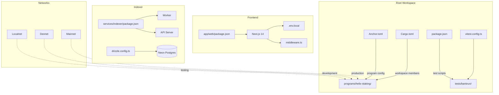

# Config & Deployment

## Build system, deployment config, and project planning

Workspace configuration spanning Anchor/Cargo build system, multi-network deployment, environment management, and project planning infrastructure.

### Workspace Structure



### Key Config Files
| File | Purpose |
|------|---------|
| `Anchor.toml` | Program ID, Anchor 0.31.1, cluster config |
| `Cargo.toml` | Rust workspace, blake3 patch, release LTO |
| `vitest.config.ts` | Forks pool, 1000s timeout |
| `app/web/.env.local` | Devnet RPC URL, wallet secrets |
| `app/web/middleware.ts` | CSP headers, `unsafe-eval` dev-only |
| `.planning/ROADMAP.md` | 8 phases, 35+ completed plans |

### Build Pipeline
```
anchor build → target/deploy/helix_staking.so
              → target/idl/helix_staking.json
              → target/types/helix_staking.ts
IDL copied to → app/web/public/idl/helix_staking.json
```

### Project Status
| Metric | Value |
|--------|-------|
| Current phase | 8 of 8 (Testing & Launch) |
| Plans completed | 35+ |
| Security status | CONDITIONAL PASS |

### Notable Gotchas & Tech Debt
- Same program ID across all networks (devnet = mainnet ID)
- `blake3` crate needs patch for Rust 1.84 compatibility
- IDL must be manually copied from `target/` to `app/web/public/`
- No automated CI/CD pipeline yet
- Anchor 0.31 locked (0.32+ has breaking changes)

[[run_me.md]]
