---
position:
  x: 568
  y: -1653
isContextNode: true
containedNodeIds:
  - /Users/annon/projects/solhex/voicetree-9-2/on-chain-program.md
  - /Users/annon/projects/solhex/voicetree-9-2/run_me.md
  - /Users/annon/projects/solhex/voicetree-9-2/welcome_to_voicetree.md
  - /Users/annon/projects/solhex/voicetree-9-2/hover_over_me.md
  - /Users/annon/projects/solhex/voicetree-9-2/welcome_to.md
  - /Users/annon/projects/solhex/voicetree-9-2/frontend-dashboard.md
  - /Users/annon/projects/solhex/voicetree-9-2/fe-app-router.md
  - /Users/annon/projects/solhex/voicetree-9-2/fe-stake-components.md
  - /Users/annon/projects/solhex/voicetree-9-2/fe-dashboard-components.md
  - /Users/annon/projects/solhex/voicetree-9-2/fe-data-hooks.md
  - /Users/annon/projects/solhex/voicetree-9-2/fe-solana-integration.md
  - /Users/annon/projects/solhex/voicetree-9-2/fe-marketing-pages.md
  - /Users/annon/projects/solhex/voicetree-9-2/fe-claim-rewards.md
  - /Users/annon/projects/solhex/voicetree-9-2/free-claim-and-bpd.md
  - /Users/annon/projects/solhex/voicetree-9-2/bpd-claim-period.md
  - /Users/annon/projects/solhex/voicetree-9-2/bpd-merkle-verification.md
  - /Users/annon/projects/solhex/voicetree-9-2/bpd-vesting-system.md
  - /Users/annon/projects/solhex/voicetree-9-2/bpd-finalize-phase.md
  - /Users/annon/projects/solhex/voicetree-9-2/bpd-distribution-and-abort.md
  - /Users/annon/projects/solhex/voicetree-9-2/config-and-deployment.md
  - /Users/annon/projects/solhex/voicetree-9-2/cfg-anchor-workspace.md
  - /Users/annon/projects/solhex/voicetree-9-2/cfg-frontend.md
  - /Users/annon/projects/solhex/voicetree-9-2/cfg-indexer.md
  - /Users/annon/projects/solhex/voicetree-9-2/cfg-project-planning.md
  - /Users/annon/projects/solhex/voicetree-9-2/indexer-service.md
  - /Users/annon/projects/solhex/voicetree-9-2/idx-worker-pipeline.md
  - /Users/annon/projects/solhex/voicetree-9-2/idx-database-schema.md
  - /Users/annon/projects/solhex/voicetree-9-2/idx-rest-api.md
  - /Users/annon/projects/solhex/voicetree-9-2/idx-event-types-and-decoding.md
  - /Users/annon/projects/solhex/voicetree-9-2/idx-infrastructure.md
  - /Users/annon/projects/solhex/voicetree-9-2/tokenomics-engine.md
  - /Users/annon/projects/solhex/voicetree-9-2/tok-tshare-calculation.md
  - /Users/annon/projects/solhex/voicetree-9-2/tok-inflation-distribution.md
  - /Users/annon/projects/solhex/voicetree-9-2/tok-penalty-system.md
  - /Users/annon/projects/solhex/voicetree-9-2/tok-constants-config.md
  - /Users/annon/projects/solhex/voicetree-9-2/tok-frontend-math-mirror.md
  - /Users/annon/projects/solhex/voicetree-9-2/test-and-audit-infra.md
  - /Users/annon/projects/solhex/voicetree-9-2/test-bankrun-core.md
  - /Users/annon/projects/solhex/voicetree-9-2/test-bankrun-phase3.md
  - /Users/annon/projects/solhex/voicetree-9-2/test-security.md
  - /Users/annon/projects/solhex/voicetree-9-2/test-playwright-e2e.md
  - /Users/annon/projects/solhex/voicetree-9-2/test-validation-audit.md
  - /Users/annon/projects/solhex/voicetree-9-2/program-state-accounts.md
  - /Users/annon/projects/solhex/voicetree-9-2/program-core-staking.md
  - /Users/annon/projects/solhex/voicetree-9-2/program-inflation-distribution.md
  - /Users/annon/projects/solhex/voicetree-9-2/program-free-claim.md
  - /Users/annon/projects/solhex/voicetree-9-2/program-bpd-instructions.md
  - /Users/annon/projects/solhex/voicetree-9-2/program-admin-migration.md
  - /Users/annon/projects/solhex/voicetree-9-2/program-constants-errors.md
---
# ctx
Nearby nodes to: /Users/annon/projects/solhex/voicetree-9-2/on-chain-program.md
```
On-Chain Program (Anchor/Rust)
├── Generate codebase graph (run me)
│   ├── Voicetree
│   │   ├── Hover over me
│   │   └── Hello
│   ├── Frontend Dashboard (Next.js)
│   │   ├── App Router & Layouts
│   │   ├── Stake Components
│   │   ├── Dashboard Components
│   │   ├── Data Hooks
│   │   ├── Solana Integration
│   │   ├── Marketing & Static Pages
│   │   └── Claim & Rewards UI
│   ├── Free Claim & Big Pay Day (BPD)
│   │   ├── Claim Period Lifecycle
│   │   ├── Free Claim & Merkle Verification
│   │   ├── Vesting System
│   │   ├── BPD Finalize Phase
│   │   └── BPD Distribution & Abort
│   ├── Config & Deployment
│   │   ├── Anchor & Rust Workspace
│   │   ├── Frontend Config
│   │   ├── Indexer Config
│   │   └── Project Planning
│   ├── Indexer Service
│   │   ├── Worker Pipeline
│   │   ├── Database Schema
│   │   ├── REST API
│   │   ├── Event Types & Decoding
│   │   ├── Infrastructure
│   ├── Tokenomics Engine
│   │   ├── T-Share Calculation
│   │   ├── Inflation & Distribution
│   │   ├── Penalty System
│   │   ├── Constants & Configuration
│   │   ├── Frontend Math Mirror
│   └── Test & Audit Infrastructure
│       ├── Bankrun Core Tests
│       ├── Bankrun Phase 3 Tests
│       ├── Security Tests
│       ├── Playwright E2E Tests
│       ├── Validation Scripts & Audit Infrastructure
├── Program State Accounts
├── Program Core Staking Instructions
├── Program Inflation & Distribution
├── Program Free Claim System
├── Program BPD Instructions
├── Program Admin & Migration Instructions
└── Program Constants, Errors & Events
```

## Node Contents 
</Users/annon/projects/solhex/voicetree-9-2/on-chain-program.md> 
 
# On-Chain Program (Anchor/Rust)

## Core staking protocol at `programs/helix-staking/`

The Helix Staking program is a Solana Anchor-based protocol (v0.31) implementing HEX-inspired tokenomics with Token-2022 integration, burn-and-mint mechanics, and lazy reward distribution.

**Program ID:** `E9B7BsxdPS89M66CRGGbsCzQ9LkiGv6aNsra3cNBJha7`

### 16 Instructions
| Category | Instructions |
|----------|-------------|
| **Core Staking** | `initialize`, `create_stake`, `unstake`, `claim_rewards`, `crank_distribution` |
| **Free Claim** | `initialize_claim_period`, `free_claim`, `withdraw_vested` |
| **BPD (3-phase)** | `finalize_bpd_calculation`, `seal_bpd_finalize`, `trigger_big_pay_day`, `abort_bpd` |
| **Admin** | `admin_mint`, `admin_set_claim_end_slot`, `admin_set_slots_per_day` |
| **Migration** | `migrate_stake` |

### 4 PDA State Accounts
| Account | Size | Seeds | Purpose |
|---------|------|-------|---------|
| `GlobalState` | 247B | `["global_state"]` | Protocol params, share rate, aggregate metrics |
| `StakeAccount` | 117B | `["stake", user, id]` | Per-stake data, T-shares, reward debt, BPD tracking |
| `ClaimConfig` | 184B | `["claim_config"]` | Merkle root, BPD calculation state, period metadata |
| `ClaimStatus` | 76B | `["claim_status", root_prefix, wallet]` | Per-user claim tracking + vesting |

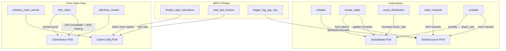

### Key Design Patterns
- **Burn-and-mint:** Tokens burned on stake, minted on claim/unstake (no custody risk)
- **Lazy distribution:** Rewards via `share_rate` increase, calculated on-demand via `reward_debt`
- **Separate PDAs per stake:** No Vec storage, unlimited stakes per user
- **u128 intermediates:** All financial math uses u128 to prevent overflow
- **Check-Effects-Interactions:** State updated before all CPIs

### Notable Gotchas & Tech Debt
- `StakeAccount.bpd_eligible` is **DEPRECATED** (set but never checked)
- `StakeAccount.claim_period_start_slot` is **DEPRECATED** (never read)
- `GlobalState.reserved[0]` repurposed as BPD window flag (blocks unstake during BPD)
- Account migrated 3 times: 92B -> 113B -> 117B (lazy migration on `claim_rewards`)
- BPD batch size: 20 stakes/tx (compute limit constraint)
- ~2,435 lines of instruction code across 16 modules

[\[run_me.md]\]
 
 <//Users/annon/projects/solhex/voicetree-9-2/on-chain-program.md>
</Users/annon/projects/solhex/voicetree-9-2/run_me.md> 
 # Generate codebase graph (run me)

### Your task is to run the following workflow

1. **Explore** the codebase (use explore subagents)
2. **Identify** the top ~7 major modules
3. **Create a node** for each module containing:
    - Concise purpose summary
    - Mermaid diagrams for the core flow
    - Notable gotchas or tech debt
There is no need for you or the subagents to create an additional progress node, the module nodes already satisfy this requirement.
4. **Spawn voicetree agents** on each module to break it down one level further

## Constraints

- **Max 7 modules** per level
- **Tree structure**: each node links only to its direct parent
- **Depth limit**: subagents do NOT spawn further agents
 
 <//Users/annon/projects/solhex/voicetree-9-2/run_me.md>
</Users/annon/projects/solhex/voicetree-9-2/welcome_to_voicetree.md> 
 # Voicetree

## The spatial IDE for multi-agent orchestration

##### Build massive projects out of hundreds of agent sessions whose outputs are all saved, connected together, and turned into a Markdown mindmap. Spatially navigate the graph to hand-hold agents as they recursively fork themselves.

Optimise for seeing only the most relevant information at the necessary level of abstraction.

ready? [\[run_me.md]\]

explore the features [\[hover_over_me.md]\] 
 <//Users/annon/projects/solhex/voicetree-9-2/welcome_to_voicetree.md>
</Users/annon/projects/solhex/voicetree-9-2/hover_over_me.md> 
 # Hover over me

Recommended usage for agentic engineering:

1. Brainstorm a large task in the mindmap itself. Get AI to help review and suggest options as needed.

2. Start executing agents on branches of the brainstorm. For larger/harder parts of the project, Tell agents to "decompose plan into a dependency graph of nodes, and then spawn voicetree agents to work through it"

3. Rotate between the idle agents (cmd + [\[ keyboard shortcut), to see if they need help or to be nudged towards true completion.

4. Since the feature will never be pixel perfect on the first iteration, for running next steps, spawn agents directly on handover notes automatically created by the previous sessions.

5. Zoom out to see the big picture of the shape of the work you and your agents did, useful for identifying productivity bottlenecks.


### Voicetree features

Above the node editor, you will see 6 buttons, these are all the actions you can perform on a node. Try adding a child node now.

Markdown support:

**Code blocks:**
```typescript
while (true) {
+  const x : string = "Hello World!"
-  // agents will automatically produce handover nodes with their diff  
  ...
}
```

**Mermaid diagram blocks:**
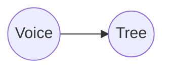

You can add edges to other nodes by typing a wikilink. Start typing double square brackets, and an autocomplete will pop up, to insert links to another nodes path like so: [to_the_other_nodes_relative_or_absolute_path.md]\]]

# Hotkeys & other features

### Navigation
- Hold **space** to follow most recent node
- **Cmd + ] or [\[** to cycle between terminals
- **Cmd + 1-5** to navigate to recently added or modified nodes (appear as tabs in the top left)
- **Cmd + E** to open the graph search / command pallete (nodes here are ordererd by recently selected), cmd + f, cmd + k also work

## Markdown nodes
- **Cmd + drag** to select nodes. Hover also selects node.
- **Cmd + n** to create new child node, or if no node is selected, creates orphan node
- **Cmd + backspace** to delete selected node(s)
- **Cmd + enter** to run this node the default agent (first agent in the agents array in settings.json)
- **Cmd + z** / **cmd + shift + z** to undo / redo 
- **Cmd + w** to close terminals and editors

- when a node is selected, you can speak directly into it! A chip with transcribed text will appear

### Settings
All settings are currently contained in the settings.json file (`~/Library/Application\ Support/VoiceTree/settings.json`) 

You can open the editor for this file in the floating menu on the right hand side of the graph.

### Agents

Agents can add nodes via their filesystem tools, since nodes are just markdown files. For example, you can tell agents to 'add a progress tree to the graph'

You can create custom agents in the settings

For example, you could create a "fix broken tests agent", which has a custom CLI command and prompt. 


#### Context nodes
When you run an agent, it will produce a context node, this is a traversal of nodes within distance=6 (configurable in the settings)
This is the context that will be injected into the agent at startup.

#### Works amazingly with spec driven development
VoiceTree pairs perfectly with OpenSpec for AI-assisted development.

Just tell your agent: "Please create an OpenSpec change proposal for this feature" - the markdown files will appear in the graph.
Works Amazingly With OpenSpec
VoiceTree pairs perfectly with OpenSpec for AI-assisted development.

Just tell your agent: "Please create an OpenSpec change proposal for this feature" - the markdown files will appear in the graph.

[[to_the_other_nodes_relative_or_absolute_path.md]\]
[\[to_the_other_nodes_relative_or_absolute_path.md]\] 
 <//Users/annon/projects/solhex/voicetree-9-2/hover_over_me.md>
</Users/annon/projects/solhex/voicetree-9-2/welcome_to.md> 
 # Hello

welcome to [\[welcome_to_voicetree.md]\] 
 <//Users/annon/projects/solhex/voicetree-9-2/welcome_to.md>
</Users/annon/projects/solhex/voicetree-9-2/frontend-dashboard.md> 
 
# Frontend Dashboard (Next.js)

## Full-featured staking UI at `app/web/`

Next.js 14 App Router application with Solana wallet integration, real-time on-chain data via React Query + WebSocket subscriptions, and Jupiter swap integration.

### Route Architecture
| Group | Routes | Purpose |
|-------|--------|---------|
| **(public)** | `/`, `/how-it-works`, `/tokenomics` | Marketing & education |
| **dashboard** | `/dashboard` | Portfolio overview + stakes list |
| | `/dashboard/stake` | 3-step stake creation wizard |
| | `/dashboard/stakes/[stakeId]` | Individual stake detail + actions |
| | `/dashboard/rewards` | Pending rewards + BPD status + crank |
| | `/dashboard/claim` | Free claim (merkle airdrop) |
| | `/dashboard/analytics` | Protocol charts (Recharts) |
| | `/dashboard/swap` | Jupiter aggregator widget |
| | `/dashboard/leaderboard` | Top stakers ranking |
| | `/dashboard/whale-tracker` | Large stake feed |
| **api** | `/api/rpc` | RPC proxy (hides Helius API key) |

### 12 Custom Hooks
| Hook | Type | Purpose |
|------|------|---------|
| `useProgram` | Core | Typed `Program<HelixStaking>` (read-only w/o wallet) |
| `useGlobalState` | Query | Protocol state + WebSocket live updates |
| `useStakes` | Query | User stakes via memcmp filter + WebSocket |
| `useTokenBalance` | Query | Token-2022 ATA balance |
| `useCurrentSlot` | Query | Blockchain slot (10s polling) |
| `useClaimConfig` | Query | Claim period + BPD status |
| `useCreateStake` | Mutation | Stake tx with simulation + retry logic |
| `useUnstake` | Mutation | Unstake with penalty handling |
| `useClaimRewards` | Mutation | Claim pending rewards |
| `useCrankDistribution` | Mutation | Permissionless daily inflation |
| `useFreeClaim` | Mutation | Merkle proof claim |
| `useWithdrawVested` | Mutation | Vesting withdrawal |

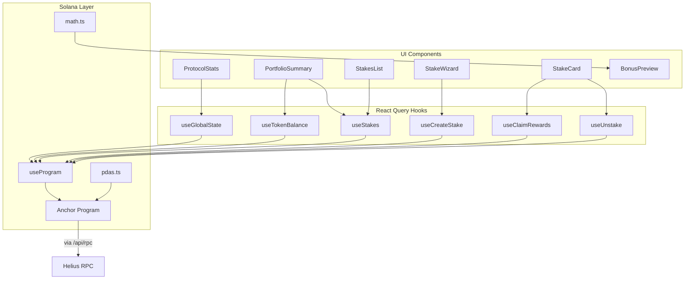

### Tech Stack
- **UI:** Radix UI + Tailwind CSS + shadcn/ui
- **State:** React Query (on-chain) + Zustand (UI wizard state)
- **Charts:** Recharts
- **Wallet:** Phantom, Solflare via wallet-adapter
- **Testing:** Playwright (UI + transaction tests)

### Notable Gotchas & Tech Debt
- Locked to `@solana/web3.js` v1 (Anchor incompatible with v2)
- `NEXT_PUBLIC_SKIP_WALLET_CHECK` env var bypasses wallet gate (testing only)
- RPC proxy at `/api/rpc` returns placeholder during SSR/build
- Client-side math in `math.ts` must stay in sync with on-chain calculations
- Forced dark theme (`ThemeProvider forcedTheme="dark"`)

[\[run_me.md]\]
 
 <//Users/annon/projects/solhex/voicetree-9-2/frontend-dashboard.md>
</Users/annon/projects/solhex/voicetree-9-2/fe-app-router.md> 
 
# App Router & Layouts

## Next.js 14 App Router with dual layout groups: public marketing site and wallet-gated dashboard

### Route Groups

| Group | Path | Layout | Rendering |
|-------|------|--------|-----------|
| `(public)` | `/`, `/how-it-works`, `/tokenomics` | `MarketingNav` + `MarketingFooter` | SSR with ISR (`revalidate: 3600`) |
| `dashboard` | `/dashboard/*` (8 sub-routes) | Sidebar nav + wallet gate | Client-side ("use client") |
| `api` | `/api/rpc` | None | Server Route Handler |

### Key Files

| File | Role |
|------|------|
| `app/layout.tsx` | Root layout: Inter font, dark HTML class, `<Providers>`, `<Toaster>` |
| `app/providers.tsx` | Provider stack (5 nested): `ConnectionProvider` > `WalletProvider` > `WalletModalProvider` > `QueryClientProvider` > `ThemeProvider` > `TooltipProvider` |
| `app/(public)/layout.tsx` | Marketing shell with server-side SEO metadata |
| `app/dashboard/layout.tsx` | Client layout with sidebar nav, mobile hamburger menu, wallet-required gate |
| `app/api/rpc/route.ts` | RPC proxy -- hides `HELIUS_RPC_URL` env var from client bundle |
| `middleware.ts` | CSP nonce generation + security headers on every non-static request |

### Provider Nesting Order

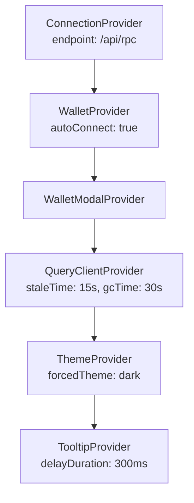

### Dashboard Navigation Items

The dashboard sidebar defines 8 navigation items as a static `NAV_ITEMS` array:

| Label | Route | Icon |
|-------|-------|------|
| Dashboard | `/dashboard` | LayoutIcon |
| New Stake | `/dashboard/stake` | PlusCircleIcon |
| Rewards | `/dashboard/rewards` | GiftIcon |
| Free Claim | `/dashboard/claim` | DownloadIcon |
| Analytics | `/dashboard/analytics` | BarChart3Icon |
| Swap | `/dashboard/swap` | RefreshCwIcon |
| Leaderboard | `/dashboard/leaderboard` | TrophyIcon |
| Whale Tracker | `/dashboard/whale-tracker` | ActivityIcon |

All icons are hand-coded SVG components (no lucide-react import) to avoid bundle issues.

### Middleware Security Headers

`middleware.ts` injects on every non-prefetch request:
- `Content-Security-Policy` with per-request nonce via `crypto.randomUUID()`
- `X-Frame-Options: DENY`
- `X-Content-Type-Options: nosniff`
- `Referrer-Policy: strict-origin-when-cross-origin`
- `connect-src` allows `*.helius-rpc.com` and `*.solana.com` (plus localhost in dev)

### QueryClient Configuration

Singleton `QueryClient` instantiated outside component (module scope) to prevent re-creation:
- `staleTime: 15_000` (15s default)
- `gcTime: 30_000` (30s garbage collection)
- `refetchOnWindowFocus: true`
- `retry: 3`

### Notable Gotchas

- **RPC endpoint during SSR**: `getRpcEndpoint()` returns a `https://localhost/api/rpc` placeholder during SSR/build since wallet-adapter is client-only. This prevents build errors but means no server-side Solana calls.
- **Test wallet injection**: When `NEXT_PUBLIC_TEST_WALLET_SECRET` is set, a `TestWalletAdapter` is dynamically imported via `useEffect`, keeping test code out of production bundle.
- **Wallet gate bypass**: `NEXT_PUBLIC_SKIP_WALLET_CHECK=true` bypasses the dashboard wallet requirement for E2E testing.
- **Forced dark theme**: `ThemeProvider` uses `forcedTheme="dark"` -- there is no light mode toggle.
- **CSP with strict-dynamic**: The nonce-based CSP uses `strict-dynamic` which requires all scripts to be nonce-tagged or loaded by nonce-tagged scripts.
- **Active route detection**: `NavLink` uses exact `pathname === item.href` matching, so nested routes under `/dashboard/stakes/[id]` do not highlight any nav item.

[\[frontend-dashboard.md]\]
 
 <//Users/annon/projects/solhex/voicetree-9-2/fe-app-router.md>
</Users/annon/projects/solhex/voicetree-9-2/fe-stake-components.md> 
 
# Stake Components

## Multi-step stake wizard, live bonus preview, penalty calculator, and stake lifecycle cards

### Component Inventory

| Component | File | Purpose |
|-----------|------|---------|
| **StakePage** | `app/dashboard/stake/page.tsx` | Wizard host with step indicator (1-2-3 dots) |
| **AmountStep** | `components/stake/stake-wizard/amount-step.tsx` | Token amount input with MAX button + balance check |
| **DurationStep** | `components/stake/stake-wizard/duration-step.tsx` | Slider (1-5555 days) + presets (1Y/3Y/5Y/Max) + live BonusPreview |
| **ConfirmStep** | `components/stake/stake-wizard/confirm-step.tsx` | Summary + penalty warning + simulation + tx submission |
| **SuccessScreen** | `components/stake/stake-wizard/success-screen.tsx` | Confirmation with Solana Explorer link |
| **BonusPreview** | `components/stake/bonus-preview.tsx` | Live LPB/BPB bars + multiplier + estimated T-shares |
| **PenaltyCalculator** | `components/stake/penalty-calculator.tsx` | Visual penalty breakdown for unstake scenarios |
| **StakeCard** | `components/stake/stake-card.tsx` | Individual stake tile with status, progress, rewards |
| **UnstakeConfirmation** | `components/stake/unstake-confirmation.tsx` | Modal dialog with mandatory checkbox before unstake |

### Wizard Flow

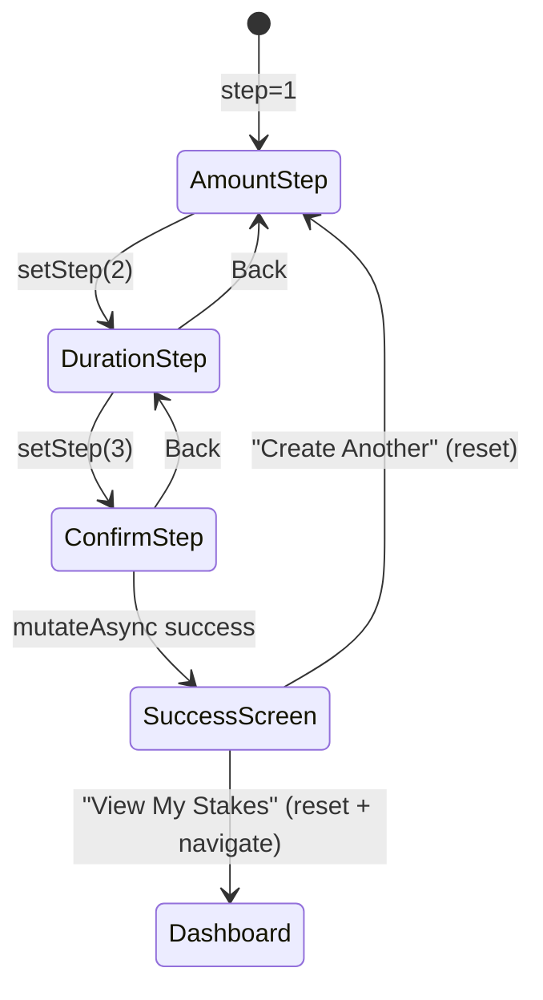

### State Management

The wizard uses a **Zustand store** (`lib/store/ui-store.ts`):

```
interface StakeWizardState {
  step: 1 | 2 | 3 | "success"
  amount: string       // decimal format (e.g., "100.5")
  days: number         // 1-5555, clamped via Math.max/min/floor
}
```

- `amount` is stored as a string (user input) and parsed to BN only when needed
- `days` is validated on set: `Math.max(1, Math.min(5555, Math.floor(days)))`
- `reset()` called on page unmount via `useEffect` cleanup and on wizard completion

### BonusPreview Details

Renders live as the user adjusts amount/duration (no debounce needed):

| Metric | Calculation | Display |
|--------|-------------|---------|
| Duration Bonus (LPB) | `(days - 1) * 2 * PRECISION / LPB_MAX_DAYS` | Progress bar (0-100%) + percentage |
| Size Bonus (BPB) | `(amount / 10) * PRECISION / BPB_THRESHOLD` | Progress bar (0-100%) + percentage |
| Total Multiplier | `PRECISION + LPB + BPB` | e.g., "2.50x" |
| T-Share Price | `globalState.shareRate` | Formatted HELIX amount |
| Estimated T-Shares | `amount * multiplier / shareRate` | Gradient-colored highlight |

### PenaltyCalculator States

Determines stake phase and renders a visual comparison bar:

| Phase | Condition | Penalty | Color |
|-------|-----------|---------|-------|
| **Early** | `currentSlot < endSlot` | 50%-100% (linear, min 50%) | Red/Yellow |
| **Grace** | `endSlot <= currentSlot <= endSlot + 14 days` | 0% | Green |
| **Late** | `currentSlot > endSlot + 14 days` | Linear to 100% over 351 days | Red |

Shows: staked amount, penalty amount, pending rewards, BPD bonus, total receive.

### StakeCard Status Logic

`getStakeStatus()` returns one of 5 states based on slot arithmetic:

| Status | Condition | Badge Color |
|--------|-----------|-------------|
| `active-late` | `<50% served` | Red |
| `active-early` | `>=50% served` | Yellow |
| `matured` | Exactly at end | Green |
| `grace` | Within 14 days of maturity | Green |
| `late` | Past grace period | Red |

### ConfirmStep Transaction Flow

1. Parse amount string to BN via `parseHelix()`
2. Call `useCreateStake().mutateAsync({ amount, days })`
3. Hook fetches fresh `globalState.totalStakesCreated` for stake ID
4. Derives stake PDA, builds tx, simulates, sends, confirms
5. On race condition ("already in use"), retries up to 3 times with 500ms delay
6. On success: `setStep("success")`

### Notable Gotchas

- **BN.js everywhere**: All amounts use `bn.js` BN type, not native BigInt. String serialization via `.toString()` is needed when crossing Anchor boundaries.
- **Stake ID race condition**: If two users stake simultaneously, `totalStakesCreated` may be stale. The retry loop in `useCreateStake` handles this by re-fetching globalState.
- **Explorer link hardcoded to devnet**: `SuccessScreen` links to `explorer.solana.com/tx/...?cluster=devnet`. This must be updated for mainnet.
- **Mandatory checkbox on unstake**: `UnstakeConfirmation` requires a checkbox acknowledgment before the "End Stake" button is enabled. Different text for grace period vs penalty scenarios.
- **No back button from ConfirmStep during tx**: The Back button is disabled while `isPending` is true.

[\[frontend-dashboard.md]\]
 
 <//Users/annon/projects/solhex/voicetree-9-2/fe-stake-components.md>
</Users/annon/projects/solhex/voicetree-9-2/fe-dashboard-components.md> 
 
# Dashboard Components

## Protocol stats, portfolio aggregation, stakes list, BPD status tracker, and permissionless crank button

### Component Inventory

| Component | File | Purpose |
|-----------|------|---------|
| **DashboardPage** | `app/dashboard/page.tsx` | Composes ProtocolStats + PortfolioSummary + StakesList |
| **ProtocolStats** | `components/dashboard/protocol-stats.tsx` | 4-card grid showing global on-chain metrics |
| **PortfolioSummary** | `components/dashboard/portfolio-summary.tsx` | User's aggregate stake data (balance, count, T-shares, rewards) |
| **StakesList** | `components/dashboard/stakes-list.tsx` | Grid of user's active stakes, sorted by maturity urgency |
| **BpdStatus** | `components/dashboard/bpd-status.tsx` | Big Pay Day lifecycle tracker (5 phases) |
| **CrankButton** | `components/dashboard/crank-button.tsx` | Permissionless daily inflation trigger |

### Dashboard Page Layout

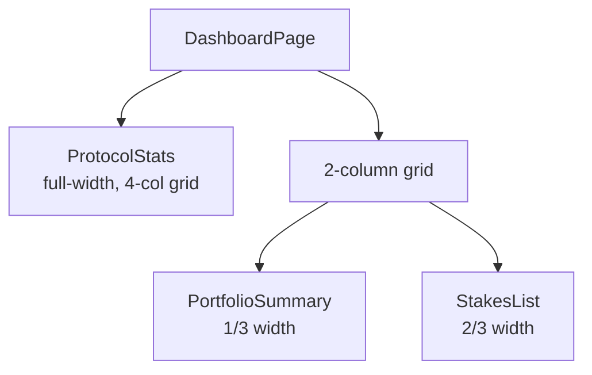

### ProtocolStats Metrics

4-card grid (`grid-cols-2 lg:grid-cols-4`), each with tooltip:

| Stat | Source | Tooltip |
|------|--------|---------|
| Total Staked | `globalState.totalTokensStaked` | "Total HELIX tokens currently locked in active stakes" |
| Total T-Shares | `globalState.totalShares` | "Total T-Shares across all active stakes..." |
| T-Share Price | `globalState.shareRate` | "The current cost per T-Share. Increases over time..." |
| Current Day | `globalState.currentDay` | "Number of days since protocol launch" |

Uses `formatHelixCompact()` for large numbers (K/M/B notation) and `formatTShares()` for T-share display.

### PortfolioSummary Aggregation

Aggregates across user's active stakes:

```
activeStakes = stakes.filter(s => s.account.isActive)
totalTShares = sum of all active stakes' tShares
totalPendingRewards = sum of calculatePendingRewards() for each stake
```

Shows 4 items: Wallet Balance, Active Stakes count, Total T-Shares, Pending Rewards. Empty state shows "Create Stake" CTA.

**Data sources**: `useStakes()`, `useTokenBalance()`, `useGlobalState()` -- all three must load before display.

### StakesList Sorting

Active stakes are sorted by `endSlot` ascending (most urgent / closest to maturity first). Uses `StakeCard` from `components/stake/stake-card.tsx` for each item in a 2-column responsive grid.

### BpdStatus Phase Machine

Tracks 5 BPD lifecycle phases:

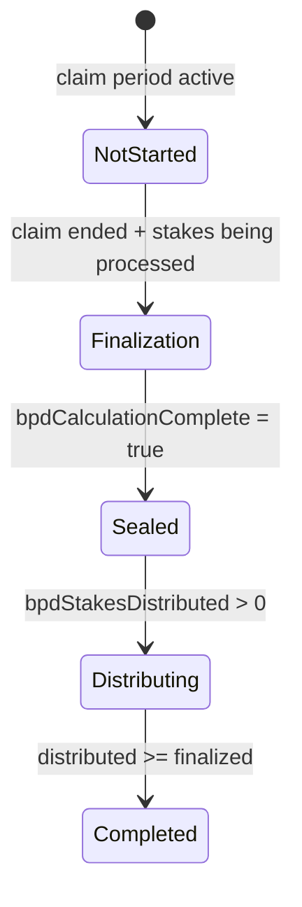

| Phase | Badge Color | UI Element |
|-------|-------------|------------|
| Not Started | gray | "Coming Soon" text |
| Finalization | blue | Processing counter |
| Sealed | yellow | "Ready for Distribution" |
| Distributing | blue | Progress bar (distributed/finalized) |
| Completed | green | "All eligible stakers received bonus" |

Also shows a yellow alert banner when BPD window is active (`globalState.reserved[0] !== 0`), warning that unstaking is temporarily blocked.

### CrankButton

- Reads `globalState.currentDay` and computes whether distribution has been triggered today
- Disabled when `alreadyDistributedToday || isPending`
- Calls `useCrankDistribution().mutateAsync()`
- Shows "Already Distributed Today" text with explanation when disabled

### Notable Gotchas

- **Triple loading state**: PortfolioSummary waits for 3 independent queries (stakes, balance, globalState). All must succeed before rendering data.
- **`penalty-400` class**: ProtocolStats and StakesList reference `text-penalty-400` for error text, which appears to be a custom Tailwind color (likely aliased in tailwind config).
- **BPD phase detection is fragile**: Phase logic uses multiple nullable fields (`bpdCalculationComplete`, `bpdStakesFinalized`, `bpdStakesDistributed`) that may not exist on older ClaimConfig accounts.
- **CrankButton day comparison is circular**: `currentDayFromSlot` is calculated from `currentDay * slotsPerDay + initSlot`, then divides back by `slotsPerDay` -- effectively comparing `currentDay` to itself. The crank disable check may not be accurate if the actual blockchain slot has advanced past the computed value.
- **No pagination**: StakesList renders all active stakes. Users with many stakes will see performance degradation.
- **Skeleton states**: Both ProtocolStats and StakesList use proper skeleton loading (shimmer animations), but PortfolioSummary only shows skeletons inside the card.

[\[frontend-dashboard.md]\]
 
 <//Users/annon/projects/solhex/voicetree-9-2/fe-dashboard-components.md>
</Users/annon/projects/solhex/voicetree-9-2/fe-data-hooks.md> 
 
# Data Hooks

## 12 custom React hooks bridging on-chain state to UI via React Query and WebSocket subscriptions

### Hook Classification

| Hook | Category | React Query Type | Cache Key | Polling | WebSocket |
|------|----------|-----------------|-----------|---------|-----------|
| `useProgram` | Core | None (useMemo) | N/A | No | No |
| `useGlobalState` | Query | `useQuery` | `["globalState"]` | 60s | Yes |
| `useStakes` | Query | `useQuery` | `["stakes", pubkey]` | 30s | Yes (per stake) |
| `useTokenBalance` | Query | `useQuery` | `["tokenBalance", pubkey]` | No | No |
| `useCurrentSlot` | Query | `useQuery` | `["currentSlot"]` | 10s | No |
| `useClaimConfig` | Query | `useQuery` | `["claimConfig"]` | 60s | Yes |
| `useCreateStake` | Mutation | `useMutation` | N/A | N/A | N/A |
| `useUnstake` | Mutation | `useMutation` | N/A | N/A | N/A |
| `useClaimRewards` | Mutation | `useMutation` | N/A | N/A | N/A |
| `useCrankDistribution` | Mutation | `useMutation` | N/A | N/A | N/A |
| `useFreeClaim` | Mutation | `useMutation` | N/A | N/A | N/A |
| `useWithdrawVested` | Mutation | `useMutation` | N/A | N/A | N/A |

### Data Flow Architecture

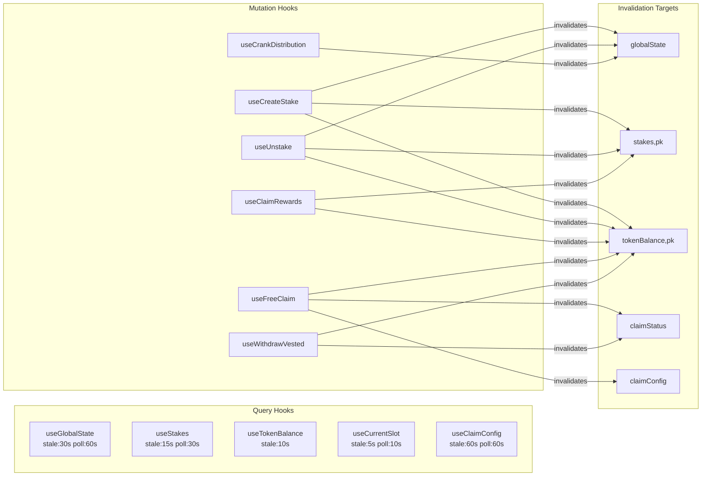

### useProgram (Core)

Returns a typed `Program<HelixStaking>` instance. Two modes:
- **With wallet**: Uses connected wallet's `signTransaction` / `signAllTransactions`
- **Without wallet**: Falls back to `DUMMY_WALLET` (read-only -- signing throws error)

Memoized on `[connection, wallet.publicKey, wallet.signTransaction, wallet.signAllTransactions]`.

### WebSocket Subscription Pattern

Three hooks use real-time WebSocket subscriptions for instant cache invalidation:

```
useGlobalState:  connection.onAccountChange(globalStatePda, ...)
useClaimConfig:  connection.onAccountChange(claimConfigPda, ...)
useStakes:       connection.onAccountChange(stake.publicKey, ...) for EACH stake
```

When the on-chain account data changes, the callback calls `queryClient.invalidateQueries()`, triggering a refetch. Subscriptions are cleaned up in `useEffect` return functions.

### Mutation Patterns

All 6 mutation hooks follow this consistent pattern:

1. **Guard**: Check `wallet.publicKey` and `sendTransaction` (or `signTransaction`)
2. **Derive**: Compute all PDA addresses via `pdas.ts`
3. **Build**: Create transaction via Anchor `program.methods.*.accountsPartial(...).transaction()`
4. **Simulate**: Call `connection.simulateTransaction(tx)` -- **security requirement**
5. **Send**: Call `sendTransaction(tx, connection)` or `wallet.signTransaction` + `sendRawTransaction`
6. **Confirm**: Wait for `connection.confirmTransaction()` at "confirmed" commitment
7. **Invalidate**: Bust relevant React Query caches
8. **Toast**: Show success/error toasts via sonner or shadcn toast

### Stale Time Hierarchy

```
useCurrentSlot:    5s   (slot changes rapidly)
useTokenBalance:  10s   (balance changes on tx)
useStakes:        15s   (stakes change infrequently)
useGlobalState:   30s   (updates once per day via crank)
useClaimConfig:   60s   (changes very rarely)
```

### useCreateStake Retry Logic

Handles **stake ID race condition** with retry loop:

```
for attempt in 0..MAX_RETRIES (3):
  1. Fetch fresh globalState.totalStakesCreated
  2. Derive stakeAccountPda from totalStakesCreated
  3. Build + simulate + send tx
  4. If "already in use" error: wait 500ms, retry
  5. If other error: throw immediately
```

### useFreeClaim Ed25519 Flow

The most complex hook. Builds a two-instruction transaction:

1. Wallet signs message `"HELIX:claim:{pubkey}:{amount}"` via `wallet.signMessage()`
2. Constructs Ed25519 verify instruction manually (14-byte header + sig + pubkey + msg)
3. Adds `[ed25519Ix, freeClaimIx]` to a single transaction
4. The Ed25519 instruction MUST immediately precede `free_claim` in the transaction

### Notable Gotchas

- **Two toast systems**: `useClaimRewards` and `useUnstake` use `sonner` toast, while `useCrankDistribution`, `useFreeClaim`, and `useWithdrawVested` use the shadcn `useToast` hook. This inconsistency means error/success toasts may render differently.
- **useStakes WebSocket scaling**: Creates one WebSocket subscription per stake account. Users with many stakes will have many open subscriptions. Subscriptions are managed via a `useRef` array and cleaned up on data change.
- **Token-2022 program ID**: `useTokenBalance` and `useCreateStake` manually specify `TokenzQdBNbLqP5VEhdkAS6EPFLC1PHnBqCXEpPxuEb` instead of importing from `@solana/spl-token`. Some hooks do import `TOKEN_2022_PROGRAM_ID` from spl-token.
- **No optimistic updates**: All mutations wait for on-chain confirmation before updating UI. This means 1-3 second delays between tx submission and visual feedback.
- **`any` casts on accounts**: Several hooks cast `.accounts({...} as any)` to bypass Anchor type checking when account resolution is partial.

[\[frontend-dashboard.md]\]
 
 <//Users/annon/projects/solhex/voicetree-9-2/fe-data-hooks.md>
</Users/annon/projects/solhex/voicetree-9-2/fe-solana-integration.md> 
 
# Solana Integration

## Client-side Anchor program binding, PDA derivation, on-chain math replication, and protocol constants

### File Inventory

| File | Purpose | Lines |
|------|---------|-------|
| `lib/solana/program.ts` | Creates typed `Program<HelixStaking>` via Anchor + IDL | ~43 |
| `lib/solana/pdas.ts` | 6 PDA derivation functions matching on-chain seeds | ~78 |
| `lib/solana/math.ts` | Client-side replication of on-chain penalty/bonus math | ~215 |
| `lib/solana/constants.ts` | Protocol constants, PDA seeds, display labels | ~81 |
| `lib/utils/format.ts` | BN formatting (HELIX amounts, T-shares, days, bps) | ~178 |

### program.ts

Creates an Anchor `Program<HelixStaking>` instance from:
- **IDL**: Loaded from `public/idl/helix_staking.json`
- **Provider**: `AnchorProvider` wrapping Connection + wallet
- **Dummy wallet**: Read-only fallback with `.signTransaction()` that rejects

```typescript
getProgram(connection, wallet?) -> Program<HelixStaking>
```

The IDL and wallet types use `as any` casts to bridge Anchor type mismatches.

### pdas.ts -- PDA Seed Map

| Function | Seeds | Returns |
|----------|-------|---------|
| `deriveGlobalState()` | `["global_state"]` | Protocol singleton |
| `deriveMint()` | `["helix_mint"]` | Token-2022 mint PDA |
| `deriveMintAuthority()` | `["mint_authority"]` | Mint authority PDA |
| `deriveStakeAccount(user, stakeId)` | `["stake", user, stakeId_le_u64]` | Per-user stake PDA |
| `deriveClaimConfig()` | `["claim_config"]` | Claim period config singleton |
| `deriveClaimStatus(merkleRoot, wallet)` | `["claim_status", root[0..8], wallet]` | Per-user claim status |

Note: `stakeId` is serialized as **little-endian u64** buffer (`toArrayLike(Buffer, "le", 8)`), matching the Anchor on-chain derivation.

### math.ts -- On-Chain Replication

All functions use `bn.js` BN arithmetic to match the on-chain Rust u128 intermediate calculations.

| Function | Formula | Notes |
|----------|---------|-------|
| `calculateLpbBonus(days)` | `(days-1) * 2 * PRECISION / LPB_MAX_DAYS` | Caps at `2 * PRECISION` for days >= 3641 |
| `calculateBpbBonus(amount)` | `(amount/10) * PRECISION / BPB_THRESHOLD` | Caps at `PRECISION` for amounts >= threshold*10 |
| `calculateTShares(amount, days, shareRate)` | `amount * (PRECISION + LPB + BPB) / shareRate` | Combines both bonuses |
| `calculateEarlyPenalty(...)` | `(1 - elapsed/total) * amount`, min 50% | Uses `mulDivUp` for protocol-favorable rounding |
| `calculateLatePenalty(...)` | `penaltyDays * amount / 351` | 14-day grace, caps at 100% |
| `calculatePendingRewards(tShares, shareRate, debt)` | `tShares * shareRate - rewardDebt` | Saturating subtraction (min 0) |

Helper functions:
- `mulDiv(a, b, c)`: `(a * b) / c`
- `mulDivUp(a, b, c)`: `(a * b + c - 1) / c` -- rounds UP to favor protocol

### constants.ts -- Protocol Parameters

| Constant | Value | Purpose |
|----------|-------|---------|
| `PROGRAM_ID` | `E9B7Bs...` | On-chain program address |
| `TOKEN_DECIMALS` | 8 | HELIX uses 8 decimal places |
| `PRECISION` | `1_000_000_000` (1e9) | Fixed-point scaling for bonus math |
| `MAX_STAKE_DAYS` | 5555 | Maximum lock duration |
| `LPB_MAX_DAYS` | 3641 | Days for full 2x duration bonus |
| `BPB_THRESHOLD` | `15000000000000000` | Size bonus threshold (~150M tokens) |
| `GRACE_PERIOD_DAYS` | 14 | Penalty-free unstake window after maturity |
| `LATE_PENALTY_WINDOW_DAYS` | 351 | Days to reach 100% late penalty |
| `MIN_PENALTY_BPS` | 5000 | Minimum 50% early penalty |
| `SLOTS_PER_DAY` | 216_000 | ~400ms per slot |
| `TSHARE_DISPLAY_FACTOR` | `10^12` | Scale factor for human-readable T-shares |

PDA seeds are Buffer-encoded strings: `"global_state"`, `"helix_mint"`, `"mint_authority"`, `"stake"`, `"claim_config"`, `"claim_status"`.

### format.ts -- Display Utilities

| Function | Input | Output Example |
|----------|-------|---------------|
| `formatHelix(BN, showSymbol?)` | `BN(150000000)` | `"1.50 HELIX"` |
| `formatHelixCompact(BN)` | `BN(1.5e15)` | `"1.50M"` |
| `parseHelix(string)` | `"1.5"` | `BN(150000000)` |
| `formatBps(number)` | `5000` | `"50.00%"` |
| `formatDays(number)` | `1825` | `"5.0 years"` |
| `formatTShares(BN)` | `BN(5e14)` | `"500.00"` |
| `truncateAddress(string)` | `"AbCd...Wxyz..."` | `"AbCd...Wxyz"` |

### Notable Gotchas

- **Client math MUST match on-chain**: Any divergence between `math.ts` and the Rust program will show users incorrect bonus/penalty previews. This is a critical sync point during protocol upgrades.
- **BN overflow risk**: `calculateTShares` multiplies `amount * totalMultiplier` which can produce very large intermediates. BN handles arbitrary precision, but be aware when converting to `number` (loss of precision above 2^53).
- **`parseHelix` truncates, does not round**: Input `"1.123456789"` becomes `"1.12345678"` (8 decimals). This matches on-chain behavior where extra precision is dropped.
- **SLOTS_PER_DAY is a constant**: The on-chain program has an `admin_set_slots_per_day` instruction, but the frontend hardcodes 216,000. If the admin changes it on-chain, the frontend will show incorrect time calculations until the constant is updated.
- **Token-2022 (not legacy SPL)**: The program uses Token Extensions (Token-2022). Using legacy SPL Token program ID for ATA derivation will produce wrong addresses.
- **TSHARE_DISPLAY_FACTOR normalization**: Raw on-chain T-share values are divided by 10^12 for display, making "100 T-Shares" correspond to a modest stake. This scaling is purely cosmetic.

[\[frontend-dashboard.md]\]
 
 <//Users/annon/projects/solhex/voicetree-9-2/fe-solana-integration.md>
</Users/annon/projects/solhex/voicetree-9-2/fe-marketing-pages.md> 
 
# Marketing & Static Pages

## Server-rendered public-facing pages with ISR, live stats from indexer, and educational content

### Page Inventory

| Route | File | Rendering | Revalidation |
|-------|------|-----------|-------------|
| `/` | `app/(public)/page.tsx` | **Server Component** (async) | 3600s (1 hour) |
| `/how-it-works` | `app/(public)/how-it-works/page.tsx` | **Server Component** (static) | 86400s (1 day) |
| `/tokenomics` | `app/(public)/tokenomics/page.tsx` | **Server Component** (async) | 86400s (1 day) |

### Component Inventory

| Component | File | Purpose |
|-----------|------|---------|
| **MarketingNav** | `components/marketing/nav.tsx` | Sticky top nav: HELIX logo, How It Works, Tokenomics, Launch App CTA |
| **MarketingFooter** | `components/marketing/footer.tsx` | 3-column footer: branding, protocol links, resources |
| **Hero** | `components/marketing/hero.tsx` | Headline + subheading + 2 CTAs + 3 live stats |
| **Features** | `components/marketing/features.tsx` | 4-card grid: Duration Bonus, Size Bonus, Daily Rewards, Big Pay Day |
| **Mechanics** | `components/marketing/mechanics.tsx` | 3-step visual flow: Choose Duration, Earn T-Shares, Collect Rewards |
| **CallToAction** | `components/marketing/cta.tsx` | Bottom CTA: "Ready to Start Earning?" + Launch App button |

### Landing Page Data Flow

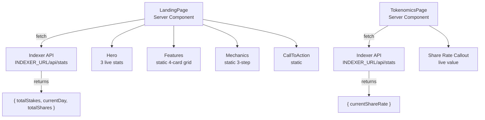

### Indexer Integration

Both `/` and `/tokenomics` fetch from `INDEXER_URL/api/stats` at build/revalidation time:

```typescript
const indexerUrl = process.env.INDEXER_URL || "http://localhost:3001";
const response = await fetch(`${indexerUrl}/api/stats`, {
  next: { revalidate: 3600 },
});
```

Graceful fallback: if fetch fails, returns `null` and components show `"--"` placeholders.

### Hero Live Stats

| Stat | Source Field | Formatting |
|------|-------------|------------|
| Total Stakes | `stats.totalStakes` | `toLocaleString()` |
| Protocol Day | `stats.currentDay` | Raw number |
| Total T-Shares | `stats.totalShares` | `parseFloat() / 1e9` with commas |

### SEO Metadata

Each page exports OpenGraph-compatible metadata:

```typescript
// Landing page
title: "HELIX Protocol - Time-Locked Staking on Solana"
description: "Stake HELIX tokens with time-locked commitments..."
openGraph: { siteName: "HELIX Protocol" }

// How It Works
title: "How HELIX Staking Works"

// Tokenomics
title: "HELIX Tokenomics"
```

### Public Layout Shell

`app/(public)/layout.tsx` wraps all marketing pages with:
- `MarketingNav` (sticky, backdrop-blur, z-50)
- Main content area (flex-1)
- `MarketingFooter` (border-top separator)

All within `min-h-screen bg-zinc-950 flex flex-col`.

### Educational Content Structure

**How It Works** covers 5 sections:
1. What is HELIX Staking? (lock period, T-shares, burn-and-mint)
2. T-Shares Explained (LPB + BPB)
3. Daily Rewards (3.69% annual, permissionless crank)
4. Penalties (early: min 50%, late: 14-day grace + 351-day window)
5. Big Pay Day (unclaimed tokens distributed to stakers)

**Tokenomics** covers 6 sections:
1. Supply Mechanics (burn-and-mint model)
2. Inflation (3.69% annual, daily distribution)
3. Share Rate (increases daily, early staker advantage)
4. Reward Distribution (lazy accumulation, claim-on-demand)
5. Penalty Redistribution (via share rate increase)
6. Free Claim & Big Pay Day (snapshot + unclaimed redistribution)

### Notable Gotchas

- **Server-only data fetching**: Landing page and tokenomics use `async` server components with ISR. They do NOT use React Query or client-side hooks. The indexer URL is a server-side env var (`INDEXER_URL`), not `NEXT_PUBLIC_`.
- **Fallback on indexer failure**: If the indexer is down, stats show as `"--"` or `0`. No error UI is shown to marketing visitors.
- **Hero T-shares formatting differs from dashboard**: Hero divides by `1e9` and formats with commas. Dashboard uses `formatTShares()` which divides by `TSHARE_DISPLAY_FACTOR` (1e12). These represent different scales.
- **Footer links are placeholder**: "Documentation" and "GitHub" links point to `#` (not yet configured).
- **No mobile nav on marketing pages**: `MarketingNav` is a simple horizontal layout with no hamburger menu. May be problematic on small screens with the 3 nav items + CTA button.
- **Static pages are not truly static**: `how-it-works` and `tokenomics` use `revalidate: 86400` but their content is hardcoded JSX. The revalidation is unnecessary except for `tokenomics` which fetches share rate from the indexer.

[\[frontend-dashboard.md]\]
 
 <//Users/annon/projects/solhex/voicetree-9-2/fe-marketing-pages.md>
</Users/annon/projects/solhex/voicetree-9-2/fe-claim-rewards.md> 
 
# Claim & Rewards UI

## Free claim flow (Merkle proof + Ed25519), vesting status tracker, rewards overview, BPD status, and crank distribution

### Page & Component Inventory

| Page/Component | File | Purpose |
|----------------|------|---------|
| **ClaimPage** | `app/dashboard/claim/page.tsx` | Free Claim page host |
| **RewardsPage** | `app/dashboard/rewards/page.tsx` | Rewards overview + BPD + crank |
| **EligibilityCheck** | `components/claim/eligibility-check.tsx` | Claim period state machine + claim status query |
| **ClaimForm** | `components/claim/claim-form.tsx` | Merkle proof lookup + speed bonus tier + claim button |
| **VestingStatus** | `components/claim/vesting-status.tsx` | Vesting progress bar + withdraw button |
| **BpdStatus** | `components/dashboard/bpd-status.tsx` | Big Pay Day 5-phase lifecycle tracker |
| **CrankButton** | `components/dashboard/crank-button.tsx` | Permissionless daily inflation trigger |

### Free Claim Flow

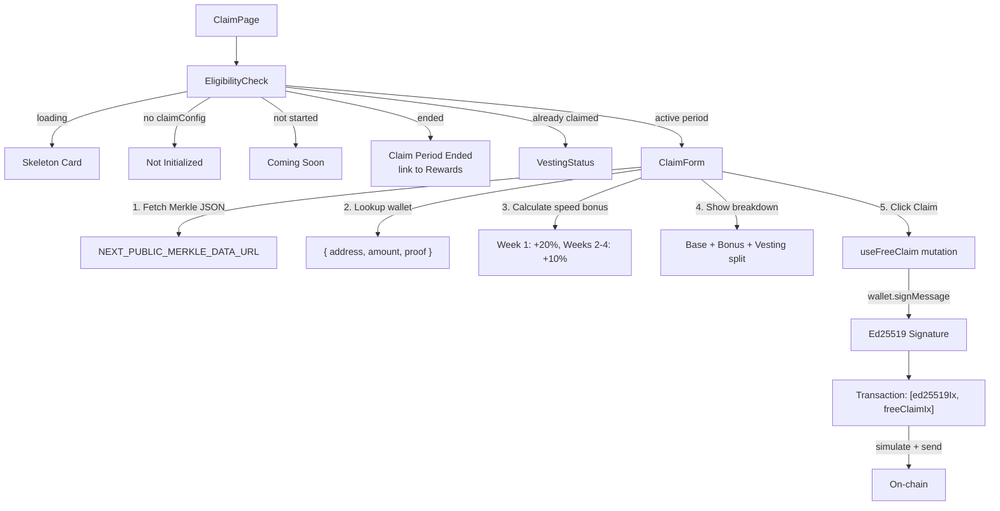

### EligibilityCheck State Machine

Queries `ClaimConfig` (on-chain singleton) and `ClaimStatus` (per-user PDA):

| Condition | Rendered Component |
|-----------|-------------------|
| Loading | Skeleton card |
| No `claimConfig` | "Not initialized yet" |
| `!claimPeriodStarted` | "Coming Soon" |
| `claimStatus.isClaimed` | **VestingStatus** (already claimed) |
| Claim period ended (`currentSlot > endSlot`) | "Claim period ended" + link to /rewards |
| Active period | **ClaimForm** |

### ClaimForm Speed Bonus Tiers

| Timeframe | Bonus | Calculation |
|-----------|-------|-------------|
| Week 1 (days 0-7) | +20% | `baseAmount * 20 / 100` |
| Weeks 2-4 (days 8-28) | +10% | `baseAmount * 10 / 100` |
| After day 28 | 0% | No bonus |

Display shows: Base Amount, Speed Bonus, Total Claimable, then vesting breakdown (10% immediate / 90% over 30 days).

### VestingStatus Calculations

```
immediateAmount = claimedAmount * 10 / 100    (10% immediate)
vestingPortion = claimedAmount - immediateAmount  (90% linear)

totalVested = immediate + (vestingPortion * elapsed / totalDuration)
availableToWithdraw = totalVested - withdrawnAmount
vestingProgress = elapsed / totalDuration * 100
```

Progress bar from 0-100%. Withdraw button disabled when `availableToWithdraw.isZero()`.

### Rewards Page Composition

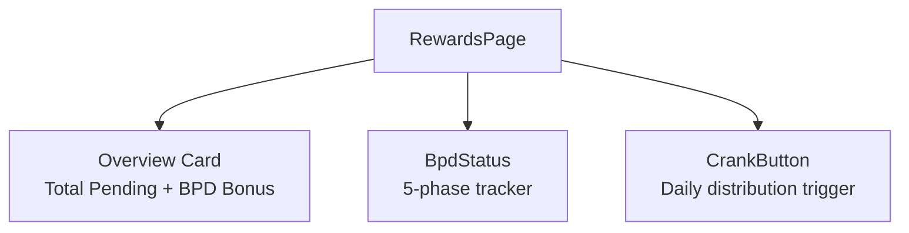

Aggregates across all user stakes:
```
totalPendingRewards = sum(calculatePendingRewards(stake.tShares, globalState.shareRate, stake.rewardDebt))
totalBpdBonus = sum(stake.bpdBonusPending)
```

### useFreeClaim Hook Details

The most complex mutation hook. Transaction structure:

1. **Message signing**: `"HELIX:claim:{snapshotWallet}:{amount}"` signed by wallet
2. **Ed25519 verify instruction**: Manually constructed 14-byte header + 64-byte signature + 32-byte pubkey + variable message
3. **free_claim instruction**: Anchor-built with 9 accounts (claimer, snapshotWallet, globalState, claimConfig, claimStatus, claimerTokenAccount, mint, mintAuthority, instructionsSysvar)
4. Transaction order: `[ed25519Ix, freeClaimIx]` -- **order is critical**, on-chain checks preceding instruction

Error mapping:
- `AlreadyClaimed` -> "You have already claimed"
- `InvalidMerkleProof` -> "Invalid claim proof"
- `ClaimPeriodNotStarted` -> "Claim period not started"
- `ClaimPeriodEnded` -> "Claim period has ended"

### useWithdrawVested Hook

Simpler flow -- single instruction:
- Derives: globalState, claimConfig, mint, mintAuthority PDAs
- Builds `withdrawVested()` instruction
- Simulates, sends, confirms
- Invalidates `tokenBalance` and `claimStatus` caches
- Error handling: `NoVestedTokens` -> "No vested tokens available"

### Notable Gotchas

- **Merkle data from CDN**: `ClaimForm` fetches proof data from `NEXT_PUBLIC_MERKLE_DATA_URL`. If this URL is misconfigured or the CDN is down, the entire claim flow fails with "Failed to load claim data."
- **Case-insensitive address match**: Merkle data lookup compares `.toLowerCase()` on both sides. Solana addresses are base58 (case-sensitive), so this comparison may produce false negatives for addresses that differ only in case. In practice, base58 addresses are case-sensitive.
- **Speed bonus calculation in ClaimForm differs from on-chain**: The UI calculates `baseAmount = amount * 1000` and applies the speed bonus. This must match the on-chain `free_claim` instruction exactly or the displayed amounts will be wrong.
- **No inline claim status query key**: EligibilityCheck uses inline `useQuery` (not a dedicated hook) with key `["claimStatus", pubkey]`. This creates a cache key that must be manually invalidated by the `useFreeClaim` hook.
- **Vesting math uses integer division**: `muln(10).divn(100)` for 10% immediate -- potential off-by-one for small amounts due to integer truncation.
- **BPD status reads `reserved[0]`**: The BPD window active check reads `globalState.reserved[0]`, which is a repurposed reserved field. This is fragile if the on-chain account layout changes.

[\[frontend-dashboard.md]\]
 
 <//Users/annon/projects/solhex/voicetree-9-2/fe-claim-rewards.md>
</Users/annon/projects/solhex/voicetree-9-2/free-claim-and-bpd.md> 
 
# Free Claim & Big Pay Day (BPD)

## Merkle airdrop, vesting, and unclaimed token redistribution

Complex multi-phase system for token distribution via Merkle proofs with speed bonuses, linear vesting, and redistribution of unclaimed tokens to stakers proportional to share-days.

### Free Claim Flow

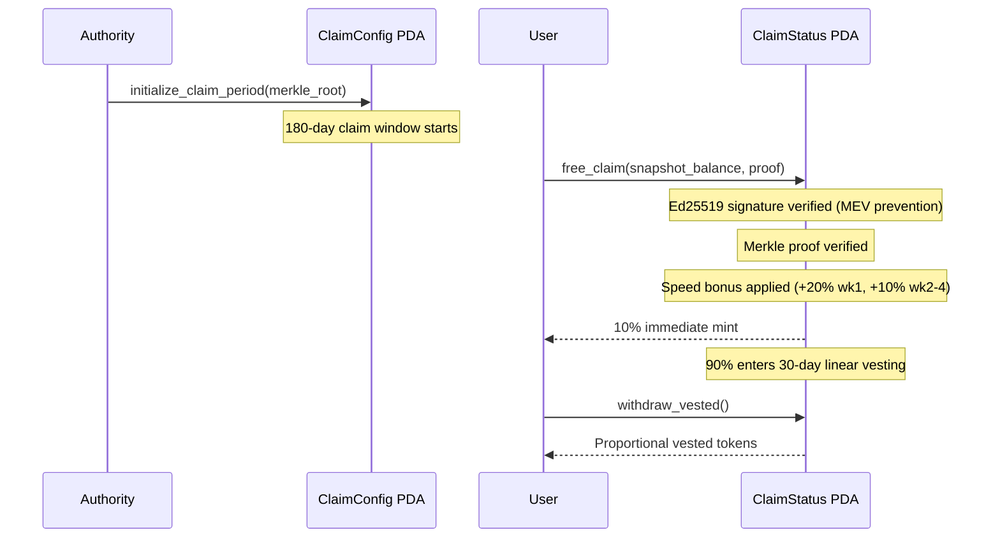

### Big Pay Day (BPD) - 3-Phase Process

After the 180-day claim period ends, unclaimed tokens are redistributed to stakes created during that period.

```mermaid
flowchart TD
    subgraph "Phase 1: Finalize (Authority, Batched)"
        F1[First batch] -->|calc unclaimed| F2[Pin snapshot slot]
        F2 -->|activate BPD window| F3[Scan stakes in batches of 20]
        F3 -->|accumulate| SD[total_share_days += t_shares * days_staked]
        F3 -->|mark| FM[bpd_finalize_period_id = claim_period_id]
    end

    subgraph "Phase 1.5: Seal (Authority)"
        SD --> SEAL[seal_bpd_finalize]
        SEAL -->|calculate| RATE[bpd_helix_per_share_day =<br/>unclaimed * PRECISION / total_share_days]
        SEAL -->|set| DONE[bpd_calculation_complete = true]
    end

    subgraph "Phase 2: Trigger (Permissionless, Batched)"
        DONE --> T1[trigger_big_pay_day]
        T1 -->|use pre-calc rate| T2[bonus = share_days * rate / PRECISION]
        T2 -->|add to| BP[stake.bpd_bonus_pending]
        T2 -->|mark| TM[bpd_claim_period_id = claim_period_id]
        T2 -->|when all done| CLEAR[Clear BPD window flag]
    end

    subgraph "Emergency"
        ABORT[abort_bpd] -->|authority only| RESET[Reset all BPD state]
    end
```

### Security Measures (Post-Audit Fixes)
| Issue | Fix |
|-------|-----|
| Per-batch rate manipulation | Authority-gated finalize + separate seal step |
| Duplicate BPD claims | `bpd_claim_period_id` tracking per stake |
| Stake changes during BPD | BPD window flag blocks unstaking |
| Snapshot consistency | `bpd_snapshot_slot` pinned on first batch |

### Notable Gotchas & Tech Debt
- **Ed25519 introspection** required for free_claim (prevents MEV front-running)
- **Batch size of 20** means large protocols need many finalize/trigger txs
- `abort_bpd` has a known HIGH severity issue (can reset bpd_claim_period_id tracking)
- Two deprecated fields on StakeAccount: `bpd_eligible`, `claim_period_start_slot`
- Counter-based completion (`distributed >= finalized`) prevents rounding exploits
- Complexity score: **HIGH** - most complex subsystem, 3-phase with batching + security constraints

[\[run_me.md]\]
 
 <//Users/annon/projects/solhex/voicetree-9-2/free-claim-and-bpd.md>
</Users/annon/projects/solhex/voicetree-9-2/bpd-claim-period.md> 
 
# Claim Period Lifecycle

## Authority-gated initialization of a 180-day Merkle claim window with snapshot root and budget

The `initialize_claim_period` instruction creates a singleton `ClaimConfig` PDA that anchors the entire free-claim and BPD pipeline. It is called once by the protocol authority to open a new claim period.

### Instruction: `initialize_claim_period`

**Source:** `programs/helix-staking/src/instructions/initialize_claim_period.rs`

**Parameters:**
| Param | Type | Purpose |
|-------|------|---------|
| `merkle_root` | `[u8; 32]` | Root of the snapshot Merkle tree (immutable after init) |
| `total_claimable` | `u64` | Total HELIX tokens allocated for this period |
| `total_eligible` | `u32` | Number of eligible addresses in the snapshot |
| `claim_period_id` | `u32` | Unique identifier for this period (must be > 0) |

### Account Constraints

- **authority**: Must be `Signer` and match `global_state.authority` (HelixError::Unauthorized)
- **global_state**: PDA derived from `[GLOBAL_STATE_SEED]`, verified by bump
- **claim_config**: `init` with PDA seeds `[CLAIM_CONFIG_SEED]` -- singleton, so only one period can exist at a time

### Key Logic

1. **claim_period_id > 0 enforced** (MED-5 fix): `StakeAccount.bpd_claim_period_id` defaults to 0, so if `claim_period_id == 0`, every stake would appear "already processed" in `trigger_big_pay_day`, silently skipping the entire BPD distribution.

2. **End slot calculation**: `end_slot = current_slot + (180 * global_state.slots_per_day)` with checked arithmetic throughout.

3. **All BPD pagination fields zeroed**: `bpd_remaining_unclaimed`, `bpd_total_share_days`, `bpd_helix_per_share_day`, `bpd_calculation_complete`, `bpd_snapshot_slot`, `bpd_stakes_finalized`, `bpd_stakes_distributed` -- clean slate for the finalize/trigger pipeline.

4. **Immutability**: `claim_period_started = true` is set and never toggled back. The merkle root is baked in at this point.

### ClaimConfig State (184 bytes)

The singleton PDA stores both claim-period metadata and all BPD pagination/distribution state:

```
authority (32) | merkle_root (32) | total_claimable (8) | total_claimed (8)
claim_count (4) | start_slot (8) | end_slot (8) | claim_period_id (4)
claim_period_started (1) | big_pay_day_complete (1) | bpd_total_distributed (8)
total_eligible (4) | bump (1)
--- BPD Phase 3.1-3.3 ---
bpd_remaining_unclaimed (8) | bpd_total_share_days (16) | bpd_helix_per_share_day (16)
bpd_calculation_complete (1) | bpd_snapshot_slot (8) | bpd_stakes_finalized (4)
bpd_stakes_distributed (4)
```

### Notable Gotchas

- **Singleton PDA**: Only one claim period can exist at a time. The `init` constraint means calling this twice will fail because the PDA already exists. A new period requires closing the old ClaimConfig first (not shown in current code).
- **claim_period_id=0 collision**: The MED-5 fix is critical -- without it, the entire BPD phase silently does nothing because every stake's default `bpd_claim_period_id` of 0 matches.
- **slots_per_day is admin-configurable**: The `global_state.slots_per_day` can be changed by `admin_set_slots_per_day`, which affects the calculated `end_slot`. If changed after initialization, the actual wall-clock duration of the claim period shifts.
- **No event replay protection**: The `ClaimPeriodStarted` event is emitted but there is no on-chain guard against re-reading stale events. Indexers must track by `claim_period_id`.

[\[free-claim-and-bpd.md]\]
 
 <//Users/annon/projects/solhex/voicetree-9-2/bpd-claim-period.md>
</Users/annon/projects/solhex/voicetree-9-2/bpd-merkle-verification.md> 
 
# Free Claim & Merkle Verification

## Ed25519-signed Merkle proof claim with tiered speed bonuses and 10/90 vesting split

The `free_claim` instruction is the user-facing entry point for the airdrop. It verifies wallet ownership via Ed25519 introspection, validates a Merkle inclusion proof, calculates a time-based speed bonus, and splits the result into an immediate mint (10%) and a vesting schedule (90%).

### Instruction: `free_claim`

**Source:** `programs/helix-staking/src/instructions/free_claim.rs`

**Parameters:**
| Param | Type | Purpose |
|-------|------|---------|
| `snapshot_balance` | `u64` | SOL balance in lamports from the snapshot |
| `proof` | `Vec<[u8; 32]>` | Merkle proof siblings (max 20 deep) |

### Account Constraints

- **claimer**: `Signer`, pays rent for `ClaimStatus` PDA
- **snapshot_wallet**: `UncheckedAccount` but constrained to `== claimer.key()` (MEDIUM-3 fix: no delegation)
- **claim_config**: Must have `claim_period_started == true`
- **claim_status**: `init` with seeds `[CLAIM_STATUS_SEED, merkle_root[0..8], snapshot_wallet]` -- the `init` constraint is the double-claim guard (second call fails because PDA exists)
- **claimer_token_account**: ATA for HELIX mint, owned by claimer
- **mint**: PDA-derived HELIX mint
- **instructions_sysvar**: Must be `ix_sysvar::ID` (for Ed25519 introspection)

### Security Pipeline (4 Checks)

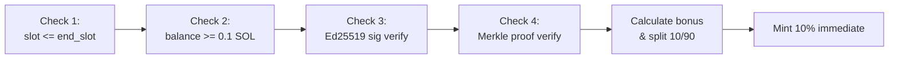

**Check 3 -- Ed25519 Introspection (MEV prevention):**
- The instruction immediately preceding `free_claim` must be an Ed25519 program instruction
- Extracts the public key and message from Ed25519 instruction data at specific byte offsets
- Message format: `"HELIX:claim:{pubkey}:{amount}"` -- binds the signature to a specific wallet and balance
- The signed pubkey must match `snapshot_wallet`
- This prevents MEV bots from front-running claims because they cannot forge the Ed25519 signature

**Check 4 -- Merkle Proof:**
- Leaf: `keccak256(snapshot_address || amount_le_bytes || claim_period_id_le_bytes)`
- Walks up the tree using sorted-pair hashing (smaller hash left, larger right)
- Final hash must match `claim_config.merkle_root`
- Max proof depth: 20 (supports 1M+ claimants)

### Speed Bonus Calculation

| Window | Days Elapsed | Bonus (bps) | Effect |
|--------|-------------|-------------|--------|
| Week 1 | 0-7 | 2000 | +20% |
| Weeks 2-4 | 8-28 | 1000 | +10% |
| After day 28 | 29+ | 0 | Base only |

**Formula:**
```
days_elapsed = (current_slot - start_slot) / slots_per_day
base_amount = mul_div(snapshot_balance, 10000, 10)  // HELIX_PER_SOL conversion
bonus_amount = mul_div(base_amount, bonus_bps, 10000)
total = base_amount + bonus_amount
immediate = mul_div(total, 1000, 10000)   // 10%
vesting = total - immediate                // 90%
```

All arithmetic uses `mul_div` (u128 intermediates) to prevent overflow on large balances (ADDL-1, ADDL-2, ADDL-3 fixes).

### Vesting Split

- **10% minted immediately** via CPI to `token_2022::mint_to`
- **90% recorded in ClaimStatus** for linear vesting over 30 days
- `vesting_end_slot = current_slot + (30 * slots_per_day)`
- `withdrawn_amount` initialized to `immediate_amount` (counts as already withdrawn)

### ClaimStatus State (76 bytes)

Per-user PDA seeded with merkle root prefix + wallet:

```
is_claimed (1) | claimed_amount (8) | claimed_slot (8) | bonus_bps (2)
withdrawn_amount (8) | vesting_end_slot (8) | snapshot_wallet (32) | bump (1)
```

### Notable Gotchas

- **Double-claim prevention is structural**: The `init` constraint on `claim_status` PDA means a second claim for the same wallet + merkle root will fail at the Anchor account initialization level. No explicit "already claimed" check needed.
- **snapshot_wallet == claimer enforced**: MEDIUM-3 fix removed delegation support. A wallet can only claim its own snapshot balance.
- **Ed25519 instruction ordering**: The Ed25519 verify must be at index `current_ix_index - 1`. If a user bundles other instructions between Ed25519 and free_claim, verification fails.
- **Decimal conversion subtlety**: SOL has 9 decimals, HELIX has 8 decimals. The `HELIX_PER_SOL = 10_000` and division by 10 handles the decimal shift: `balance_lamports * 10000 / 10 = balance * 1000`.
- **Merkle root prefix in PDA seed**: Only the first 8 bytes of the merkle root are used in the ClaimStatus PDA seed. This allows future claim periods with different roots to create separate ClaimStatus accounts per user.

[\[free-claim-and-bpd.md]\]
 
 <//Users/annon/projects/solhex/voicetree-9-2/bpd-merkle-verification.md>
</Users/annon/projects/solhex/voicetree-9-2/bpd-vesting-system.md> 
 
# Vesting System

## Linear 30-day vesting with partial withdrawals of the 90% locked portion

The `withdraw_vested` instruction allows claimers to withdraw their vested tokens progressively over a 30-day period. 10% was minted immediately during `free_claim`; the remaining 90% unlocks linearly slot-by-slot.

### Instruction: `withdraw_vested`

**Source:** `programs/helix-staking/src/instructions/withdraw_vested.rs`

**Parameters:** None (all state is read from `ClaimStatus`)

### Account Constraints

- **claimer**: `Signer`, must match `claim_status.snapshot_wallet` (HelixError::Unauthorized)
- **claim_status**: PDA with seeds `[CLAIM_STATUS_SEED, merkle_root[0..8], snapshot_wallet]`, must have `is_claimed == true`
- **claimer_token_account**: ATA for HELIX, owned by claimer
- **mint**: PDA-derived HELIX mint (mutable for minting)
- **mint_authority**: PDA signer for CPI

### Vesting Curve

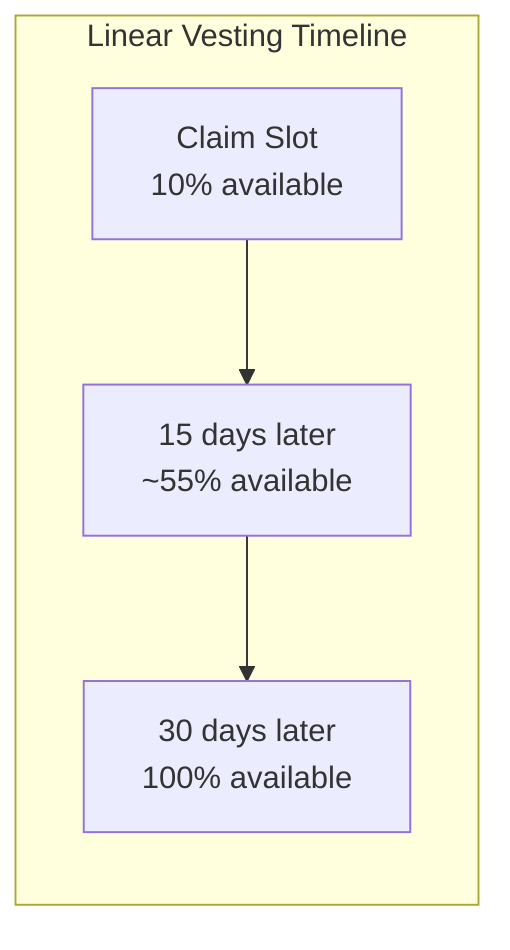

**Formula:**
```
immediate = mul_div(claimed_amount, 1000, 10000)  // 10%
vesting_portion = claimed_amount - immediate        // 90%

if current_slot >= vesting_end_slot:
    total_vested = claimed_amount                    // 100%
elif current_slot <= claimed_slot:
    total_vested = immediate                         // 10% only
else:
    elapsed = current_slot - claimed_slot
    duration = vesting_end_slot - claimed_slot
    unlocked_vesting = mul_div(vesting_portion, elapsed, duration)
    total_vested = immediate + unlocked_vesting

available = total_vested - withdrawn_amount
```

### Key Logic

1. **Cumulative tracking**: `withdrawn_amount` tracks total ever withdrawn (including the initial 10%). Each call computes `total_vested - withdrawn_amount` to get the newly available portion.

2. **State update before CPI** (reentrancy prevention): `claim_status.withdrawn_amount` is updated _before_ the `mint_to` CPI call. Even though Solana's runtime prevents reentrancy, this follows defense-in-depth.

3. **Idempotent calls**: If a user calls `withdraw_vested` twice in quick succession with no slots elapsed between them, the second call returns `HelixError::NoVestedTokens` because `available == 0`.

4. **Post-vesting full withdrawal**: After `vesting_end_slot`, `total_vested = claimed_amount`, so all remaining tokens become available in one final withdrawal.

### Overflow Protection

All arithmetic uses `mul_div` with u128 intermediates (MED-2 fix). For a max HELIX supply scenario:
- `claimed_amount` up to ~2^63
- `elapsed * vesting_portion` computed in u128 before division
- Safe `checked_sub` on `total_vested - withdrawn_amount`

### State Transitions

| Field | After free_claim | After partial withdraw | After full vesting |
|-------|-----------------|----------------------|-------------------|
| `claimed_amount` | total (base+bonus) | unchanged | unchanged |
| `withdrawn_amount` | = immediate (10%) | += available | = claimed_amount |
| `vesting_end_slot` | claimed_slot + 30d | unchanged | unchanged |

### Notable Gotchas

- **No partial amount parameter**: Users cannot choose how much to withdraw. The instruction always withdraws the maximum available vested amount. This simplifies accounting but means users get all-or-nothing per call.
- **Minting, not transferring**: Vested tokens are minted on demand via `token_2022::mint_to`, not held in escrow. This means the total supply increases as users vest. The `total_claimable` budget on `ClaimConfig` is an accounting limit, not enforced on-chain per-withdrawal.
- **No expiry on vesting**: Even after the 180-day claim period ends and BPD runs, vested tokens remain claimable indefinitely. There is no deadline to complete vesting withdrawals.
- **slots_per_day affects vesting duration**: The 30-day vesting window was calculated at claim time using `global_state.slots_per_day`. If `slots_per_day` is later changed, already-created vesting schedules are unaffected (the `vesting_end_slot` is absolute).

[\[free-claim-and-bpd.md]\]
 
 <//Users/annon/projects/solhex/voicetree-9-2/bpd-vesting-system.md>
</Users/annon/projects/solhex/voicetree-9-2/bpd-finalize-phase.md> 
 
# BPD Finalize Phase

## Authority-gated batched scan of all stakes to accumulate share-days and compute the BPD distribution rate

After the 180-day claim period ends, the unclaimed token pool must be distributed to eligible stakers. The finalize phase scans all stakes in batches of 20, accumulates `t_shares * days_staked` (share-days), then a separate `seal_bpd_finalize` call computes the global rate. This two-step design prevents the critical "first-batch-drains-pool" attack.

### Instructions

**Source files:**
- `programs/helix-staking/src/instructions/finalize_bpd_calculation.rs`
- `programs/helix-staking/src/instructions/seal_bpd_finalize.rs`

### Phase Diagram

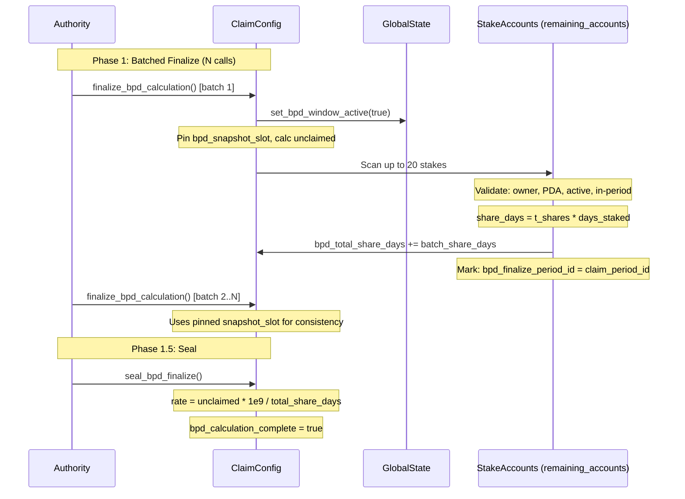

### finalize_bpd_calculation

**Account constraints:**
- **caller**: Must match `global_state.authority` (M-1 fix: prevents griefing by arbitrary callers)
- **claim_config**: `claim_period_started == true`, `bpd_calculation_complete == false`, `big_pay_day_complete == false`
- **remaining_accounts**: Up to 20 StakeAccount PDAs (read-write)

**Per-stake validation pipeline:**
1. `account_info.owner == program_id` (ownership check)
2. `data.len() >= StakeAccount::LEN` (skip un-migrated)
3. `StakeAccount::try_deserialize` succeeds (valid Anchor discriminator)
4. `stake.bpd_finalize_period_id != claim_period_id` (CRIT-NEW-1: duplicate prevention)
5. PDA re-derivation: `create_program_address([STAKE_SEED, user, stake_id, bump])` matches account key
6. `is_active == true`
7. `start_slot >= claim_config.start_slot` (created during or after period start)
8. `start_slot <= claim_config.end_slot` (created before period ended)
9. `days_staked > 0` where `days_staked = (min(snapshot_slot, end_slot) - start_slot) / slots_per_day`

**First-batch initialization:**
- Detects first batch when `bpd_remaining_unclaimed == 0 && bpd_total_share_days == 0 && bpd_snapshot_slot == 0`
- Calculates `unclaimed = total_claimable - total_claimed`
- Pins `bpd_snapshot_slot = clock.slot` for consistent days_staked across all batches
- Activates BPD window via `global_state.set_bpd_window_active(true)` (HIGH-2: blocks unstaking)

**Zero unclaimed fast path:** If `unclaimed == 0`, immediately sets `bpd_calculation_complete = true` and clears the BPD window.

### seal_bpd_finalize

**Account constraints:**
- **authority**: Must match `global_state.authority`
- **claim_config**: Same guards as finalize (`claim_period_started`, `!bpd_calculation_complete`, `!big_pay_day_complete`)

**Logic:**
1. Verifies claim period has ended (`clock.slot > end_slot`)
2. Requires `bpd_stakes_finalized > 0` (HIGH-2: ensures finalization actually processed stakes)
3. If `bpd_total_share_days == 0`: sets rate to 0, marks complete (edge case: stakes existed but had 0 share-days)
4. Otherwise: `bpd_helix_per_share_day = (unclaimed * PRECISION) / total_share_days` where `PRECISION = 1e9`
5. Sets `bpd_calculation_complete = true`

### Why Two Steps?

The original design computed the rate inside `finalize_bpd_calculation` itself. This was **critically vulnerable**: an attacker could call finalize with just 1 stake in the first batch, causing the rate to be computed from only that stake's share-days, allowing it to drain the entire unclaimed pool. The seal step ensures the authority explicitly confirms all stakes have been scanned before the rate is locked.

### Notable Gotchas

- **Authority-gated finalize (M-1 fix)**: Originally permissionless, which allowed griefing -- anyone could submit junk accounts or strategically incomplete batches.
- **bpd_finalize_period_id tracking (CRIT-NEW-1)**: Each stake is marked with the current `claim_period_id` after finalization. This prevents the same stake from being counted twice if submitted in multiple batches.
- **Snapshot slot pinning**: All batches use the same `bpd_snapshot_slot` for days_staked calculation. Without this, later batches would calculate different days_staked for the same stake, breaking rate consistency.
- **BPD window blocks unstaking**: While BPD finalize/trigger is in progress, `global_state.is_bpd_window_active()` returns true, which prevents `unstake` operations. This ensures share-days calculations remain valid.
- **u128 for share-days and rate**: Both `bpd_total_share_days` and `bpd_helix_per_share_day` are stored as u128 to handle the cross-multiplication of large stake counts, t_shares, and days.
- **Invalid accounts silently skipped**: Accounts that fail any validation step are `continue`d past, not rejected. This means the caller must ensure they pass valid stakes or they waste compute without error.
- **Batch size of 20**: `MAX_STAKES_PER_FINALIZE = 20` is hardcoded. For a protocol with 10,000 eligible stakes, finalization requires 500 transactions.

[\[free-claim-and-bpd.md]\]
 
 <//Users/annon/projects/solhex/voicetree-9-2/bpd-finalize-phase.md>
</Users/annon/projects/solhex/voicetree-9-2/bpd-distribution-and-abort.md> 
 
# BPD Distribution & Abort

## Permissionless batched bonus distribution to stakes and authority-gated emergency abort

After the finalize phase computes the global BPD rate, `trigger_big_pay_day` distributes bonuses to individual stakes proportionally. It is permissionless (anyone can crank it). The `abort_bpd` instruction is an authority-only emergency escape hatch.

### Instruction: `trigger_big_pay_day`

**Source:** `programs/helix-staking/src/instructions/trigger_big_pay_day.rs`

### Distribution Flow

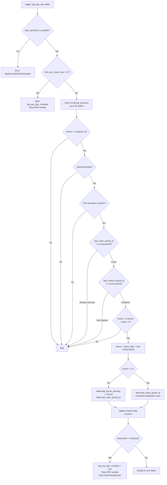

### Account Constraints

- **caller**: Any `Signer` (permissionless -- designed to be cranked by bots or the frontend)
- **claim_config**: `claim_period_started`, `!big_pay_day_complete`, `bpd_calculation_complete` (must be sealed first)
- **remaining_accounts**: Up to 20 StakeAccount PDAs (read-write)

### Per-Stake Bonus Calculation

```
share_days = t_shares * min(snapshot_slot, end_slot) - start_slot) / slots_per_day
bonus_u128 = share_days * bpd_helix_per_share_day / PRECISION
bonus = u64::try_from(bonus_u128)   // MED-1: safe cast instead of 'as u64'
```

### Dual Anti-Duplicate System

Two separate period-tracking fields on `StakeAccount` prevent different classes of exploits:

| Field | Set By | Purpose |
|-------|--------|---------|
| `bpd_finalize_period_id` | `finalize_bpd_calculation` | Marks stake as "counted in share-days total" |
| `bpd_claim_period_id` | `trigger_big_pay_day` | Marks stake as "received BPD bonus" |

**CRIT-NEW-1 enforcement**: `trigger_big_pay_day` requires `bpd_finalize_period_id == claim_period_id` before distributing. This ensures only stakes that were included in the denominator (share-days total) can receive a numerator (bonus). Without this, an attacker could inject stakes into trigger that were not counted during finalize, inflating distributions.

### Completion Logic

Counter-based: `bpd_stakes_distributed >= bpd_stakes_finalized`. This avoids rounding-based completion bugs and provides a deterministic "are we done?" check. When complete:
1. `big_pay_day_complete = true`
2. `bpd_remaining_unclaimed = 0`
3. `global_state.set_bpd_window_active(false)` (re-enables unstaking)
4. Emits `ClaimPeriodEnded` event

**Over-distribution guard (MED-3):** `bpd_remaining_unclaimed.checked_sub(batch_distributed)` returns `HelixError::BpdOverDistribution` if bonuses exceed the pool. This is a safety net against rate calculation rounding errors.

### Zero-Bonus Handling (H-1 Fix)

Stakes with `bonus == 0` (due to rounding or tiny share-days) still get their `bpd_claim_period_id` set and `bpd_stakes_distributed` incremented. Without this fix, zero-bonus stakes would never be marked as processed, causing them to be resubmitted infinitely and preventing completion.

---

### Instruction: `abort_bpd`

**Source:** `programs/helix-staking/src/instructions/abort_bpd.rs`

**Account constraints:**
- **authority**: Must be `Signer` and match `global_state.authority` (via `has_one`)
- **global_state**: Mutable (to clear BPD window)
- **claim_config**: Mutable (to reset BPD state)

**Precondition:** `global_state.is_bpd_window_active() == true` (HelixError::BpdWindowNotActive)

**Effect -- full BPD state reset:**
```
bpd_calculation_complete = false
bpd_helix_per_share_day = 0
bpd_total_share_days = 0
bpd_snapshot_slot = 0
bpd_stakes_finalized = 0
bpd_stakes_distributed = 0
bpd_remaining_unclaimed = 0
global_state.set_bpd_window_active(false)
```

Emits `BpdAborted { claim_period_id, stakes_finalized, stakes_distributed }`.

### Notable Gotchas

- **abort_bpd does NOT reset per-stake fields**: `bpd_finalize_period_id` and `bpd_claim_period_id` on individual `StakeAccount`s are NOT cleared by abort. If a new BPD cycle is started with the same `claim_period_id`, stakes already marked will be skipped. This is a known HIGH severity issue -- an abort mid-distribution can leave some stakes marked as "already received" even though their bonuses in `bpd_bonus_pending` were never actually committed to a completed cycle.
- **Permissionless trigger is a feature**: Anyone can crank `trigger_big_pay_day` because the rate is pre-calculated and stakes must be finalize-marked. There is no economic advantage to front-running or reordering because the rate is global and fixed.
- **Rounding dust**: Due to integer division in the rate calculation, the sum of all individual bonuses may be slightly less than `bpd_remaining_unclaimed`. The counter-based completion handles this gracefully -- it does not require the pool to reach exactly zero.
- **Empty batch returns Ok(())**: If all 20 accounts in a trigger batch are ineligible (already received, not finalized, etc.), the instruction succeeds silently. The caller must track `bpd_stakes_distributed` off-chain to know when to stop.
- **Bonus stored, not minted**: `trigger_big_pay_day` adds bonus to `stake.bpd_bonus_pending` -- it does NOT mint tokens. The actual minting happens when the user unstakes (in `end_stake` or similar). This is a deferred-mint pattern.

[\[free-claim-and-bpd.md]\]
 
 <//Users/annon/projects/solhex/voicetree-9-2/bpd-distribution-and-abort.md>
</Users/annon/projects/solhex/voicetree-9-2/config-and-deployment.md> 
 
# Config & Deployment

## Build system, deployment config, and project planning

Workspace configuration spanning Anchor/Cargo build system, multi-network deployment, environment management, and project planning infrastructure.

### Workspace Structure

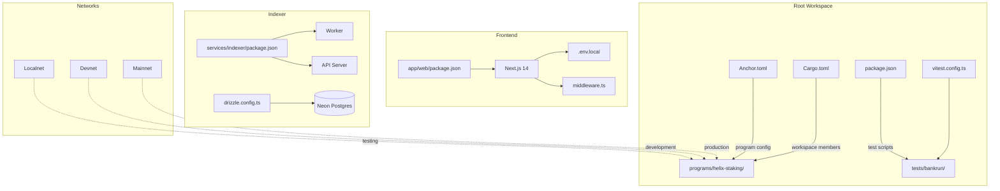

### Key Config Files
| File | Purpose |
|------|---------|
| `Anchor.toml` | Program ID, Anchor 0.31.1, cluster config |
| `Cargo.toml` | Rust workspace, blake3 patch, release LTO |
| `vitest.config.ts` | Forks pool, 1000s timeout |
| `app/web/.env.local` | Devnet RPC URL, wallet secrets |
| `app/web/middleware.ts` | CSP headers, `unsafe-eval` dev-only |
| `.planning/ROADMAP.md` | 8 phases, 35+ completed plans |

### Build Pipeline
```
anchor build → target/deploy/helix_staking.so
              → target/idl/helix_staking.json
              → target/types/helix_staking.ts
IDL copied to → app/web/public/idl/helix_staking.json
```

### Project Status
| Metric | Value |
|--------|-------|
| Current phase | 8 of 8 (Testing & Launch) |
| Plans completed | 35+ |
| Security status | CONDITIONAL PASS |

### Notable Gotchas & Tech Debt
- Same program ID across all networks (devnet = mainnet ID)
- `blake3` crate needs patch for Rust 1.84 compatibility
- IDL must be manually copied from `target/` to `app/web/public/`
- No automated CI/CD pipeline yet
- Anchor 0.31 locked (0.32+ has breaking changes)

[\[run_me.md]\]
 
 <//Users/annon/projects/solhex/voicetree-9-2/config-and-deployment.md>
</Users/annon/projects/solhex/voicetree-9-2/cfg-anchor-workspace.md> 
 
# Anchor & Rust Workspace

## Build system for the Solana on-chain program: Anchor.toml, workspace Cargo.toml, and program Cargo.toml

### Anchor.toml (`/Anchor.toml`)

Anchor CLI version is locked to **0.31.1** via the `[toolchain]` block. Seeds derivation is enabled; linting is not skipped.

```toml
[toolchain]
anchor_version = "0.31.1"

[features]
seeds = true
skip-lint = false
```

**Program ID** is the same across all network targets:

- Localnet: `E9B7BsxdPS89M66CRGGbsCzQ9LkiGv6aNsra3cNBJha7`
- Devnet: `E9B7BsxdPS89M66CRGGbsCzQ9LkiGv6aNsra3cNBJha7`

Provider defaults to `Localnet` with `~/.config/solana/id.json` wallet. Test runner is configured with a 5s startup wait.

The test script invokes `ts-mocha` (legacy), but the project has migrated to vitest -- see root `vitest.config.ts`.

### Workspace Cargo.toml (`/Cargo.toml`)

```toml
[workspace]
members = ["programs/*"]
resolver = "2"
```

**Critical patch**: `blake3` is pinned to tag `1.8.2` because version `1.8.3+` requires Rust `edition2024`, which is incompatible with Solana's platform-tools (Rust 1.84).

**Release profile** is tuned for on-chain deployment safety:
- `overflow-checks = true` -- arithmetic panics on overflow (security requirement)
- `lto = "fat"` -- full link-time optimization for smaller binary
- `codegen-units = 1` -- single codegen unit for maximum optimization
- Build override: `opt-level = 3` with no incremental compilation

### Program Cargo.toml (`/programs/helix-staking/Cargo.toml`)

```toml
[package]
name = "helix-staking"
edition = "2021"

[dependencies]
anchor-lang = "0.31"
anchor-spl = { version = "0.31", features = ["metadata", "token_2022"] }
spl-token-2022 = { version = "6", features = ["no-entrypoint"] }
solana-nostd-keccak = "0.1"  # Merkle proof verification
```

Features include `idl-build` for Anchor IDL generation and `cpi` for cross-program invocations.

### Root package.json (`/package.json`)

Two test entry points:
- `npm test` -- `anchor test` (full validator lifecycle)
- `npm run test:bankrun` -- `vitest run tests/bankrun` (fast, deterministic, no validator)

Key dependencies: `@coral-xyz/anchor ^0.31.0`, `@solana/web3.js ^1.95.0`.

### vitest.config.ts (`/vitest.config.ts`)

```ts
pool: 'forks',       // Required -- bankrun native bindings crash with threads
singleFork: true,    // All tests share one process (avoids forking overhead)
testTimeout: 1000000, // ~16 minutes -- bankrun tests are slow
hookTimeout: 1000000,
```

The `forks` pool is mandatory because `solana-bankrun` uses native Node addons that are not thread-safe.

### Build Pipeline

```
anchor build
  -> target/deploy/helix_staking.so      (on-chain program binary)
  -> target/idl/helix_staking.json       (IDL for client generation)
  -> target/types/helix_staking.ts       (TypeScript types)

Manual step: copy IDL to app/web/public/idl/helix_staking.json
```

### Notable Gotchas

- **Same program ID everywhere**: localnet and devnet share `E9B7Bs...`. Mainnet will also reuse this unless redeployed to a fresh keypair.
- **blake3 patch is fragile**: If upstream releases a new compatible version or Solana upgrades platform-tools past Rust 1.84, the patch must be updated or removed.
- **IDL copy is manual**: No script or CI step copies the generated IDL to the frontend public directory. Forgetting this breaks client-side deserialization.
- **Anchor 0.31 lock**: Upgrading to Anchor 0.32+ introduces breaking changes in account validation. Stay on 0.31.x.
- **vitest forks mode**: Using `pool: 'threads'` will segfault due to bankrun's native bindings. This is a hard requirement.
- **`overflow-checks = true`** in release profile is a security decision -- it prevents silent integer wrapping in the deployed program binary.

[\[config-and-deployment.md]\]
 
 <//Users/annon/projects/solhex/voicetree-9-2/cfg-anchor-workspace.md>
</Users/annon/projects/solhex/voicetree-9-2/cfg-frontend.md> 
 
# Frontend Config

## Next.js 14 dashboard configuration: webpack, middleware CSP, env vars, Tailwind theme, Playwright E2E, and provider stack

### next.config.mjs (`/app/web/next.config.mjs`)

Disables Node.js polyfills that Solana packages try to require in the browser:

```js
config.resolve.fallback = {
  crypto: false, stream: false, buffer: false,
  fs: false, path: false, os: false,
};
```

No other custom webpack config. No rewrites, redirects, or image optimization overrides.

### Environment Variables (`/app/web/.env.local`)

```
HELIUS_RPC_URL=https://api.devnet.solana.com
NEXT_PUBLIC_RPC_URL=https://api.devnet.solana.com
```

The `.env.local.example` template shows `HELIUS_RPC_URL=https://mainnet.helius-rpc.com/?api-key=YOUR_KEY` for production Helius usage.

Additional env vars used at runtime:
- `NEXT_PUBLIC_SKIP_WALLET_CHECK` -- set in Playwright E2E to bypass wallet-dependent UI gates
- `NEXT_PUBLIC_TEST_WALLET_SECRET` -- loaded by Playwright for E2E transaction tests
- `NEXT_PUBLIC_MERKLE_DATA_URL` -- CDN URL for Merkle proof data (free claim)

### Middleware (`/app/web/middleware.ts`)

Applies security headers on every non-static request:

- **CSP**: `script-src 'self' 'nonce-{uuid}' 'strict-dynamic'`, with `'unsafe-eval'` added only in dev mode
- **connect-src**: whitelists `*.helius-rpc.com` and `*.solana.com` (both HTTPS and WSS). Dev mode adds `localhost:*`.
- **X-Frame-Options**: `DENY`
- **X-Content-Type-Options**: `nosniff`
- **Referrer-Policy**: `strict-origin-when-cross-origin`

Nonce is propagated via `x-nonce` request header for downstream consumption by script tags.

Matcher excludes `_next/static`, `_next/image`, `favicon.ico`, and prefetch requests.

### Providers (`/app/web/app/providers.tsx`)

Provider stack (outermost to innermost):
1. `ConnectionProvider` -- endpoint resolves to `{origin}/api/rpc` in browser, `https://localhost/api/rpc` during SSR
2. `WalletProvider` -- `autoConnect` enabled, dynamically loads `TestWalletAdapter` when `NEXT_PUBLIC_TEST_WALLET_SECRET` is set
3. `WalletModalProvider`
4. `QueryClientProvider` -- singleton `QueryClient` with `staleTime: 15s`, `gcTime: 30s`, `retry: 3`
5. `ThemeProvider` -- forced dark mode (`forcedTheme="dark"`)
6. `TooltipProvider` -- 300ms delay

### Tailwind (`/app/web/tailwind.config.ts`)

Custom color palette:
- **helix**: Green scale (50-950) -- brand color based on emerald (#10b981 at 500)
- **accent**: Blue scale -- interactive elements (#3b82f6 at 500)
- **penalty**: Red scale -- penalty/destructive states (#ef4444 at 500)
- **surface**: Dark zinc backgrounds (DEFAULT=#18181b, raised=#27272a, overlay=#3f3f46)
- **border**: Zinc borders (DEFAULT=#3f3f46, subtle=#27272a)

Dark mode is class-based. Font family uses `--font-inter` CSS variable with system-ui fallback.

### Playwright (`/app/web/playwright.config.ts`)

```ts
testDir: './e2e'
timeout: 30_000          // 30s default
fullyParallel: true
retries: process.env.CI ? 2 : 0
workers: process.env.CI ? 1 : undefined
reporter: 'html'
```

Two project configurations:
1. **chromium** -- standard E2E tests, ignores `transactions/` directory
2. **transaction-tests** -- 90s timeout, sequential (`fullyParallel: false`), depends on chromium completing first

WebServer spins up `npm run dev` at `localhost:3000` with test-specific env vars injected (`NEXT_PUBLIC_SKIP_WALLET_CHECK`, `HELIUS_RPC_URL=http://localhost:8899`).

### Key Dependencies

| Package | Version | Purpose |
|---------|---------|---------|
| `next` | ^14.2.0 | Framework |
| `@coral-xyz/anchor` | 0.31.1 | Program client (pinned exact) |
| `@solana/web3.js` | 1.95.8 | Solana SDK (pinned exact, v1 required) |
| `@tanstack/react-query` | ^5.0.0 | Data fetching/caching |
| `zustand` | ^5.0.0 | Client state |
| `recharts` | ^2.15.0 | Analytics charts |
| `sonner` | ^1.7.0 | Toast notifications |
| `@radix-ui/*` | various | UI primitives (dialog, slider, checkbox, tooltip, progress) |
| `@playwright/test` | ^1.58.2 | E2E testing |

### Notable Gotchas

- **`--legacy-peer-deps` required**: Solana wallet adapter packages peer on newer `@solana/web3.js`, but Anchor 0.31 requires v1.x. Install with `npm install --legacy-peer-deps`.
- **CSP nonce per-request**: Each request gets a fresh `crypto.randomUUID()` nonce. If you add inline scripts, they must carry this nonce or they will be blocked.
- **`unsafe-eval` in dev only**: Next.js dev server uses eval for hot module replacement. Production builds must not have this.
- **RPC proxy pattern**: Browser hits `/api/rpc` (relative URL), not the RPC directly. This keeps the Helius API key server-side.
- **`@solana/web3.js` v1 locked**: Anchor TS client is incompatible with `@solana/web3.js` v2. Do not upgrade.
- **Dark mode forced**: `forcedTheme="dark"` means theme toggling does nothing. The entire UI is dark-only.
- **Playwright global setup/teardown**: Tests use `e2e/global-setup.ts` and `e2e/global-teardown.ts` for wallet provisioning.

[\[config-and-deployment.md]\]
 
 <//Users/annon/projects/solhex/voicetree-9-2/cfg-frontend.md>
</Users/annon/projects/solhex/voicetree-9-2/cfg-indexer.md> 
 
# Indexer Config

## Light indexer service configuration: Drizzle ORM, Zod env validation, Fastify API server, and Neon Postgres

### Package Identity (`/services/indexer/package.json`)

```json
{
  "name": "@helix/indexer",
  "type": "module",   // ESM-first
  "private": true
}
```

Two runtime entry points:
- `dev:worker` -- `tsx src/worker/index.ts` (polls chain events)
- `dev:api` -- `tsx src/api/index.ts` (Fastify REST server)

Database management:
- `db:generate` -- `drizzle-kit generate` (create migration SQL from schema diff)
- `db:migrate` -- `drizzle-kit migrate` (apply migrations)
- `db:studio` -- `drizzle-kit studio` (web UI for database inspection)

### Environment Validation (`/services/indexer/src/lib/env.ts`)

Zod schema validates all env vars at startup. The process **exits immediately** on validation failure with a formatted error listing missing/invalid vars.

| Variable | Type | Default | Required |
|----------|------|---------|----------|
| `DATABASE_URL` | string | -- | Yes |
| `RPC_URL` | string | `https://api.devnet.solana.com` | No |
| `PROGRAM_ID` | string | -- | Yes |
| `PORT` | number | `3001` | No |
| `POLL_INTERVAL_MS` | number | `5000` | No |
| `LOG_LEVEL` | enum(`debug`/`info`/`warn`/`error`) | `info` | No |
| `FRONTEND_URL` | string | `http://localhost:3000` | No |

### Drizzle Config (`/services/indexer/drizzle.config.ts`)

```ts
defineConfig({
  schema: './src/db/schema.ts',
  dialect: 'postgresql',
  dbCredentials: { url: process.env.DATABASE_URL! },
  out: './src/db/migrations',
});
```

Loads `dotenv/config` at top level. Schema file at `src/db/schema.ts` is the single source of truth for all 11+ event tables and checkpoint tracking.

### Fastify API Server (`/services/indexer/src/api/index.ts`)

- CORS origin locked to `env.FRONTEND_URL` (single origin, credentials allowed)
- Listens on `0.0.0.0:{PORT}` (default 3001)
- Built-in Fastify logger disabled; uses custom `pino` logger
- Global error handler returns structured JSON `{ error, message, statusCode }`
- Graceful shutdown on SIGTERM/SIGINT: closes Fastify, then closes DB pool

Route plugins registered:
1. `/health` -- health check
2. `/stats` -- aggregate protocol statistics
3. `/distributions` -- inflation distribution history
4. `/stakes` -- stake event history
5. `/claims` -- free claim event history
6. `/leaderboard` -- T-share rankings (RANK window function)
7. `/whale-activity` -- large stake/unstake movements

### Key Dependencies

| Package | Version | Purpose |
|---------|---------|---------|
| `fastify` | ^5.2.1 | HTTP server |
| `@fastify/cors` | ^10.0.2 | CORS middleware |
| `drizzle-orm` | ^0.38.3 | Type-safe SQL ORM |
| `@neondatabase/serverless` | ^0.10.4 | Neon Postgres serverless driver |
| `zod` | ^3.24.1 | Runtime env/query validation |
| `pino` / `pino-pretty` | ^9.6 / ^13.0 | Structured logging |
| `p-retry` | ^6.2.1 | Retry logic for RPC calls |
| `@coral-xyz/anchor` | ^0.30.1 | IDL decoding (note: 0.30, not 0.31) |

### vitest.config.ts (`/services/indexer/vitest.config.ts`)

```ts
defineConfig({
  test: {
    root: 'src',
    globals: true,
    environment: 'node',
  },
  resolve: {
    alias: { '@': path.resolve(__dirname, './src') },
  },
});
```

Path alias `@` maps to `./src` for clean imports throughout the indexer codebase.

### Notable Gotchas

- **Anchor version mismatch**: Indexer uses `@coral-xyz/anchor ^0.30.1` while root and frontend use `0.31.x`. This is intentional -- the indexer only decodes events from the IDL and does not construct transactions, so the minor version difference is tolerable.
- **`type: "module"`**: The indexer is ESM-only. All internal imports use `.js` extensions. This differs from the root workspace which is CommonJS.
- **Lazy DB initialization**: The DB client uses a `Proxy` pattern to defer connection until first use, avoiding import-time env validation failures during testing.
- **`DATABASE_URL` is required**: Unlike RPC_URL which has a default, missing DATABASE_URL kills the process at startup. Ensure `.env` is present.
- **Neon serverless driver**: Uses `@neondatabase/serverless` for HTTP-based Postgres connections. This requires a Neon-hosted database (not a standard Postgres connection string).
- **Token-value fields stored as text**: Large numeric fields (amounts, T-shares, share rates) are stored as Postgres `text` to preserve full precision beyond JavaScript's Number range. Client-side parsing uses `BN.js`.
- **CORS single-origin**: The API only accepts requests from `FRONTEND_URL`. If you run the frontend on a different port, update the env var.
- **No authentication**: The API is fully public/read-only. No auth tokens, no rate limiting.

[\[config-and-deployment.md]\]
 
 <//Users/annon/projects/solhex/voicetree-9-2/cfg-indexer.md>
</Users/annon/projects/solhex/voicetree-9-2/cfg-project-planning.md> 
 
# Project Planning

## The `.planning/` directory: roadmap phases, state tracking, research docs, and agent-driven audit infrastructure

### Directory Structure

```
.planning/
  PROJECT.md         -- What HELIX is, requirements, constraints, key decisions
  ROADMAP.md         -- 8 phases with plan details and completion tracking
  STATE.md           -- Current position, velocity metrics, session continuity
  REQUIREMENTS.md    -- Formal requirement specifications
  CONTEXT-HANDOFF.md -- Context for session handoffs between agents
  CLAUDE.md          -- Claude-specific project instructions
  config.json        -- Agent configuration
  agent-history.json -- Agent execution log
  v1.0-MILESTONE-AUDIT.md -- Pre-launch audit checklist
  research/          -- Initial research docs (STACK, FEATURES, ARCHITECTURE, PITFALLS, SUMMARY)
  docs/              -- Supporting documentation (security audit team config, etc.)
  phases/            -- 11 phase directories with plans, summaries, and audits
```

### PROJECT.md -- Protocol Definition

Defines HELIX as a "HEX-style staking protocol on Solana" with the core value proposition: users stake tokens for a chosen duration, earn T-shares proportional to commitment, and receive daily inflation rewards.

Key constraints documented:
- Anchor (Rust) on Solana -- locked
- Token-2022 with metadata extension
- `@solana/web3.js` v1 required (Anchor TS client incompatibility with v2)
- Light indexer only -- not a full backend
- Solo developer build with Claude as implementation partner

### ROADMAP.md -- Phase Tracking

8 main phases plus 3 inserted security phases (2.1, 3.2, 3.3):

| Phase | Name | Plans | Status |
|-------|------|-------|--------|
| 1 | Foundation & Token Infrastructure | 2/2 | Complete |
| 2 | Core Staking Mechanics | 4/4 | Complete |
| 2.1 | Critical Math Fixes (inserted) | 1/1 | Complete |
| 3 | Free Claim & Big Pay Day | 6/6 | Complete |
| 3.2 | BPD Security Critical Fixes (inserted) | 2/2 | Complete |
| 3.3 | Post-Audit Security Hardening (inserted) | 4/4 | Complete |
| 4 | Staking Dashboard | 5/5 | Complete |
| 5 | Light Indexer Service | 3/3 | Complete |
| 6 | Analytics & Jupiter Integration | 3/3 | Complete |
| 7 | Leaderboard & Marketing Site | 3/3 | Complete |
| 8 | Testing, Audit & Mainnet Launch | 3/5 | In Progress |

**Phase numbering convention**: Integer phases (1, 2, 3) are planned milestones. Decimal phases (2.1, 3.2, 3.3) are urgent insertions triggered by security audits.

Each phase directory under `phases/` contains plan files (`NN-MM-PLAN.md`), summary files (`NN-MM-SUMMARY.md`), and optional security audit reports (`NN-SECURITY-AUDIT.md`).

### STATE.md -- Session Continuity

Tracks the exact resume point between work sessions:

- **Current position**: Phase 8, Plan 3 of 5 complete (60%)
- **Last activity**: Plan 08-03 (security tests + 7-agent audit: CONDITIONAL PASS)
- **Next**: Plans 08-04 (devnet deployment) and 08-05 (mainnet deployment)
- **Total velocity**: 35 plans completed in ~5h 15min (~8.8 min average)

Contains an extensive **Accumulated Context > Decisions** section documenting every architectural decision made across all phases (130+ entries). This is the single most important reference when resuming work -- it captures the "why" behind every implementation choice.

### Research Directory

Initial research conducted before development:

| File | Content |
|------|---------|
| `STACK.md` | Technology choices and rationale |
| `FEATURES.md` | Feature breakdown and prioritization |
| `ARCHITECTURE.md` | System architecture design |
| `PITFALLS.md` | Known risks and mitigation strategies |
| `SUMMARY.md` | Research synthesis |

### Security Audit Infrastructure

The 7-agent parallel security audit system is documented in `.planning/docs/security-audit-team.md`. Agents cover:
1. Account/PDA validation
2. Tokenomics correctness
3. Logic/edge cases
4. Access control
5. Reentrancy/CPI safety
6. Arithmetic overflow/precision
7. State/data integrity

Audit reports are stored per-phase (e.g., `03-SECURITY-AUDIT.md`, `08-SECURITY-AUDIT.md`).

### Notable Gotchas

- **STATE.md is the resume file**: Always read this first when starting a new session. The `Session Continuity` section tells you exactly where to pick up.
- **Decimal phases are security insertions**: When you see Phase 3.2 or 3.3, these were emergency insertions to fix audit findings. They are complete and should not be re-executed.
- **Accumulated Context is massive**: The decisions list in STATE.md has 130+ entries. Use it as a reference, not a reading exercise. Search for specific keywords.
- **Plan files are the source of truth**: Each `NN-MM-PLAN.md` contains the exact implementation instructions that were executed. Summary files contain the outcome.
- **Phase 8 is incomplete**: Plans 08-04 (devnet deployment) and 08-05 (mainnet deployment) have not been executed yet. This is the current frontier.
- **v1.0-MILESTONE-AUDIT.md**: A pre-launch checklist that should be reviewed before mainnet deployment. It is a separate document from the phase-specific audit reports.
- **No CI/CD**: All builds, tests, and deployments are manual. The planning system tracks what was done but does not automate execution.

[\[config-and-deployment.md]\]
 
 <//Users/annon/projects/solhex/voicetree-9-2/cfg-project-planning.md>
</Users/annon/projects/solhex/voicetree-9-2/indexer-service.md> 
 
# Indexer Service

## Event polling + REST API at `services/indexer/`

Lightweight dual-process Node.js service that monitors the Helix program for on-chain events, stores them in PostgreSQL, and serves analytics via REST API.

### Architecture

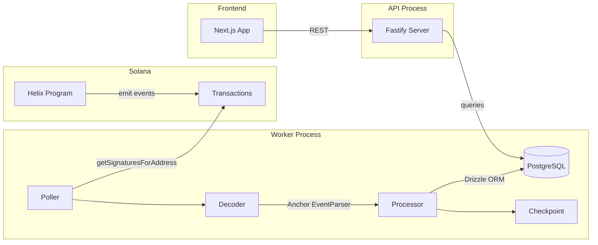

### 12 Event Tables
| Table | Key Indexes | Purpose |
|-------|-------------|---------|
| `stake_created_events` | user, user+slot | Stake creation records |
| `stake_ended_events` | user | Unstake records with penalties |
| `rewards_claimed_events` | user | Reward claim history |
| `inflation_distributed_events` | day | Daily distribution log |
| `admin_minted_events` | - | Admin mint audit trail |
| `claim_period_started_events` | - | Claim period lifecycle |
| `tokens_claimed_events` | claimer | Free claim records |
| `vested_tokens_withdrawn_events` | claimer | Vesting withdrawals |
| `claim_period_ended_events` | - | Period completion |
| `big_pay_day_distributed_events` | - | BPD distribution records |
| `bpd_aborted_events` | - | BPD abort audit trail |
| `checkpoints` | program | Cursor for crash recovery |

### REST API Endpoints
| Route | Purpose |
|-------|---------|
| `GET /health` | DB + indexer lag status |
| `GET /api/stats` | Protocol-wide aggregates |
| `GET /api/stats/history` | Historical share rate |
| `GET /api/stakes?user=` | Paginated stake events |
| `GET /api/distributions/chart` | Inflation chart data |
| `GET /api/claims/tokens?claimer=` | Claim events |
| `GET /api/leaderboard` | Top stakers |
| `GET /api/whale-activity` | Large stake events |

### Tech Stack
- **Runtime:** Node.js + TypeScript (tsx)
- **API:** Fastify 5.2
- **Database:** Neon Postgres (serverless) + Drizzle ORM
- **RPC:** `@solana/web3.js` with p-retry (5 retries, exponential backoff)
- **Logging:** Pino

### Notable Gotchas & Tech Debt
- **Polling-based** (5s interval) - not real-time WebSocket subscription
- No reorg handling beyond slot tracking in checkpoint
- All u64/u128 values stored as `text` (avoids JS BigInt precision loss)
- Single program ID per checkpoint (no multi-program support)
- `onConflictDoNothing()` for idempotent inserts (signature unique constraint)

### Sub-Components
- [\[idx-worker-pipeline.md]\] -- Polling loop, signature processing, checkpoint management
- [\[idx-database-schema.md]\] -- 13 Drizzle tables (12 events + checkpoint), Neon connection
- [\[idx-rest-api.md]\] -- 10 Fastify endpoints for analytics, stakes, claims, leaderboard
- [\[idx-event-types-and-decoding.md]\] -- TypeScript interfaces and Anchor log parsing
- [\[idx-infrastructure.md]\] -- Env validation, retry-enabled RPC client, Pino logger

[\[run_me.md]\]
 
 <//Users/annon/projects/solhex/voicetree-9-2/indexer-service.md>
</Users/annon/projects/solhex/voicetree-9-2/idx-worker-pipeline.md> 
 
# Worker Pipeline

## Polling loop that fetches on-chain transactions, decodes Anchor events, and writes them to Postgres with per-signature checkpointing.

The worker is a standalone Node.js process (`worker/index.ts`) that runs a `setInterval`-based polling loop. Each tick flows through four stages: checkpoint lookup, signature fetching, event decoding, and database insertion.

### File Roles

| File | Purpose |
|------|---------|
| `worker/index.ts` | Orchestrator -- poll timer, `tick()` loop, graceful shutdown (SIGTERM/SIGINT with 30s drain) |
| `worker/poller.ts` | Calls `getSignaturesForAddress` with `until` cursor from checkpoint, returns results in chronological (oldest-first) order |
| `worker/decoder.ts` | Fetches the parsed transaction via RPC, pipes `logMessages` through Anchor's `EventParser` |
| `worker/processor.ts` | Giant `switch(name)` that routes each decoded event to the correct Drizzle table insert |
| `worker/checkpoint.ts` | Upsert of `(programId, lastSignature, lastSlot, processedCount)` for crash recovery |

### Data Flow

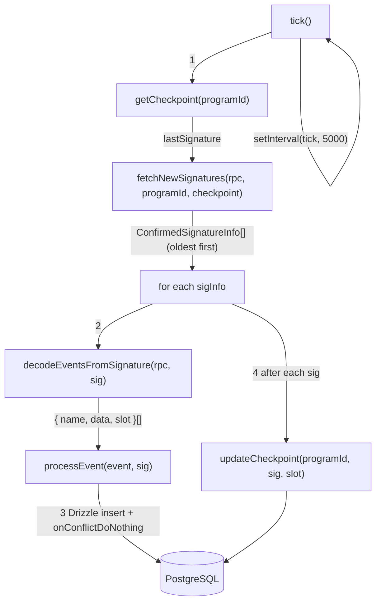

### Processing Model

- **Sequential per-signature**: Signatures are processed one at a time in chronological order. This guarantees checkpoint consistency -- if the process crashes, it resumes from the last successfully checkpointed signature.
- **Parallel within-tick is avoided**: The `isProcessing` flag prevents overlapping ticks if a batch takes longer than `POLL_INTERVAL_MS` (default 5s).
- **Error isolation**: A failure on one signature logs an error and continues to the next. The failed signature's events are lost (no retry queue), but the checkpoint advances only on success.

### Graceful Shutdown

1. Sets `isShuttingDown = true`, clears the interval timer.
2. Busy-waits (250ms polls) up to 30 seconds for `isProcessing` to clear.
3. Calls `closePool()` on the DB connection, then `process.exit(0)`.
4. If the 30s timeout fires while still processing, exits with code 1.

### Notable Gotchas

- **No retry queue**: If `decodeEventsFromSignature` returns `[]` due to a pruned/unavailable transaction, those events are permanently missed. The checkpoint still advances past it.
- **1000-signature limit per poll**: `getSignaturesForAddress` caps at 1000. If more than 1000 txns accumulate between ticks, only the most recent 1000 are fetched (they are reversed to oldest-first). Older ones are never picked up because the next tick uses `until` = the oldest one just fetched. This is a catch-up gap risk.
- **No reorg handling**: If a confirmed slot is reorged, the indexed events remain in the DB. The checkpoint tracks slot numbers but does not compare or roll back.
- **`toStr` / `toNum` helpers in processor**: These silently coerce BN objects, PublicKeys, and byte arrays. If Anchor SDK changes its output types, these helpers may silently produce incorrect values.
- **Inflation gap detection**: `detectInflationGap` in `processor.ts` warns if there is a day gap in `InflationDistributed` events that exceeds `daysElapsed`, but takes no corrective action.

[\[indexer-service.md]\]
 
 <//Users/annon/projects/solhex/voicetree-9-2/idx-worker-pipeline.md>
</Users/annon/projects/solhex/voicetree-9-2/idx-database-schema.md> 
 
# Database Schema

## Drizzle ORM schema defining 13 PostgreSQL tables (12 event tables + 1 checkpoint table) on Neon serverless Postgres.

### File Roles

| File | Purpose |
|------|---------|
| `db/schema.ts` | All table definitions using `drizzle-orm/pg-core`. Exports one const per table. |
| `db/client.ts` | Lazy-initialized Neon serverless `Pool` (max 10 connections) + Drizzle ORM instance, exposed via `Proxy` for deferred init. |

### Connection Architecture

The `db` and `pool` exports use ES `Proxy` wrappers that defer actual pool creation until first access. This avoids import-time crashes during tests when `DATABASE_URL` is unset. `closePool()` tears down both the pool and the cached Drizzle instance.

```mermaid
flowchart LR
    CODE["import { db }"] -->|Proxy get trap| LAZY["getDb()"]
    LAZY -->|first call| POOL["new Pool({ connectionString, max: 10 })"]
    POOL --> NEON["@neondatabase/serverless"]
    LAZY --> DRIZZLE["drizzle(pool, { schema })"]
    DRIZZLE --> ORM["Typed query builder"]
```

### Shared Columns Pattern

Every event table spreads a `sharedColumns` object:

| Column | Type | Notes |
|--------|------|-------|
| `id` | `serial` | Auto-increment PK |
| `signature` | `text NOT NULL UNIQUE` | Solana transaction signature; uniqueness enforces idempotent inserts |
| `slot` | `bigint (mode: number)` | Solana slot number |
| `created_at` | `timestamp DEFAULT NOW()` | DB insertion time |

### Event Tables (12)

| # | Table Name | Extra Columns | Indexes |
|---|-----------|---------------|---------|
| 1 | `protocol_initialized_events` | globalState, mint, mintAuthority, authority, annualInflationBp, minStakeAmount, startingShareRate, slotsPerDay | -- (signature unique only) |
| 2 | `stake_created_events` | user, stakeId, amount, tShares, days, shareRate | `user`, `(user, slot)` |
| 3 | `stake_ended_events` | user, stakeId, originalAmount, returnAmount, penaltyAmount, penaltyType, rewardsClaimed | `user` |
| 4 | `rewards_claimed_events` | user, stakeId, amount | `user` |
| 5 | `inflation_distributed_events` | day, daysElapsed, amount, newShareRate, totalShares | `day` |
| 6 | `admin_minted_events` | authority, recipient, amount | -- |
| 7 | `claim_period_started_events` | timestamp, claimPeriodId, merkleRoot, totalClaimable, totalEligible, claimDeadlineSlot | -- |
| 8 | `tokens_claimed_events` | timestamp, claimer, snapshotWallet, claimPeriodId, snapshotBalance, baseAmount, bonusBps, daysElapsed, totalAmount, immediateAmount, vestingAmount, vestingEndSlot | `claimer` |
| 9 | `vested_tokens_withdrawn_events` | timestamp, claimer, amount, totalVested, totalWithdrawn, remaining | `claimer` |
| 10 | `claim_period_ended_events` | timestamp, claimPeriodId, totalClaimed, claimsCount, unclaimedAmount | -- |
| 11 | `big_pay_day_distributed_events` | timestamp, claimPeriodId, totalUnclaimed, totalEligibleShareDays, helixPerShareDay, eligibleStakers | -- |
| 12 | `bpd_aborted_events` | claimPeriodId, stakesFinalized, stakesDistributed | -- |

### Checkpoint Table

| Column | Type | Notes |
|--------|------|-------|
| `id` | `serial` PK | |
| `program_id` | `text NOT NULL UNIQUE` | One row per tracked program |
| `last_signature` | `text` nullable | Most recently processed tx signature |
| `last_slot` | `bigint` nullable | Slot of that signature |
| `processed_count` | `bigint DEFAULT 0` | Running counter, incremented via SQL `+ 1` on upsert |
| `updated_at` | `timestamp DEFAULT NOW()` | Last upsert time |

### Column Type Conventions

| Solana Type | PG Column | Rationale |
|-------------|-----------|-----------|
| `u64` / `u128` (BN) | `text` | Avoids JS `Number` precision loss beyond 2^53 |
| `Pubkey` | `text` | Stored as base58 string |
| `u8` / `u16` / `u32` | `integer` or `bigint(mode: number)` | Safe within JS number range |
| `[u8; 32]` (merkle root) | `text` | Hex-encoded by `processor.ts` via `Buffer.from(val).toString('hex')` |

### Notable Gotchas

- **No foreign keys between tables**: Event tables are fully independent. The leaderboard query in the API uses a `LEFT JOIN` between `stake_created_events` and `stake_ended_events` via raw SQL, not ORM relations.
- **`bigint(mode: number)`**: Drizzle maps this to JS `number`, which silently loses precision above 2^53. The `slot` column uses this, which is safe (slots are well under 2^53), but it would be dangerous for token amounts -- hence those use `text`.
- **Proxy-based lazy init**: If `DATABASE_URL` is missing at runtime (not just test time), the error only surfaces on the first query, not at import time.
- **No migrations tooling visible**: Schema changes appear to be applied manually or via `drizzle-kit push`. No migration files are tracked in the repo.

[\[indexer-service.md]\]
 
 <//Users/annon/projects/solhex/voicetree-9-2/idx-database-schema.md>
</Users/annon/projects/solhex/voicetree-9-2/idx-rest-api.md> 
 
# REST API

## Fastify 5.2 server exposing 10 read-only endpoints for protocol analytics, stake history, claim data, and health checks.

The API is a separate process from the worker (`api/index.ts`). It connects to the same Neon Postgres database and serves pre-built analytical queries to the Next.js frontend.

### File Roles

| File | Purpose |
|------|---------|
| `api/index.ts` | Fastify setup, CORS config (locked to `FRONTEND_URL`), route registration, global error handler, graceful shutdown |
| `api/routes/health.ts` | `/health` -- DB ping + indexer lag detection (slot delta > 1000 = degraded) |
| `api/routes/stats.ts` | `/api/stats`, `/api/stats/history`, `/api/stats/distribution/stakes` -- protocol-wide aggregates |
| `api/routes/distributions.ts` | `/api/distributions`, `/api/distributions/chart` -- inflation distribution history |
| `api/routes/stakes.ts` | `/api/stakes`, `/api/unstakes` -- paginated stake/unstake events with optional user filter |
| `api/routes/claims.ts` | `/api/claims/tokens`, `/api/claims/rewards`, `/api/claims/bpd` -- claim event history |
| `api/routes/leaderboard.ts` | `/api/leaderboard` -- top stakers by active t-shares, total staked, or stake count |
| `api/routes/whale-activity.ts` | `/api/whale-activity` -- large stake/unstake movements above a threshold |

### Endpoint Reference

| Method | Path | Query Params | Description |
|--------|------|-------------|-------------|
| GET | `/health` | -- | DB connectivity + slot lag check (503 if lag > 1000 slots) |
| GET | `/api/stats` | -- | Parallel count queries across 5 tables + latest distribution |
| GET | `/api/stats/history` | `limit` (default 365) | Historical share rate from inflation events |
| GET | `/api/stats/distribution/stakes` | -- | Stake duration bucketing (< 30d, 30-90d, ... > 2y) |
| GET | `/api/distributions` | `page`, `limit` | Paginated inflation events (newest first) |
| GET | `/api/distributions/chart` | -- | All inflation events (oldest first, for charting) |
| GET | `/api/stakes` | `page`, `limit`, `user` | Paginated stake creation events |
| GET | `/api/unstakes` | `page`, `limit`, `user` | Paginated stake ended events |
| GET | `/api/claims/tokens` | `page`, `limit`, `claimer` | Token claim events with optional claimer filter |
| GET | `/api/claims/rewards` | `page`, `limit`, `user` | Reward claim events with optional user filter |
| GET | `/api/claims/bpd` | `page`, `limit` | Big Pay Day distribution events (global) |
| GET | `/api/leaderboard` | `limit`, `sort`, `user` | Active staker rankings (sort: t_shares / total_staked / stake_count) |
| GET | `/api/whale-activity` | `limit`, `minAmount` | Large movements (default threshold: 100 HELIX = 100000000000 raw) |

### Pagination Pattern

Most paginated endpoints follow this structure:

```mermaid
flowchart LR
    REQ["Request ?page=2&limit=50"] --> ZOD["Zod validation"]
    ZOD --> PAR["Promise.all"]
    PAR --> DATA["SELECT ... LIMIT/OFFSET"]
    PAR --> COUNT["SELECT COUNT(*)"]
    DATA --> RESP["{data, pagination: {page, limit, total, totalPages}}"]
    COUNT --> RESP
```

Validation uses Zod schemas inline (`z.coerce.number().int().positive().max(200).default(50)`). All pagination endpoints run the data query and count query in parallel via `Promise.all`.

### Leaderboard Query (Raw SQL)

The leaderboard endpoint uses a raw SQL CTE because it needs a `LEFT JOIN` to identify **active** stakes (created but not ended), which is not trivially expressed in Drizzle's query builder:

1. **`active_stakes` CTE**: Joins `stake_created_events` LEFT JOIN `stake_ended_events` on `(user, stake_id)`, filters where `se.id IS NULL`.
2. **`ranked` CTE**: Applies `RANK() OVER (ORDER BY ...)` with dynamic sort column via `sql.raw()`.
3. Final SELECT includes the user's own rank if `?user=` is provided, regardless of position.

### Notable Gotchas

- **CORS origin is a single string** (`env.FRONTEND_URL`), not an array. Multi-origin support (e.g., staging + production) would require changes.
- **No rate limiting or authentication**: All endpoints are publicly accessible. The frontend URL CORS restriction is trivially bypassed.
- **`sql.raw(sortColumn)` in leaderboard**: The sort column is validated via Zod enum (`t_shares | total_staked | stake_count`), so SQL injection is prevented. But the pattern is fragile -- adding a sort option without updating the Zod enum could introduce risk.
- **`/api/distributions/chart` fetches ALL rows**: No pagination or limit. As the protocol runs longer, this response will grow unbounded.
- **Whale activity default threshold**: `minAmount` defaults to `100000000000` (100 HELIX at 9 decimals). This is a string comparison cast to `::numeric` in SQL, which works correctly but is non-obvious.
- **Fastify logger disabled**: `Fastify({ logger: false })` -- all logging goes through the shared Pino instance from `lib/logger.ts` instead.

[\[indexer-service.md]\]
 
 <//Users/annon/projects/solhex/voicetree-9-2/idx-rest-api.md>
</Users/annon/projects/solhex/voicetree-9-2/idx-event-types-and-decoding.md> 
 
# Event Types & Decoding

## TypeScript interfaces for all 12 Helix program events and Anchor-based log parsing that converts raw transaction logs into typed event objects.

### File Roles

| File | Purpose |
|------|---------|
| `types/events.ts` | 12 TypeScript interfaces (one per event), `EVENT_NAMES` const tuple, `EventDataMap` type map, and `IndexedEvent` discriminated union |
| `lib/anchor.ts` | Loads the Helix Staking IDL from disk, constructs `BorshCoder` + `EventParser`, exports `parseEventsFromLogs()` |

### Event Catalog

| # | Event Name | Key Fields | Category |
|---|-----------|------------|----------|
| 1 | `ProtocolInitialized` | globalState, mint, authority, annualInflationBp, slotsPerDay | Admin |
| 2 | `StakeCreated` | user, stakeId, amount, tShares, days, shareRate | Staking |
| 3 | `StakeEnded` | user, stakeId, originalAmount, returnAmount, penaltyAmount, penaltyType | Staking |
| 4 | `RewardsClaimed` | user, stakeId, amount | Staking |
| 5 | `InflationDistributed` | day, daysElapsed, amount, newShareRate, totalShares | Inflation |
| 6 | `AdminMinted` | authority, recipient, amount | Admin |
| 7 | `ClaimPeriodStarted` | claimPeriodId, merkleRoot, totalClaimable, totalEligible, claimDeadlineSlot | Claims |
| 8 | `TokensClaimed` | claimer, snapshotWallet, claimPeriodId, baseAmount, bonusBps, vestingAmount | Claims |
| 9 | `VestedTokensWithdrawn` | claimer, amount, totalVested, totalWithdrawn, remaining | Claims |
| 10 | `ClaimPeriodEnded` | claimPeriodId, totalClaimed, claimsCount, unclaimedAmount | Claims |
| 11 | `BigPayDayDistributed` | claimPeriodId, totalUnclaimed, totalEligibleShareDays, helixPerShareDay | BPD |
| 12 | `BpdAborted` | claimPeriodId, stakesFinalized, stakesDistributed | BPD |

### Type Conventions

| Solana/Anchor Type | TypeScript Type | Rationale |
|-------------------|-----------------|-----------|
| `Pubkey` | `string` | Base58 after `toBase58()` |
| `u64` / `u128` | `string` | `BN.toString()` avoids JS precision loss |
| `u8` / `u16` / `u32` | `number` | Safe within JS number range |
| `[u8; 32]` | `number[]` | Raw byte array (hex-encoded at storage time by processor) |

### Decoding Pipeline

```mermaid
flowchart LR
    TX["Transaction logs\n(string[])"] -->|"parseEventsFromLogs()"| EP["Anchor EventParser\n.parseLogs(logs)"]
    EP -->|"Generator<Event>"| COLLECT["Collect into array"]
    COLLECT -->|"{ name, data }[]"| OUT["Return to decoder.ts"]

    subgraph "lib/anchor.ts initialization"
        IDL["helix_staking.json\n(from disk)"] --> BC["BorshCoder(idl)"]
        IDL --> PID["PublicKey from\nidl.address"]
        BC --> EP2["new EventParser(programId, coder)"]
        PID --> EP2
    end
```

### IDL Resolution

The IDL path is resolved with fallback logic:
1. `process.env.IDL_PATH` (explicit override, useful for deployments)
2. Default: `../../../../target/idl/helix_staking.json` (relative to `lib/anchor.ts`, resolves to the Anchor build output)

The program ID is extracted from the IDL via `idl.address` (Anchor 0.30+ format) with fallback to `idl.metadata.address` (older format). If neither exists, it throws at startup.

### Discriminated Union

The `IndexedEvent` type is a mapped discriminated union:

```typescript
type IndexedEvent = {
  [K in EventName]: { name: K; data: EventDataMap[K] };
}[EventName];
```

This allows type-safe narrowing in switch statements: when you match `event.name === 'StakeCreated'`, TypeScript narrows `event.data` to `StakeCreated`.

### Notable Gotchas

- **IDL is read synchronously at module load**: `fs.readFileSync` blocks the event loop on startup. If the file is missing, the process crashes immediately with an uncaught exception.
- **EventParser is a generator**: `parseLogs()` returns a generator, not an array. The current code iterates it with a `for...of` loop. If a single log entry causes a parse error, the generator may terminate early and remaining events in the same transaction are lost.
- **Type interfaces are not validated at runtime**: The interfaces in `types/events.ts` are compile-time only. If the on-chain program emits an event with a different shape than expected (e.g., after a program upgrade), the mismatch is silently ignored -- `processor.ts` just calls `toStr(data.fieldName)` which returns `''` for undefined fields.
- **`BpdAborted` lacks `slot` and `timestamp` fields**: Unlike other event interfaces, `BpdAborted` only has `claimPeriodId`, `stakesFinalized`, `stakesDistributed`. The `slot` is added by `decoder.ts` from the transaction metadata, not from the event data itself.

[\[indexer-service.md]\]
 
 <//Users/annon/projects/solhex/voicetree-9-2/idx-event-types-and-decoding.md>
</Users/annon/projects/solhex/voicetree-9-2/idx-infrastructure.md> 
 
# Infrastructure

## Shared utility layer providing environment validation, retry-enabled RPC client, and structured logging across both worker and API processes.

### File Roles

| File | Purpose |
|------|---------|
| `lib/env.ts` | Zod-validated environment variables with defaults; exits process on validation failure |
| `lib/rpc.ts` | `RpcClient` interface wrapping `@solana/web3.js` `Connection` with `p-retry` (5 retries, exponential backoff) |
| `lib/logger.ts` | Pino logger with pretty-printing in dev, JSON in production |

### Environment Variables

| Variable | Type | Default | Required | Notes |
|----------|------|---------|----------|-------|
| `DATABASE_URL` | string | -- | Yes | Neon Postgres connection string |
| `RPC_URL` | string | `https://api.devnet.solana.com` | No | Solana RPC endpoint |
| `PROGRAM_ID` | string | -- | Yes | Helix Staking program address to index |
| `PORT` | number | `3001` | No | API server listen port |
| `POLL_INTERVAL_MS` | number | `5000` | No | Worker polling interval in milliseconds |
| `LOG_LEVEL` | enum | `info` | No | `debug`, `info`, `warn`, `error` |
| `FRONTEND_URL` | string | `http://localhost:3000` | No | CORS origin for the API |

### RPC Client

```mermaid
flowchart TD
    CALLER["Worker / API"] -->|method call| CLIENT["RpcClient"]
    CLIENT -->|wraps| RETRY["p-retry\n5 retries\nfactor: 2\nmin: 1s, max: 60s"]
    RETRY -->|delegates to| CONN["@solana/web3.js Connection\n(confirmed commitment)"]
    CONN --> RPC["Solana RPC Node"]

    RETRY -->|on failure| LOG["logger.warn\nattempt, retriesLeft"]
```

The `RpcClient` interface exposes three methods:

| Method | Purpose | Used By |
|--------|---------|---------|
| `getSignaturesForAddress(address, options)` | Fetch transaction signatures for the program | `worker/poller.ts` |
| `getParsedTransaction(signature, commitment)` | Fetch full parsed transaction with logs | `worker/decoder.ts` |
| `getSlot(commitment)` | Get current chain slot number | `api/routes/health.ts` |

All three wrap the underlying `Connection` method in `p-retry` with identical retry options:
- **5 retries** with exponential backoff (factor 2)
- **Min timeout**: 1 second
- **Max timeout**: 60 seconds
- Each failed attempt logs a warning with attempt number and retries remaining

The `connection` property is also exposed directly on the client for any direct access needs, though it is not currently used outside the wrapper methods.

### Logger Configuration

| Environment | Behavior |
|-------------|----------|
| `NODE_ENV !== 'production'` | `pino-pretty` transport with colorized output, human-readable timestamps, `pid` and `hostname` suppressed |
| `NODE_ENV === 'production'` | Raw JSON output (default Pino behavior), structured for log aggregation |

The log level is set from `process.env.LOG_LEVEL` directly (not through the Zod-validated `env` object), defaulting to `'info'`. This means the logger initializes before environment validation runs.

### Notable Gotchas

- **`env.ts` calls `process.exit(1)` on validation failure**: This hard-exits the process. In test environments, importing any module that transitively imports `env.ts` will crash the test runner if the required env vars are not set. The `db/client.ts` Proxy pattern was specifically designed to work around this for the database layer.
- **Logger level set before env validation**: `lib/logger.ts` reads `process.env.LOG_LEVEL` at module load time, independently of `lib/env.ts`. If `env.ts` has not been imported yet, the Zod default (`'info'`) does not apply -- but since the logger also defaults to `'info'`, this is practically a non-issue.
- **RPC client is created per-process**: The worker creates one in `worker/index.ts`, and the health route creates another in `api/routes/health.ts`. These are separate `Connection` instances with independent WebSocket subscriptions (if any). There is no shared singleton.
- **No request timeout on RPC calls**: The retry wrapper handles transient failures but does not enforce a per-request timeout. A hung RPC node could block the worker indefinitely (the retry `maxTimeout` only applies between retries, not to individual request duration).
- **Default RPC URL is devnet**: If `RPC_URL` is not set, the indexer silently connects to devnet. This is safe for development but could cause confusion if deployed without the variable.

[\[indexer-service.md]\]
 
 <//Users/annon/projects/solhex/voicetree-9-2/idx-infrastructure.md>
</Users/annon/projects/solhex/voicetree-9-2/tokenomics-engine.md> 
 
# Tokenomics Engine

## Share rate, bonuses, penalties & inflation math

Cross-cutting module spanning on-chain program (`constants.rs`, `math.rs`, instruction logic) and frontend (`lib/solana/math.ts`, `lib/utils/format.ts`). Implements HEX-inspired economic model with burn-and-mint mechanics.

### Core Parameters
| Parameter | Value |
|-----------|-------|
| Annual inflation | 3.69% (3,690,000 bp) |
| Min stake | 0.1 HELIX (10M base units) |
| Starting share rate | 10,000 (1:1) |
| Max stake duration | 5,555 days (~15.2 years) |
| LPB max days | 3,641 (10 years for 2x) |
| BPB threshold | 150M tokens (100% bonus) |
| Precision | 1e9 (fixed-point scaling) |

### T-Share Calculation

```mermaid
flowchart LR
    A[Staked Amount] --> CALC
    D[Stake Days] --> LPB[LPB Bonus<br/>0% → 200%<br/>1 → 3641 days]
    A --> BPB[BPB Bonus<br/>0% → 100%<br/>0 → 150M tokens]
    LPB --> MULT[Total Multiplier<br/>1x + LPB + BPB]
    BPB --> MULT
    MULT --> CALC[T-Shares =<br/>amount x multiplier<br/>÷ share_rate]
    SR[Current Share Rate] --> CALC
```

### Penalty System
| Scenario | Formula | Range |
|----------|---------|-------|
| **Early exit** | `max(50%, time_unserved%)` | 50% - 100% |
| **On-time** | 0% | 0% |
| **Late (grace)** | 0% for 14 days | 0% |
| **Late (penalty)** | Linear over 351 days | 0% → 100% |

Penalties are **redistributed** to remaining stakers via share_rate increase.

### Key Invariants
- All math uses u128 intermediates (overflow prevention)
- Division AFTER multiplication (precision preservation)
- Penalties round UP (protocol-favorable)
- share_rate only increases (monotonic)

### Notable Gotchas & Tech Debt
- Frontend `math.ts` must mirror on-chain calculations exactly - divergence = UI bugs
- `TSHARE_DISPLAY_FACTOR = 1e12` for human-readable display (separate from PRECISION)
- Slot-based time: 216,000 slots/day assumes 400ms/slot (configurable via admin)
- Penalty window: exactly 365 days late = 100% penalty (351 days after 14-day grace)

### Sub-Components

- [\[tok-tshare-calculation.md]\] -- LPB + BPB bonuses, share rate division, reward debt
- [\[tok-inflation-distribution.md]\] -- Daily crank, share_rate increase, lazy distribution model
- [\[tok-penalty-system.md]\] -- Early/on-time/late penalties, grace period, redistribution
- [\[tok-constants-config.md]\] -- All protocol parameters, PDA seeds, precision factors
- [\[tok-frontend-math-mirror.md]\] -- math.ts parity with on-chain, format.ts display utilities

[\[run_me.md]\]
 
 <//Users/annon/projects/solhex/voicetree-9-2/tokenomics-engine.md>
</Users/annon/projects/solhex/voicetree-9-2/tok-tshare-calculation.md> 
 
# T-Share Calculation

## Converts staked amount + duration into T-Shares using LPB and BPB bonus curves, divided by the ever-increasing share rate

T-Shares are the core accounting unit of the protocol. They determine a staker's proportional claim on daily inflation rewards. The calculation lives on-chain in `math.rs` and is mirrored exactly in the frontend `math.ts` for preview display.

### Master Formula

```
t_shares = staked_amount * (PRECISION + LPB_bonus + BPB_bonus) / share_rate
```

Where `PRECISION = 1_000_000_000` (1e9) represents the base 1x multiplier. The total multiplier therefore ranges from **1x** (no bonuses) to **4x** (max LPB 2x + max BPB 1x + base 1x).

### Duration Bonus (LPB -- Longer Pays Better)

```
if days == 0:        bonus = 0
if days >= 3641:     bonus = 2 * PRECISION   (200% cap)
else:                bonus = (days - 1) * 2 * PRECISION / 3641
```

- 1-day stake earns **zero** LPB (days-1 = 0)
- 3,641 days (~10 years) earns the full **200%** bonus
- Stakes beyond 3,641 days (up to MAX_STAKE_DAYS=5555) still cap at 200%
- Linear interpolation between 1 and 3,641

### Size Bonus (BPB -- Bigger Pays Better)

```
if amount == 0:              bonus = 0
if amount/10 >= threshold:   bonus = PRECISION   (100% cap)
else:                        bonus = (amount / 10) * PRECISION / BPB_THRESHOLD
```

Where `BPB_THRESHOLD = 150,000,000_00_000_000` (150M tokens in 8-decimal base units).

- The `/10` divisor means you need **1.5 Billion** tokens staked for 100% BPB
- Linear between 0 and the threshold
- Integer division (`amount / 10`) happens first, which loses up to 9 base units of precision

### Reward Debt (Lazy Distribution)

At stake creation, `reward_debt = t_shares * current_share_rate` is stored. This anchors the staker's entry point so that `pending_rewards = (t_shares * current_share_rate) - reward_debt` correctly reflects only post-stake inflation.

On-chain (`math.rs`):
```rust
pub fn calculate_reward_debt(t_shares: u64, share_rate: u64) -> Result<u64> {
    let result = (t_shares as u128).checked_mul(share_rate as u128)...;
    u64::try_from(result)  // RewardDebtOverflow if > u64::MAX
}
```

### Mermaid: T-Share Calculation Flow

```mermaid
flowchart TD
    A[User Input: amount + days] --> V{Validate}
    V -->|amount < min_stake| REJECT[Reject]
    V -->|days < 1 or > 5555| REJECT
    V -->|Valid| LPB["LPB = (days-1) * 2 * PRECISION / 3641"]
    V -->|Valid| BPB["BPB = (amount/10) * PRECISION / BPB_THRESHOLD"]
    LPB --> MULT["total_mult = PRECISION + LPB + BPB"]
    BPB --> MULT
    MULT --> TSHARES["t_shares = amount * total_mult / share_rate"]
    TSHARES --> DEBT["reward_debt = t_shares * share_rate"]
    DEBT --> STORE["Store in StakeAccount"]
    TSHARES --> GLOBAL["global.total_shares += t_shares"]
```

### On-Chain vs Frontend Parity

| Function | On-chain (`math.rs`) | Frontend (`math.ts`) |
|---|---|---|
| `calculate_lpb_bonus` | `u64` with checked arithmetic | `BN` with same formula |
| `calculate_bpb_bonus` | `u64`, integer `/10` first | `BN.div(TEN)` first |
| `calculate_t_shares` | `u128` intermediate for multiply | `BN.mul()` (arbitrary precision) |
| `calculate_reward_debt` | `u128` intermediate, `RewardDebtOverflow` | Not in frontend (on-chain only) |

### Notable Gotchas

- **Share rate only increases** -- later stakers get fewer T-Shares per token, which is the core incentive to stake early.
- **BPB `/10` integer division** loses up to 9 base units (negligible but technically a floor). Both on-chain and frontend do this identically.
- **u128 intermediates** on-chain prevent overflow. Frontend BN is arbitrary-precision, so no overflow risk, but the results must match the truncation behavior of u128->u64 conversion.
- **Display scaling**: Raw on-chain T-Shares are divided by `TSHARE_DISPLAY_FACTOR = 1e12` for user display. A 10 HELIX stake at 1:1 rate shows as ~100 display T-Shares. This is purely cosmetic and separate from PRECISION.
- **1-day stake = zero LPB**: The `days - 1` formula means you need at least 2 days for any duration bonus.

### Key Source Files

- On-chain: `programs/helix-staking/src/instructions/math.rs` (lines 38-127)
- Frontend: `app/web/lib/solana/math.ts` (lines 42-106)
- UI: `app/web/components/stake/bonus-preview.tsx`

[\[tokenomics-engine.md]\]
 
 <//Users/annon/projects/solhex/voicetree-9-2/tok-tshare-calculation.md>
</Users/annon/projects/solhex/voicetree-9-2/tok-inflation-distribution.md> 
 
# Inflation & Distribution

## Permissionless daily crank mints virtual inflation by increasing share_rate, distributing rewards proportionally to all T-Share holders

The protocol inflates at 3.69% annually. Rather than minting tokens to each staker individually, the crank bumps a global `share_rate`. Each staker's pending rewards are computed lazily: `pending = t_shares * current_share_rate - reward_debt`.

### Core Parameters

| Parameter | Value | Stored In |
|---|---|---|
| `annual_inflation_bp` | 3,690,000 (= 3.69%) | `GlobalState` |
| `slots_per_day` | 216,000 (~400ms/slot) | `GlobalState` (admin-adjustable) |
| `share_rate` | Starts at 10,000 (1:1) | `GlobalState` (monotonically increasing) |
| `current_day` | 0-indexed from `init_slot` | `GlobalState` |

### Crank Distribution Formula

The crank (`crank_distribution.rs`) runs once per logical day. Anyone can call it (permissionless).

```
current_day = (current_slot - init_slot) / slots_per_day

days_elapsed = current_day - global_state.current_day

annual_inflation = total_tokens_staked * annual_inflation_bp / 100_000_000

daily_inflation = annual_inflation * days_elapsed / 365

share_rate_increase = daily_inflation * PRECISION / total_shares

share_rate += share_rate_increase
```

Key detail: `annual_inflation_bp = 3_690_000` with a divisor of `100_000_000` means the basis points have 2 extra digits of precision beyond the standard 10,000-based BPS.

### Lazy Distribution Model

No tokens are minted during the crank. The `share_rate` increase encodes future value:

```
pending_rewards = t_shares * current_share_rate - reward_debt
```

Actual minting only happens at **unstake** or **claim_rewards**, when the protocol mints `return_amount + pending_rewards + bpd_bonus` to the user.

### Mermaid: Daily Distribution Cycle

```mermaid
flowchart TD
    CRANK[Cranker calls crank_distribution] --> CHECK{current_day > last_day?}
    CHECK -->|No| SKIP[AlreadyDistributedToday error]
    CHECK -->|Yes| SHARES{total_shares > 0?}
    SHARES -->|No| UPDATE_DAY["Update current_day only<br/>No inflation emitted"]
    SHARES -->|Yes| CALC["annual = staked * 3,690,000 / 100M<br/>daily = annual * elapsed / 365"]
    CALC --> RATE["share_rate += daily * 1e9 / total_shares"]
    RATE --> EMIT["Emit InflationDistributed event"]
    EMIT --> UPDATE_DAY2["Update current_day"]
```

### Multi-Day Catch-Up

If the crank is missed for N days, the next call uses `days_elapsed = N` and distributes the full accumulated inflation in one shot. The formula `annual_inflation * days_elapsed / 365` handles this correctly, as `mul_div` preserves precision via u128 intermediates.

### Interaction with Staking/Unstaking

- **New stake**: `reward_debt = t_shares * share_rate` locks in entry point
- **Unstake**: `pending_rewards = t_shares * share_rate - reward_debt` captures all accrued inflation
- **Penalty redistribution**: When someone unstakes with a penalty, `share_rate += penalty * PRECISION / remaining_shares` gives the penalty to everyone else (see `tok-penalty-system.md`)

### Token Economics (Burn-and-Mint)

The protocol uses a burn-and-mint model:
- **Stake**: Tokens are **burned** from the user's wallet
- **Unstake**: Tokens are **minted** back (principal - penalty + rewards + BPD)
- The crank does NOT mint; it only updates `share_rate`
- `total_tokens_staked` (not `mint.supply`) is the inflation base, since supply is deflated by burns

### Notable Gotchas

- **Uses `total_tokens_staked` not mint supply** for inflation base. In a burn-and-mint model, supply does not reflect locked value.
- **Multiply before divide** (`annual * days / 365` not `(annual / 365) * days`) to preserve precision with integer arithmetic.
- **Zero-shares guard**: If no active stakes, the crank just updates `current_day` without dividing by zero.
- **HIGH-1 fix**: The `annual_inflation` calculation uses `mul_div` (u128 intermediate) to prevent overflow. Without this, overflow occurs at ~50K HELIX staked because `staked * 3_690_000` exceeds u64::MAX.
- **share_rate never decreases** -- this is a protocol invariant. It increases from inflation and from penalty redistribution.
- **Slots per day is admin-adjustable** (`admin_set_slots_per_day`), which changes the effective day length. This means the inflation rate in wall-clock time can shift if Solana's slot time drifts.

### Key Source Files

- On-chain: `programs/helix-staking/src/instructions/crank_distribution.rs`
- Math helpers: `programs/helix-staking/src/instructions/math.rs` (lines 9-17, 260-276)
- State: `programs/helix-staking/src/state/global_state.rs`
- Constants: `programs/helix-staking/src/constants.rs` (line 8)

[\[tokenomics-engine.md]\]
 
 <//Users/annon/projects/solhex/voicetree-9-2/tok-inflation-distribution.md>
</Users/annon/projects/solhex/voicetree-9-2/tok-penalty-system.md> 
 
# Penalty System

## Early and late unstake penalties enforced via basis-point calculations, with forfeited tokens redistributed to remaining stakers through share_rate increases

Three timing scenarios exist at unstake: early (before maturity), on-time (within grace period), and late (after grace). Penalties are computed in both on-chain Rust and frontend TypeScript with identical formulas.

### Penalty Schedule

```
            |<--- Stake Duration --->|<- Grace ->|<--- Late Penalty Window --->|
  start_slot                     end_slot    +14 days                    +365 days
            [  EARLY: 50%-100%  ]   [ 0%  ]   [    LINEAR 0% -> 100%    ]
```

### Early Unstake Penalty

Triggered when `current_slot < end_slot`.

```
served_fraction_bps = (elapsed * 10,000) / total_duration
penalty_bps = 10,000 - served_fraction_bps
penalty_bps = max(penalty_bps, 5,000)          // enforce 50% floor
penalty_amount = ceil(staked_amount * penalty_bps / 10,000)
```

| Time Served | Natural Penalty | After 50% Floor |
|---|---|---|
| 0% | 100% | 100% |
| 25% | 75% | 75% |
| 50% | 50% | 50% |
| 75% | 25% | **50%** (floor) |
| 90% | 10% | **50%** (floor) |
| 100% | 0% (not early) | 0% |

The 50% minimum (`MIN_PENALTY_BPS = 5000`) means serving more than half your term still costs at least half. This strongly discourages early exit.

### Late Unstake Penalty

Triggered when `current_slot > end_slot + grace_period_slots`.

```
slots_late = current_slot - end_slot
late_days = slots_late / slots_per_day
if late_days <= 14:  penalty = 0     // grace period
else:
  penalty_days = late_days - 14
  penalty_bps = penalty_days * 10,000 / 351
  penalty_bps = min(penalty_bps, 10,000)    // cap at 100%
  penalty_amount = ceil(staked_amount * penalty_bps / 10,000)
```

| Days After Maturity | Penalty |
|---|---|
| 0-14 (grace) | 0% |
| 15 | ~0.28% |
| 100 | ~24.5% |
| 200 | ~53.0% |
| 365 (14 grace + 351 window) | 100% |

The late penalty window is **exactly 351 days** so that `351 * 10,000 / 351 = 10,000 bps = 100%` at day 365 post-maturity.

### Mermaid: Penalty Decision Flow

```mermaid
flowchart TD
    UNSTAKE[User calls unstake] --> BPD{BPD window active?}
    BPD -->|Yes| BLOCKED["UnstakeBlockedDuringBpd error"]
    BPD -->|No| TIMING{current_slot vs end_slot}
    TIMING -->|"current < end"| EARLY["EARLY penalty<br/>max(50%, unserved%)<br/>Round UP"]
    TIMING -->|"current >= end"| GRACE{Days late?}
    GRACE -->|"<= 14 days"| ONTIME["ON-TIME: 0% penalty"]
    GRACE -->|"> 14 days"| LATE["LATE penalty<br/>linear 0%->100% over 351 days<br/>Round UP"]
    EARLY --> REDISTRIBUTE
    LATE --> REDISTRIBUTE
    ONTIME --> MINT["Mint full amount + rewards + BPD"]
    REDISTRIBUTE["Redistribute penalty:<br/>share_rate += penalty * 1e9 / total_shares"]
    REDISTRIBUTE --> MINT2["Mint (amount - penalty) + rewards + BPD"]
```

### Penalty Redistribution

Penalties are not burned; they flow back to remaining stakers via `share_rate`:

```rust
// In unstake.rs, after removing unstaker's shares:
if penalty > 0 && global_state.total_shares > 0 {
    let penalty_share_increase = mul_div(penalty, PRECISION, global_state.total_shares)?;
    global_state.share_rate += penalty_share_increase;
}
```

**Order matters**: The unstaker's `t_shares` are subtracted from `total_shares` BEFORE the redistribution, so the penalty-payer does not benefit from their own penalty.

### Rounding Direction

All penalty amounts use `mul_div_up` (ceiling division):
```
penalty = ((staked_amount * penalty_bps) + (BPS_SCALER - 1)) / BPS_SCALER
```
This rounds UP in favor of the protocol. A penalty of 50% on 101 tokens yields 51 (not 50).

### Notable Gotchas

- **50% floor on early exit** means even at 99% term completion, leaving early costs half your stake. This is a design choice inherited from HEX.
- **Round-UP arithmetic** (`mul_div_up`) means the protocol always gets the extra fractional token. Both Rust and TypeScript implement this identically.
- **BPD window blocks unstaking** (`is_bpd_window_active()` check). During Big Pay Day calculation, all unstakes are rejected to prevent share-rate manipulation.
- **Penalty type encoding**: `0` = None, `1` = Early, `2` = Late. Emitted in the `StakeEnded` event for indexer consumption.
- **Slots-per-day dependency**: Late penalty uses `slots_per_day` from GlobalState. If admin changes this value, existing late-penalty calculations shift.
- **Integer division in late_days** means partial days are truncated (floor). Being 13.9 days late still counts as 13 days (within grace).
- **Total payout**: `total_mint = (staked_amount - penalty) + pending_rewards + bpd_bonus_pending`. All three components are summed and minted in a single CPI call.

### Key Source Files

- On-chain formulas: `programs/helix-staking/src/instructions/math.rs` (lines 129-227)
- Unstake logic: `programs/helix-staking/src/instructions/unstake.rs`
- Frontend mirror: `app/web/lib/solana/math.ts` (lines 116-193)
- Constants: `programs/helix-staking/src/constants.rs` (lines 29-33)

[\[tokenomics-engine.md]\]
 
 <//Users/annon/projects/solhex/voicetree-9-2/tok-penalty-system.md>
</Users/annon/projects/solhex/voicetree-9-2/tok-constants-config.md> 
 
# Constants & Configuration

## All protocol parameters, PDA seeds, precision factors, and configurable admin values in one reference

Protocol constants are defined in on-chain `constants.rs` and mirrored in frontend `constants.ts`. Some values are hardcoded; others are stored in `GlobalState` and admin-adjustable at runtime.

### Hardcoded Protocol Constants

| Constant | On-chain Value | Frontend Value | Purpose |
|---|---|---|---|
| `PRECISION` | `1_000_000_000` (1e9) | `new BN(1_000_000_000)` | Fixed-point scaling for bonuses/rates |
| `MAX_STAKE_DAYS` | `5555` | `5555` | Maximum stake duration (~15.2 years) |
| `LPB_MAX_DAYS` | `3641` | `3641` | Days for full 2x duration bonus (~10 years) |
| `BPB_THRESHOLD` | `150_000_000_00_000_000` | `new BN("15000000000000000")` | 150M tokens (8 decimals) for BPB calculation |
| `MIN_PENALTY_BPS` | `5000` | `5000` | 50% minimum early unstake penalty |
| `BPS_SCALER` | `10_000` | `10_000` | Basis points denominator |
| `GRACE_PERIOD_DAYS` | `14` | `14` | Post-maturity grace period |
| `LATE_PENALTY_WINDOW_DAYS` | `351` | `351` | Days for late penalty to reach 100% |
| `TOKEN_DECIMALS` | `8` | `8` | HELIX token decimal places |
| `DEFAULT_ANNUAL_INFLATION_BP` | `3_690_000` | -- | 3.69% in extended basis points |
| `DEFAULT_STARTING_SHARE_RATE` | `10_000` | -- | 1:1 at launch |
| `DEFAULT_SLOTS_PER_DAY` | `216_000` | `216_000` | ~400ms per slot |
| `DEFAULT_MIN_STAKE_AMOUNT` | `10_000_000` | -- | 0.1 HELIX minimum |

### Display Constants (Frontend Only)

| Constant | Value | Purpose |
|---|---|---|
| `TSHARE_DISPLAY_FACTOR` | `new BN("1000000000000")` (1e12) | Scale raw T-Shares for human display |
| `PROGRAM_ID` | `E9B7Bs...` | Deployed program address |
| `LABELS.*` | User-facing strings | LPB="Duration Bonus", BPB="Size Bonus", etc. |

### Claim & Vesting Constants

| Constant | Value | Purpose |
|---|---|---|
| `CLAIM_PERIOD_DAYS` | `180` | 6-month claim window |
| `VESTING_DAYS` | `30` | 30-day graduated release |
| `IMMEDIATE_RELEASE_BPS` | `1000` (10%) | Portion available immediately |
| `VESTED_RELEASE_BPS` | `9000` (90%) | Portion that vests over 30 days |
| `SPEED_BONUS_WEEK1_BPS` | `2000` (+20%) | Bonus for claiming in week 1 |
| `SPEED_BONUS_WEEK2_4_BPS` | `1000` (+10%) | Bonus for claiming in weeks 2-4 |
| `HELIX_PER_SOL` | `10_000` | Snapshot claim ratio |
| `MIN_SOL_BALANCE` | `100_000_000` | 0.1 SOL minimum for claim |
| `MAX_MERKLE_PROOF_LEN` | `20` | Supports 1M+ claimants |

### PDA Seeds

| Seed | On-chain | Frontend |
|---|---|---|
| `GLOBAL_STATE_SEED` | `b"global_state"` | `Buffer.from("global_state")` |
| `MINT_SEED` | `b"helix_mint"` | `Buffer.from("helix_mint")` |
| `MINT_AUTHORITY_SEED` | `b"mint_authority"` | `Buffer.from("mint_authority")` |
| `STAKE_SEED` | `b"stake"` | `Buffer.from("stake")` |
| `CLAIM_CONFIG_SEED` | `b"claim_config"` | `Buffer.from("claim_config")` |
| `CLAIM_STATUS_SEED` | `b"claim_status"` | `Buffer.from("claim_status")` |

### Admin-Adjustable Parameters (in GlobalState)

These are set at `initialize` and can be changed by the authority:

| Field | Default | Admin Instruction |
|---|---|---|
| `annual_inflation_bp` | 3,690,000 | (future governance) |
| `min_stake_amount` | 10,000,000 | (future governance) |
| `slots_per_day` | 216,000 | `admin_set_slots_per_day` |
| `claim_period_days` | 180 | (set at init) |

### Mermaid: Configuration Hierarchy

```mermaid
flowchart LR
    subgraph Hardcoded["Hardcoded (constants.rs)"]
        PREC[PRECISION = 1e9]
        MAX[MAX_STAKE_DAYS = 5555]
        LPB[LPB_MAX_DAYS = 3641]
        BPB[BPB_THRESHOLD = 150M]
        PEN[Penalty params]
    end

    subgraph Runtime["Runtime (GlobalState)"]
        SR[share_rate<br/>starts 10,000<br/>monotonic increase]
        INF[annual_inflation_bp<br/>3,690,000]
        SPD[slots_per_day<br/>216,000<br/>admin-adjustable]
        COUNTERS[total_stakes<br/>total_shares<br/>current_day]
    end

    subgraph Frontend["Frontend Mirror (constants.ts)"]
        PREC2[PRECISION = BN 1e9]
        DISP[TSHARE_DISPLAY_FACTOR = 1e12]
        LABELS[LABELS object]
    end

    Hardcoded --> Runtime
    Hardcoded -.->|"must match"| Frontend
```

### Notable Gotchas

- **BPB_THRESHOLD representation differs**: On-chain uses `150_000_000_00_000_000` (Rust underscore grouping for 150M at 8 decimals). Frontend uses `"15000000000000000"` (string for BN). Same numeric value, different literal formats.
- **PRECISION vs TSHARE_DISPLAY_FACTOR**: `PRECISION` (1e9) is for internal math scaling. `TSHARE_DISPLAY_FACTOR` (1e12) is purely for UI display. Confusing them will produce wildly wrong numbers.
- **Extended basis points**: `annual_inflation_bp = 3_690_000` is NOT standard basis points (which use 10,000 = 100%). It uses 100,000,000 as the denominator for extra precision. This is why the divisor in `crank_distribution.rs` is `100_000_000`, not `10_000`.
- **`reserved[0]` double-duty**: `GlobalState.reserved[0]` is used as the BPD window active flag (`is_bpd_window_active`). The other 5 reserved slots are truly unused.
- **Seeds must be byte-identical** between on-chain and frontend. Any discrepancy means PDA derivation fails silently (wrong address, account not found).
- **`slots_per_day` can drift**: If Solana's actual slot time changes, admin can update this. But changing it affects all future day calculations, penalty windows, and inflation timing retroactively for in-progress stakes.

### Key Source Files

- On-chain: `programs/helix-staking/src/constants.rs`
- Frontend: `app/web/lib/solana/constants.ts`
- State: `programs/helix-staking/src/state/global_state.rs`

[\[tokenomics-engine.md]\]
 
 <//Users/annon/projects/solhex/voicetree-9-2/tok-constants-config.md>
</Users/annon/projects/solhex/voicetree-9-2/tok-frontend-math-mirror.md> 
 
# Frontend Math Mirror

## TypeScript reimplementation of on-chain math using BN.js for real-time previews and display formatting

The frontend must replicate on-chain calculations exactly so that bonus previews, penalty estimates, and reward displays match what the blockchain will compute. Any divergence is a user-visible bug.

### Architecture

```
math.ts          -- Pure BN arithmetic functions (mirrors math.rs)
constants.ts     -- Protocol parameters (mirrors constants.rs)
format.ts        -- Display formatting (HELIX amounts, T-Shares, BPS, days)
```

Components consume these via:
- `bonus-preview.tsx` -- Live T-Share preview as user adjusts amount/days
- `confirm-step.tsx` -- Final review before stake submission
- `protocol-stats.tsx` -- Dashboard stats (total staked, share rate, etc.)

### Function Parity Table

| On-chain (math.rs) | Frontend (math.ts) | Notes |
|---|---|---|
| `mul_div(a, b, c)` | `mulDiv(a, b, c)` | u128 vs BN (both safe from overflow) |
| `mul_div_up(a, b, c)` | `mulDivUp(a, b, c)` | Ceiling division for penalties |
| `calculate_lpb_bonus(days)` | `calculateLpbBonus(stakeDays)` | Identical formula |
| `calculate_bpb_bonus(amount)` | `calculateBpbBonus(stakedAmount)` | Both do `/10` first |
| `calculate_t_shares(amt, days, rate)` | `calculateTShares(amt, days, rate)` | Same formula |
| `calculate_early_penalty(...)` | `calculateEarlyPenalty(...)` | Same slot-based |
| `calculate_late_penalty(...)` | `calculateLatePenalty(...)` | Same slot-based |
| `calculate_pending_rewards(...)` | `calculatePendingRewards(...)` | Same lazy diff |
| `calculate_reward_debt(...)` | (not mirrored) | Only needed on-chain at stake creation |
| `get_current_day(...)` | (not mirrored) | Only needed by crank |

### BN.js Arithmetic Patterns

The frontend uses `bn.js` for arbitrary-precision integers:

```typescript
// mulDiv: (a * b) / c -- no overflow risk with BN
function mulDiv(a: BN, b: BN, c: BN): BN {
  return a.mul(b).div(c);
}

// mulDivUp: ceiling division -- matches on-chain rounding
function mulDivUp(a: BN, b: BN, c: BN): BN {
  return a.mul(b).add(c.sub(ONE)).div(c);
}
```

On-chain uses `u128` intermediates to prevent overflow in `u64 * u64 / u64`. BN.js is arbitrary precision so this is not a concern, but the **truncation behavior** (integer floor division) must match.

### Display Formatting (format.ts)

| Function | Input | Output Example | Notes |
|---|---|---|---|
| `formatHelix(bn)` | `BN(100_000_000)` | `"1.00 HELIX"` | Trims trailing zeros, keeps min 2 decimals |
| `formatHelixCompact(bn)` | `BN(1.5e14)` | `"1.50M"` | K/M/B suffixes for large values |
| `parseHelix(str)` | `"1.5"` | `BN(150_000_000)` | Truncates to 8 decimals (no rounding) |
| `formatBps(n)` | `5000` | `"50.00%"` | Basis points to percentage |
| `formatDays(n)` | `365` | `"365 days"` | Years for large values |
| `formatTShares(bn)` | raw T-Shares | `"123.45"` | Divides by 1e12 display factor |
| `truncateAddress(s)` | `"AbCdEf...6789"` | `"AbCd...6789"` | 4+4 chars |

### Mermaid: Data Flow from Chain to Display

```mermaid
flowchart LR
    CHAIN["On-chain GlobalState<br/>(share_rate, total_shares)"] -->|RPC query| HOOK["useGlobalState()"]
    HOOK --> MATH["math.ts<br/>calculateTShares()<br/>calculateLpbBonus()<br/>calculateBpbBonus()"]
    USER["User Input<br/>(amount, days)"] --> PARSE["parseHelix(amount)"]
    PARSE --> MATH
    MATH --> FORMAT["format.ts<br/>formatTShares()<br/>formatHelix()"]
    FORMAT --> UI["BonusPreview<br/>ConfirmStep<br/>ProtocolStats"]
```

### Bonus-to-Percentage Conversion Pattern

Both `bonus-preview.tsx` and `confirm-step.tsx` convert PRECISION-scaled bonuses to display percentages:

```typescript
const lpbPercent = lpbBonus.mul(new BN(10000)).div(PRECISION).toNumber() / 100;
//  e.g., PRECISION (1e9) -> 10000 -> / 100 -> 100.00%
```

This is `bonus * 10000 / 1e9` then divide by 100 for percentage with 2 decimal places. The intermediate `* 10000` preserves 2 decimal digits of precision before converting to JS `number`.

### parseHelix: Truncation (Not Rounding)

```typescript
// "1.123456789" with TOKEN_DECIMALS=8 -> truncates to "1.12345678"
if (decimalPart.length > TOKEN_DECIMALS) {
  decimalPart = decimalPart.slice(0, TOKEN_DECIMALS);  // truncate, don't round
}
```

This matches on-chain behavior where amounts are always in base units (integers). The frontend never rounds user input -- it floors to the nearest base unit.

### Notable Gotchas

- **BN.js vs BigInt**: The codebase uses `bn.js` (not native `BigInt`). This is because `@solana/web3.js` and Anchor use BN. Mixing BN and BigInt will cause silent type errors.
- **PRECISION vs TSHARE_DISPLAY_FACTOR confusion**: `PRECISION = 1e9` is for math scaling. `TSHARE_DISPLAY_FACTOR = 1e12` is only for `formatTShares`. Using the wrong one produces 1000x errors.
- **`shareRate` type mismatch**: On-chain it is `u64`. The frontend receives it as a `BN` (from Anchor deserialization) but some paths convert via `.toString()` and back (`new BN(globalState.shareRate.toString())`). Ensure consistency.
- **Slot-based not timestamp-based**: All penalty calculations use slot numbers, not Unix timestamps. The frontend must fetch `Clock.slot` for accurate penalty previews (or approximate via `slots_per_day`).
- **Compact formatting truncates**: `formatHelixCompact` uses integer division for K/M/B, losing precision. `1,999,999 HELIX` displays as `"1.99M"` not `"2.00M"`. This is cosmetic only.
- **`addCommas` regex**: The comma-insertion regex `\B(?=(\d{3})+(?!\d))` is correct for positive integers but breaks on decimal parts if called incorrectly. It is only called on the whole-number portion.
- **No server-side math**: All calculations run client-side. There is no API endpoint that computes T-Shares or penalties. If the frontend math diverges from on-chain, the user sees incorrect previews until the transaction confirms (or fails).

### Key Source Files

- Math: `app/web/lib/solana/math.ts`
- Constants: `app/web/lib/solana/constants.ts`
- Formatting: `app/web/lib/utils/format.ts`
- Bonus Preview: `app/web/components/stake/bonus-preview.tsx`
- Confirm Step: `app/web/components/stake/stake-wizard/confirm-step.tsx`
- Protocol Stats: `app/web/components/dashboard/protocol-stats.tsx`

[\[tokenomics-engine.md]\]
 
 <//Users/annon/projects/solhex/voicetree-9-2/tok-frontend-math-mirror.md>
</Users/annon/projects/solhex/voicetree-9-2/test-and-audit-infra.md> 
 
# Test & Audit Infrastructure

## Bankrun tests, Playwright E2E, security audits, validation scripts

Multi-layered testing spanning on-chain program tests (Vitest + Bankrun), frontend E2E (Playwright), devnet validation scripts, and a 7-agent security audit system.

### Test Architecture

```mermaid
flowchart TD
    subgraph "On-Chain Tests (Vitest + Bankrun)"
        BT[tests/bankrun/] -->|unit/integration| P1[Phase 1-2 Tests]
        BT --> P3[Phase 3 Tests]
        BT --> SEC[Phase 3.3 Security Tests]
    end

    subgraph "E2E Tests (Playwright)"
        PW[app/web/e2e/] -->|UI only| UI[dashboard, navigation, analytics, swap, rewards]
        PW -->|with wallet| TX[transactions/create-stake, claim-rewards, end-stake]
    end

    subgraph "Validation Scripts"
        SC[scripts/] --> DV[devnet-validate.ts]
        SC --> DVB[devnet-validate-bpd.ts]
        SC --> DVC[devnet-validate-claims.ts]
    end

    subgraph "Security Audit (7 Agents)"
        AUDIT[.planning/docs/security-audit-team.md] --> A1[Account/PDA]
        AUDIT --> A2[Tokenomics]
        AUDIT --> A3[Logic/Edge Cases]
        AUDIT --> A4[Access Control]
        AUDIT --> A5[Reentrancy/CPI]
        AUDIT --> A6[Arithmetic]
        AUDIT --> A7[State/Data]
    end
```

### Test Coverage
| Suite | Count | Coverage |
|-------|-------|----------|
| Bankrun (Phase 1-2) | ~20 | Core staking lifecycle |
| Bankrun (Phase 3) | ~15 | Free claim, BPD, migration |
| Security (Phase 3.3) | 10/10 | CRIT-1, HIGH-1/2, MED-1 |
| Playwright UI | 5 suites | Dashboard, nav, analytics, swap, rewards |
| Playwright Tx | 3 suites | Create stake, claim, end stake |

### Notable Gotchas & Tech Debt
- Bankrun uses `forks` pool mode - no parallel test execution
- 1000s timeout needed for long-running BPD batch tests
- E2E transaction tests need real SOL (separate from UI tests)
- No CI/CD pipeline configured yet (Phase 8 remaining work)
- `TestWalletAdapter` only loaded when env var set (production-safe)

## Child Nodes

- [\[test-bankrun-core.md]\] -- Core staking lifecycle tests (initialize, createStake, unstake, claimRewards, crankDistribution)
- [\[test-bankrun-phase3.md]\] -- Free claim, BPD distribution, vesting, and account migration tests
- [\[test-security.md]\] -- Security audit finding regression tests (CRIT-1, HIGH-1/2, MED-1, CRIT-NEW-1)
- [\[test-playwright-e2e.md]\] -- Browser E2E tests for Next.js dashboard, navigation, and transaction flows
- [\[test-validation-audit.md]\] -- Devnet validation scripts and 7-agent security audit configuration

[\[run_me.md]\]
 
 <//Users/annon/projects/solhex/voicetree-9-2/test-and-audit-infra.md>
</Users/annon/projects/solhex/voicetree-9-2/test-bankrun-core.md> 
 
# Bankrun Core Tests

**Parent:** [\[test-and-audit-infra.md]\]

Foundational Solana program tests using solana-bankrun with Anchor framework integration. These tests validate the core staking lifecycle: protocol initialization, stake creation with T-share calculations, unstaking with penalty mechanics, reward claiming via lazy distribution, and permissionless crank-based inflation distribution.

## Key Test Files

### `tests/bankrun/utils.ts` -- Shared Test Utilities

Central utility module imported by all bankrun test suites. Provides:

- **PDA Seeds & Derivation:** `GLOBAL_STATE_SEED`, `MINT_AUTHORITY_SEED`, `MINT_SEED`, `STAKE_SEED` with corresponding `findGlobalStatePDA()`, `findMintAuthorityPDA()`, `findMintPDA()`, `findStakePDA()` functions.
- **Protocol Defaults:** `DEFAULT_ANNUAL_INFLATION_BP` (500 = 5%), `DEFAULT_MIN_STAKE_AMOUNT` (10M base units = 0.1 HELIX), `DEFAULT_STARTING_SHARE_RATE` (10,000), `DEFAULT_SLOTS_PER_DAY` (216,000).
- **`setupTest()`**: Bootstraps a Bankrun `ProgramTestContext` via `startAnchor()`, returning `BanksClient`, `payer`, and `Anchor Provider`.
- **`initializeProtocol()`**: Initializes `GlobalState` PDA, Token-2022 mint, and mint authority. Returns all PDAs for downstream use.
- **`advanceClock(days)`**: Manipulates Bankrun's `Clock` sysvar to simulate time passage. Converts days to slots via `DEFAULT_SLOTS_PER_DAY`.
- **`mintTokensToUser()`**: Calls `admin_mint` instruction to fund test wallets.
- **`getTokenBalance()`**: Parses Token-2022 account data at byte offset 64 to extract `u64` balance.

### `tests/bankrun/initialize.test.ts` -- Protocol Initialization (4 tests)

- Verifies `GlobalState` parameters (authority, mint, inflation rate, share_rate, counters all zero).
- Validates Token-2022 mint configuration (8 decimals, 0 initial supply, correct mint authority PDA).
- Rejects double initialization (protocol already initialized).
- Confirms Bankrun clock mocking works correctly (216K slots = 86,400 seconds).

### `tests/bankrun/createStake.test.ts` -- Stake Creation (6 tests)

- **Min duration T-shares:** Verifies `t_shares = amount * PRECISION / share_rate`.
- **LPB bonus at 3641 days:** Validates the Longer Pays Better 2x multiplier at the curve maximum.
- **BPB bonus for large amounts:** Tests the Bigger Pays Better bonus scaling.
- **Below minimum rejection:** Amounts below `DEFAULT_MIN_STAKE_AMOUNT` are rejected.
- **Invalid duration rejection:** Duration of 0 days and >5555 days both fail.
- **Sequential IDs:** Same user creating multiple stakes gets incrementing `stake_id` values.

### `tests/bankrun/unstake.test.ts` -- Unstaking & Penalties (9 tests)

Organized into Early / On-Time / Late / Edge Case groups:
- **Early unstake:** 50% minimum penalty floor, proportional penalty for partial completion.
- **Mint-based return:** Confirms tokens are minted (not transferred) back to user.
- **Grace period:** 14-day grace window after stake maturity with no penalty.
- **Late penalties:** Linear late penalty after grace period, reaching 100% at 365 days late.
- **Edge cases:** Double-unstake rejection, unauthorized user rejection, `GlobalState` counter updates (`total_staked`, `total_shares`), and `share_rate` redistribution of penalty amounts to remaining stakers.

### `tests/bankrun/claimRewards.test.ts` -- Reward Claiming (7 tests)

- Correct claim amount after crank distribution.
- Rejection when no rewards are available.
- `reward_debt` mechanism prevents double-claiming same distribution.
- Multi-day accumulation (multiple cranks before one claim).
- Proportional distribution: two stakers with 3:1 T-share ratio receive 3:1 rewards.
- Rejection on inactive (already unstaked) stake.
- `share_rate` increase after distribution makes future stakes more expensive per T-share.

### `tests/bankrun/crankDistribution.test.ts` -- Inflation Distribution (5 tests)

- `share_rate` increases correctly after 1-day crank.
- Same-day double distribution rejected.
- Multi-day gap handling: cranking after 3 missed days catches up correctly.
- Zero `total_shares` handling: crank is a no-op (no division-by-zero).
- Permissionless cranking: non-authority user can successfully crank.

## Test Patterns & Utilities

- **Vitest runner** (`describe`/`it`/`expect`) with `beforeAll` setup blocks.
- **Bankrun context isolation:** Each test file gets a fresh `ProgramTestContext` via `setupTest()`.
- **Clock manipulation:** `advanceClock()` enables deterministic time-dependent testing without waiting for real block production.
- **Token-2022 parsing:** Manual byte-level account data parsing at offset 64 (avoids SPL token library dependency for balance reads).
- **PDA-based account lookups:** All state assertions read directly from on-chain PDA accounts via `getAccount()` + `program.coder.accounts.decode()`.

## Notable Gotchas

- **Token-2022 vs SPL Token:** The program uses `TOKEN_2022_PROGRAM_ID`, not the legacy SPL Token program. Token account data layout differs slightly; balance is at offset 64.
- **Slots vs seconds:** Bankrun maps 1 slot = 0.4 seconds. `DEFAULT_SLOTS_PER_DAY` (216,000) = 86,400 seconds. All time-dependent tests operate in slots, not wall clock time.
- **Mint-not-transfer model:** Unstaking mints new tokens rather than transferring from a vault. Tests must check `mint.supply` changes, not balance transfers.
- **Share rate is cumulative:** After penalty redistribution or crank distribution, `share_rate` increases permanently, affecting all future T-share calculations.
- **Sequential stake IDs:** The `next_stake_id` counter on `GlobalState` is user-specific (tracked per-user in the stake PDA seed), so stake IDs are scoped to each user.
 
 <//Users/annon/projects/solhex/voicetree-9-2/test-bankrun-core.md>
</Users/annon/projects/solhex/voicetree-9-2/test-bankrun-phase3.md> 
 
# Bankrun Phase 3 Tests

**Parent:** [\[test-and-audit-infra.md]\]

Phase 3 test suite validates the free claim system, Big Pay Day (BPD) distribution, vesting mechanics, and account migration. These tests extend the core bankrun infrastructure with Merkle tree proofs, Ed25519 signature verification, and multi-phase BPD lifecycle testing.

## Key Test Files

### `tests/bankrun/phase3/utils.ts` -- Extended Test Utilities

Builds on top of `tests/bankrun/utils.ts` with claim-specific infrastructure:

- **Merkle Tree:** `buildMerkleTree()` using keccak256 hashing with sorted leaves for deterministic ordering. `getMerkleProof()` extracts inclusion proofs. `ClaimEntry` interface: `{ pubkey, amount }`.
- **Ed25519 Signatures:** `buildClaimMessage("HELIX:claim:{pubkey}:{amount}")`, `signClaimMessage()` using Ed25519, `createEd25519Instruction()` manually constructs the Ed25519 program instruction with 112-byte signature data layout.
- **PDA Derivation:** `findClaimConfigPDA()` and `findClaimStatusPDA()` with `MERKLE_ROOT_PREFIX_LEN=8` (first 8 bytes of merkle root used in PDA seed).
- **Vesting Math:** `calculateVestedAmount()` implements linear vesting formula, `calculateSpeedBonus()` with `HELIX_PER_SOL=10000` and decimal precision adjustment.
- **Constants:** `VESTING_DAYS=30`, `IMMEDIATE_RELEASE_BPS=1000` (10%), `CLAIM_PERIOD_DAYS=180`, `SPEED_BONUS_WEEK1_BPS=2000` (+20%), `SPEED_BONUS_WEEK2_4_BPS=1000` (+10%), `MIN_SOL_BALANCE=100M` lamports (0.1 SOL).

### `tests/bankrun/phase3/initializeClaim.test.ts` -- Claim Period Setup (5 tests)

- Valid merkle root initialization by authority.
- Non-authority user rejection.
- Double initialization rejection (claim config PDA already exists).
- Correct `end_slot` calculation: `current_slot + (CLAIM_PERIOD_DAYS * slots_per_day)`.
- Event data verification by reading persisted state fields.

### `tests/bankrun/phase3/freeClaim.test.ts` -- Free Claim Mechanics (11 tests)

- **Valid claim flow:** Merkle proof + Ed25519 signature verification, tokens minted to claimant.
- **Speed bonus tiers:** +20% in week 1, +10% in weeks 2-4, 0% after day 28.
- **Vesting split:** 10% immediate release, 90% vested over 30 days. Tests verify exact amounts.
- **Rejection cases:** Invalid merkle proof, missing Ed25519 instruction, wrong signer key, double claim (ClaimStatus PDA already exists), claim after period ends, claim before period starts.
- **SOL balance gate:** Snapshot balance below `MIN_SOL_BALANCE` (0.1 SOL) rejected.
- **Boundary tests:** Exact day 7 (last day of week 1 bonus) and day 28 (last day of weeks 2-4 bonus) boundary verification.

### `tests/bankrun/phase3/triggerBpd.test.ts` -- Big Pay Day Distribution (13 tests)

Tests the two-phase BPD architecture: `finalize_bpd_calculation` -> `seal_bpd_finalize` -> `trigger_big_pay_day`.

- **Unclaimed distribution:** Remaining tokens (total_claimable - total_claimed) distributed to eligible stakers.
- **Permissionless triggering:** Any user can call trigger after finalization is sealed.
- **T-share-days weighting:** Two stakers with different durations receive BPD proportional to `t_shares * days_staked`.
- **Eligibility filtering:** Only stakes active during the claim period qualify. Stakes created after the period ends are excluded.
- **Attack prevention:** Last-minute staking (stake created just before claim period ends) gets minimal share-days, preventing gaming.
- **Guard rails:** Rejection before period ends, rejection when finalize not complete, double trigger rejection, no eligible stakers handling (`NoEligibleStakers` error).
- **Cross-period safety:** `bpd_claim_period_id` prevents duplicate BPD across different claim periods.
- **Batch processing:** Within-batch duplicate stake prevention, cross-batch rate fairness (3 stakes split across 2 finalize batches, verified equal rate applied).
- **Double finalize rejection:** Cannot re-finalize already-finalized stakes.

### `tests/bankrun/phase3/withdrawVested.test.ts` -- Vesting Withdrawals (7 tests)

- Immediate 10% already withdrawn at claim time; `NoVestedTokens` error on day 0.
- Partial mid-period withdrawal (e.g., day 15 of 30 releases ~50% of vested portion).
- Full amount withdrawal after 30 days (entire 90% vested portion released).
- Cumulative `withdrawn_amount` tracking across multiple withdrawals.
- Double-withdrawal prevention (no tokens to withdraw after full withdrawal).
- Linear vesting correctness verification with exact BN arithmetic.
- Rejection when no prior claim exists (ClaimStatus account missing).

### `tests/bankrun/phase3/migration.test.ts` -- Account Migration (7 tests)

Tests backward compatibility when stake accounts grow from 92 bytes (v1) to 112 bytes (v2 with BPD fields):

- Old stakes (92 bytes) continue working with `claim_rewards` instruction.
- Migrated stake gets `bpd_bonus_pending = 0` (clean initialization).
- New stakes (112 bytes) have BPD fields from creation.
- Migration preserves all existing data fields.
- User pays rent difference for the additional 20 bytes.
- `claim_rewards` includes `bpd_bonus_pending` amount after BPD trigger.
- `claim_rewards` clears `bpd_bonus_pending` to zero after payout.
- Ineligible stake (created outside claim period) returns zero BPD bonus.

## Test Patterns & Utilities

- **Merkle tree construction:** keccak256 with sorted leaf pairs for deterministic tree structure. Proofs are arrays of 32-byte hashes.
- **Ed25519 instruction building:** Manual construction of the Ed25519 program instruction data (2-byte count header, 48-byte offset structure, 64-byte signature, 32-byte pubkey, variable message). This mirrors the on-chain Ed25519 precompile validation.
- **Two-phase BPD helper functions:** `finalizeBpd(stakeAccounts)` processes a batch, `sealBpdFinalize()` locks the calculation, `triggerBigPayDay(stakeAccounts)` distributes. Tests exercise multiple batches by calling finalize with different stake subsets.
- **BN arithmetic throughout:** All token amounts, T-shares, and vesting calculations use `bn.js` to match on-chain u64/u128 precision.
- **Clock advancement for vesting:** Tests advance the Bankrun clock to specific days within the 30-day vesting window to verify partial release amounts.

## Notable Gotchas

- **Ed25519 instruction must be in same transaction:** The on-chain program verifies the Ed25519 signature instruction exists in the transaction's instruction sysvar. It must be the instruction immediately preceding the free_claim instruction.
- **Merkle root prefix length:** Only the first 8 bytes of the merkle root are used in the ClaimStatus PDA seed (`MERKLE_ROOT_PREFIX_LEN=8`). This is a deliberate space optimization but means different merkle roots sharing the same 8-byte prefix would collide.
- **BPD two-phase is security-critical:** The split between finalize (accumulate share-days) and seal (calculate rate) prevents early batches from draining the pool. Rate calculation must happen only after ALL eligible stakes are counted.
- **Batch size limit:** `MAX_STAKES_PER_FINALIZE = 20` per transaction due to Solana compute budget constraints. Large protocols need multiple finalize transactions.
- **Snapshot slot consistency:** `bpd_snapshot_slot` is captured on the first finalize batch and reused for all subsequent batches, preventing time-of-check-time-of-use manipulation.
- **Migration rent difference:** When migrating a 92-byte stake to 112 bytes, the calling user (not necessarily the stake owner) pays the additional rent. Tests verify this cost transfer.
 
 <//Users/annon/projects/solhex/voicetree-9-2/test-bankrun-phase3.md>
</Users/annon/projects/solhex/voicetree-9-2/test-security.md> 
 
# Security Tests

**Parent:** [\[test-and-audit-infra.md]\]

Targeted regression tests for specific vulnerabilities discovered during security audits. Located in `tests/bankrun/phase3.3/`, these tests validate fixes for critical, high, and medium severity findings. Each test is tagged with its audit finding ID for traceability.

## Key Test Files

### `tests/bankrun/phase3.3/securityFixes.test.ts` -- Audit Finding Fixes

Tests for the original security audit findings (CRIT-1, HIGH-1, HIGH-2, MED-1):

**CRIT-1: Zero-Bonus Stake Counter Desync** (3 tests)
- Validates that `bpd_stakes_distributed` counter matches `bpd_stakes_finalized` even when stakes have zero BPD bonus.
- Stakes with 0 share-days (e.g., created at period boundary) must still increment the distributed counter during `trigger_big_pay_day`.
- Prevents the BPD lifecycle from getting stuck in an incomplete state because non-bonus stakes were silently skipped.

**HIGH-1: Emergency BPD Abort Mechanism** (4 tests)
- Authority can abort an active BPD calculation via `abort_bpd` instruction.
- Non-authority users are rejected from calling abort.
- Abort when no BPD is active returns appropriate error.
- After abort, unstaking is re-enabled (BPD window guard is cleared).

**HIGH-2: Seal Requires Finalized Stakes** (2 tests)
- `seal_bpd_finalize` rejects if no stakes have been finalized (prevents sealing with zero share-days leading to division-by-zero).
- Seal correctly proceeds when at least one batch of stakes has been finalized.

**MED-1: Zero-Amount Finalize Clears BPD Window** (1 test)
- When finalize processes zero eligible stakes, the BPD window is properly cleared without requiring a seal operation.
- Prevents the protocol from getting stuck in BPD-active state with no way to complete the lifecycle.

### `tests/bankrun/phase3.3/securityHardening.test.ts` -- Hardening & Integration

Comprehensive hardening tests for post-audit improvements:

**CRIT-NEW-1: Seal Security** (4 tests)
- Non-authority rejection: only the protocol authority can seal finalization.
- No-stakes-finalized rejection: sealing with zero processed stakes is blocked.
- Double seal rejection: cannot seal an already-sealed BPD calculation.
- Post-seal finalize rejection: new finalize batches rejected after seal is applied.

**CRIT-NEW-1: Per-Stake Finalize Tracking** (2 tests)
- Duplicate stake in same batch is silently skipped (no error, no double-counting).
- `trigger_big_pay_day` skips non-finalized stakes (stakes not included in any finalize batch receive zero BPD).

**CRIT-NEW-1: Counter-Based Completion** (1 test)
- Partial trigger (processing subset of stakes) does not mark BPD as complete.
- BPD completes only when `bpd_stakes_distributed == bpd_stakes_finalized`.

**HIGH-2: BPD Window Guard** (2 tests)
- Unstaking is blocked while BPD window is active (prevents share count manipulation during calculation).
- Unstaking is allowed immediately after BPD window closes (via seal or abort).

**MED-5: Claim Period ID Validation** (2 tests)
- `claim_period_id = 0` is rejected as invalid (prevents uninitialized state confusion).
- `claim_period_id = 1` is accepted as the first valid period.

**LOW-2: BPD Bonus in Unstake** (1 test)
- When a stake with pending `bpd_bonus_pending > 0` is unstaked, the payout includes the BPD bonus amount.
- Ensures BPD rewards are not lost on early unstake.

**Integration: Full Hardened Lifecycle** (1 test)
- End-to-end BPD lifecycle with 3 stakes processed across 2 finalize batches and 2 trigger batches.
- Validates the complete flow: create stakes -> advance through claim period -> finalize batch 1 -> finalize batch 2 -> seal -> trigger batch 1 -> trigger batch 2 -> verify all counters match -> verify BPD bonuses credited correctly.

## Test Patterns & Utilities

- **Audit ID tagging:** Each `describe` block is tagged with the finding ID (e.g., `"CRIT-1: ..."`, `"HIGH-2: ..."`) for direct traceability to audit reports.
- **Reuses phase3 utilities:** Imports from both `tests/bankrun/utils.ts` and `tests/bankrun/phase3/utils.ts` for Merkle tree, claim setup, and BPD helper functions.
- **Counter assertion pattern:** Tests frequently check `bpd_stakes_finalized` and `bpd_stakes_distributed` counters on `ClaimConfig` to verify lifecycle state machine correctness.
- **Error code verification:** Tests assert specific Anchor error codes (e.g., `BpdWindowActive`, `NoEligibleStakers`, `Unauthorized`) rather than generic failure.
- **Negative testing emphasis:** The majority of tests verify rejection paths--unauthorized access, invalid state transitions, duplicate operations--reflecting the security-focused nature of the suite.

## Notable Gotchas

- **CRIT-NEW-1 was discovered post-fix:** The original audit found CRIT-1 (per-batch BPD rate calculation). The fix introduced a two-phase BPD design, but a follow-up audit found CRIT-NEW-1: `finalize_bpd_calculation` was permissionless, allowing attackers to control which stakes are included and game the `last_batch` detection by sending fewer than 20 accounts.
- **Counter desync is subtle:** Zero-bonus stakes (0 share-days) must still be counted in `bpd_stakes_distributed` during trigger. If skipped, the `distributed == finalized` completion check never passes, permanently blocking the BPD lifecycle.
- **BPD window is a global lock:** While the BPD window is active (between first finalize and seal/abort), ALL unstaking across the entire protocol is blocked. This is a deliberate security trade-off to prevent share manipulation but has UX implications.
- **Abort is the escape hatch:** If BPD finalization gets stuck (e.g., due to bug or insufficient compute), `abort_bpd` is the only way to clear the BPD window and re-enable unstaking. It requires authority access.
- **Test ordering matters:** The integration lifecycle test must run operations in exact sequence (finalize all -> seal -> trigger all) because the state machine enforces strict phase transitions.
 
 <//Users/annon/projects/solhex/voicetree-9-2/test-security.md>
</Users/annon/projects/solhex/voicetree-9-2/test-playwright-e2e.md> 
 
# Playwright E2E Tests

**Parent:** [\[test-and-audit-infra.md]\]

Browser-based end-to-end tests using Playwright for the Next.js web application. Tests cover navigation, dashboard rendering, transaction flows (create stake, end stake, claim rewards), and UI feature pages. The suite runs against a local solana-test-validator with pre-seeded protocol state.

## Key Test Files

### `app/web/playwright.config.ts` -- Test Configuration

Defines two Playwright projects with different execution strategies:

- **"chromium" project:** Runs all E2E specs except `transactions/` directory. Standard timeout. Parallelizable.
- **"transaction-tests" project:** Runs only `transactions/` specs with 90-second timeout, serial execution mode, and dependency on "chromium" project completing first (ensures UI is working before testing on-chain transactions).
- **Global setup/teardown:** `global-setup.ts` starts `solana-test-validator` with the BPF program loaded, initializes protocol, seeds test data. `global-teardown.ts` kills the validator process.
- **Web server:** Starts Next.js dev server with `NEXT_PUBLIC_SKIP_WALLET_CHECK=true` and `NEXT_PUBLIC_TEST_WALLET_SECRET` environment variables for automated wallet connection.

### `app/web/e2e/fixtures.ts` -- Custom Test Fixtures

Extends Playwright's base `test` with automatic wallet connection:

- **localStorage injection:** Sets `walletName` in localStorage to trigger `TestWalletAdapter` auto-connect on page load.
- **`waitForWalletConnection(page)`**: Polls for a truncated public key string appearing in the sidebar, confirming wallet is connected.
- **`waitForTxSuccess(page)`**: Waits for a Sonner toast notification with success status, used after transaction submission.
- **`waitForToast(page, text)`**: Generic toast detection helper.

### `app/web/e2e/global-setup.ts` -- Environment Bootstrap

Comprehensive test environment setup:

1. Starts `solana-test-validator` with `--bpf-program` flag loading the compiled Helix Staking program.
2. Initializes protocol with `slotsPerDay=10` (accelerated time for fast test execution).
3. Generates a test wallet keypair.
4. Creates Associated Token Account (ATA) for the test wallet.
5. Mints 500 HELIX to the test wallet via `admin_mint`.
6. Creates 2 pre-existing stakes (10 HELIX / 30 days and 5 HELIX / 60 days) so dashboard tests have data.
7. Advances 50 slots and cranks distribution 5 times to generate claimable rewards.
8. Saves test wallet secret as base58 string to `.test-wallet.json` for the Next.js app to load.

### `app/web/e2e/dashboard.spec.ts` -- Dashboard Tests (6 tests)

- Page title displays correctly.
- Protocol stats section shows values (Total Staked, Total Shares, Current Day).
- Portfolio section renders with connected wallet data.
- Stakes section lists pre-seeded stakes.
- Sidebar navigation links are present and functional.
- Stake detail page shows not-found for invalid stake ID, with back-to-dashboard link.

### `app/web/e2e/navigation.spec.ts` -- Navigation Tests (8 tests)

Tests all sidebar navigation links exist and route correctly:
Dashboard, New Stake, Rewards, Free Claim, Analytics, Swap, Leaderboard, Whale Tracker.

### `app/web/e2e/rewards.spec.ts` -- Rewards Page Tests (3 tests)

- Rewards heading renders.
- Rewards overview section shows pending rewards and BPD information.
- Values display in HELIX denomination.

### `app/web/e2e/analytics.spec.ts` -- Analytics Page Tests (4 tests)

- Page title renders.
- Stats cards display key metrics.
- Charts render: T-Share Price History, Stake Duration Distribution, Supply Breakdown.
- Sidebar navigation functional from analytics page.

### `app/web/e2e/swap.spec.ts` -- Swap Page Tests (2 tests)

- Jupiter terminal container and script tag are present in DOM.
- Sidebar navigation functional from swap page.

### `app/web/e2e/transactions/create-stake.spec.ts` -- Create Stake Flow (2 tests)

- **Full wizard flow:** Navigate to New Stake -> enter amount -> select duration -> confirm step -> submit transaction -> verify success toast and redirect.
- **Wizard step verification:** Each step displays correct content, back button navigates to previous step.

### `app/web/e2e/transactions/end-stake.spec.ts` -- End Stake Flow (1 serial test)

- Navigate to a specific stake detail page.
- Click "End Stake" / unstake button.
- Check the confirmation checkbox (acknowledging potential penalty).
- Submit the unstake transaction.
- Verify redirect back to dashboard after success.

### `app/web/e2e/transactions/claim-rewards.spec.ts` -- Claim Rewards Flow (1 test)

- Navigate to a stake detail page via "Claim Rewards" link.
- Click the claim button.
- Verify success toast notification.

## Test Patterns & Utilities

- **TestWalletAdapter pattern:** The app's `providers.tsx` detects `NEXT_PUBLIC_TEST_WALLET_SECRET` and registers a `TestWalletAdapter` that auto-connects with the seeded keypair, bypassing real wallet UI.
- **Fixture-based wallet injection:** Custom Playwright fixtures set localStorage before each test, enabling wallet auto-connection without manual interaction.
- **Serial transaction tests:** Transaction specs run serially because they modify on-chain state (creating/ending stakes). Running in parallel would cause race conditions on shared validator state.
- **Accelerated time:** `slotsPerDay=10` in global setup means 1 "protocol day" passes in ~4 seconds of real time, enabling reward accumulation tests without long waits.
- **Pre-seeded state:** Global setup creates stakes and cranks distributions before tests run, so dashboard/rewards tests have meaningful data to assert against.
- **Toast-based transaction verification:** Success/failure is detected via Sonner toast notifications rather than polling on-chain state, testing the actual user experience.

## Notable Gotchas

- **Validator must be killed on teardown:** Global teardown kills the `solana-test-validator` process. If tests crash without cleanup, a zombie validator blocks port 8899 for subsequent runs.
- **`NEXT_PUBLIC_SKIP_WALLET_CHECK=true` is required:** Without this env var, the dashboard layout shows a "connect wallet" gate, blocking all dashboard test navigation.
- **Transaction tests depend on chromium project:** The `"transaction-tests"` Playwright project has `dependencies: ["chromium"]`, ensuring basic UI tests pass before attempting on-chain transactions. If UI is broken, transaction tests are skipped.
- **`.test-wallet.json` is ephemeral:** Generated by global setup, consumed by the Next.js app at runtime. Must not be committed to git. If it persists between runs with different validator states, tests may fail with stale keypair data.
- **90-second timeout for transactions:** On-chain transaction confirmation can be slow in test validator; the extended timeout prevents flaky failures on slower machines.
- **CSP headers affect wallet:** The Next.js middleware sets Content Security Policy headers that must whitelist Solana RPC endpoints. Misconfigured CSP silently blocks wallet RPC calls.
 
 <//Users/annon/projects/solhex/voicetree-9-2/test-playwright-e2e.md>
</Users/annon/projects/solhex/voicetree-9-2/test-validation-audit.md> 
 
# Validation Scripts & Audit Infrastructure

**Parent:** [\[test-and-audit-infra.md]\]

Devnet validation scripts for end-to-end lifecycle testing against live Solana infrastructure, E2E wallet setup tooling, and the 7-agent security audit team configuration. These scripts bridge the gap between local bankrun tests and production deployment by exercising the program against real Solana devnet.

## Key Test Files

### `scripts/devnet-validate.ts` -- Core Staking Lifecycle

Exercises the fundamental staking flow on devnet:

1. **Initialize protocol:** Creates `GlobalState`, Token-2022 mint, and mint authority PDAs.
2. **Admin mint:** Mints HELIX tokens to the deployer wallet.
3. **Create stake:** Creates a time-locked stake with specified amount and duration.
4. **Crank distribution:** Runs the permissionless inflation distribution crank.

Validates PDA derivation, ATA creation, and basic instruction flow against a live validator. Serves as a smoke test after program deployment.

### `scripts/devnet-validate-claims.ts` -- Full Claim Lifecycle

End-to-end claim system validation:

1. **Initialize claim period:** Sets up merkle root and claim configuration.
2. **Free claim:** Constructs Merkle proof + Ed25519 signature, submits free_claim instruction.
3. **Withdraw vested:** Tests vesting withdrawal after advancing time.
4. **BPD flow:** Attempts Big Pay Day lifecycle (expected to fail on standard devnet due to 180-day claim period duration).

Mirrors the Merkle tree implementation from `tests/bankrun/phase3/utils.ts` (keccak256, sorted leaves). Useful for verifying that the claim system works end-to-end with real RPC and real signature verification, catching issues that bankrun's simulated environment might miss (e.g., Ed25519 precompile behavior differences).

### `scripts/devnet-validate-bpd.ts` -- BPD Lifecycle with Admin Workarounds

Full Big Pay Day lifecycle validation using admin-only time manipulation instructions:

1. **`abort_bpd`**: Clear any existing BPD state from prior test runs.
2. **`admin_set_slots_per_day(10)`**: Accelerate time to avoid 180-day wait.
3. **`admin_set_claim_end_slot(past)`**: Force claim period to end immediately.
4. **`finalize_bpd_calculation`**: Process eligible stakes in batches.
5. **`seal_bpd_finalize`**: Lock the share-day accumulation.
6. **`trigger_big_pay_day`**: Distribute BPD bonuses.
7. **Restore `slots_per_day`**: Reset to production value after testing.

This script uses admin-only instructions (`admin_set_slots_per_day`, `admin_set_claim_end_slot`, `abort_bpd`) that exist specifically for devnet testing. These instructions are authority-gated and would typically be disabled or removed before mainnet deployment.

### `scripts/setup-e2e-wallet.ts` -- E2E Wallet Provisioning

Idempotent test wallet setup for Playwright E2E tests:

1. Generates a new Solana keypair (or loads existing from `.test-wallet.json`).
2. Airdrops SOL from devnet/localnet faucet.
3. Creates Associated Token Account (ATA) for the HELIX mint.
4. Mints 500 HELIX tokens via `admin_mint`.
5. Outputs base58-encoded secret key for `NEXT_PUBLIC_TEST_WALLET_SECRET` env var.

Designed to be run before Playwright tests as a standalone setup step. Idempotent: safe to run multiple times without creating duplicate accounts.

### `.planning/docs/security-audit-team.md` -- 7-Agent Audit Configuration

Configuration file for launching 7 specialized Opus audit agents in parallel:

| Agent | Focus Area | Key Files |
|-------|-----------|-----------|
| **Account/PDA** | PDA derivation correctness, seed collisions, account validation | All instruction files, state accounts |
| **Tokenomics** | Economic model correctness, inflation math, bonus curves | `math.rs`, `constants.rs`, `create_stake.rs` |
| **Logic/Edge Cases** | State machine transitions, boundary conditions, off-by-one | All instruction files, especially BPD lifecycle |
| **Access Control** | Authority checks, signer validation, unauthorized access | All instruction files (`has_one`, `constraint`) |
| **Reentrancy/CPI** | Cross-program invocation safety, CPI guard patterns | Token mint/transfer instructions, CPI calls |
| **Arithmetic** | Overflow/underflow, precision loss, division-by-zero | `math.rs`, `crank_distribution.rs`, BPD calculations |
| **State/Data** | Account discriminators, data layout, migration safety | State definitions, migration instruction |

Each agent receives the same source file context but has a specific focus lens and output format. Results are compiled into a consolidated report with deduplication and cross-referencing across agents.

**Launch workflow:**
1. Read the config file for agent specifications.
2. Glob all relevant source files to build shared context.
3. Launch all 7 agents in parallel (background).
4. Wait for completion.
5. Compile consolidated report: deduplicate findings, cross-reference between agents, compare against prior audit results.

## Test Patterns & Utilities

- **Admin instruction workarounds:** Devnet scripts use authority-only admin instructions (`admin_set_slots_per_day`, `admin_set_claim_end_slot`, `abort_bpd`) to manipulate time and state, bypassing the 180-day claim period wait that would make testing impractical.
- **Idempotent design:** Scripts check for existing state before creating (e.g., wallet keypair file, ATA existence) and skip already-completed steps.
- **Base58 key serialization:** Test wallet secret is serialized as base58 for environment variable transport, matching Solana CLI conventions.
- **Parallel audit agents:** 7 specialized agents run concurrently, each with a narrow audit focus, producing structured findings that are later deduplicated and consolidated.
- **Mirror implementations:** The devnet claim validation script re-implements the Merkle tree and Ed25519 signing logic from bankrun test utils, providing cross-validation that both implementations agree.

## Notable Gotchas

- **Admin instructions are devnet-only:** `admin_set_slots_per_day`, `admin_set_claim_end_slot`, and `abort_bpd` are authority-gated admin instructions. They exist for testing purposes and should be audited for potential mainnet misuse (e.g., authority key compromise).
- **BPD devnet testing requires time manipulation:** The 180-day claim period makes BPD lifecycle testing impossible on devnet without the admin time acceleration. The `devnet-validate-bpd.ts` script must restore `slots_per_day` after testing to avoid corrupting the devnet environment for other tests.
- **Ed25519 precompile differences:** The Ed25519 signature verification precompile may behave slightly differently between bankrun (simulated) and real validators. The devnet validation scripts serve as a critical check that signatures constructed in JavaScript actually verify on-chain.
- **Audit finding history is cumulative:** The security audit team should always compare new findings against prior audit results (Phase 3 audit found CRIT-1/CRIT-2 + 5 HIGH, post-fix audit found CRIT-NEW-1). New fixes may introduce new vulnerabilities.
- **Airdrop rate limits:** Devnet SOL airdrops are rate-limited. The `setup-e2e-wallet.ts` script may fail if run too frequently. The idempotent design mitigates this by reusing existing wallets when possible.
- **`.test-wallet.json` must not be committed:** Contains a private key. The `.gitignore` should exclude this file. If committed, the key is compromised (though devnet-only, it sets a bad precedent).
 
 <//Users/annon/projects/solhex/voicetree-9-2/test-validation-audit.md>
</Users/annon/projects/solhex/voicetree-9-2/program-state-accounts.md> 
 
# Program State Accounts

## Four PDA-based accounts that store all on-chain protocol state

The Helix Staking program uses four Anchor `#[account]` structs, each stored as a PDA with deterministic seeds. There are no token vaults -- the protocol uses burn-and-mint, so state accounts only track accounting, not custody.

### Account Summary

| Account | Size | Seeds | Singleton? | Purpose |
|---------|------|-------|------------|---------|
| `GlobalState` | 247B | `["global_state"]` | Yes | Protocol params, share rate, aggregate counters |
| `StakeAccount` | 117B | `["stake", user, stake_id]` | No (1 per stake) | Per-stake position data |
| `ClaimConfig` | 184B | `["claim_config"]` | Yes | Free claim period + BPD calculation state |
| `ClaimStatus` | 76B | `["claim_status", root_prefix[0..8], wallet]` | No (1 per claimer per period) | Per-user claim tracking + vesting |

### GlobalState (global_state.rs)

The protocol singleton. Holds all tunable parameters and aggregate metrics.

**Key fields:**

| Field | Type | Purpose |
|-------|------|---------|
| `authority` | `Pubkey` | Admin key (future governance) |
| `mint` | `Pubkey` | HLX Token-2022 mint address |
| `share_rate` | `u64` | Tokens-per-share, starts at 10,000. Increases via crank + penalties |
| `annual_inflation_bp` | `u64` | 3,690,000 = 3.69% (basis points with 2 extra decimals) |
| `total_shares` | `u64` | Sum of all active T-shares |
| `total_tokens_staked` | `u64` | Sum of staked amounts (used as inflation base) |
| `current_day` | `u64` | Last day that received inflation distribution |
| `reserved[0]` | `u64` | **Repurposed** as BPD window flag (0 = inactive, 1 = active) |

**Helper methods:**
- `is_bpd_window_active()` -- reads `reserved[0]` to check if unstaking is blocked
- `set_bpd_window_active(bool)` -- sets the flag; called by `finalize_bpd_calculation` (on) and `trigger_big_pay_day`/`abort_bpd` (off)

### StakeAccount (stake_account.rs)

One account per stake position. Seeded by user pubkey + auto-incrementing stake_id.

**Key fields:**

| Field | Type | Purpose |
|-------|------|---------|
| `user` | `Pubkey` | Owner |
| `stake_id` | `u64` | Unique ID from `GlobalState.total_stakes_created` |
| `staked_amount` | `u64` | Tokens burned on creation |
| `t_shares` | `u64` | T-shares (includes LPB + BPB bonuses) |
| `reward_debt` | `u64` | `t_shares * share_rate` at last claim/creation |
| `is_active` | `bool` | False after unstake |
| `bpd_bonus_pending` | `u64` | BPD bonus written by `trigger_big_pay_day`, claimed via `claim_rewards` or `unstake` |
| `bpd_claim_period_id` | `u32` | Prevents duplicate BPD distribution per period |
| `bpd_finalize_period_id` | `u32` | Prevents duplicate counting in `finalize_bpd_calculation` |

**Deprecated fields (kept for layout compatibility):**
- `bpd_eligible` -- set by `create_stake` but never checked
- `claim_period_start_slot` -- set by `create_stake` but never read

**Migration history:** 92B -> 113B -> 117B. The `claim_rewards` instruction uses `realloc` to lazily migrate old accounts. A dedicated `migrate_stake` instruction also exists.

### ClaimConfig (claim_config.rs)

Singleton that tracks one free-claim period and the BPD calculation state machine.

**Key fields:**

| Field | Type | Purpose |
|-------|------|---------|
| `merkle_root` | `[u8; 32]` | Snapshot Merkle root (immutable after init) |
| `total_claimable` / `total_claimed` | `u64` | Pool accounting |
| `start_slot` / `end_slot` | `u64` | Claim window (180 days) |
| `claim_period_id` | `u32` | Must be > 0 (MED-5 fix) |
| `bpd_remaining_unclaimed` | `u64` | Unclaimed tokens for BPD pool |
| `bpd_total_share_days` | `u128` | Accumulated across finalize batches |
| `bpd_helix_per_share_day` | `u128` | Rate set by `seal_bpd_finalize` |
| `bpd_calculation_complete` | `bool` | Gate for `trigger_big_pay_day` |
| `bpd_snapshot_slot` | `u64` | Pinned on first finalize batch for consistent days_staked |
| `bpd_stakes_finalized` / `bpd_stakes_distributed` | `u32` | Counter-based completion detection |

### ClaimStatus (claim_status.rs)

One per claimer per claim period. Seeds use the first 8 bytes of the Merkle root to allow future multi-period support.

**Key fields:**

| Field | Type | Purpose |
|-------|------|---------|
| `is_claimed` | `bool` | Double-claim guard (PDA init also prevents this) |
| `claimed_amount` | `u64` | Total amount (base + speed bonus) |
| `withdrawn_amount` | `u64` | Cumulative withdrawals (prevents double-withdrawal) |
| `vesting_end_slot` | `u64` | `claimed_slot + 30 days` |
| `snapshot_wallet` | `Pubkey` | Must match claimer (no delegation, MEDIUM-3 fix) |
| `bonus_bps` | `u16` | 0, 1000, or 2000 (speed bonus tier) |

```mermaid
erDiagram
    GlobalState ||--o{ StakeAccount : "tracks via counters"
    GlobalState ||--|| ClaimConfig : "authority constraint"
    ClaimConfig ||--o{ ClaimStatus : "merkle_root prefix in seed"
    ClaimConfig ||--o{ StakeAccount : "BPD eligibility check"

    GlobalState {
        Pubkey authority
        u64 share_rate
        u64 total_shares
        u64 total_tokens_staked
        u64 current_day
        u64_arr reserved
    }
    StakeAccount {
        Pubkey user
        u64 stake_id
        u64 t_shares
        u64 reward_debt
        u64 bpd_bonus_pending
        u32 bpd_claim_period_id
        u32 bpd_finalize_period_id
        bool is_active
    }
    ClaimConfig {
        bytes32 merkle_root
        u64 total_claimable
        u64 total_claimed
        u128 bpd_helix_per_share_day
        bool bpd_calculation_complete
        u32 bpd_stakes_finalized
    }
    ClaimStatus {
        bool is_claimed
        u64 claimed_amount
        u64 withdrawn_amount
        u64 vesting_end_slot
        Pubkey snapshot_wallet
    }
```

### Notable Gotchas
- `GlobalState.reserved[0]` is secretly the BPD window flag -- not documented in the struct definition comments, only via helper methods
- `StakeAccount` has been migrated 3 times (92B -> 113B -> 117B); old accounts in the wild need realloc before the new fields can be read
- `ClaimConfig.authority` is DEPRECATED -- authority is checked via `GlobalState.authority` constraint, but the field remains for layout compatibility
- `claim_period_id` must be > 0; a value of 0 would collide with `StakeAccount.bpd_claim_period_id`'s default, causing all stakes to be skipped during BPD distribution
- `bpd_total_share_days` and `bpd_helix_per_share_day` are `u128` to handle overflow, but the BPD event emits them truncated to `u64` via `.min(u64::MAX as u128) as u64`

[\[on-chain-program.md]\]
 
 <//Users/annon/projects/solhex/voicetree-9-2/program-state-accounts.md>
</Users/annon/projects/solhex/voicetree-9-2/program-core-staking.md> 
 
# Program Core Staking Instructions

## create_stake, unstake, and claim_rewards -- the three user-facing staking operations

These three instructions implement the burn-and-mint staking lifecycle. Tokens are burned on stake creation, and new tokens are minted on claim/unstake. No token vault or escrow is needed.

### Instruction Overview

| Instruction | Signer | Mutates | CPI | Permissionless? |
|-------------|--------|---------|-----|-----------------|
| `create_stake` | user | GlobalState, StakeAccount (init), Mint | `token_2022::burn` | Yes |
| `unstake` | user (owner) | GlobalState, StakeAccount, Mint | `token_2022::mint_to` | Yes (owner only) |
| `claim_rewards` | user (owner) | GlobalState, StakeAccount, Mint | `token_2022::mint_to` | Yes (owner only) |

### create_stake (create_stake.rs)

Creates a new stake position by burning tokens from the user.

**Parameters:** `amount: u64`, `days: u16`

**Flow:**
1. Validate `amount >= min_stake_amount` and `1 <= days <= 5555`
2. Calculate T-shares via `calculate_t_shares(amount, days, share_rate)` -- applies LPB + BPB bonuses
3. Calculate `end_slot = current_slot + days * slots_per_day`
4. Calculate `reward_debt = t_shares * share_rate` (snapshot for lazy distribution)
5. Initialize `StakeAccount` PDA (seeded by `["stake", user, total_stakes_created]`)
6. Optionally check `remaining_accounts[0]` for `ClaimConfig` to set BPD eligibility flags (DEPRECATED -- fields set but never read)
7. Update GlobalState counters: `total_stakes_created++`, `total_tokens_staked += amount`, `total_shares += t_shares`
8. **Burn** tokens from user's token account via Token-2022 CPI
9. Emit `StakeCreated` event

**Key detail:** The stake_id comes from `global_state.total_stakes_created` *before* incrementing, making it 0-indexed.

### unstake (unstake.rs)

Closes a stake, applying early/late penalties, and mints return + rewards + BPD bonus.

**Flow:**
1. **Block if BPD window active** (`global_state.is_bpd_window_active()` check, HIGH-2 fix)
2. Calculate `pending_rewards = (t_shares * share_rate) - reward_debt`
3. Determine penalty:
   - **Early** (current_slot < end_slot): Linear penalty based on time not served, minimum 50%
   - **Late** (current_slot > end_slot + 14 days grace): Linear penalty from 0% to 100% over 351 days
   - **On-time** (within grace period): No penalty
4. `return_amount = staked_amount - penalty`
5. `total_mint = return_amount + pending_rewards + bpd_bonus_pending`
6. **Mark `is_active = false` BEFORE CPI** (reentrancy prevention)
7. Clear `bpd_bonus_pending`
8. Update GlobalState: decrement `total_shares`, `total_tokens_staked`; increment `total_unstakes_created`, `total_tokens_unstaked`
9. **Redistribute penalty** to remaining stakers: `share_rate += (penalty * PRECISION) / total_shares`
10. Mint `total_mint` to user via Token-2022 CPI
11. Emit `StakeEnded` event

### claim_rewards (claim_rewards.rs)

Claims accumulated inflation rewards (and any BPD bonus) without closing the stake.

**Flow:**
1. Calculate `pending_rewards = (t_shares * share_rate) - reward_debt`
2. Add `bpd_bonus_pending` to get `total_rewards`
3. Require `total_rewards > 0`
4. **Update `reward_debt = t_shares * share_rate` BEFORE CPI** (double-claim prevention)
5. Clear `bpd_bonus_pending`
6. Increment `total_claims_created`
7. Mint `total_rewards` to user

**Lazy migration:** Uses `realloc = StakeAccount::LEN` + `realloc::payer = user` to transparently resize old stake accounts (92B or 113B) to the current 117B layout.

```mermaid
sequenceDiagram
    participant User
    participant CreateStake
    participant GlobalState
    participant StakeAccount
    participant Mint

    Note over User,Mint: === Create Stake ===
    User->>CreateStake: amount, days
    CreateStake->>CreateStake: calculate_t_shares(amount, days, share_rate)
    CreateStake->>StakeAccount: init PDA (reward_debt = t_shares * share_rate)
    CreateStake->>GlobalState: total_stakes++, total_shares += t_shares
    CreateStake->>Mint: burn(amount) via Token-2022

    Note over User,Mint: === Crank (time passes) ===
    Note over GlobalState: share_rate increases via crank_distribution

    Note over User,Mint: === Claim Rewards ===
    User->>StakeAccount: claim_rewards
    StakeAccount->>StakeAccount: pending = (t_shares * share_rate) - reward_debt
    StakeAccount->>StakeAccount: reward_debt = t_shares * share_rate
    StakeAccount->>Mint: mint_to(pending + bpd_bonus)

    Note over User,Mint: === Unstake ===
    User->>StakeAccount: unstake
    StakeAccount->>StakeAccount: calculate penalty (early/late/none)
    StakeAccount->>StakeAccount: is_active = false
    StakeAccount->>GlobalState: total_shares -= t_shares
    GlobalState->>GlobalState: share_rate += penalty redistribution
    StakeAccount->>Mint: mint_to(return + rewards + bpd)
```

### Penalty Mechanics

| Timing | Penalty | Formula |
|--------|---------|---------|
| Early (< end_slot) | 50%-100% of principal | `max(50%, 100% - served_fraction)` of staked_amount (rounded up) |
| Grace period (end_slot to end_slot + 14 days) | 0% | No penalty |
| Late (14-365 days after end_slot) | 0%-100% linear | `(late_days - 14) / 351 * staked_amount` (rounded up, capped at 100%) |

Penalties are redistributed to remaining stakers by increasing `share_rate`, not burned.

### Notable Gotchas
- `unstake` is blocked during BPD window (`reserved[0] != 0`) to prevent share-count manipulation mid-distribution
- The `create_stake` ClaimConfig check via `remaining_accounts` sets `bpd_eligible` and `claim_period_start_slot`, but these fields are DEPRECATED and never read by BPD instructions -- eligibility is determined by slot range checks instead
- `claim_rewards` performs lazy realloc from 92B/113B to 117B, so the user pays rent for the size increase
- Early penalty uses `mul_div_up` (round-up) to favor the protocol; a user unstaking immediately gets exactly 0% back (100% penalty)
- Reward calculation uses `u128` intermediates but stores `reward_debt` as `u64`, which can overflow for very large t_shares * share_rate combinations (returns `RewardDebtOverflow`)

[\[on-chain-program.md]\]
 
 <//Users/annon/projects/solhex/voicetree-9-2/program-core-staking.md>
</Users/annon/projects/solhex/voicetree-9-2/program-inflation-distribution.md> 
 
# Program Inflation & Distribution

## crank_distribution and math.rs -- the permissionless inflation engine

The inflation system uses a "lazy distribution" pattern: instead of iterating over all stakes, it increases a global `share_rate` scalar. Each stake's pending rewards are computed on-demand as `(t_shares * share_rate) - reward_debt`.

### crank_distribution (crank_distribution.rs)

A permissionless instruction that anyone can call to advance the protocol's day counter and increase the share rate.

**Accounts:** Cranker (signer, anyone), GlobalState (mut), Mint (read), MintAuthority (read)

**Flow:**

1. Calculate `current_day = (current_slot - init_slot) / slots_per_day`
2. Require `current_day > global_state.current_day` (prevent double-distribution)
3. Calculate `days_elapsed = current_day - global_state.current_day` (supports multi-day catch-up)
4. If `total_shares == 0`: just update `current_day` and return (no division by zero)
5. Calculate inflation:
   - `annual_inflation = total_tokens_staked * annual_inflation_bp / 100_000_000`
   - `daily_inflation_total = annual_inflation * days_elapsed / 365`
   - `share_rate_increase = daily_inflation_total * PRECISION / total_shares`
6. Update `share_rate += share_rate_increase`
7. Update `current_day = current_day`
8. Emit `InflationDistributed` event

**Key design decision:** Inflation is based on `total_tokens_staked` (not `mint.supply`) because in the burn-and-mint model, supply does not reflect locked value.

### math.rs -- Core Financial Functions

All financial math lives in `instructions/math.rs`. Every function uses `u128` intermediates to prevent overflow.

| Function | Signature | Purpose |
|----------|-----------|---------|
| `mul_div(a, b, c)` | `u64 -> u64` | `(a * b) / c` via u128, floors |
| `mul_div_up(a, b, c)` | `u64 -> u64` | `((a * b) + (c-1)) / c` via u128, rounds up |
| `calculate_lpb_bonus(days)` | `u64 -> u64` | Longer Pays Better: 0x at 1 day, 2x at 3641+ days |
| `calculate_bpb_bonus(amount)` | `u64 -> u64` | Bigger Pays Better: 0x at 0, 1x at 150M+ tokens |
| `calculate_t_shares(amount, days, rate)` | `u64 -> u64` | `amount * (1 + LPB + BPB) / share_rate` |
| `calculate_early_penalty(...)` | `u64 -> u64` | Linear penalty, min 50%, rounded up |
| `calculate_late_penalty(...)` | `u64 -> u64` | Linear from 0% to 100% over 351 days, rounded up |
| `calculate_pending_rewards(...)` | `u64 -> u64` | `(t_shares * share_rate) - reward_debt` |
| `calculate_reward_debt(...)` | `u64 -> u64` | `t_shares * share_rate`, returns `RewardDebtOverflow` if > u64::MAX |
| `get_current_day(...)` | `u64 -> u64` | `(current_slot - init_slot) / slots_per_day` |

### T-Share Calculation Detail

```
t_shares = staked_amount * total_multiplier / share_rate

where total_multiplier = PRECISION + lpb_bonus + bpb_bonus
```

**LPB (Longer Pays Better):**
- 1 day: 0 bonus
- Linear scale: `(days - 1) * 2 * PRECISION / 3641`
- 3641+ days: exactly `2 * PRECISION` (capped)

**BPB (Bigger Pays Better):**
- Linear: `(amount / 10) * PRECISION / BPB_THRESHOLD`
- Threshold: 150M tokens (8 decimals) = `150_000_000_00_000_000`
- At threshold: exactly `PRECISION` (100% bonus, capped)

**Maximum multiplier:** `1x (base) + 2x (LPB) + 1x (BPB) = 4x` for a 3641+ day stake of 150M+ tokens.

```mermaid
flowchart LR
    subgraph "Crank Distribution"
        A[Anyone calls crank] --> B{current_day > last_day?}
        B -->|No| Z[AlreadyDistributedToday]
        B -->|Yes| C{total_shares > 0?}
        C -->|No| D[Update current_day only]
        C -->|Yes| E[annual = staked * inflation_bp / 100M]
        E --> F[daily = annual * days_elapsed / 365]
        F --> G["rate_increase = daily * PRECISION / total_shares"]
        G --> H[share_rate += rate_increase]
    end

    subgraph "Reward Claim"
        I[User calls claim] --> J["pending = t_shares * share_rate - reward_debt"]
        J --> K["reward_debt = t_shares * share_rate"]
        K --> L[Mint pending to user]
    end

    H -.->|share_rate increased| I
```

### Constants Used

| Constant | Value | Purpose |
|----------|-------|---------|
| `PRECISION` | 1,000,000,000 (1e9) | Fixed-point scaling factor |
| `LPB_MAX_DAYS` | 3,641 | ~10 years for full 2x LPB |
| `BPB_THRESHOLD` | 150,000,000_00_000_000 | 150M tokens at 8 decimals |
| `MAX_STAKE_DAYS` | 5,555 | Maximum stake duration |
| `BPS_SCALER` | 10,000 | Basis point denominator |
| `MIN_PENALTY_BPS` | 5,000 | 50% minimum early penalty |
| `GRACE_PERIOD_DAYS` | 14 | No late penalty within grace |
| `LATE_PENALTY_WINDOW_DAYS` | 351 | 365 - 14 = linear to 100% |

### Notable Gotchas
- `crank_distribution` supports multi-day catch-up: if nobody cranks for 3 days, the next crank distributes all 3 days at once using `days_elapsed`
- Inflation is computed against `total_tokens_staked`, not circulating supply. This means inflation compounds relative to locked value.
- `mul_div` floors (truncates) by default; `mul_div_up` rounds up and is used only for penalties (protocol-favorable rounding)
- `calculate_pending_rewards` uses `saturating_sub` for the case where `reward_debt > current_value` -- this should never happen but is defensive
- `calculate_reward_debt` can return `RewardDebtOverflow` if `t_shares * share_rate > u64::MAX` -- this would permanently lock a stake's rewards. The overflow threshold is approximately when share_rate has increased ~4.3 billion times from starting rate (unlikely in practice but not impossible over very long timeframes)
- All math is deterministic and matches the frontend TypeScript implementations using `BigInt` (documented in function comments)

[\[on-chain-program.md]\]
 
 <//Users/annon/projects/solhex/voicetree-9-2/program-inflation-distribution.md>
</Users/annon/projects/solhex/voicetree-9-2/program-free-claim.md> 
 
# Program Free Claim System

## initialize_claim_period, free_claim, and withdraw_vested -- the airdrop distribution pipeline

The free claim system distributes HLX tokens to Solana holders based on a snapshot. It uses a Merkle tree for eligibility verification, Ed25519 signature introspection for MEV prevention, speed bonuses for early claimers, and a 30-day linear vesting schedule.

### Instruction Overview

| Instruction | Signer | Auth | Purpose |
|-------------|--------|------|---------|
| `initialize_claim_period` | authority | Admin only | Set Merkle root, start 180-day window |
| `free_claim` | claimer | Merkle proof + Ed25519 sig | Claim tokens, get 10% immediately |
| `withdraw_vested` | claimer (original) | Must match `snapshot_wallet` | Withdraw unlocked vesting tokens |

### initialize_claim_period (initialize_claim_period.rs)

Admin-only setup for a new claim period. Creates the `ClaimConfig` PDA.

**Parameters:** `merkle_root: [u8; 32]`, `total_claimable: u64`, `total_eligible: u32`, `claim_period_id: u32`

**Key validations:**
- `claim_period_id > 0` (MED-5 fix: 0 would collide with StakeAccount default `bpd_claim_period_id`)
- Authority must match `GlobalState.authority`

**Initializes:**
- `end_slot = current_slot + 180 * slots_per_day`
- All BPD pagination fields zeroed
- `claim_period_started = true` (makes Merkle root immutable)

### free_claim (free_claim.rs)

The core claim instruction. Four security checks, then token math and minting.

**Parameters:** `snapshot_balance: u64` (lamports), `proof: Vec<[u8; 32]>`

**Security checks (in order):**
1. **Claim period active:** `clock.slot <= claim_config.end_slot`
2. **Minimum balance:** `snapshot_balance >= 0.1 SOL` (100,000,000 lamports)
3. **Ed25519 signature:** Verifies the immediately-preceding instruction is an Ed25519 verify for message `"HELIX:claim:{pubkey}:{amount}"` signed by `snapshot_wallet`
4. **Merkle proof:** Leaf = `keccak256(wallet || amount || claim_period_id)`, walks up tree to verify root

**Token calculation:**
1. `base_amount = snapshot_balance * HELIX_PER_SOL / 10` (= snapshot_balance * 1000, converting 9-decimal SOL to 8-decimal HLX at 10,000:1 ratio)
2. Speed bonus:
   - Days 0-7: +20% (2000 bps)
   - Days 8-28: +10% (1000 bps)
   - Days 29+: 0%
3. `total_amount = base_amount + bonus_amount`
4. Split: 10% immediate (`mul_div(total, 1000, 10000)`), 90% vesting over 30 days

**Post-calculation:**
- Initialize `ClaimStatus` PDA (double-claim prevented by PDA init)
- `withdrawn_amount = immediate_amount` (immediate portion counts as already withdrawn)
- Update `ClaimConfig.total_claimed` and `claim_count`
- Mint immediate portion via Token-2022

**Important constraint:** `snapshot_wallet.key() == claimer.key()` -- no delegation allowed (MEDIUM-3 security fix). The claimer must be the actual snapshot wallet holder.

### withdraw_vested (withdraw_vested.rs)

Allows claimer to withdraw tokens that have vested since the claim.

**Flow:**
1. Calculate total vested: `immediate + (vesting_portion * elapsed / vesting_duration)`
2. `available = total_vested - withdrawn_amount`
3. Require `available > 0`
4. Update `withdrawn_amount` BEFORE CPI (reentrancy prevention)
5. Mint `available` to claimer

**Vesting formula:** Linear release over 30 days from claim slot. After `vesting_end_slot`, 100% is available.

```mermaid
sequenceDiagram
    participant Admin
    participant Claimer
    participant ClaimConfig
    participant ClaimStatus
    participant Mint

    Note over Admin,Mint: === Setup ===
    Admin->>ClaimConfig: initialize_claim_period(merkle_root, pool, count, id)
    ClaimConfig->>ClaimConfig: end_slot = now + 180 days

    Note over Admin,Mint: === Claim (Day 3) ===
    Claimer->>Claimer: Ed25519 sign "HELIX:claim:{wallet}:{balance}"
    Claimer->>ClaimStatus: free_claim(snapshot_balance, proof)
    Note over ClaimStatus: Verify: Ed25519 sig, Merkle proof
    ClaimStatus->>ClaimStatus: base = balance * 1000
    ClaimStatus->>ClaimStatus: bonus = base * 20% (week 1)
    ClaimStatus->>ClaimStatus: total = base + bonus
    ClaimStatus->>ClaimStatus: immediate = total * 10%
    ClaimStatus->>Mint: mint_to(immediate)

    Note over Admin,Mint: === Vesting (Day 18) ===
    Claimer->>ClaimStatus: withdraw_vested
    ClaimStatus->>ClaimStatus: vested = immediate + (90% * 15/30)
    ClaimStatus->>ClaimStatus: available = vested - withdrawn
    ClaimStatus->>Mint: mint_to(available)

    Note over Admin,Mint: === Full Vest (Day 33+) ===
    Claimer->>ClaimStatus: withdraw_vested
    ClaimStatus->>ClaimStatus: vested = 100%
    ClaimStatus->>ClaimStatus: available = total - withdrawn
    ClaimStatus->>Mint: mint_to(remaining)
```

### Speed Bonus Tiers

| Window | Days Elapsed | Bonus | Example (1 SOL snapshot) |
|--------|-------------|-------|------------------------|
| Week 1 | 0-7 | +20% | 12,000 HLX |
| Weeks 2-4 | 8-28 | +10% | 11,000 HLX |
| After month 1 | 29+ | 0% | 10,000 HLX |

### Notable Gotchas
- The Ed25519 signature must be the instruction **immediately before** `free_claim` in the transaction (index = current - 1). If not, it fails.
- `ClaimStatus` PDA seeds include `merkle_root[0..8]` -- this means different claim periods (with different roots) produce different PDAs, enabling future multi-period support
- `snapshot_wallet == claimer` constraint (no delegation) was a MEDIUM-3 security fix to prevent front-running attacks where an attacker could claim on behalf of someone else
- `total_claimable` is not enforced on-chain per claim (no `require(total_claimed <= total_claimable)`). The Merkle tree is the trust boundary.
- Overflow fixes (ADDL-1, ADDL-2, ADDL-3) use `mul_div` throughout to handle large snapshot balances via u128 intermediates
- `withdrawn_amount` starts at `immediate_amount` (not 0), so the vesting math correctly tracks cumulative withdrawals including the initial release

[\[on-chain-program.md]\]
 
 <//Users/annon/projects/solhex/voicetree-9-2/program-free-claim.md>
</Users/annon/projects/solhex/voicetree-9-2/program-bpd-instructions.md> 
 
# Program BPD Instructions

## finalize_bpd_calculation, seal_bpd_finalize, trigger_big_pay_day, abort_bpd -- the 3-phase Big Pay Day pipeline

Big Pay Day (BPD) redistributes unclaimed free-claim tokens to active stakers proportional to their T-share-days. It uses a 3-phase design to work within Solana's compute limits, processing stakes in batches of 20 per transaction.

### Phase Overview

| Phase | Instruction | Auth | Purpose |
|-------|-------------|------|---------|
| 1. Finalize | `finalize_bpd_calculation` | Authority only | Scan stakes in batches, accumulate total share-days |
| 2. Seal | `seal_bpd_finalize` | Authority only | Calculate global BPD rate from accumulated data |
| 3. Trigger | `trigger_big_pay_day` | Permissionless | Distribute bonuses to individual stakes in batches |
| Abort | `abort_bpd` | Authority only | Emergency reset of BPD state |

### Phase 1: finalize_bpd_calculation (finalize_bpd_calculation.rs)

Scans up to 20 stake accounts per call, accumulating their share-days into `ClaimConfig.bpd_total_share_days`.

**Preconditions:**
- Claim period ended (`clock.slot > claim_config.end_slot`)
- `bpd_calculation_complete == false`
- `big_pay_day_complete == false`
- Caller is `GlobalState.authority`

**First batch behavior:**
- Calculates `bpd_remaining_unclaimed = total_claimable - total_claimed`
- Pins `bpd_snapshot_slot = clock.slot` (used consistently across all batches)
- Sets BPD window active (`global_state.reserved[0] = 1`), which **blocks all unstaking**

**Per-stake processing:**
1. Verify account is owned by program
2. Skip accounts < 117 bytes (un-migrated)
3. Deserialize as `StakeAccount`
4. **Skip if `bpd_finalize_period_id == claim_period_id`** (duplicate prevention, CRIT-NEW-1)
5. Verify PDA derivation matches
6. Check eligibility: `is_active`, `start_slot` within claim period range
7. Calculate `days_staked = min(snapshot_slot, end_slot) - start_slot / slots_per_day`
8. Calculate `share_days = t_shares * days_staked` (u128)
9. Set `stake.bpd_finalize_period_id = claim_period_id`
10. Write updated stake back via `try_serialize`
11. Increment `bpd_stakes_finalized`

**If unclaimed = 0:** Marks complete immediately, clears BPD window.

### Phase 2: seal_bpd_finalize (seal_bpd_finalize.rs)

Authority-gated instruction that calculates the global BPD rate after all finalize batches are done.

**Preconditions:**
- Claim period ended
- `bpd_stakes_finalized > 0` (HIGH-2 fix: prevents sealing with no data)
- `bpd_calculation_complete == false`

**Calculation:**
```
bpd_helix_per_share_day = (bpd_remaining_unclaimed * PRECISION) / bpd_total_share_days
```

Both operands are `u128` to handle overflow. Sets `bpd_calculation_complete = true`.

**Edge case:** If `bpd_total_share_days == 0` (all stakes had 0 days), sets rate to 0 and marks complete.

### Phase 3: trigger_big_pay_day (trigger_big_pay_day.rs)

Permissionless instruction that distributes BPD bonuses to individual stakes using the pre-calculated rate.

**Preconditions:**
- `bpd_calculation_complete == true` (enforced by constraint)
- `big_pay_day_complete == false`

**Per-stake processing:**
1. Same ownership and PDA verification as finalize
2. **Skip if `bpd_claim_period_id == claim_period_id`** (already received BPD)
3. **Require `bpd_finalize_period_id == claim_period_id`** (CRIT-NEW-1: only distribute to finalized stakes)
4. Check eligibility (active, within claim period, > 0 days staked)
5. Calculate: `bonus = share_days * helix_per_share_day / PRECISION`
6. Safe cast via `u64::try_from` (MED-1 fix)
7. Add `bonus` to `stake.bpd_bonus_pending`
8. Set `stake.bpd_claim_period_id = claim_period_id`
9. Track `bpd_total_distributed` and `bpd_remaining_unclaimed`

**Completion detection:** `bpd_stakes_distributed >= bpd_stakes_finalized` (counter-based, not pool-exhaustion-based). When complete:
- Sets `big_pay_day_complete = true`
- Clears BPD window (`global_state.reserved[0] = 0`)
- Emits `ClaimPeriodEnded` event

**Zero-bonus handling (H-1 fix):** Stakes with calculated bonus = 0 are still marked as processed (`bpd_claim_period_id` set) and counted in `bpd_stakes_distributed` to prevent infinite resubmission.

### abort_bpd (abort_bpd.rs)

Emergency instruction for authority to reset BPD state if the pipeline gets stuck.

**Resets all BPD fields:**
- `bpd_calculation_complete = false`
- `bpd_helix_per_share_day = 0`
- `bpd_total_share_days = 0`
- `bpd_snapshot_slot = 0`
- `bpd_stakes_finalized = 0`
- `bpd_stakes_distributed = 0`
- `bpd_remaining_unclaimed = 0`
- Clears BPD window flag

**Precondition:** BPD window must be active (`global_state.is_bpd_window_active()`).

**Warning:** Does NOT reset individual `StakeAccount.bpd_finalize_period_id` values, which means re-running finalize after abort will re-scan and re-count stakes correctly (they won't be skipped because the period IDs won't match a fresh attempt -- unless the same `claim_period_id` is reused, in which case previously-finalized stakes would be skipped).

```mermaid
stateDiagram-v2
    [*] --> ClaimPeriodActive: initialize_claim_period
    ClaimPeriodActive --> ClaimPeriodEnded: clock.slot > end_slot

    ClaimPeriodEnded --> Finalizing: finalize_bpd_calculation (1st batch)
    Note right of Finalizing: BPD window ON\n(unstake blocked)

    Finalizing --> Finalizing: finalize_bpd_calculation (batch N)
    Finalizing --> Sealed: seal_bpd_finalize
    Note right of Sealed: Rate calculated\nbpd_calculation_complete = true

    Sealed --> Distributing: trigger_big_pay_day (batch 1)
    Distributing --> Distributing: trigger_big_pay_day (batch N)
    Distributing --> Complete: stakes_distributed >= stakes_finalized
    Note right of Complete: BPD window OFF\nbig_pay_day_complete = true

    Finalizing --> Aborted: abort_bpd
    Sealed --> Aborted: abort_bpd
    Distributing --> Aborted: abort_bpd
    Note right of Aborted: All BPD fields reset\nBPD window OFF
    Aborted --> [*]
    Complete --> [*]
```

### Batch Size Constraint

Both `finalize_bpd_calculation` and `trigger_big_pay_day` process at most **20 stakes per transaction** (`MAX_STAKES_PER_FINALIZE = 20`, `MAX_STAKES_PER_BPD = 20`). This is a Solana compute budget constraint. For N eligible stakes, the full pipeline requires:
- `ceil(N/20)` finalize calls
- 1 seal call
- `ceil(N/20)` trigger calls

### Notable Gotchas
- **Unstaking is blocked** during the entire BPD window (from first finalize to completion/abort). This is necessary to prevent share-count manipulation but means users cannot exit their positions during BPD processing.
- `finalize_bpd_calculation` was originally permissionless but was gated to authority-only (M-1 fix) to prevent griefing attacks where an attacker could submit empty or malicious batches
- `seal_bpd_finalize` exists as a separate instruction (not auto-triggered) because the original design allowed last-batch detection to be gamed by sending fewer than 20 accounts
- `abort_bpd` does NOT undo `bpd_bonus_pending` already written to individual stakes during the trigger phase -- partially-distributed bonuses remain on stake accounts even after abort
- `bpd_remaining_unclaimed` is decremented with `checked_sub` (MED-3 fix) to catch over-distribution, which would indicate a rate calculation bug
- The `bpd_snapshot_slot` is pinned on the first finalize batch for consistent days_staked across all batches, even if finalization spans multiple slots
- Stakes created between `ClaimConfig.start_slot` and `ClaimConfig.end_slot` are eligible; stakes created before the period are excluded even if they overlap
- The event `BigPayDayDistributed` truncates u128 values to u64 via `.min(u64::MAX as u128) as u64`, which loses precision for very large values

[\[on-chain-program.md]\]
 
 <//Users/annon/projects/solhex/voicetree-9-2/program-bpd-instructions.md>
</Users/annon/projects/solhex/voicetree-9-2/program-admin-migration.md> 
 
# Program Admin & Migration Instructions

## admin_mint, admin_set_*, and migrate_stake -- privileged operations and account migration

These instructions are restricted to the protocol authority (stored in `GlobalState.authority`) and handle token minting for operational needs, parameter tuning, and legacy account migration.

### Instruction Overview

| Instruction | Auth | Mutates | Purpose |
|-------------|------|---------|---------|
| `admin_mint` | Authority | GlobalState, Mint | Mint tokens to any recipient (capped) |
| `admin_set_claim_end_slot` | Authority | ClaimConfig | Override claim period end slot |
| `admin_set_slots_per_day` | Authority | GlobalState | Override slots-per-day parameter |
| `migrate_stake` | Anyone (payer) | StakeAccount | Realloc old stake accounts to current size |

### admin_mint (admin_mint.rs)

Authority-gated instruction to mint tokens directly to any token account, subject to a lifetime cap.

**Parameter:** `amount: u64`

**Flow:**
1. Calculate `new_total = total_admin_minted + amount`
2. Require `new_total <= max_admin_mint`
3. **Update `total_admin_minted` BEFORE CPI** (MED-6 fix: Check-Effects-Interactions pattern)
4. Mint via Token-2022 PDA signer
5. Emit `AdminMinted` event

**Cap enforcement:** `max_admin_mint` is set at `initialize` and cannot be changed after deployment. `total_admin_minted` is monotonically increasing.

**Note:** The recipient can be any Token-2022 token account for the HLX mint -- not limited to the authority's own account.

### admin_set_claim_end_slot (admin_set_claim_end_slot.rs)

Authority-gated override for the claim period's end slot.

**Parameter:** `new_end_slot: u64`

**Purpose:** Primarily for devnet/testing to fast-forward claim period expiry so the BPD flow can be tested without waiting 180 days.

**Constraints:**
- `claim_config.claim_period_started` must be true
- No validation on `new_end_slot` (can be set to any value, including past slots)

### admin_set_slots_per_day (admin_set_slots_per_day.rs)

Authority-gated override for the `slots_per_day` parameter in GlobalState.

**Parameter:** `new_slots_per_day: u64`

**Constraints:**
- `new_slots_per_day > 0` (prevents division by zero in day calculations)

**Purpose:** Testing helper to make "days" pass faster. Changing this in production would affect all time-dependent calculations: stake maturity, inflation distribution, vesting, penalty windows, and BPD eligibility.

### migrate_stake (migrate_stake.rs)

Permissionless instruction to resize old `StakeAccount` PDAs to the current 117-byte layout.

**Flow:** Uses Anchor's `realloc` to resize the account. The `payer` signer pays for any additional rent. The instruction body is literally empty (`Ok(())`) -- all the work is done by Anchor's realloc macro.

**Migration history:**
| Version | Size | New Fields |
|---------|------|------------|
| v1 (Phase 1) | 92B | Original fields |
| v2 (Phase 3) | 113B | `bpd_bonus_pending`, `bpd_eligible`, `claim_period_start_slot` |
| v3 (Phase 3.3) | 117B | `bpd_claim_period_id`, `bpd_finalize_period_id` |

**Realloc behavior (`realloc::zero = false`):** New bytes are NOT zeroed. Since Anchor deserializes the full struct, the new fields get whatever bytes happen to be in the extended space. In practice, Solana zeros new account space during realloc, but the `zero = false` flag means Anchor won't explicitly zero it.

**Alternative migration path:** `claim_rewards` also performs the same realloc (with `realloc::payer = user`), so stakes are lazily migrated when users claim. The dedicated `migrate_stake` instruction exists for batch migration by an operator.

```mermaid
flowchart LR
    subgraph "Admin Operations"
        A[authority] --> AM[admin_mint]
        A --> ASC[admin_set_claim_end_slot]
        A --> ASS[admin_set_slots_per_day]
        AM -->|"cap check: total + amount <= max"| M[Mint tokens]
        ASC -->|"no bound checks"| CC[ClaimConfig.end_slot]
        ASS -->|"must be > 0"| GS[GlobalState.slots_per_day]
    end

    subgraph "Migration"
        P[any payer] --> MS[migrate_stake]
        MS -->|"realloc 92/113B -> 117B"| SA[StakeAccount]
    end
```

### Notable Gotchas
- `admin_mint` has no time-lock, multi-sig requirement, or rate-limiting on-chain -- the only guard is the lifetime cap set at `initialize`. Production should use a multisig as the authority.
- `admin_set_claim_end_slot` has NO validation on the new value -- it can be set to 0 (already expired) or `u64::MAX` (never expires). In production, this is an escape hatch but also a risk vector.
- `admin_set_slots_per_day` affects ALL time-dependent calculations retroactively. Changing it mid-operation could cause inconsistent day calculations between different instructions.
- `migrate_stake` uses `realloc::zero = false`, which means the new `bpd_claim_period_id` and `bpd_finalize_period_id` fields default to 0 after migration. Since valid `claim_period_id` starts at 1, this is safe -- 0 means "never processed."
- The `migrate_stake` instruction's `payer` does NOT need to be the stake owner. Any account can pay to migrate any stake. This allows batch migration scripts to be run by operators.
- `ClaimConfig.authority` (set by `initialize_claim_period`) is deprecated and not used for auth checks -- all admin instructions check against `GlobalState.authority` instead.

[\[on-chain-program.md]\]
 
 <//Users/annon/projects/solhex/voicetree-9-2/program-admin-migration.md>
</Users/annon/projects/solhex/voicetree-9-2/program-constants-errors.md> 
 
# Program Constants, Errors & Events

## constants.rs, error.rs, and events.rs -- the shared protocol definitions

These three files define the protocol's configuration values, error codes, and indexer-facing event structures. They are imported by every instruction module.

### Constants (constants.rs)

**Token Configuration:**

| Constant | Value | Description |
|----------|-------|-------------|
| `TOKEN_DECIMALS` | 8 | HLX token decimals |
| `TOKEN_NAME` / `TOKEN_SYMBOL` | "HLX" | Token metadata |

**Protocol Defaults:**

| Constant | Value | Description |
|----------|-------|-------------|
| `DEFAULT_ANNUAL_INFLATION_BP` | 3,690,000 | 3.69% annual inflation (basis points * 100) |
| `DEFAULT_MIN_STAKE_AMOUNT` | 10,000,000 | 0.1 HLX minimum stake |
| `DEFAULT_STARTING_SHARE_RATE` | 10,000 | 1:1 ratio at launch |
| `DEFAULT_SLOTS_PER_DAY` | 216,000 | ~400ms per slot |
| `DEFAULT_CLAIM_PERIOD_DAYS` | 180 | 6-month claim window |

**PDA Seeds:**

| Constant | Value | Used By |
|----------|-------|---------|
| `GLOBAL_STATE_SEED` | `b"global_state"` | GlobalState PDA |
| `MINT_AUTHORITY_SEED` | `b"mint_authority"` | Mint authority PDA |
| `MINT_SEED` | `b"helix_mint"` | Token mint PDA |
| `STAKE_SEED` | `b"stake"` | StakeAccount PDAs |
| `CLAIM_CONFIG_SEED` | `b"claim_config"` | ClaimConfig PDA |
| `CLAIM_STATUS_SEED` | `b"claim_status"` | ClaimStatus PDAs |

**Staking Math:**

| Constant | Value | Description |
|----------|-------|-------------|
| `PRECISION` | 1,000,000,000 | 1e9 fixed-point scaling |
| `MAX_STAKE_DAYS` | 5,555 | Maximum stake duration |
| `LPB_MAX_DAYS` | 3,641 | Full 2x LPB bonus (~10 years) |
| `BPB_THRESHOLD` | 150,000,000_00_000_000 | 150M tokens for full BPB bonus |
| `MIN_PENALTY_BPS` | 5,000 | 50% minimum early penalty |
| `BPS_SCALER` | 10,000 | Basis point denominator |
| `GRACE_PERIOD_DAYS` | 14 | Late penalty grace window |
| `LATE_PENALTY_WINDOW_DAYS` | 351 | 365 - 14 days for linear late penalty |

**Free Claim:**

| Constant | Value | Description |
|----------|-------|-------------|
| `VESTING_DAYS` | 30 | 30-day graduated release |
| `IMMEDIATE_RELEASE_BPS` | 1,000 | 10% available immediately |
| `VESTED_RELEASE_BPS` | 9,000 | 90% vests over 30 days |
| `CLAIM_PERIOD_DAYS` | 180 | 6-month claim window |
| `SPEED_BONUS_WEEK1_BPS` | 2,000 | +20% for days 1-7 |
| `SPEED_BONUS_WEEK2_4_BPS` | 1,000 | +10% for days 8-28 |
| `HELIX_PER_SOL` | 10,000 | Claim ratio |
| `MIN_SOL_BALANCE` | 100,000,000 | 0.1 SOL minimum (9 decimals) |
| `MAX_MERKLE_PROOF_LEN` | 20 | Supports 1M+ claimants |
| `MERKLE_ROOT_PREFIX_LEN` | 8 | First 8 bytes of root for PDA seed |

### Error Codes (error.rs)

30 error variants organized by domain:

**Arithmetic (generic):**
- `Overflow`, `Underflow`, `DivisionByZero`

**Authorization:**
- `Unauthorized`, `UnauthorizedStakeAccess`

**Staking:**
- `StakeBelowMinimum`, `InvalidStakeDuration`, `StakeNotActive`, `StakeAlreadyClosed`
- `AlreadyDistributedToday`, `NoActiveShares`, `NoRewardsToClaim`
- `RewardDebtOverflow` -- t_shares * share_rate exceeds u64

**Claim Period:**
- `ClaimPeriodActive`, `ClaimPeriodEnded`, `ClaimPeriodNotStarted`, `ClaimPeriodAlreadyStarted`
- `InvalidMerkleProof`, `AlreadyClaimed`, `SnapshotBalanceTooLow`
- `InvalidClaimPeriodId` -- claim_period_id must be > 0

**Signature:**
- `InvalidSignature`, `MissingEd25519Instruction`

**Vesting:**
- `NoVestedTokens`, `InsufficientVestedBalance`

**BPD:**
- `BigPayDayAlreadyTriggered`, `BigPayDayNotAvailable`, `NoEligibleStakers`, `StakeNotBpdEligible`
- `BpdCalculationNotComplete`, `BpdCalculationAlreadyComplete`
- `UnstakeBlockedDuringBpd`, `BpdOverDistribution`, `StakeNotFinalized`, `BpdFinalizationIncomplete`
- `BpdWindowNotActive`

**Admin:**
- `AdminMintCapExceeded`, `InvalidParameter`, `AlreadyInitialized`, `InvalidMintSpace`

### Events (events.rs)

13 event types emitted for indexer consumption. Every event includes a `slot: u64` field for reorg correlation.

| Event | Emitted By | Key Fields |
|-------|-----------|------------|
| `ProtocolInitialized` | `initialize` | global_state, mint, authority, params |
| `StakeCreated` | `create_stake` | user, stake_id, amount, t_shares, days, share_rate |
| `StakeEnded` | `unstake` | user, stake_id, return_amount, penalty_amount, penalty_type |
| `RewardsClaimed` | `claim_rewards` | user, stake_id, amount (includes BPD bonus) |
| `InflationDistributed` | `crank_distribution` | day, days_elapsed, amount, new_share_rate, total_shares |
| `AdminMinted` | `admin_mint` | authority, recipient, amount |
| `ClaimPeriodStarted` | `initialize_claim_period` | claim_period_id, merkle_root, total_claimable, deadline |
| `TokensClaimed` | `free_claim` | claimer, snapshot_wallet, amounts, bonus_bps, vesting_end |
| `VestedTokensWithdrawn` | `withdraw_vested` | claimer, amount, total_vested, total_withdrawn, remaining |
| `ClaimPeriodEnded` | `trigger_big_pay_day` | claim_period_id, total_claimed, unclaimed_amount |
| `BigPayDayDistributed` | `trigger_big_pay_day` | total_unclaimed, helix_per_share_day, eligible_stakers |
| `BpdAborted` | `abort_bpd` | claim_period_id, stakes_finalized, stakes_distributed |

**Event design pattern:**
- All events include `slot` for indexer reorg handling
- Claim/vesting events also include `timestamp` (from `Clock::get().unix_timestamp`)
- `StakeEnded.penalty_type` is an enum-as-u8: 0=None, 1=Early, 2=Late
- `BigPayDayDistributed` truncates u128 fields to u64 for event compatibility

```mermaid
flowchart TD
    subgraph "Shared Definitions"
        C[constants.rs] -->|PDA seeds| I[All Instructions]
        C -->|Math constants| M[math.rs]
        C -->|Claim params| FC[free_claim.rs]
        E[error.rs] -->|Error variants| I
        EV[events.rs] -->|Event structs| I
    end

    subgraph "Import Pattern"
        I --> CS[create_stake]
        I --> US[unstake]
        I --> CR[claim_rewards]
        I --> CD[crank_distribution]
        I --> BPD[BPD instructions]
        I --> ADM[Admin instructions]
    end
```

### Notable Gotchas
- `annual_inflation_bp` is NOT standard basis points (1 bp = 0.01%). The value 3,690,000 means 3.69%, requiring division by `100_000_000` (not the usual `10_000`). This is basis points with 2 extra decimals of precision.
- `CLAIM_PERIOD_DAYS` exists as both a `u8` constant (180) in `DEFAULT_CLAIM_PERIOD_DAYS` and a `u64` constant (180) in `CLAIM_PERIOD_DAYS`. The `u64` version is used in calculations.
- `BPB_THRESHOLD` is `150_000_000_00_000_000` which looks like 150 quadrillion but is actually 150 million tokens with 8 decimal places. The underscore grouping is misleading.
- `HELIX_PER_SOL = 10,000` combined with the 9-to-8 decimal conversion means the effective multiplier is `* 1000` in the claim formula, not `* 10,000`.
- Several error variants (`AlreadyInitialized`, `InvalidMintSpace`, `StakeNotBpdEligible`) exist in the enum but are no longer used by any instruction -- they remain for backward compatibility with client-side error matching.
- The `slot` field in events is critical for the indexer's reorg handling. If an event is emitted without it, the indexer cannot correlate the event with a specific block.

[\[on-chain-program.md]\]
 
 <//Users/annon/projects/solhex/voicetree-9-2/program-constants-errors.md>
<TASK> IMPORTANT. YOUR specific task, and the most relevant context is the source note you were spawned from, which is:
        /Users/annon/projects/solhex/voicetree-9-2/on-chain-program.md: 
# On-Chain Program (Anchor/Rust)

## Core staking protocol at `programs/helix-staking/`

The Helix Staking program is a Solana Anchor-based protocol (v0.31) implementing HEX-inspired tokenomics with Token-2022 integration, burn-and-mint mechanics, and lazy reward distribution.

**Program ID:** `E9B7BsxdPS89M66CRGGbsCzQ9LkiGv6aNsra3cNBJha7`

### 16 Instructions
| Category | Instructions |
|----------|-------------|
| **Core Staking** | `initialize`, `create_stake`, `unstake`, `claim_rewards`, `crank_distribution` |
| **Free Claim** | `initialize_claim_period`, `free_claim`, `withdraw_vested` |
| **BPD (3-phase)** | `finalize_bpd_calculation`, `seal_bpd_finalize`, `trigger_big_pay_day`, `abort_bpd` |
| **Admin** | `admin_mint`, `admin_set_claim_end_slot`, `admin_set_slots_per_day` |
| **Migration** | `migrate_stake` |

### 4 PDA State Accounts
| Account | Size | Seeds | Purpose |
|---------|------|-------|---------|
| `GlobalState` | 247B | `["global_state"]` | Protocol params, share rate, aggregate metrics |
| `StakeAccount` | 117B | `["stake", user, id]` | Per-stake data, T-shares, reward debt, BPD tracking |
| `ClaimConfig` | 184B | `["claim_config"]` | Merkle root, BPD calculation state, period metadata |
| `ClaimStatus` | 76B | `["claim_status", root_prefix, wallet]` | Per-user claim tracking + vesting |

```mermaid
flowchart TD
    subgraph Instructions
        I[initialize] --> GS[GlobalState PDA]
        CS[create_stake] -->|burn tokens| SA[StakeAccount PDA]
        CS -->|update counters| GS
        CD[crank_distribution] -->|increase share_rate| GS
        CR[claim_rewards] -->|mint rewards| SA
        U[unstake] -->|penalty → share_rate| GS
        U -->|mark inactive| SA
    end

    subgraph "Free Claim Flow"
        ICP[initialize_claim_period] --> CC[ClaimConfig PDA]
        FC[free_claim] -->|merkle proof| CST[ClaimStatus PDA]
        FC -->|10% immediate + 90% vesting| CST
        WV[withdraw_vested] --> CST
    end

    subgraph "BPD 3-Phase"
        FBC[finalize_bpd_calculation] -->|batch scan stakes| CC
        SBF[seal_bpd_finalize] -->|calc rate| CC
        TBP[trigger_big_pay_day] -->|distribute bonuses| SA
    end
```

### Key Design Patterns
- **Burn-and-mint:** Tokens burned on stake, minted on claim/unstake (no custody risk)
- **Lazy distribution:** Rewards via `share_rate` increase, calculated on-demand via `reward_debt`
- **Separate PDAs per stake:** No Vec storage, unlimited stakes per user
- **u128 intermediates:** All financial math uses u128 to prevent overflow
- **Check-Effects-Interactions:** State updated before all CPIs

### Notable Gotchas & Tech Debt
- `StakeAccount.bpd_eligible` is **DEPRECATED** (set but never checked)
- `StakeAccount.claim_period_start_slot` is **DEPRECATED** (never read)
- `GlobalState.reserved[0]` repurposed as BPD window flag (blocks unstake during BPD)
- Account migrated 3 times: 92B -> 113B -> 117B (lazy migration on `claim_rewards`)
- BPD batch size: 20 stakes/tx (compute limit constraint)
- ~2,435 lines of instruction code across 16 modules

[\[run_me.md]\]
 </TASK>

