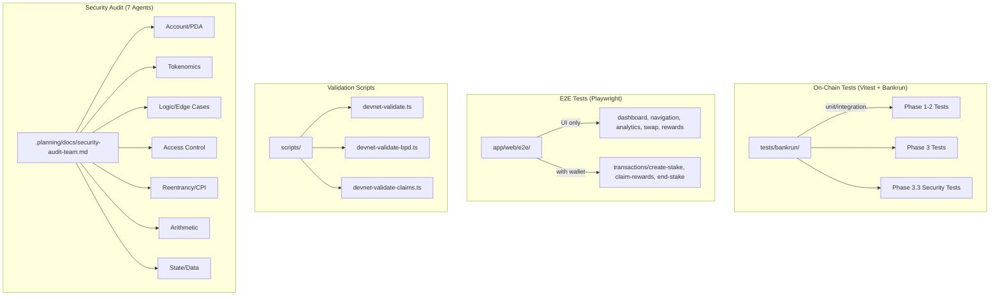

---
position:
  x: 1776
  y: -1520
isContextNode: true
containedNodeIds:
  - /Users/annon/projects/solhex/voicetree-9-2/test-and-audit-infra.md
  - /Users/annon/projects/solhex/voicetree-9-2/test-bankrun-core.md
  - /Users/annon/projects/solhex/voicetree-9-2/test-bankrun-phase3.md
  - /Users/annon/projects/solhex/voicetree-9-2/test-security.md
  - /Users/annon/projects/solhex/voicetree-9-2/test-playwright-e2e.md
  - /Users/annon/projects/solhex/voicetree-9-2/test-validation-audit.md
  - /Users/annon/projects/solhex/voicetree-9-2/run_me.md
---
# ctx
Nearby nodes to: /Users/annon/projects/solhex/voicetree-9-2/test-and-audit-infra.md
```
Test & Audit Infrastructure
├── Bankrun Core Tests
├── Bankrun Phase 3 Tests
├── Security Tests
├── Playwright E2E Tests
├── Validation Scripts & Audit Infrastructure
└── Generate codebase graph (run me)
```

## Node Contents 
</Users/annon/projects/solhex/voicetree-9-2/test-and-audit-infra.md> 
 
# Test & Audit Infrastructure

## Bankrun tests, Playwright E2E, security audits, validation scripts

Multi-layered testing spanning on-chain program tests (Vitest + Bankrun), frontend E2E (Playwright), devnet validation scripts, and a 7-agent security audit system.

### Test Architecture



### Test Coverage
| Suite | Count | Coverage |
|-------|-------|----------|
| Bankrun (Phase 1-2) | ~20 | Core staking lifecycle |
| Bankrun (Phase 3) | ~15 | Free claim, BPD, migration |
| Security (Phase 3.3) | 10/10 | CRIT-1, HIGH-1/2, MED-1 |
| Playwright UI | 5 suites | Dashboard, nav, analytics, swap, rewards |
| Playwright Tx | 3 suites | Create stake, claim, end stake |

### Notable Gotchas & Tech Debt
- Bankrun uses `forks` pool mode - no parallel test execution
- 1000s timeout needed for long-running BPD batch tests
- E2E transaction tests need real SOL (separate from UI tests)
- No CI/CD pipeline configured yet (Phase 8 remaining work)
- `TestWalletAdapter` only loaded when env var set (production-safe)

## Child Nodes

- [\[test-bankrun-core.md]\] -- Core staking lifecycle tests (initialize, createStake, unstake, claimRewards, crankDistribution)
- [\[test-bankrun-phase3.md]\] -- Free claim, BPD distribution, vesting, and account migration tests
- [\[test-security.md]\] -- Security audit finding regression tests (CRIT-1, HIGH-1/2, MED-1, CRIT-NEW-1)
- [\[test-playwright-e2e.md]\] -- Browser E2E tests for Next.js dashboard, navigation, and transaction flows
- [\[test-validation-audit.md]\] -- Devnet validation scripts and 7-agent security audit configuration

[\[run_me.md]\]
 
 <//Users/annon/projects/solhex/voicetree-9-2/test-and-audit-infra.md>
</Users/annon/projects/solhex/voicetree-9-2/test-bankrun-core.md> 
 
# Bankrun Core Tests

**Parent:** [\[test-and-audit-infra.md]\]

Foundational Solana program tests using solana-bankrun with Anchor framework integration. These tests validate the core staking lifecycle: protocol initialization, stake creation with T-share calculations, unstaking with penalty mechanics, reward claiming via lazy distribution, and permissionless crank-based inflation distribution.

## Key Test Files

### `tests/bankrun/utils.ts` -- Shared Test Utilities

Central utility module imported by all bankrun test suites. Provides:

- **PDA Seeds & Derivation:** `GLOBAL_STATE_SEED`, `MINT_AUTHORITY_SEED`, `MINT_SEED`, `STAKE_SEED` with corresponding `findGlobalStatePDA()`, `findMintAuthorityPDA()`, `findMintPDA()`, `findStakePDA()` functions.
- **Protocol Defaults:** `DEFAULT_ANNUAL_INFLATION_BP` (500 = 5%), `DEFAULT_MIN_STAKE_AMOUNT` (10M base units = 0.1 HELIX), `DEFAULT_STARTING_SHARE_RATE` (10,000), `DEFAULT_SLOTS_PER_DAY` (216,000).
- **`setupTest()`**: Bootstraps a Bankrun `ProgramTestContext` via `startAnchor()`, returning `BanksClient`, `payer`, and `Anchor Provider`.
- **`initializeProtocol()`**: Initializes `GlobalState` PDA, Token-2022 mint, and mint authority. Returns all PDAs for downstream use.
- **`advanceClock(days)`**: Manipulates Bankrun's `Clock` sysvar to simulate time passage. Converts days to slots via `DEFAULT_SLOTS_PER_DAY`.
- **`mintTokensToUser()`**: Calls `admin_mint` instruction to fund test wallets.
- **`getTokenBalance()`**: Parses Token-2022 account data at byte offset 64 to extract `u64` balance.

### `tests/bankrun/initialize.test.ts` -- Protocol Initialization (4 tests)

- Verifies `GlobalState` parameters (authority, mint, inflation rate, share_rate, counters all zero).
- Validates Token-2022 mint configuration (8 decimals, 0 initial supply, correct mint authority PDA).
- Rejects double initialization (protocol already initialized).
- Confirms Bankrun clock mocking works correctly (216K slots = 86,400 seconds).

### `tests/bankrun/createStake.test.ts` -- Stake Creation (6 tests)

- **Min duration T-shares:** Verifies `t_shares = amount * PRECISION / share_rate`.
- **LPB bonus at 3641 days:** Validates the Longer Pays Better 2x multiplier at the curve maximum.
- **BPB bonus for large amounts:** Tests the Bigger Pays Better bonus scaling.
- **Below minimum rejection:** Amounts below `DEFAULT_MIN_STAKE_AMOUNT` are rejected.
- **Invalid duration rejection:** Duration of 0 days and >5555 days both fail.
- **Sequential IDs:** Same user creating multiple stakes gets incrementing `stake_id` values.

### `tests/bankrun/unstake.test.ts` -- Unstaking & Penalties (9 tests)

Organized into Early / On-Time / Late / Edge Case groups:
- **Early unstake:** 50% minimum penalty floor, proportional penalty for partial completion.
- **Mint-based return:** Confirms tokens are minted (not transferred) back to user.
- **Grace period:** 14-day grace window after stake maturity with no penalty.
- **Late penalties:** Linear late penalty after grace period, reaching 100% at 365 days late.
- **Edge cases:** Double-unstake rejection, unauthorized user rejection, `GlobalState` counter updates (`total_staked`, `total_shares`), and `share_rate` redistribution of penalty amounts to remaining stakers.

### `tests/bankrun/claimRewards.test.ts` -- Reward Claiming (7 tests)

- Correct claim amount after crank distribution.
- Rejection when no rewards are available.
- `reward_debt` mechanism prevents double-claiming same distribution.
- Multi-day accumulation (multiple cranks before one claim).
- Proportional distribution: two stakers with 3:1 T-share ratio receive 3:1 rewards.
- Rejection on inactive (already unstaked) stake.
- `share_rate` increase after distribution makes future stakes more expensive per T-share.

### `tests/bankrun/crankDistribution.test.ts` -- Inflation Distribution (5 tests)

- `share_rate` increases correctly after 1-day crank.
- Same-day double distribution rejected.
- Multi-day gap handling: cranking after 3 missed days catches up correctly.
- Zero `total_shares` handling: crank is a no-op (no division-by-zero).
- Permissionless cranking: non-authority user can successfully crank.

## Test Patterns & Utilities

- **Vitest runner** (`describe`/`it`/`expect`) with `beforeAll` setup blocks.
- **Bankrun context isolation:** Each test file gets a fresh `ProgramTestContext` via `setupTest()`.
- **Clock manipulation:** `advanceClock()` enables deterministic time-dependent testing without waiting for real block production.
- **Token-2022 parsing:** Manual byte-level account data parsing at offset 64 (avoids SPL token library dependency for balance reads).
- **PDA-based account lookups:** All state assertions read directly from on-chain PDA accounts via `getAccount()` + `program.coder.accounts.decode()`.

## Notable Gotchas

- **Token-2022 vs SPL Token:** The program uses `TOKEN_2022_PROGRAM_ID`, not the legacy SPL Token program. Token account data layout differs slightly; balance is at offset 64.
- **Slots vs seconds:** Bankrun maps 1 slot = 0.4 seconds. `DEFAULT_SLOTS_PER_DAY` (216,000) = 86,400 seconds. All time-dependent tests operate in slots, not wall clock time.
- **Mint-not-transfer model:** Unstaking mints new tokens rather than transferring from a vault. Tests must check `mint.supply` changes, not balance transfers.
- **Share rate is cumulative:** After penalty redistribution or crank distribution, `share_rate` increases permanently, affecting all future T-share calculations.
- **Sequential stake IDs:** The `next_stake_id` counter on `GlobalState` is user-specific (tracked per-user in the stake PDA seed), so stake IDs are scoped to each user.
 
 <//Users/annon/projects/solhex/voicetree-9-2/test-bankrun-core.md>
</Users/annon/projects/solhex/voicetree-9-2/test-bankrun-phase3.md> 
 
# Bankrun Phase 3 Tests

**Parent:** [\[test-and-audit-infra.md]\]

Phase 3 test suite validates the free claim system, Big Pay Day (BPD) distribution, vesting mechanics, and account migration. These tests extend the core bankrun infrastructure with Merkle tree proofs, Ed25519 signature verification, and multi-phase BPD lifecycle testing.

## Key Test Files

### `tests/bankrun/phase3/utils.ts` -- Extended Test Utilities

Builds on top of `tests/bankrun/utils.ts` with claim-specific infrastructure:

- **Merkle Tree:** `buildMerkleTree()` using keccak256 hashing with sorted leaves for deterministic ordering. `getMerkleProof()` extracts inclusion proofs. `ClaimEntry` interface: `{ pubkey, amount }`.
- **Ed25519 Signatures:** `buildClaimMessage("HELIX:claim:{pubkey}:{amount}")`, `signClaimMessage()` using Ed25519, `createEd25519Instruction()` manually constructs the Ed25519 program instruction with 112-byte signature data layout.
- **PDA Derivation:** `findClaimConfigPDA()` and `findClaimStatusPDA()` with `MERKLE_ROOT_PREFIX_LEN=8` (first 8 bytes of merkle root used in PDA seed).
- **Vesting Math:** `calculateVestedAmount()` implements linear vesting formula, `calculateSpeedBonus()` with `HELIX_PER_SOL=10000` and decimal precision adjustment.
- **Constants:** `VESTING_DAYS=30`, `IMMEDIATE_RELEASE_BPS=1000` (10%), `CLAIM_PERIOD_DAYS=180`, `SPEED_BONUS_WEEK1_BPS=2000` (+20%), `SPEED_BONUS_WEEK2_4_BPS=1000` (+10%), `MIN_SOL_BALANCE=100M` lamports (0.1 SOL).

### `tests/bankrun/phase3/initializeClaim.test.ts` -- Claim Period Setup (5 tests)

- Valid merkle root initialization by authority.
- Non-authority user rejection.
- Double initialization rejection (claim config PDA already exists).
- Correct `end_slot` calculation: `current_slot + (CLAIM_PERIOD_DAYS * slots_per_day)`.
- Event data verification by reading persisted state fields.

### `tests/bankrun/phase3/freeClaim.test.ts` -- Free Claim Mechanics (11 tests)

- **Valid claim flow:** Merkle proof + Ed25519 signature verification, tokens minted to claimant.
- **Speed bonus tiers:** +20% in week 1, +10% in weeks 2-4, 0% after day 28.
- **Vesting split:** 10% immediate release, 90% vested over 30 days. Tests verify exact amounts.
- **Rejection cases:** Invalid merkle proof, missing Ed25519 instruction, wrong signer key, double claim (ClaimStatus PDA already exists), claim after period ends, claim before period starts.
- **SOL balance gate:** Snapshot balance below `MIN_SOL_BALANCE` (0.1 SOL) rejected.
- **Boundary tests:** Exact day 7 (last day of week 1 bonus) and day 28 (last day of weeks 2-4 bonus) boundary verification.

### `tests/bankrun/phase3/triggerBpd.test.ts` -- Big Pay Day Distribution (13 tests)

Tests the two-phase BPD architecture: `finalize_bpd_calculation` -> `seal_bpd_finalize` -> `trigger_big_pay_day`.

- **Unclaimed distribution:** Remaining tokens (total_claimable - total_claimed) distributed to eligible stakers.
- **Permissionless triggering:** Any user can call trigger after finalization is sealed.
- **T-share-days weighting:** Two stakers with different durations receive BPD proportional to `t_shares * days_staked`.
- **Eligibility filtering:** Only stakes active during the claim period qualify. Stakes created after the period ends are excluded.
- **Attack prevention:** Last-minute staking (stake created just before claim period ends) gets minimal share-days, preventing gaming.
- **Guard rails:** Rejection before period ends, rejection when finalize not complete, double trigger rejection, no eligible stakers handling (`NoEligibleStakers` error).
- **Cross-period safety:** `bpd_claim_period_id` prevents duplicate BPD across different claim periods.
- **Batch processing:** Within-batch duplicate stake prevention, cross-batch rate fairness (3 stakes split across 2 finalize batches, verified equal rate applied).
- **Double finalize rejection:** Cannot re-finalize already-finalized stakes.

### `tests/bankrun/phase3/withdrawVested.test.ts` -- Vesting Withdrawals (7 tests)

- Immediate 10% already withdrawn at claim time; `NoVestedTokens` error on day 0.
- Partial mid-period withdrawal (e.g., day 15 of 30 releases ~50% of vested portion).
- Full amount withdrawal after 30 days (entire 90% vested portion released).
- Cumulative `withdrawn_amount` tracking across multiple withdrawals.
- Double-withdrawal prevention (no tokens to withdraw after full withdrawal).
- Linear vesting correctness verification with exact BN arithmetic.
- Rejection when no prior claim exists (ClaimStatus account missing).

### `tests/bankrun/phase3/migration.test.ts` -- Account Migration (7 tests)

Tests backward compatibility when stake accounts grow from 92 bytes (v1) to 112 bytes (v2 with BPD fields):

- Old stakes (92 bytes) continue working with `claim_rewards` instruction.
- Migrated stake gets `bpd_bonus_pending = 0` (clean initialization).
- New stakes (112 bytes) have BPD fields from creation.
- Migration preserves all existing data fields.
- User pays rent difference for the additional 20 bytes.
- `claim_rewards` includes `bpd_bonus_pending` amount after BPD trigger.
- `claim_rewards` clears `bpd_bonus_pending` to zero after payout.
- Ineligible stake (created outside claim period) returns zero BPD bonus.

## Test Patterns & Utilities

- **Merkle tree construction:** keccak256 with sorted leaf pairs for deterministic tree structure. Proofs are arrays of 32-byte hashes.
- **Ed25519 instruction building:** Manual construction of the Ed25519 program instruction data (2-byte count header, 48-byte offset structure, 64-byte signature, 32-byte pubkey, variable message). This mirrors the on-chain Ed25519 precompile validation.
- **Two-phase BPD helper functions:** `finalizeBpd(stakeAccounts)` processes a batch, `sealBpdFinalize()` locks the calculation, `triggerBigPayDay(stakeAccounts)` distributes. Tests exercise multiple batches by calling finalize with different stake subsets.
- **BN arithmetic throughout:** All token amounts, T-shares, and vesting calculations use `bn.js` to match on-chain u64/u128 precision.
- **Clock advancement for vesting:** Tests advance the Bankrun clock to specific days within the 30-day vesting window to verify partial release amounts.

## Notable Gotchas

- **Ed25519 instruction must be in same transaction:** The on-chain program verifies the Ed25519 signature instruction exists in the transaction's instruction sysvar. It must be the instruction immediately preceding the free_claim instruction.
- **Merkle root prefix length:** Only the first 8 bytes of the merkle root are used in the ClaimStatus PDA seed (`MERKLE_ROOT_PREFIX_LEN=8`). This is a deliberate space optimization but means different merkle roots sharing the same 8-byte prefix would collide.
- **BPD two-phase is security-critical:** The split between finalize (accumulate share-days) and seal (calculate rate) prevents early batches from draining the pool. Rate calculation must happen only after ALL eligible stakes are counted.
- **Batch size limit:** `MAX_STAKES_PER_FINALIZE = 20` per transaction due to Solana compute budget constraints. Large protocols need multiple finalize transactions.
- **Snapshot slot consistency:** `bpd_snapshot_slot` is captured on the first finalize batch and reused for all subsequent batches, preventing time-of-check-time-of-use manipulation.
- **Migration rent difference:** When migrating a 92-byte stake to 112 bytes, the calling user (not necessarily the stake owner) pays the additional rent. Tests verify this cost transfer.
 
 <//Users/annon/projects/solhex/voicetree-9-2/test-bankrun-phase3.md>
</Users/annon/projects/solhex/voicetree-9-2/test-security.md> 
 
# Security Tests

**Parent:** [\[test-and-audit-infra.md]\]

Targeted regression tests for specific vulnerabilities discovered during security audits. Located in `tests/bankrun/phase3.3/`, these tests validate fixes for critical, high, and medium severity findings. Each test is tagged with its audit finding ID for traceability.

## Key Test Files

### `tests/bankrun/phase3.3/securityFixes.test.ts` -- Audit Finding Fixes

Tests for the original security audit findings (CRIT-1, HIGH-1, HIGH-2, MED-1):

**CRIT-1: Zero-Bonus Stake Counter Desync** (3 tests)
- Validates that `bpd_stakes_distributed` counter matches `bpd_stakes_finalized` even when stakes have zero BPD bonus.
- Stakes with 0 share-days (e.g., created at period boundary) must still increment the distributed counter during `trigger_big_pay_day`.
- Prevents the BPD lifecycle from getting stuck in an incomplete state because non-bonus stakes were silently skipped.

**HIGH-1: Emergency BPD Abort Mechanism** (4 tests)
- Authority can abort an active BPD calculation via `abort_bpd` instruction.
- Non-authority users are rejected from calling abort.
- Abort when no BPD is active returns appropriate error.
- After abort, unstaking is re-enabled (BPD window guard is cleared).

**HIGH-2: Seal Requires Finalized Stakes** (2 tests)
- `seal_bpd_finalize` rejects if no stakes have been finalized (prevents sealing with zero share-days leading to division-by-zero).
- Seal correctly proceeds when at least one batch of stakes has been finalized.

**MED-1: Zero-Amount Finalize Clears BPD Window** (1 test)
- When finalize processes zero eligible stakes, the BPD window is properly cleared without requiring a seal operation.
- Prevents the protocol from getting stuck in BPD-active state with no way to complete the lifecycle.

### `tests/bankrun/phase3.3/securityHardening.test.ts` -- Hardening & Integration

Comprehensive hardening tests for post-audit improvements:

**CRIT-NEW-1: Seal Security** (4 tests)
- Non-authority rejection: only the protocol authority can seal finalization.
- No-stakes-finalized rejection: sealing with zero processed stakes is blocked.
- Double seal rejection: cannot seal an already-sealed BPD calculation.
- Post-seal finalize rejection: new finalize batches rejected after seal is applied.

**CRIT-NEW-1: Per-Stake Finalize Tracking** (2 tests)
- Duplicate stake in same batch is silently skipped (no error, no double-counting).
- `trigger_big_pay_day` skips non-finalized stakes (stakes not included in any finalize batch receive zero BPD).

**CRIT-NEW-1: Counter-Based Completion** (1 test)
- Partial trigger (processing subset of stakes) does not mark BPD as complete.
- BPD completes only when `bpd_stakes_distributed == bpd_stakes_finalized`.

**HIGH-2: BPD Window Guard** (2 tests)
- Unstaking is blocked while BPD window is active (prevents share count manipulation during calculation).
- Unstaking is allowed immediately after BPD window closes (via seal or abort).

**MED-5: Claim Period ID Validation** (2 tests)
- `claim_period_id = 0` is rejected as invalid (prevents uninitialized state confusion).
- `claim_period_id = 1` is accepted as the first valid period.

**LOW-2: BPD Bonus in Unstake** (1 test)
- When a stake with pending `bpd_bonus_pending > 0` is unstaked, the payout includes the BPD bonus amount.
- Ensures BPD rewards are not lost on early unstake.

**Integration: Full Hardened Lifecycle** (1 test)
- End-to-end BPD lifecycle with 3 stakes processed across 2 finalize batches and 2 trigger batches.
- Validates the complete flow: create stakes -> advance through claim period -> finalize batch 1 -> finalize batch 2 -> seal -> trigger batch 1 -> trigger batch 2 -> verify all counters match -> verify BPD bonuses credited correctly.

## Test Patterns & Utilities

- **Audit ID tagging:** Each `describe` block is tagged with the finding ID (e.g., `"CRIT-1: ..."`, `"HIGH-2: ..."`) for direct traceability to audit reports.
- **Reuses phase3 utilities:** Imports from both `tests/bankrun/utils.ts` and `tests/bankrun/phase3/utils.ts` for Merkle tree, claim setup, and BPD helper functions.
- **Counter assertion pattern:** Tests frequently check `bpd_stakes_finalized` and `bpd_stakes_distributed` counters on `ClaimConfig` to verify lifecycle state machine correctness.
- **Error code verification:** Tests assert specific Anchor error codes (e.g., `BpdWindowActive`, `NoEligibleStakers`, `Unauthorized`) rather than generic failure.
- **Negative testing emphasis:** The majority of tests verify rejection paths--unauthorized access, invalid state transitions, duplicate operations--reflecting the security-focused nature of the suite.

## Notable Gotchas

- **CRIT-NEW-1 was discovered post-fix:** The original audit found CRIT-1 (per-batch BPD rate calculation). The fix introduced a two-phase BPD design, but a follow-up audit found CRIT-NEW-1: `finalize_bpd_calculation` was permissionless, allowing attackers to control which stakes are included and game the `last_batch` detection by sending fewer than 20 accounts.
- **Counter desync is subtle:** Zero-bonus stakes (0 share-days) must still be counted in `bpd_stakes_distributed` during trigger. If skipped, the `distributed == finalized` completion check never passes, permanently blocking the BPD lifecycle.
- **BPD window is a global lock:** While the BPD window is active (between first finalize and seal/abort), ALL unstaking across the entire protocol is blocked. This is a deliberate security trade-off to prevent share manipulation but has UX implications.
- **Abort is the escape hatch:** If BPD finalization gets stuck (e.g., due to bug or insufficient compute), `abort_bpd` is the only way to clear the BPD window and re-enable unstaking. It requires authority access.
- **Test ordering matters:** The integration lifecycle test must run operations in exact sequence (finalize all -> seal -> trigger all) because the state machine enforces strict phase transitions.
 
 <//Users/annon/projects/solhex/voicetree-9-2/test-security.md>
</Users/annon/projects/solhex/voicetree-9-2/test-playwright-e2e.md> 
 
# Playwright E2E Tests

**Parent:** [\[test-and-audit-infra.md]\]

Browser-based end-to-end tests using Playwright for the Next.js web application. Tests cover navigation, dashboard rendering, transaction flows (create stake, end stake, claim rewards), and UI feature pages. The suite runs against a local solana-test-validator with pre-seeded protocol state.

## Key Test Files

### `app/web/playwright.config.ts` -- Test Configuration

Defines two Playwright projects with different execution strategies:

- **"chromium" project:** Runs all E2E specs except `transactions/` directory. Standard timeout. Parallelizable.
- **"transaction-tests" project:** Runs only `transactions/` specs with 90-second timeout, serial execution mode, and dependency on "chromium" project completing first (ensures UI is working before testing on-chain transactions).
- **Global setup/teardown:** `global-setup.ts` starts `solana-test-validator` with the BPF program loaded, initializes protocol, seeds test data. `global-teardown.ts` kills the validator process.
- **Web server:** Starts Next.js dev server with `NEXT_PUBLIC_SKIP_WALLET_CHECK=true` and `NEXT_PUBLIC_TEST_WALLET_SECRET` environment variables for automated wallet connection.

### `app/web/e2e/fixtures.ts` -- Custom Test Fixtures

Extends Playwright's base `test` with automatic wallet connection:

- **localStorage injection:** Sets `walletName` in localStorage to trigger `TestWalletAdapter` auto-connect on page load.
- **`waitForWalletConnection(page)`**: Polls for a truncated public key string appearing in the sidebar, confirming wallet is connected.
- **`waitForTxSuccess(page)`**: Waits for a Sonner toast notification with success status, used after transaction submission.
- **`waitForToast(page, text)`**: Generic toast detection helper.

### `app/web/e2e/global-setup.ts` -- Environment Bootstrap

Comprehensive test environment setup:

1. Starts `solana-test-validator` with `--bpf-program` flag loading the compiled Helix Staking program.
2. Initializes protocol with `slotsPerDay=10` (accelerated time for fast test execution).
3. Generates a test wallet keypair.
4. Creates Associated Token Account (ATA) for the test wallet.
5. Mints 500 HELIX to the test wallet via `admin_mint`.
6. Creates 2 pre-existing stakes (10 HELIX / 30 days and 5 HELIX / 60 days) so dashboard tests have data.
7. Advances 50 slots and cranks distribution 5 times to generate claimable rewards.
8. Saves test wallet secret as base58 string to `.test-wallet.json` for the Next.js app to load.

### `app/web/e2e/dashboard.spec.ts` -- Dashboard Tests (6 tests)

- Page title displays correctly.
- Protocol stats section shows values (Total Staked, Total Shares, Current Day).
- Portfolio section renders with connected wallet data.
- Stakes section lists pre-seeded stakes.
- Sidebar navigation links are present and functional.
- Stake detail page shows not-found for invalid stake ID, with back-to-dashboard link.

### `app/web/e2e/navigation.spec.ts` -- Navigation Tests (8 tests)

Tests all sidebar navigation links exist and route correctly:
Dashboard, New Stake, Rewards, Free Claim, Analytics, Swap, Leaderboard, Whale Tracker.

### `app/web/e2e/rewards.spec.ts` -- Rewards Page Tests (3 tests)

- Rewards heading renders.
- Rewards overview section shows pending rewards and BPD information.
- Values display in HELIX denomination.

### `app/web/e2e/analytics.spec.ts` -- Analytics Page Tests (4 tests)

- Page title renders.
- Stats cards display key metrics.
- Charts render: T-Share Price History, Stake Duration Distribution, Supply Breakdown.
- Sidebar navigation functional from analytics page.

### `app/web/e2e/swap.spec.ts` -- Swap Page Tests (2 tests)

- Jupiter terminal container and script tag are present in DOM.
- Sidebar navigation functional from swap page.

### `app/web/e2e/transactions/create-stake.spec.ts` -- Create Stake Flow (2 tests)

- **Full wizard flow:** Navigate to New Stake -> enter amount -> select duration -> confirm step -> submit transaction -> verify success toast and redirect.
- **Wizard step verification:** Each step displays correct content, back button navigates to previous step.

### `app/web/e2e/transactions/end-stake.spec.ts` -- End Stake Flow (1 serial test)

- Navigate to a specific stake detail page.
- Click "End Stake" / unstake button.
- Check the confirmation checkbox (acknowledging potential penalty).
- Submit the unstake transaction.
- Verify redirect back to dashboard after success.

### `app/web/e2e/transactions/claim-rewards.spec.ts` -- Claim Rewards Flow (1 test)

- Navigate to a stake detail page via "Claim Rewards" link.
- Click the claim button.
- Verify success toast notification.

## Test Patterns & Utilities

- **TestWalletAdapter pattern:** The app's `providers.tsx` detects `NEXT_PUBLIC_TEST_WALLET_SECRET` and registers a `TestWalletAdapter` that auto-connects with the seeded keypair, bypassing real wallet UI.
- **Fixture-based wallet injection:** Custom Playwright fixtures set localStorage before each test, enabling wallet auto-connection without manual interaction.
- **Serial transaction tests:** Transaction specs run serially because they modify on-chain state (creating/ending stakes). Running in parallel would cause race conditions on shared validator state.
- **Accelerated time:** `slotsPerDay=10` in global setup means 1 "protocol day" passes in ~4 seconds of real time, enabling reward accumulation tests without long waits.
- **Pre-seeded state:** Global setup creates stakes and cranks distributions before tests run, so dashboard/rewards tests have meaningful data to assert against.
- **Toast-based transaction verification:** Success/failure is detected via Sonner toast notifications rather than polling on-chain state, testing the actual user experience.

## Notable Gotchas

- **Validator must be killed on teardown:** Global teardown kills the `solana-test-validator` process. If tests crash without cleanup, a zombie validator blocks port 8899 for subsequent runs.
- **`NEXT_PUBLIC_SKIP_WALLET_CHECK=true` is required:** Without this env var, the dashboard layout shows a "connect wallet" gate, blocking all dashboard test navigation.
- **Transaction tests depend on chromium project:** The `"transaction-tests"` Playwright project has `dependencies: ["chromium"]`, ensuring basic UI tests pass before attempting on-chain transactions. If UI is broken, transaction tests are skipped.
- **`.test-wallet.json` is ephemeral:** Generated by global setup, consumed by the Next.js app at runtime. Must not be committed to git. If it persists between runs with different validator states, tests may fail with stale keypair data.
- **90-second timeout for transactions:** On-chain transaction confirmation can be slow in test validator; the extended timeout prevents flaky failures on slower machines.
- **CSP headers affect wallet:** The Next.js middleware sets Content Security Policy headers that must whitelist Solana RPC endpoints. Misconfigured CSP silently blocks wallet RPC calls.
 
 <//Users/annon/projects/solhex/voicetree-9-2/test-playwright-e2e.md>
</Users/annon/projects/solhex/voicetree-9-2/test-validation-audit.md> 
 
# Validation Scripts & Audit Infrastructure

**Parent:** [\[test-and-audit-infra.md]\]

Devnet validation scripts for end-to-end lifecycle testing against live Solana infrastructure, E2E wallet setup tooling, and the 7-agent security audit team configuration. These scripts bridge the gap between local bankrun tests and production deployment by exercising the program against real Solana devnet.

## Key Test Files

### `scripts/devnet-validate.ts` -- Core Staking Lifecycle

Exercises the fundamental staking flow on devnet:

1. **Initialize protocol:** Creates `GlobalState`, Token-2022 mint, and mint authority PDAs.
2. **Admin mint:** Mints HELIX tokens to the deployer wallet.
3. **Create stake:** Creates a time-locked stake with specified amount and duration.
4. **Crank distribution:** Runs the permissionless inflation distribution crank.

Validates PDA derivation, ATA creation, and basic instruction flow against a live validator. Serves as a smoke test after program deployment.

### `scripts/devnet-validate-claims.ts` -- Full Claim Lifecycle

End-to-end claim system validation:

1. **Initialize claim period:** Sets up merkle root and claim configuration.
2. **Free claim:** Constructs Merkle proof + Ed25519 signature, submits free_claim instruction.
3. **Withdraw vested:** Tests vesting withdrawal after advancing time.
4. **BPD flow:** Attempts Big Pay Day lifecycle (expected to fail on standard devnet due to 180-day claim period duration).

Mirrors the Merkle tree implementation from `tests/bankrun/phase3/utils.ts` (keccak256, sorted leaves). Useful for verifying that the claim system works end-to-end with real RPC and real signature verification, catching issues that bankrun's simulated environment might miss (e.g., Ed25519 precompile behavior differences).

### `scripts/devnet-validate-bpd.ts` -- BPD Lifecycle with Admin Workarounds

Full Big Pay Day lifecycle validation using admin-only time manipulation instructions:

1. **`abort_bpd`**: Clear any existing BPD state from prior test runs.
2. **`admin_set_slots_per_day(10)`**: Accelerate time to avoid 180-day wait.
3. **`admin_set_claim_end_slot(past)`**: Force claim period to end immediately.
4. **`finalize_bpd_calculation`**: Process eligible stakes in batches.
5. **`seal_bpd_finalize`**: Lock the share-day accumulation.
6. **`trigger_big_pay_day`**: Distribute BPD bonuses.
7. **Restore `slots_per_day`**: Reset to production value after testing.

This script uses admin-only instructions (`admin_set_slots_per_day`, `admin_set_claim_end_slot`, `abort_bpd`) that exist specifically for devnet testing. These instructions are authority-gated and would typically be disabled or removed before mainnet deployment.

### `scripts/setup-e2e-wallet.ts` -- E2E Wallet Provisioning

Idempotent test wallet setup for Playwright E2E tests:

1. Generates a new Solana keypair (or loads existing from `.test-wallet.json`).
2. Airdrops SOL from devnet/localnet faucet.
3. Creates Associated Token Account (ATA) for the HELIX mint.
4. Mints 500 HELIX tokens via `admin_mint`.
5. Outputs base58-encoded secret key for `NEXT_PUBLIC_TEST_WALLET_SECRET` env var.

Designed to be run before Playwright tests as a standalone setup step. Idempotent: safe to run multiple times without creating duplicate accounts.

### `.planning/docs/security-audit-team.md` -- 7-Agent Audit Configuration

Configuration file for launching 7 specialized Opus audit agents in parallel:

| Agent | Focus Area | Key Files |
|-------|-----------|-----------|
| **Account/PDA** | PDA derivation correctness, seed collisions, account validation | All instruction files, state accounts |
| **Tokenomics** | Economic model correctness, inflation math, bonus curves | `math.rs`, `constants.rs`, `create_stake.rs` |
| **Logic/Edge Cases** | State machine transitions, boundary conditions, off-by-one | All instruction files, especially BPD lifecycle |
| **Access Control** | Authority checks, signer validation, unauthorized access | All instruction files (`has_one`, `constraint`) |
| **Reentrancy/CPI** | Cross-program invocation safety, CPI guard patterns | Token mint/transfer instructions, CPI calls |
| **Arithmetic** | Overflow/underflow, precision loss, division-by-zero | `math.rs`, `crank_distribution.rs`, BPD calculations |
| **State/Data** | Account discriminators, data layout, migration safety | State definitions, migration instruction |

Each agent receives the same source file context but has a specific focus lens and output format. Results are compiled into a consolidated report with deduplication and cross-referencing across agents.

**Launch workflow:**
1. Read the config file for agent specifications.
2. Glob all relevant source files to build shared context.
3. Launch all 7 agents in parallel (background).
4. Wait for completion.
5. Compile consolidated report: deduplicate findings, cross-reference between agents, compare against prior audit results.

## Test Patterns & Utilities

- **Admin instruction workarounds:** Devnet scripts use authority-only admin instructions (`admin_set_slots_per_day`, `admin_set_claim_end_slot`, `abort_bpd`) to manipulate time and state, bypassing the 180-day claim period wait that would make testing impractical.
- **Idempotent design:** Scripts check for existing state before creating (e.g., wallet keypair file, ATA existence) and skip already-completed steps.
- **Base58 key serialization:** Test wallet secret is serialized as base58 for environment variable transport, matching Solana CLI conventions.
- **Parallel audit agents:** 7 specialized agents run concurrently, each with a narrow audit focus, producing structured findings that are later deduplicated and consolidated.
- **Mirror implementations:** The devnet claim validation script re-implements the Merkle tree and Ed25519 signing logic from bankrun test utils, providing cross-validation that both implementations agree.

## Notable Gotchas

- **Admin instructions are devnet-only:** `admin_set_slots_per_day`, `admin_set_claim_end_slot`, and `abort_bpd` are authority-gated admin instructions. They exist for testing purposes and should be audited for potential mainnet misuse (e.g., authority key compromise).
- **BPD devnet testing requires time manipulation:** The 180-day claim period makes BPD lifecycle testing impossible on devnet without the admin time acceleration. The `devnet-validate-bpd.ts` script must restore `slots_per_day` after testing to avoid corrupting the devnet environment for other tests.
- **Ed25519 precompile differences:** The Ed25519 signature verification precompile may behave slightly differently between bankrun (simulated) and real validators. The devnet validation scripts serve as a critical check that signatures constructed in JavaScript actually verify on-chain.
- **Audit finding history is cumulative:** The security audit team should always compare new findings against prior audit results (Phase 3 audit found CRIT-1/CRIT-2 + 5 HIGH, post-fix audit found CRIT-NEW-1). New fixes may introduce new vulnerabilities.
- **Airdrop rate limits:** Devnet SOL airdrops are rate-limited. The `setup-e2e-wallet.ts` script may fail if run too frequently. The idempotent design mitigates this by reusing existing wallets when possible.
- **`.test-wallet.json` must not be committed:** Contains a private key. The `.gitignore` should exclude this file. If committed, the key is compromised (though devnet-only, it sets a bad precedent).
 
 <//Users/annon/projects/solhex/voicetree-9-2/test-validation-audit.md>
</Users/annon/projects/solhex/voicetree-9-2/run_me.md> 
 # Generate codebase graph (run me)

### Your task is to run the following workflow

1. **Explore** the codebase (use explore subagents)
2. **Identify** the top ~7 major modules
3. **Create a node** for each module containing:
    - Concise purpose summary
    - Mermaid diagrams for the core flow
    - Notable gotchas or tech debt
There is no need for you or the subagents to create an additional progress node, the module nodes already satisfy this requirement.
4. **Spawn voicetree agents** on each module to break it down one level further

## Constraints

- **Max 7 modules** per level
- **Tree structure**: each node links only to its direct parent
- **Depth limit**: subagents do NOT spawn further agents
 
 <//Users/annon/projects/solhex/voicetree-9-2/run_me.md>
<TASK> IMPORTANT. YOUR specific task, and the most relevant context is the source note you were spawned from, which is:
        /Users/annon/projects/solhex/voicetree-9-2/test-and-audit-infra.md: 
# Test & Audit Infrastructure

## Bankrun tests, Playwright E2E, security audits, validation scripts

Multi-layered testing spanning on-chain program tests (Vitest + Bankrun), frontend E2E (Playwright), devnet validation scripts, and a 7-agent security audit system.

### Test Architecture


### Test Coverage
| Suite | Count | Coverage |
|-------|-------|----------|
| Bankrun (Phase 1-2) | ~20 | Core staking lifecycle |
| Bankrun (Phase 3) | ~15 | Free claim, BPD, migration |
| Security (Phase 3.3) | 10/10 | CRIT-1, HIGH-1/2, MED-1 |
| Playwright UI | 5 suites | Dashboard, nav, analytics, swap, rewards |
| Playwright Tx | 3 suites | Create stake, claim, end stake |

### Notable Gotchas & Tech Debt
- Bankrun uses `forks` pool mode - no parallel test execution
- 1000s timeout needed for long-running BPD batch tests
- E2E transaction tests need real SOL (separate from UI tests)
- No CI/CD pipeline configured yet (Phase 8 remaining work)
- `TestWalletAdapter` only loaded when env var set (production-safe)

## Child Nodes

- [\[test-bankrun-core.md]\] -- Core staking lifecycle tests (initialize, createStake, unstake, claimRewards, crankDistribution)
- [\[test-bankrun-phase3.md]\] -- Free claim, BPD distribution, vesting, and account migration tests
- [\[test-security.md]\] -- Security audit finding regression tests (CRIT-1, HIGH-1/2, MED-1, CRIT-NEW-1)
- [\[test-playwright-e2e.md]\] -- Browser E2E tests for Next.js dashboard, navigation, and transaction flows
- [\[test-validation-audit.md]\] -- Devnet validation scripts and 7-agent security audit configuration

[\[run_me.md]\]
 </TASK>

