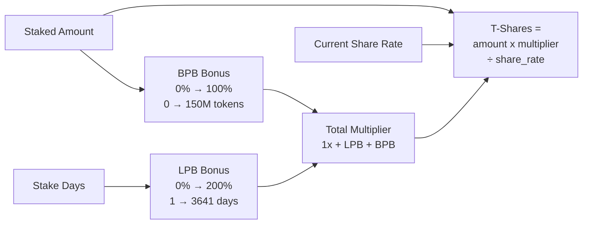
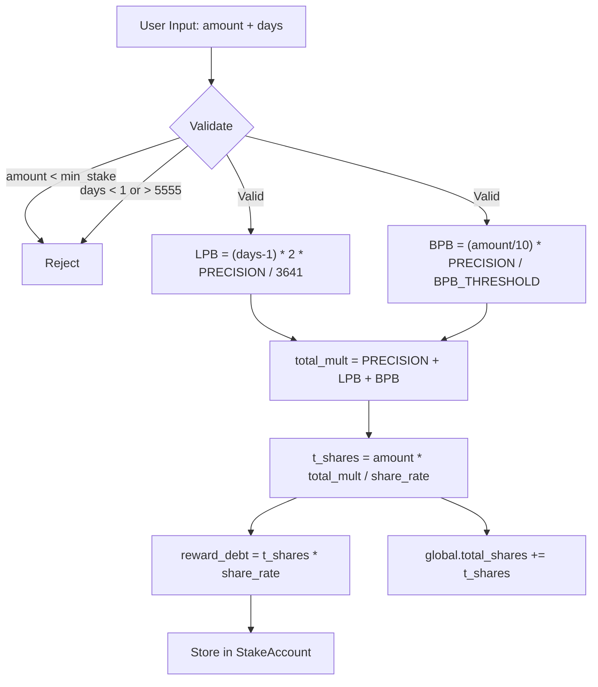
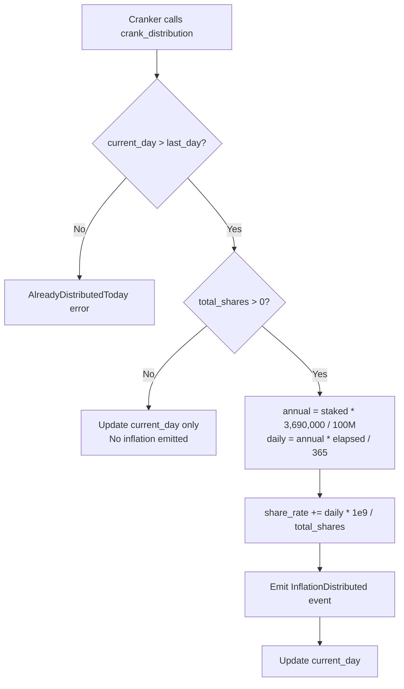
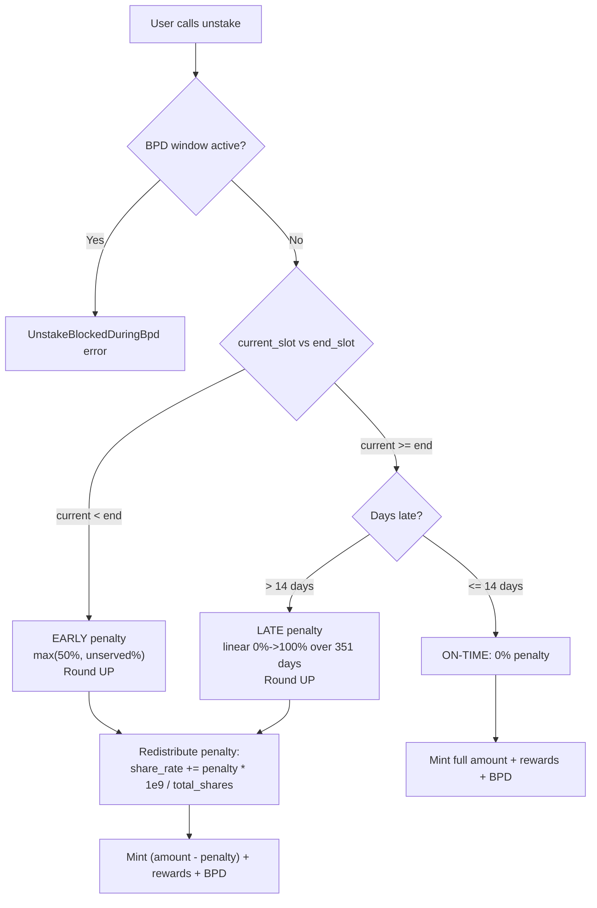
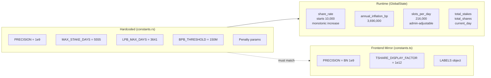
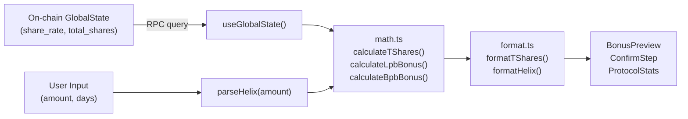

---
position:
  x: 1544
  y: -1923
isContextNode: true
containedNodeIds:
  - /Users/annon/projects/solhex/voicetree-9-2/tokenomics-engine.md
  - /Users/annon/projects/solhex/voicetree-9-2/tok-tshare-calculation.md
  - /Users/annon/projects/solhex/voicetree-9-2/tok-inflation-distribution.md
  - /Users/annon/projects/solhex/voicetree-9-2/tok-penalty-system.md
  - /Users/annon/projects/solhex/voicetree-9-2/tok-constants-config.md
  - /Users/annon/projects/solhex/voicetree-9-2/tok-frontend-math-mirror.md
  - /Users/annon/projects/solhex/voicetree-9-2/run_me.md
---
# ctx
Nearby nodes to: /Users/annon/projects/solhex/voicetree-9-2/tokenomics-engine.md
```
Tokenomics Engine
├── T-Share Calculation
├── Inflation & Distribution
├── Penalty System
├── Constants & Configuration
├── Frontend Math Mirror
└── Generate codebase graph (run me)
```

## Node Contents 
</Users/annon/projects/solhex/voicetree-9-2/tokenomics-engine.md> 
 
# Tokenomics Engine

## Share rate, bonuses, penalties & inflation math

Cross-cutting module spanning on-chain program (`constants.rs`, `math.rs`, instruction logic) and frontend (`lib/solana/math.ts`, `lib/utils/format.ts`). Implements HEX-inspired economic model with burn-and-mint mechanics.

### Core Parameters
| Parameter | Value |
|-----------|-------|
| Annual inflation | 3.69% (3,690,000 bp) |
| Min stake | 0.1 HELIX (10M base units) |
| Starting share rate | 10,000 (1:1) |
| Max stake duration | 5,555 days (~15.2 years) |
| LPB max days | 3,641 (10 years for 2x) |
| BPB threshold | 150M tokens (100% bonus) |
| Precision | 1e9 (fixed-point scaling) |

### T-Share Calculation



### Penalty System
| Scenario | Formula | Range |
|----------|---------|-------|
| **Early exit** | `max(50%, time_unserved%)` | 50% - 100% |
| **On-time** | 0% | 0% |
| **Late (grace)** | 0% for 14 days | 0% |
| **Late (penalty)** | Linear over 351 days | 0% → 100% |

Penalties are **redistributed** to remaining stakers via share_rate increase.

### Key Invariants
- All math uses u128 intermediates (overflow prevention)
- Division AFTER multiplication (precision preservation)
- Penalties round UP (protocol-favorable)
- share_rate only increases (monotonic)

### Notable Gotchas & Tech Debt
- Frontend `math.ts` must mirror on-chain calculations exactly - divergence = UI bugs
- `TSHARE_DISPLAY_FACTOR = 1e12` for human-readable display (separate from PRECISION)
- Slot-based time: 216,000 slots/day assumes 400ms/slot (configurable via admin)
- Penalty window: exactly 365 days late = 100% penalty (351 days after 14-day grace)

### Sub-Components

- [\[tok-tshare-calculation.md]\] -- LPB + BPB bonuses, share rate division, reward debt
- [\[tok-inflation-distribution.md]\] -- Daily crank, share_rate increase, lazy distribution model
- [\[tok-penalty-system.md]\] -- Early/on-time/late penalties, grace period, redistribution
- [\[tok-constants-config.md]\] -- All protocol parameters, PDA seeds, precision factors
- [\[tok-frontend-math-mirror.md]\] -- math.ts parity with on-chain, format.ts display utilities

[\[run_me.md]\]
 
 <//Users/annon/projects/solhex/voicetree-9-2/tokenomics-engine.md>
</Users/annon/projects/solhex/voicetree-9-2/tok-tshare-calculation.md> 
 
# T-Share Calculation

## Converts staked amount + duration into T-Shares using LPB and BPB bonus curves, divided by the ever-increasing share rate

T-Shares are the core accounting unit of the protocol. They determine a staker's proportional claim on daily inflation rewards. The calculation lives on-chain in `math.rs` and is mirrored exactly in the frontend `math.ts` for preview display.

### Master Formula

```
t_shares = staked_amount * (PRECISION + LPB_bonus + BPB_bonus) / share_rate
```

Where `PRECISION = 1_000_000_000` (1e9) represents the base 1x multiplier. The total multiplier therefore ranges from **1x** (no bonuses) to **4x** (max LPB 2x + max BPB 1x + base 1x).

### Duration Bonus (LPB -- Longer Pays Better)

```
if days == 0:        bonus = 0
if days >= 3641:     bonus = 2 * PRECISION   (200% cap)
else:                bonus = (days - 1) * 2 * PRECISION / 3641
```

- 1-day stake earns **zero** LPB (days-1 = 0)
- 3,641 days (~10 years) earns the full **200%** bonus
- Stakes beyond 3,641 days (up to MAX_STAKE_DAYS=5555) still cap at 200%
- Linear interpolation between 1 and 3,641

### Size Bonus (BPB -- Bigger Pays Better)

```
if amount == 0:              bonus = 0
if amount/10 >= threshold:   bonus = PRECISION   (100% cap)
else:                        bonus = (amount / 10) * PRECISION / BPB_THRESHOLD
```

Where `BPB_THRESHOLD = 150,000,000_00_000_000` (150M tokens in 8-decimal base units).

- The `/10` divisor means you need **1.5 Billion** tokens staked for 100% BPB
- Linear between 0 and the threshold
- Integer division (`amount / 10`) happens first, which loses up to 9 base units of precision

### Reward Debt (Lazy Distribution)

At stake creation, `reward_debt = t_shares * current_share_rate` is stored. This anchors the staker's entry point so that `pending_rewards = (t_shares * current_share_rate) - reward_debt` correctly reflects only post-stake inflation.

On-chain (`math.rs`):
```rust
pub fn calculate_reward_debt(t_shares: u64, share_rate: u64) -> Result<u64> {
    let result = (t_shares as u128).checked_mul(share_rate as u128)...;
    u64::try_from(result)  // RewardDebtOverflow if > u64::MAX
}
```

### Mermaid: T-Share Calculation Flow



### On-Chain vs Frontend Parity

| Function | On-chain (`math.rs`) | Frontend (`math.ts`) |
|---|---|---|
| `calculate_lpb_bonus` | `u64` with checked arithmetic | `BN` with same formula |
| `calculate_bpb_bonus` | `u64`, integer `/10` first | `BN.div(TEN)` first |
| `calculate_t_shares` | `u128` intermediate for multiply | `BN.mul()` (arbitrary precision) |
| `calculate_reward_debt` | `u128` intermediate, `RewardDebtOverflow` | Not in frontend (on-chain only) |

### Notable Gotchas

- **Share rate only increases** -- later stakers get fewer T-Shares per token, which is the core incentive to stake early.
- **BPB `/10` integer division** loses up to 9 base units (negligible but technically a floor). Both on-chain and frontend do this identically.
- **u128 intermediates** on-chain prevent overflow. Frontend BN is arbitrary-precision, so no overflow risk, but the results must match the truncation behavior of u128->u64 conversion.
- **Display scaling**: Raw on-chain T-Shares are divided by `TSHARE_DISPLAY_FACTOR = 1e12` for user display. A 10 HELIX stake at 1:1 rate shows as ~100 display T-Shares. This is purely cosmetic and separate from PRECISION.
- **1-day stake = zero LPB**: The `days - 1` formula means you need at least 2 days for any duration bonus.

### Key Source Files

- On-chain: `programs/helix-staking/src/instructions/math.rs` (lines 38-127)
- Frontend: `app/web/lib/solana/math.ts` (lines 42-106)
- UI: `app/web/components/stake/bonus-preview.tsx`

[\[tokenomics-engine.md]\]
 
 <//Users/annon/projects/solhex/voicetree-9-2/tok-tshare-calculation.md>
</Users/annon/projects/solhex/voicetree-9-2/tok-inflation-distribution.md> 
 
# Inflation & Distribution

## Permissionless daily crank mints virtual inflation by increasing share_rate, distributing rewards proportionally to all T-Share holders

The protocol inflates at 3.69% annually. Rather than minting tokens to each staker individually, the crank bumps a global `share_rate`. Each staker's pending rewards are computed lazily: `pending = t_shares * current_share_rate - reward_debt`.

### Core Parameters

| Parameter | Value | Stored In |
|---|---|---|
| `annual_inflation_bp` | 3,690,000 (= 3.69%) | `GlobalState` |
| `slots_per_day` | 216,000 (~400ms/slot) | `GlobalState` (admin-adjustable) |
| `share_rate` | Starts at 10,000 (1:1) | `GlobalState` (monotonically increasing) |
| `current_day` | 0-indexed from `init_slot` | `GlobalState` |

### Crank Distribution Formula

The crank (`crank_distribution.rs`) runs once per logical day. Anyone can call it (permissionless).

```
current_day = (current_slot - init_slot) / slots_per_day

days_elapsed = current_day - global_state.current_day

annual_inflation = total_tokens_staked * annual_inflation_bp / 100_000_000

daily_inflation = annual_inflation * days_elapsed / 365

share_rate_increase = daily_inflation * PRECISION / total_shares

share_rate += share_rate_increase
```

Key detail: `annual_inflation_bp = 3_690_000` with a divisor of `100_000_000` means the basis points have 2 extra digits of precision beyond the standard 10,000-based BPS.

### Lazy Distribution Model

No tokens are minted during the crank. The `share_rate` increase encodes future value:

```
pending_rewards = t_shares * current_share_rate - reward_debt
```

Actual minting only happens at **unstake** or **claim_rewards**, when the protocol mints `return_amount + pending_rewards + bpd_bonus` to the user.

### Mermaid: Daily Distribution Cycle



### Multi-Day Catch-Up

If the crank is missed for N days, the next call uses `days_elapsed = N` and distributes the full accumulated inflation in one shot. The formula `annual_inflation * days_elapsed / 365` handles this correctly, as `mul_div` preserves precision via u128 intermediates.

### Interaction with Staking/Unstaking

- **New stake**: `reward_debt = t_shares * share_rate` locks in entry point
- **Unstake**: `pending_rewards = t_shares * share_rate - reward_debt` captures all accrued inflation
- **Penalty redistribution**: When someone unstakes with a penalty, `share_rate += penalty * PRECISION / remaining_shares` gives the penalty to everyone else (see `tok-penalty-system.md`)

### Token Economics (Burn-and-Mint)

The protocol uses a burn-and-mint model:
- **Stake**: Tokens are **burned** from the user's wallet
- **Unstake**: Tokens are **minted** back (principal - penalty + rewards + BPD)
- The crank does NOT mint; it only updates `share_rate`
- `total_tokens_staked` (not `mint.supply`) is the inflation base, since supply is deflated by burns

### Notable Gotchas

- **Uses `total_tokens_staked` not mint supply** for inflation base. In a burn-and-mint model, supply does not reflect locked value.
- **Multiply before divide** (`annual * days / 365` not `(annual / 365) * days`) to preserve precision with integer arithmetic.
- **Zero-shares guard**: If no active stakes, the crank just updates `current_day` without dividing by zero.
- **HIGH-1 fix**: The `annual_inflation` calculation uses `mul_div` (u128 intermediate) to prevent overflow. Without this, overflow occurs at ~50K HELIX staked because `staked * 3_690_000` exceeds u64::MAX.
- **share_rate never decreases** -- this is a protocol invariant. It increases from inflation and from penalty redistribution.
- **Slots per day is admin-adjustable** (`admin_set_slots_per_day`), which changes the effective day length. This means the inflation rate in wall-clock time can shift if Solana's slot time drifts.

### Key Source Files

- On-chain: `programs/helix-staking/src/instructions/crank_distribution.rs`
- Math helpers: `programs/helix-staking/src/instructions/math.rs` (lines 9-17, 260-276)
- State: `programs/helix-staking/src/state/global_state.rs`
- Constants: `programs/helix-staking/src/constants.rs` (line 8)

[\[tokenomics-engine.md]\]
 
 <//Users/annon/projects/solhex/voicetree-9-2/tok-inflation-distribution.md>
</Users/annon/projects/solhex/voicetree-9-2/tok-penalty-system.md> 
 
# Penalty System

## Early and late unstake penalties enforced via basis-point calculations, with forfeited tokens redistributed to remaining stakers through share_rate increases

Three timing scenarios exist at unstake: early (before maturity), on-time (within grace period), and late (after grace). Penalties are computed in both on-chain Rust and frontend TypeScript with identical formulas.

### Penalty Schedule

```
            |<--- Stake Duration --->|<- Grace ->|<--- Late Penalty Window --->|
  start_slot                     end_slot    +14 days                    +365 days
            [  EARLY: 50%-100%  ]   [ 0%  ]   [    LINEAR 0% -> 100%    ]
```

### Early Unstake Penalty

Triggered when `current_slot < end_slot`.

```
served_fraction_bps = (elapsed * 10,000) / total_duration
penalty_bps = 10,000 - served_fraction_bps
penalty_bps = max(penalty_bps, 5,000)          // enforce 50% floor
penalty_amount = ceil(staked_amount * penalty_bps / 10,000)
```

| Time Served | Natural Penalty | After 50% Floor |
|---|---|---|
| 0% | 100% | 100% |
| 25% | 75% | 75% |
| 50% | 50% | 50% |
| 75% | 25% | **50%** (floor) |
| 90% | 10% | **50%** (floor) |
| 100% | 0% (not early) | 0% |

The 50% minimum (`MIN_PENALTY_BPS = 5000`) means serving more than half your term still costs at least half. This strongly discourages early exit.

### Late Unstake Penalty

Triggered when `current_slot > end_slot + grace_period_slots`.

```
slots_late = current_slot - end_slot
late_days = slots_late / slots_per_day
if late_days <= 14:  penalty = 0     // grace period
else:
  penalty_days = late_days - 14
  penalty_bps = penalty_days * 10,000 / 351
  penalty_bps = min(penalty_bps, 10,000)    // cap at 100%
  penalty_amount = ceil(staked_amount * penalty_bps / 10,000)
```

| Days After Maturity | Penalty |
|---|---|
| 0-14 (grace) | 0% |
| 15 | ~0.28% |
| 100 | ~24.5% |
| 200 | ~53.0% |
| 365 (14 grace + 351 window) | 100% |

The late penalty window is **exactly 351 days** so that `351 * 10,000 / 351 = 10,000 bps = 100%` at day 365 post-maturity.

### Mermaid: Penalty Decision Flow



### Penalty Redistribution

Penalties are not burned; they flow back to remaining stakers via `share_rate`:

```rust
// In unstake.rs, after removing unstaker's shares:
if penalty > 0 && global_state.total_shares > 0 {
    let penalty_share_increase = mul_div(penalty, PRECISION, global_state.total_shares)?;
    global_state.share_rate += penalty_share_increase;
}
```

**Order matters**: The unstaker's `t_shares` are subtracted from `total_shares` BEFORE the redistribution, so the penalty-payer does not benefit from their own penalty.

### Rounding Direction

All penalty amounts use `mul_div_up` (ceiling division):
```
penalty = ((staked_amount * penalty_bps) + (BPS_SCALER - 1)) / BPS_SCALER
```
This rounds UP in favor of the protocol. A penalty of 50% on 101 tokens yields 51 (not 50).

### Notable Gotchas

- **50% floor on early exit** means even at 99% term completion, leaving early costs half your stake. This is a design choice inherited from HEX.
- **Round-UP arithmetic** (`mul_div_up`) means the protocol always gets the extra fractional token. Both Rust and TypeScript implement this identically.
- **BPD window blocks unstaking** (`is_bpd_window_active()` check). During Big Pay Day calculation, all unstakes are rejected to prevent share-rate manipulation.
- **Penalty type encoding**: `0` = None, `1` = Early, `2` = Late. Emitted in the `StakeEnded` event for indexer consumption.
- **Slots-per-day dependency**: Late penalty uses `slots_per_day` from GlobalState. If admin changes this value, existing late-penalty calculations shift.
- **Integer division in late_days** means partial days are truncated (floor). Being 13.9 days late still counts as 13 days (within grace).
- **Total payout**: `total_mint = (staked_amount - penalty) + pending_rewards + bpd_bonus_pending`. All three components are summed and minted in a single CPI call.

### Key Source Files

- On-chain formulas: `programs/helix-staking/src/instructions/math.rs` (lines 129-227)
- Unstake logic: `programs/helix-staking/src/instructions/unstake.rs`
- Frontend mirror: `app/web/lib/solana/math.ts` (lines 116-193)
- Constants: `programs/helix-staking/src/constants.rs` (lines 29-33)

[\[tokenomics-engine.md]\]
 
 <//Users/annon/projects/solhex/voicetree-9-2/tok-penalty-system.md>
</Users/annon/projects/solhex/voicetree-9-2/tok-constants-config.md> 
 
# Constants & Configuration

## All protocol parameters, PDA seeds, precision factors, and configurable admin values in one reference

Protocol constants are defined in on-chain `constants.rs` and mirrored in frontend `constants.ts`. Some values are hardcoded; others are stored in `GlobalState` and admin-adjustable at runtime.

### Hardcoded Protocol Constants

| Constant | On-chain Value | Frontend Value | Purpose |
|---|---|---|---|
| `PRECISION` | `1_000_000_000` (1e9) | `new BN(1_000_000_000)` | Fixed-point scaling for bonuses/rates |
| `MAX_STAKE_DAYS` | `5555` | `5555` | Maximum stake duration (~15.2 years) |
| `LPB_MAX_DAYS` | `3641` | `3641` | Days for full 2x duration bonus (~10 years) |
| `BPB_THRESHOLD` | `150_000_000_00_000_000` | `new BN("15000000000000000")` | 150M tokens (8 decimals) for BPB calculation |
| `MIN_PENALTY_BPS` | `5000` | `5000` | 50% minimum early unstake penalty |
| `BPS_SCALER` | `10_000` | `10_000` | Basis points denominator |
| `GRACE_PERIOD_DAYS` | `14` | `14` | Post-maturity grace period |
| `LATE_PENALTY_WINDOW_DAYS` | `351` | `351` | Days for late penalty to reach 100% |
| `TOKEN_DECIMALS` | `8` | `8` | HELIX token decimal places |
| `DEFAULT_ANNUAL_INFLATION_BP` | `3_690_000` | -- | 3.69% in extended basis points |
| `DEFAULT_STARTING_SHARE_RATE` | `10_000` | -- | 1:1 at launch |
| `DEFAULT_SLOTS_PER_DAY` | `216_000` | `216_000` | ~400ms per slot |
| `DEFAULT_MIN_STAKE_AMOUNT` | `10_000_000` | -- | 0.1 HELIX minimum |

### Display Constants (Frontend Only)

| Constant | Value | Purpose |
|---|---|---|
| `TSHARE_DISPLAY_FACTOR` | `new BN("1000000000000")` (1e12) | Scale raw T-Shares for human display |
| `PROGRAM_ID` | `E9B7Bs...` | Deployed program address |
| `LABELS.*` | User-facing strings | LPB="Duration Bonus", BPB="Size Bonus", etc. |

### Claim & Vesting Constants

| Constant | Value | Purpose |
|---|---|---|
| `CLAIM_PERIOD_DAYS` | `180` | 6-month claim window |
| `VESTING_DAYS` | `30` | 30-day graduated release |
| `IMMEDIATE_RELEASE_BPS` | `1000` (10%) | Portion available immediately |
| `VESTED_RELEASE_BPS` | `9000` (90%) | Portion that vests over 30 days |
| `SPEED_BONUS_WEEK1_BPS` | `2000` (+20%) | Bonus for claiming in week 1 |
| `SPEED_BONUS_WEEK2_4_BPS` | `1000` (+10%) | Bonus for claiming in weeks 2-4 |
| `HELIX_PER_SOL` | `10_000` | Snapshot claim ratio |
| `MIN_SOL_BALANCE` | `100_000_000` | 0.1 SOL minimum for claim |
| `MAX_MERKLE_PROOF_LEN` | `20` | Supports 1M+ claimants |

### PDA Seeds

| Seed | On-chain | Frontend |
|---|---|---|
| `GLOBAL_STATE_SEED` | `b"global_state"` | `Buffer.from("global_state")` |
| `MINT_SEED` | `b"helix_mint"` | `Buffer.from("helix_mint")` |
| `MINT_AUTHORITY_SEED` | `b"mint_authority"` | `Buffer.from("mint_authority")` |
| `STAKE_SEED` | `b"stake"` | `Buffer.from("stake")` |
| `CLAIM_CONFIG_SEED` | `b"claim_config"` | `Buffer.from("claim_config")` |
| `CLAIM_STATUS_SEED` | `b"claim_status"` | `Buffer.from("claim_status")` |

### Admin-Adjustable Parameters (in GlobalState)

These are set at `initialize` and can be changed by the authority:

| Field | Default | Admin Instruction |
|---|---|---|
| `annual_inflation_bp` | 3,690,000 | (future governance) |
| `min_stake_amount` | 10,000,000 | (future governance) |
| `slots_per_day` | 216,000 | `admin_set_slots_per_day` |
| `claim_period_days` | 180 | (set at init) |

### Mermaid: Configuration Hierarchy



### Notable Gotchas

- **BPB_THRESHOLD representation differs**: On-chain uses `150_000_000_00_000_000` (Rust underscore grouping for 150M at 8 decimals). Frontend uses `"15000000000000000"` (string for BN). Same numeric value, different literal formats.
- **PRECISION vs TSHARE_DISPLAY_FACTOR**: `PRECISION` (1e9) is for internal math scaling. `TSHARE_DISPLAY_FACTOR` (1e12) is purely for UI display. Confusing them will produce wildly wrong numbers.
- **Extended basis points**: `annual_inflation_bp = 3_690_000` is NOT standard basis points (which use 10,000 = 100%). It uses 100,000,000 as the denominator for extra precision. This is why the divisor in `crank_distribution.rs` is `100_000_000`, not `10_000`.
- **`reserved[0]` double-duty**: `GlobalState.reserved[0]` is used as the BPD window active flag (`is_bpd_window_active`). The other 5 reserved slots are truly unused.
- **Seeds must be byte-identical** between on-chain and frontend. Any discrepancy means PDA derivation fails silently (wrong address, account not found).
- **`slots_per_day` can drift**: If Solana's actual slot time changes, admin can update this. But changing it affects all future day calculations, penalty windows, and inflation timing retroactively for in-progress stakes.

### Key Source Files

- On-chain: `programs/helix-staking/src/constants.rs`
- Frontend: `app/web/lib/solana/constants.ts`
- State: `programs/helix-staking/src/state/global_state.rs`

[\[tokenomics-engine.md]\]
 
 <//Users/annon/projects/solhex/voicetree-9-2/tok-constants-config.md>
</Users/annon/projects/solhex/voicetree-9-2/tok-frontend-math-mirror.md> 
 
# Frontend Math Mirror

## TypeScript reimplementation of on-chain math using BN.js for real-time previews and display formatting

The frontend must replicate on-chain calculations exactly so that bonus previews, penalty estimates, and reward displays match what the blockchain will compute. Any divergence is a user-visible bug.

### Architecture

```
math.ts          -- Pure BN arithmetic functions (mirrors math.rs)
constants.ts     -- Protocol parameters (mirrors constants.rs)
format.ts        -- Display formatting (HELIX amounts, T-Shares, BPS, days)
```

Components consume these via:
- `bonus-preview.tsx` -- Live T-Share preview as user adjusts amount/days
- `confirm-step.tsx` -- Final review before stake submission
- `protocol-stats.tsx` -- Dashboard stats (total staked, share rate, etc.)

### Function Parity Table

| On-chain (math.rs) | Frontend (math.ts) | Notes |
|---|---|---|
| `mul_div(a, b, c)` | `mulDiv(a, b, c)` | u128 vs BN (both safe from overflow) |
| `mul_div_up(a, b, c)` | `mulDivUp(a, b, c)` | Ceiling division for penalties |
| `calculate_lpb_bonus(days)` | `calculateLpbBonus(stakeDays)` | Identical formula |
| `calculate_bpb_bonus(amount)` | `calculateBpbBonus(stakedAmount)` | Both do `/10` first |
| `calculate_t_shares(amt, days, rate)` | `calculateTShares(amt, days, rate)` | Same formula |
| `calculate_early_penalty(...)` | `calculateEarlyPenalty(...)` | Same slot-based |
| `calculate_late_penalty(...)` | `calculateLatePenalty(...)` | Same slot-based |
| `calculate_pending_rewards(...)` | `calculatePendingRewards(...)` | Same lazy diff |
| `calculate_reward_debt(...)` | (not mirrored) | Only needed on-chain at stake creation |
| `get_current_day(...)` | (not mirrored) | Only needed by crank |

### BN.js Arithmetic Patterns

The frontend uses `bn.js` for arbitrary-precision integers:

```typescript
// mulDiv: (a * b) / c -- no overflow risk with BN
function mulDiv(a: BN, b: BN, c: BN): BN {
  return a.mul(b).div(c);
}

// mulDivUp: ceiling division -- matches on-chain rounding
function mulDivUp(a: BN, b: BN, c: BN): BN {
  return a.mul(b).add(c.sub(ONE)).div(c);
}
```

On-chain uses `u128` intermediates to prevent overflow in `u64 * u64 / u64`. BN.js is arbitrary precision so this is not a concern, but the **truncation behavior** (integer floor division) must match.

### Display Formatting (format.ts)

| Function | Input | Output Example | Notes |
|---|---|---|---|
| `formatHelix(bn)` | `BN(100_000_000)` | `"1.00 HELIX"` | Trims trailing zeros, keeps min 2 decimals |
| `formatHelixCompact(bn)` | `BN(1.5e14)` | `"1.50M"` | K/M/B suffixes for large values |
| `parseHelix(str)` | `"1.5"` | `BN(150_000_000)` | Truncates to 8 decimals (no rounding) |
| `formatBps(n)` | `5000` | `"50.00%"` | Basis points to percentage |
| `formatDays(n)` | `365` | `"365 days"` | Years for large values |
| `formatTShares(bn)` | raw T-Shares | `"123.45"` | Divides by 1e12 display factor |
| `truncateAddress(s)` | `"AbCdEf...6789"` | `"AbCd...6789"` | 4+4 chars |

### Mermaid: Data Flow from Chain to Display



### Bonus-to-Percentage Conversion Pattern

Both `bonus-preview.tsx` and `confirm-step.tsx` convert PRECISION-scaled bonuses to display percentages:

```typescript
const lpbPercent = lpbBonus.mul(new BN(10000)).div(PRECISION).toNumber() / 100;
//  e.g., PRECISION (1e9) -> 10000 -> / 100 -> 100.00%
```

This is `bonus * 10000 / 1e9` then divide by 100 for percentage with 2 decimal places. The intermediate `* 10000` preserves 2 decimal digits of precision before converting to JS `number`.

### parseHelix: Truncation (Not Rounding)

```typescript
// "1.123456789" with TOKEN_DECIMALS=8 -> truncates to "1.12345678"
if (decimalPart.length > TOKEN_DECIMALS) {
  decimalPart = decimalPart.slice(0, TOKEN_DECIMALS);  // truncate, don't round
}
```

This matches on-chain behavior where amounts are always in base units (integers). The frontend never rounds user input -- it floors to the nearest base unit.

### Notable Gotchas

- **BN.js vs BigInt**: The codebase uses `bn.js` (not native `BigInt`). This is because `@solana/web3.js` and Anchor use BN. Mixing BN and BigInt will cause silent type errors.
- **PRECISION vs TSHARE_DISPLAY_FACTOR confusion**: `PRECISION = 1e9` is for math scaling. `TSHARE_DISPLAY_FACTOR = 1e12` is only for `formatTShares`. Using the wrong one produces 1000x errors.
- **`shareRate` type mismatch**: On-chain it is `u64`. The frontend receives it as a `BN` (from Anchor deserialization) but some paths convert via `.toString()` and back (`new BN(globalState.shareRate.toString())`). Ensure consistency.
- **Slot-based not timestamp-based**: All penalty calculations use slot numbers, not Unix timestamps. The frontend must fetch `Clock.slot` for accurate penalty previews (or approximate via `slots_per_day`).
- **Compact formatting truncates**: `formatHelixCompact` uses integer division for K/M/B, losing precision. `1,999,999 HELIX` displays as `"1.99M"` not `"2.00M"`. This is cosmetic only.
- **`addCommas` regex**: The comma-insertion regex `\B(?=(\d{3})+(?!\d))` is correct for positive integers but breaks on decimal parts if called incorrectly. It is only called on the whole-number portion.
- **No server-side math**: All calculations run client-side. There is no API endpoint that computes T-Shares or penalties. If the frontend math diverges from on-chain, the user sees incorrect previews until the transaction confirms (or fails).

### Key Source Files

- Math: `app/web/lib/solana/math.ts`
- Constants: `app/web/lib/solana/constants.ts`
- Formatting: `app/web/lib/utils/format.ts`
- Bonus Preview: `app/web/components/stake/bonus-preview.tsx`
- Confirm Step: `app/web/components/stake/stake-wizard/confirm-step.tsx`
- Protocol Stats: `app/web/components/dashboard/protocol-stats.tsx`

[\[tokenomics-engine.md]\]
 
 <//Users/annon/projects/solhex/voicetree-9-2/tok-frontend-math-mirror.md>
</Users/annon/projects/solhex/voicetree-9-2/run_me.md> 
 # Generate codebase graph (run me)

### Your task is to run the following workflow

1. **Explore** the codebase (use explore subagents)
2. **Identify** the top ~7 major modules
3. **Create a node** for each module containing:
    - Concise purpose summary
    - Mermaid diagrams for the core flow
    - Notable gotchas or tech debt
There is no need for you or the subagents to create an additional progress node, the module nodes already satisfy this requirement.
4. **Spawn voicetree agents** on each module to break it down one level further

## Constraints

- **Max 7 modules** per level
- **Tree structure**: each node links only to its direct parent
- **Depth limit**: subagents do NOT spawn further agents
 
 <//Users/annon/projects/solhex/voicetree-9-2/run_me.md>
<TASK> IMPORTANT. YOUR specific task, and the most relevant context is the source note you were spawned from, which is:
        /Users/annon/projects/solhex/voicetree-9-2/tokenomics-engine.md: 
# Tokenomics Engine

## Share rate, bonuses, penalties & inflation math

Cross-cutting module spanning on-chain program (`constants.rs`, `math.rs`, instruction logic) and frontend (`lib/solana/math.ts`, `lib/utils/format.ts`). Implements HEX-inspired economic model with burn-and-mint mechanics.

### Core Parameters
| Parameter | Value |
|-----------|-------|
| Annual inflation | 3.69% (3,690,000 bp) |
| Min stake | 0.1 HELIX (10M base units) |
| Starting share rate | 10,000 (1:1) |
| Max stake duration | 5,555 days (~15.2 years) |
| LPB max days | 3,641 (10 years for 2x) |
| BPB threshold | 150M tokens (100% bonus) |
| Precision | 1e9 (fixed-point scaling) |

### T-Share Calculation


### Penalty System
| Scenario | Formula | Range |
|----------|---------|-------|
| **Early exit** | `max(50%, time_unserved%)` | 50% - 100% |
| **On-time** | 0% | 0% |
| **Late (grace)** | 0% for 14 days | 0% |
| **Late (penalty)** | Linear over 351 days | 0% → 100% |

Penalties are **redistributed** to remaining stakers via share_rate increase.

### Key Invariants
- All math uses u128 intermediates (overflow prevention)
- Division AFTER multiplication (precision preservation)
- Penalties round UP (protocol-favorable)
- share_rate only increases (monotonic)

### Notable Gotchas & Tech Debt
- Frontend `math.ts` must mirror on-chain calculations exactly - divergence = UI bugs
- `TSHARE_DISPLAY_FACTOR = 1e12` for human-readable display (separate from PRECISION)
- Slot-based time: 216,000 slots/day assumes 400ms/slot (configurable via admin)
- Penalty window: exactly 365 days late = 100% penalty (351 days after 14-day grace)

### Sub-Components

- [\[tok-tshare-calculation.md]\] -- LPB + BPB bonuses, share rate division, reward debt
- [\[tok-inflation-distribution.md]\] -- Daily crank, share_rate increase, lazy distribution model
- [\[tok-penalty-system.md]\] -- Early/on-time/late penalties, grace period, redistribution
- [\[tok-constants-config.md]\] -- All protocol parameters, PDA seeds, precision factors
- [\[tok-frontend-math-mirror.md]\] -- math.ts parity with on-chain, format.ts display utilities

[\[run_me.md]\]
 </TASK>

