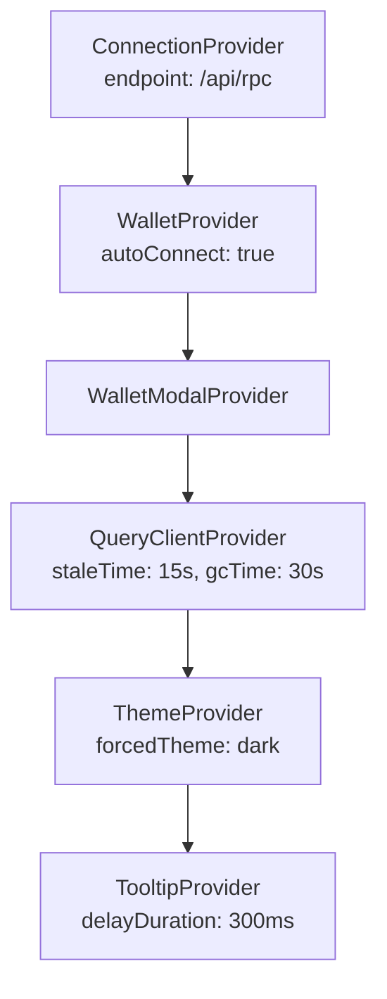

# App Router & Layouts

## Next.js 14 App Router with dual layout groups: public marketing site and wallet-gated dashboard

### Route Groups

| Group | Path | Layout | Rendering |
|-------|------|--------|-----------|
| `(public)` | `/`, `/how-it-works`, `/tokenomics` | `MarketingNav` + `MarketingFooter` | SSR with ISR (`revalidate: 3600`) |
| `dashboard` | `/dashboard/*` (8 sub-routes) | Sidebar nav + wallet gate | Client-side ("use client") |
| `api` | `/api/rpc` | None | Server Route Handler |

### Key Files

| File | Role |
|------|------|
| `app/layout.tsx` | Root layout: Inter font, dark HTML class, `<Providers>`, `<Toaster>` |
| `app/providers.tsx` | Provider stack (5 nested): `ConnectionProvider` > `WalletProvider` > `WalletModalProvider` > `QueryClientProvider` > `ThemeProvider` > `TooltipProvider` |
| `app/(public)/layout.tsx` | Marketing shell with server-side SEO metadata |
| `app/dashboard/layout.tsx` | Client layout with sidebar nav, mobile hamburger menu, wallet-required gate |
| `app/api/rpc/route.ts` | RPC proxy -- hides `HELIUS_RPC_URL` env var from client bundle |
| `middleware.ts` | CSP nonce generation + security headers on every non-static request |

### Provider Nesting Order

### Dashboard Navigation Items

The dashboard sidebar defines 8 navigation items as a static `NAV_ITEMS` array:

| Label | Route | Icon |
|-------|-------|------|
| Dashboard | `/dashboard` | LayoutIcon |
| New Stake | `/dashboard/stake` | PlusCircleIcon |
| Rewards | `/dashboard/rewards` | GiftIcon |
| Free Claim | `/dashboard/claim` | DownloadIcon |
| Analytics | `/dashboard/analytics` | BarChart3Icon |
| Swap | `/dashboard/swap` | RefreshCwIcon |
| Leaderboard | `/dashboard/leaderboard` | TrophyIcon |
| Whale Tracker | `/dashboard/whale-tracker` | ActivityIcon |

All icons are hand-coded SVG components (no lucide-react import) to avoid bundle issues.

### Middleware Security Headers

`middleware.ts` injects on every non-prefetch request:
- `Content-Security-Policy` with per-request nonce via `crypto.randomUUID()`
- `X-Frame-Options: DENY`
- `X-Content-Type-Options: nosniff`
- `Referrer-Policy: strict-origin-when-cross-origin`
- `connect-src` allows `*.helius-rpc.com` and `*.solana.com` (plus localhost in dev)

### QueryClient Configuration

Singleton `QueryClient` instantiated outside component (module scope) to prevent re-creation:
- `staleTime: 15_000` (15s default)
- `gcTime: 30_000` (30s garbage collection)
- `refetchOnWindowFocus: true`
- `retry: 3`

### Notable Gotchas

- **RPC endpoint during SSR**: `getRpcEndpoint()` returns a `https://localhost/api/rpc` placeholder during SSR/build since wallet-adapter is client-only. This prevents build errors but means no server-side Solana calls.
- **Test wallet injection**: When `NEXT_PUBLIC_TEST_WALLET_SECRET` is set, a `TestWalletAdapter` is dynamically imported via `useEffect`, keeping test code out of production bundle.
- **Wallet gate bypass**: `NEXT_PUBLIC_SKIP_WALLET_CHECK=true` bypasses the dashboard wallet requirement for E2E testing.
- **Forced dark theme**: `ThemeProvider` uses `forcedTheme="dark"` -- there is no light mode toggle.
- **CSP with strict-dynamic**: The nonce-based CSP uses `strict-dynamic` which requires all scripts to be nonce-tagged or loaded by nonce-tagged scripts.
- **Active route detection**: `NavLink` uses exact `pathname === item.href` matching, so nested routes under `/dashboard/stakes/[id]` do not highlight any nav item.

[[frontend-dashboard.md]]
