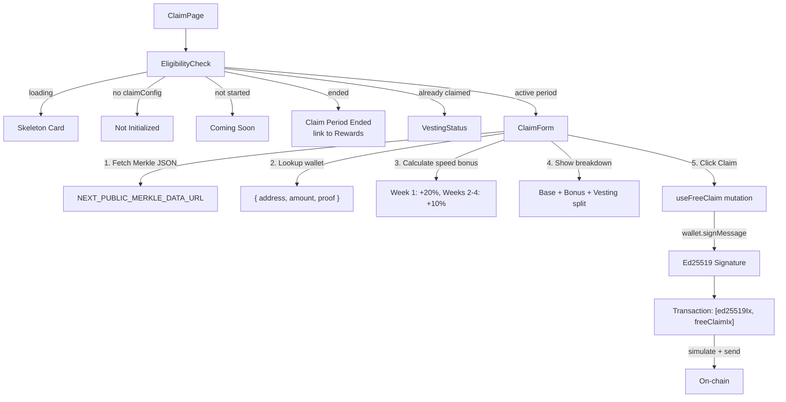
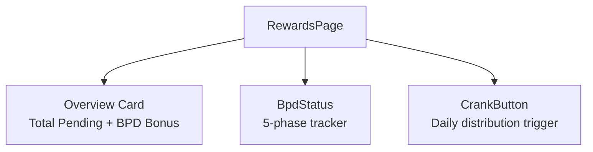

# Claim & Rewards UI

## Free claim flow (Merkle proof + Ed25519), vesting status tracker, rewards overview, BPD status, and crank distribution

### Page & Component Inventory

| Page/Component | File | Purpose |
|----------------|------|---------|
| **ClaimPage** | `app/dashboard/claim/page.tsx` | Free Claim page host |
| **RewardsPage** | `app/dashboard/rewards/page.tsx` | Rewards overview + BPD + crank |
| **EligibilityCheck** | `components/claim/eligibility-check.tsx` | Claim period state machine + claim status query |
| **ClaimForm** | `components/claim/claim-form.tsx` | Merkle proof lookup + speed bonus tier + claim button |
| **VestingStatus** | `components/claim/vesting-status.tsx` | Vesting progress bar + withdraw button |
| **BpdStatus** | `components/dashboard/bpd-status.tsx` | Big Pay Day 5-phase lifecycle tracker |
| **CrankButton** | `components/dashboard/crank-button.tsx` | Permissionless daily inflation trigger |

### Free Claim Flow



### EligibilityCheck State Machine

Queries `ClaimConfig` (on-chain singleton) and `ClaimStatus` (per-user PDA):

| Condition | Rendered Component |
|-----------|-------------------|
| Loading | Skeleton card |
| No `claimConfig` | "Not initialized yet" |
| `!claimPeriodStarted` | "Coming Soon" |
| `claimStatus.isClaimed` | **VestingStatus** (already claimed) |
| Claim period ended (`currentSlot > endSlot`) | "Claim period ended" + link to /rewards |
| Active period | **ClaimForm** |

### ClaimForm Speed Bonus Tiers

| Timeframe | Bonus | Calculation |
|-----------|-------|-------------|
| Week 1 (days 0-7) | +20% | `baseAmount * 20 / 100` |
| Weeks 2-4 (days 8-28) | +10% | `baseAmount * 10 / 100` |
| After day 28 | 0% | No bonus |

Display shows: Base Amount, Speed Bonus, Total Claimable, then vesting breakdown (10% immediate / 90% over 30 days).

### VestingStatus Calculations

```
immediateAmount = claimedAmount * 10 / 100    (10% immediate)
vestingPortion = claimedAmount - immediateAmount  (90% linear)

totalVested = immediate + (vestingPortion * elapsed / totalDuration)
availableToWithdraw = totalVested - withdrawnAmount
vestingProgress = elapsed / totalDuration * 100
```

Progress bar from 0-100%. Withdraw button disabled when `availableToWithdraw.isZero()`.

### Rewards Page Composition



Aggregates across all user stakes:
```
totalPendingRewards = sum(calculatePendingRewards(stake.tShares, globalState.shareRate, stake.rewardDebt))
totalBpdBonus = sum(stake.bpdBonusPending)
```

### useFreeClaim Hook Details

The most complex mutation hook. Transaction structure:

1. **Message signing**: `"HELIX:claim:{snapshotWallet}:{amount}"` signed by wallet
2. **Ed25519 verify instruction**: Manually constructed 14-byte header + 64-byte signature + 32-byte pubkey + variable message
3. **free_claim instruction**: Anchor-built with 9 accounts (claimer, snapshotWallet, globalState, claimConfig, claimStatus, claimerTokenAccount, mint, mintAuthority, instructionsSysvar)
4. Transaction order: `[ed25519Ix, freeClaimIx]` -- **order is critical**, on-chain checks preceding instruction

Error mapping:
- `AlreadyClaimed` -> "You have already claimed"
- `InvalidMerkleProof` -> "Invalid claim proof"
- `ClaimPeriodNotStarted` -> "Claim period not started"
- `ClaimPeriodEnded` -> "Claim period has ended"

### useWithdrawVested Hook

Simpler flow -- single instruction:
- Derives: globalState, claimConfig, mint, mintAuthority PDAs
- Builds `withdrawVested()` instruction
- Simulates, sends, confirms
- Invalidates `tokenBalance` and `claimStatus` caches
- Error handling: `NoVestedTokens` -> "No vested tokens available"

### Notable Gotchas

- **Merkle data from CDN**: `ClaimForm` fetches proof data from `NEXT_PUBLIC_MERKLE_DATA_URL`. If this URL is misconfigured or the CDN is down, the entire claim flow fails with "Failed to load claim data."
- **Case-insensitive address match**: Merkle data lookup compares `.toLowerCase()` on both sides. Solana addresses are base58 (case-sensitive), so this comparison may produce false negatives for addresses that differ only in case. In practice, base58 addresses are case-sensitive.
- **Speed bonus calculation in ClaimForm differs from on-chain**: The UI calculates `baseAmount = amount * 1000` and applies the speed bonus. This must match the on-chain `free_claim` instruction exactly or the displayed amounts will be wrong.
- **No inline claim status query key**: EligibilityCheck uses inline `useQuery` (not a dedicated hook) with key `["claimStatus", pubkey]`. This creates a cache key that must be manually invalidated by the `useFreeClaim` hook.
- **Vesting math uses integer division**: `muln(10).divn(100)` for 10% immediate -- potential off-by-one for small amounts due to integer truncation.
- **BPD status reads `reserved[0]`**: The BPD window active check reads `globalState.reserved[0]`, which is a repurposed reserved field. This is fragile if the on-chain account layout changes.

[[frontend-dashboard.md]]
