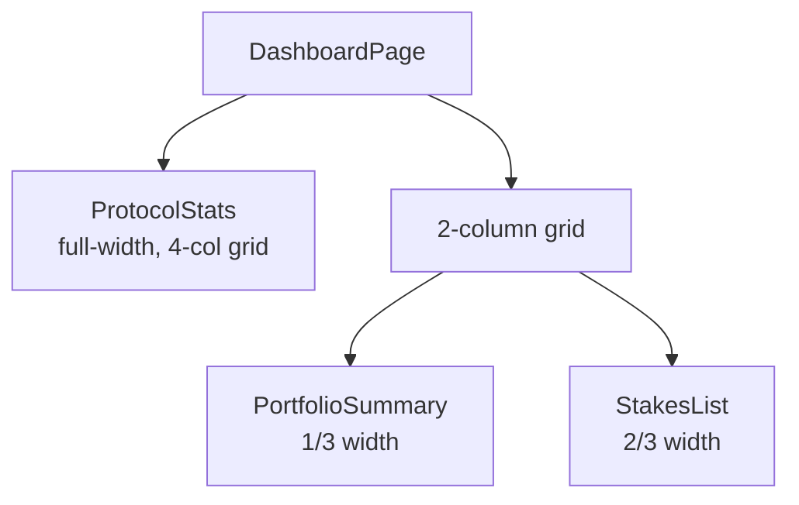
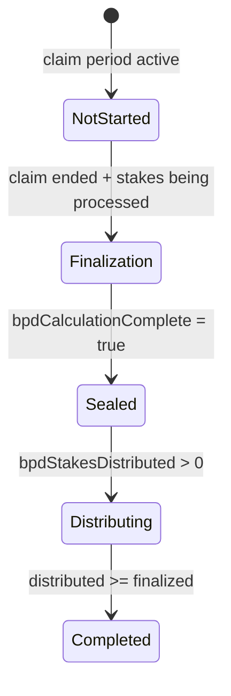

# Dashboard Components

## Protocol stats, portfolio aggregation, stakes list, BPD status tracker, and permissionless crank button

### Component Inventory

| Component | File | Purpose |
|-----------|------|---------|
| **DashboardPage** | `app/dashboard/page.tsx` | Composes ProtocolStats + PortfolioSummary + StakesList |
| **ProtocolStats** | `components/dashboard/protocol-stats.tsx` | 4-card grid showing global on-chain metrics |
| **PortfolioSummary** | `components/dashboard/portfolio-summary.tsx` | User's aggregate stake data (balance, count, T-shares, rewards) |
| **StakesList** | `components/dashboard/stakes-list.tsx` | Grid of user's active stakes, sorted by maturity urgency |
| **BpdStatus** | `components/dashboard/bpd-status.tsx` | Big Pay Day lifecycle tracker (5 phases) |
| **CrankButton** | `components/dashboard/crank-button.tsx` | Permissionless daily inflation trigger |

### Dashboard Page Layout



### ProtocolStats Metrics

4-card grid (`grid-cols-2 lg:grid-cols-4`), each with tooltip:

| Stat | Source | Tooltip |
|------|--------|---------|
| Total Staked | `globalState.totalTokensStaked` | "Total HELIX tokens currently locked in active stakes" |
| Total T-Shares | `globalState.totalShares` | "Total T-Shares across all active stakes..." |
| T-Share Price | `globalState.shareRate` | "The current cost per T-Share. Increases over time..." |
| Current Day | `globalState.currentDay` | "Number of days since protocol launch" |

Uses `formatHelixCompact()` for large numbers (K/M/B notation) and `formatTShares()` for T-share display.

### PortfolioSummary Aggregation

Aggregates across user's active stakes:

```
activeStakes = stakes.filter(s => s.account.isActive)
totalTShares = sum of all active stakes' tShares
totalPendingRewards = sum of calculatePendingRewards() for each stake
```

Shows 4 items: Wallet Balance, Active Stakes count, Total T-Shares, Pending Rewards. Empty state shows "Create Stake" CTA.

**Data sources**: `useStakes()`, `useTokenBalance()`, `useGlobalState()` -- all three must load before display.

### StakesList Sorting

Active stakes are sorted by `endSlot` ascending (most urgent / closest to maturity first). Uses `StakeCard` from `components/stake/stake-card.tsx` for each item in a 2-column responsive grid.

### BpdStatus Phase Machine

Tracks 5 BPD lifecycle phases:



| Phase | Badge Color | UI Element |
|-------|-------------|------------|
| Not Started | gray | "Coming Soon" text |
| Finalization | blue | Processing counter |
| Sealed | yellow | "Ready for Distribution" |
| Distributing | blue | Progress bar (distributed/finalized) |
| Completed | green | "All eligible stakers received bonus" |

Also shows a yellow alert banner when BPD window is active (`globalState.reserved[0] !== 0`), warning that unstaking is temporarily blocked.

### CrankButton

- Reads `globalState.currentDay` and computes whether distribution has been triggered today
- Disabled when `alreadyDistributedToday || isPending`
- Calls `useCrankDistribution().mutateAsync()`
- Shows "Already Distributed Today" text with explanation when disabled

### Notable Gotchas

- **Triple loading state**: PortfolioSummary waits for 3 independent queries (stakes, balance, globalState). All must succeed before rendering data.
- **`penalty-400` class**: ProtocolStats and StakesList reference `text-penalty-400` for error text, which appears to be a custom Tailwind color (likely aliased in tailwind config).
- **BPD phase detection is fragile**: Phase logic uses multiple nullable fields (`bpdCalculationComplete`, `bpdStakesFinalized`, `bpdStakesDistributed`) that may not exist on older ClaimConfig accounts.
- **CrankButton day comparison is circular**: `currentDayFromSlot` is calculated from `currentDay * slotsPerDay + initSlot`, then divides back by `slotsPerDay` -- effectively comparing `currentDay` to itself. The crank disable check may not be accurate if the actual blockchain slot has advanced past the computed value.
- **No pagination**: StakesList renders all active stakes. Users with many stakes will see performance degradation.
- **Skeleton states**: Both ProtocolStats and StakesList use proper skeleton loading (shimmer animations), but PortfolioSummary only shows skeletons inside the card.

[[frontend-dashboard.md]]
