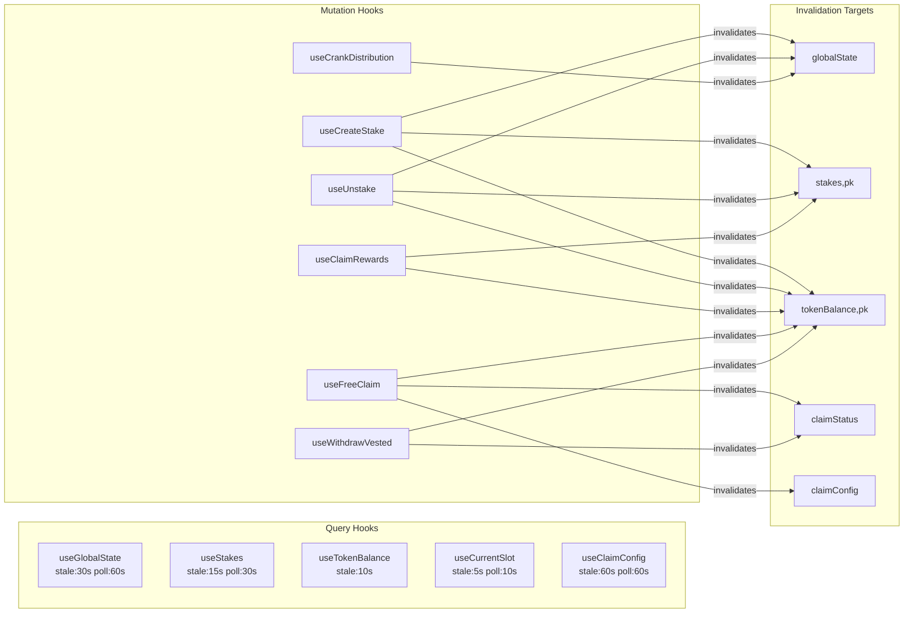

# Data Hooks

## 12 custom React hooks bridging on-chain state to UI via React Query and WebSocket subscriptions

### Hook Classification

| Hook | Category | React Query Type | Cache Key | Polling | WebSocket |
|------|----------|-----------------|-----------|---------|-----------|
| `useProgram` | Core | None (useMemo) | N/A | No | No |
| `useGlobalState` | Query | `useQuery` | `["globalState"]` | 60s | Yes |
| `useStakes` | Query | `useQuery` | `["stakes", pubkey]` | 30s | Yes (per stake) |
| `useTokenBalance` | Query | `useQuery` | `["tokenBalance", pubkey]` | No | No |
| `useCurrentSlot` | Query | `useQuery` | `["currentSlot"]` | 10s | No |
| `useClaimConfig` | Query | `useQuery` | `["claimConfig"]` | 60s | Yes |
| `useCreateStake` | Mutation | `useMutation` | N/A | N/A | N/A |
| `useUnstake` | Mutation | `useMutation` | N/A | N/A | N/A |
| `useClaimRewards` | Mutation | `useMutation` | N/A | N/A | N/A |
| `useCrankDistribution` | Mutation | `useMutation` | N/A | N/A | N/A |
| `useFreeClaim` | Mutation | `useMutation` | N/A | N/A | N/A |
| `useWithdrawVested` | Mutation | `useMutation` | N/A | N/A | N/A |

### Data Flow Architecture



### useProgram (Core)

Returns a typed `Program<HelixStaking>` instance. Two modes:
- **With wallet**: Uses connected wallet's `signTransaction` / `signAllTransactions`
- **Without wallet**: Falls back to `DUMMY_WALLET` (read-only -- signing throws error)

Memoized on `[connection, wallet.publicKey, wallet.signTransaction, wallet.signAllTransactions]`.

### WebSocket Subscription Pattern

Three hooks use real-time WebSocket subscriptions for instant cache invalidation:

```
useGlobalState:  connection.onAccountChange(globalStatePda, ...)
useClaimConfig:  connection.onAccountChange(claimConfigPda, ...)
useStakes:       connection.onAccountChange(stake.publicKey, ...) for EACH stake
```

When the on-chain account data changes, the callback calls `queryClient.invalidateQueries()`, triggering a refetch. Subscriptions are cleaned up in `useEffect` return functions.

### Mutation Patterns

All 6 mutation hooks follow this consistent pattern:

1. **Guard**: Check `wallet.publicKey` and `sendTransaction` (or `signTransaction`)
2. **Derive**: Compute all PDA addresses via `pdas.ts`
3. **Build**: Create transaction via Anchor `program.methods.*.accountsPartial(...).transaction()`
4. **Simulate**: Call `connection.simulateTransaction(tx)` -- **security requirement**
5. **Send**: Call `sendTransaction(tx, connection)` or `wallet.signTransaction` + `sendRawTransaction`
6. **Confirm**: Wait for `connection.confirmTransaction()` at "confirmed" commitment
7. **Invalidate**: Bust relevant React Query caches
8. **Toast**: Show success/error toasts via sonner or shadcn toast

### Stale Time Hierarchy

```
useCurrentSlot:    5s   (slot changes rapidly)
useTokenBalance:  10s   (balance changes on tx)
useStakes:        15s   (stakes change infrequently)
useGlobalState:   30s   (updates once per day via crank)
useClaimConfig:   60s   (changes very rarely)
```

### useCreateStake Retry Logic

Handles **stake ID race condition** with retry loop:

```
for attempt in 0..MAX_RETRIES (3):
  1. Fetch fresh globalState.totalStakesCreated
  2. Derive stakeAccountPda from totalStakesCreated
  3. Build + simulate + send tx
  4. If "already in use" error: wait 500ms, retry
  5. If other error: throw immediately
```

### useFreeClaim Ed25519 Flow

The most complex hook. Builds a two-instruction transaction:

1. Wallet signs message `"HELIX:claim:{pubkey}:{amount}"` via `wallet.signMessage()`
2. Constructs Ed25519 verify instruction manually (14-byte header + sig + pubkey + msg)
3. Adds `[ed25519Ix, freeClaimIx]` to a single transaction
4. The Ed25519 instruction MUST immediately precede `free_claim` in the transaction

### Notable Gotchas

- **Two toast systems**: `useClaimRewards` and `useUnstake` use `sonner` toast, while `useCrankDistribution`, `useFreeClaim`, and `useWithdrawVested` use the shadcn `useToast` hook. This inconsistency means error/success toasts may render differently.
- **useStakes WebSocket scaling**: Creates one WebSocket subscription per stake account. Users with many stakes will have many open subscriptions. Subscriptions are managed via a `useRef` array and cleaned up on data change.
- **Token-2022 program ID**: `useTokenBalance` and `useCreateStake` manually specify `TokenzQdBNbLqP5VEhdkAS6EPFLC1PHnBqCXEpPxuEb` instead of importing from `@solana/spl-token`. Some hooks do import `TOKEN_2022_PROGRAM_ID` from spl-token.
- **No optimistic updates**: All mutations wait for on-chain confirmation before updating UI. This means 1-3 second delays between tx submission and visual feedback.
- **`any` casts on accounts**: Several hooks cast `.accounts({...} as any)` to bypass Anchor type checking when account resolution is partial.

[[frontend-dashboard.md]]
