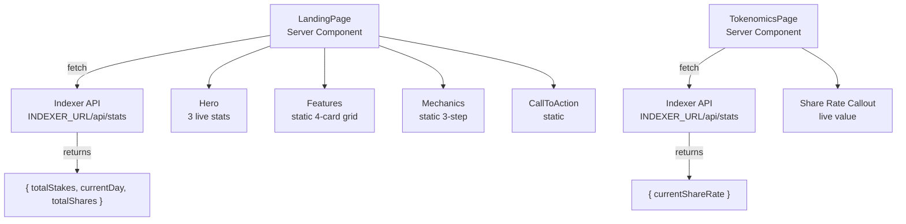

# Marketing & Static Pages

## Server-rendered public-facing pages with ISR, live stats from indexer, and educational content

### Page Inventory

| Route | File | Rendering | Revalidation |
|-------|------|-----------|-------------|
| `/` | `app/(public)/page.tsx` | **Server Component** (async) | 3600s (1 hour) |
| `/how-it-works` | `app/(public)/how-it-works/page.tsx` | **Server Component** (static) | 86400s (1 day) |
| `/tokenomics` | `app/(public)/tokenomics/page.tsx` | **Server Component** (async) | 86400s (1 day) |

### Component Inventory

| Component | File | Purpose |
|-----------|------|---------|
| **MarketingNav** | `components/marketing/nav.tsx` | Sticky top nav: HELIX logo, How It Works, Tokenomics, Launch App CTA |
| **MarketingFooter** | `components/marketing/footer.tsx` | 3-column footer: branding, protocol links, resources |
| **Hero** | `components/marketing/hero.tsx` | Headline + subheading + 2 CTAs + 3 live stats |
| **Features** | `components/marketing/features.tsx` | 4-card grid: Duration Bonus, Size Bonus, Daily Rewards, Big Pay Day |
| **Mechanics** | `components/marketing/mechanics.tsx` | 3-step visual flow: Choose Duration, Earn T-Shares, Collect Rewards |
| **CallToAction** | `components/marketing/cta.tsx` | Bottom CTA: "Ready to Start Earning?" + Launch App button |

### Landing Page Data Flow



### Indexer Integration

Both `/` and `/tokenomics` fetch from `INDEXER_URL/api/stats` at build/revalidation time:

```typescript
const indexerUrl = process.env.INDEXER_URL || "http://localhost:3001";
const response = await fetch(`${indexerUrl}/api/stats`, {
  next: { revalidate: 3600 },
});
```

Graceful fallback: if fetch fails, returns `null` and components show `"--"` placeholders.

### Hero Live Stats

| Stat | Source Field | Formatting |
|------|-------------|------------|
| Total Stakes | `stats.totalStakes` | `toLocaleString()` |
| Protocol Day | `stats.currentDay` | Raw number |
| Total T-Shares | `stats.totalShares` | `parseFloat() / 1e9` with commas |

### SEO Metadata

Each page exports OpenGraph-compatible metadata:

```typescript
// Landing page
title: "HELIX Protocol - Time-Locked Staking on Solana"
description: "Stake HELIX tokens with time-locked commitments..."
openGraph: { siteName: "HELIX Protocol" }

// How It Works
title: "How HELIX Staking Works"

// Tokenomics
title: "HELIX Tokenomics"
```

### Public Layout Shell

`app/(public)/layout.tsx` wraps all marketing pages with:
- `MarketingNav` (sticky, backdrop-blur, z-50)
- Main content area (flex-1)
- `MarketingFooter` (border-top separator)

All within `min-h-screen bg-zinc-950 flex flex-col`.

### Educational Content Structure

**How It Works** covers 5 sections:
1. What is HELIX Staking? (lock period, T-shares, burn-and-mint)
2. T-Shares Explained (LPB + BPB)
3. Daily Rewards (3.69% annual, permissionless crank)
4. Penalties (early: min 50%, late: 14-day grace + 351-day window)
5. Big Pay Day (unclaimed tokens distributed to stakers)

**Tokenomics** covers 6 sections:
1. Supply Mechanics (burn-and-mint model)
2. Inflation (3.69% annual, daily distribution)
3. Share Rate (increases daily, early staker advantage)
4. Reward Distribution (lazy accumulation, claim-on-demand)
5. Penalty Redistribution (via share rate increase)
6. Free Claim & Big Pay Day (snapshot + unclaimed redistribution)

### Notable Gotchas

- **Server-only data fetching**: Landing page and tokenomics use `async` server components with ISR. They do NOT use React Query or client-side hooks. The indexer URL is a server-side env var (`INDEXER_URL`), not `NEXT_PUBLIC_`.
- **Fallback on indexer failure**: If the indexer is down, stats show as `"--"` or `0`. No error UI is shown to marketing visitors.
- **Hero T-shares formatting differs from dashboard**: Hero divides by `1e9` and formats with commas. Dashboard uses `formatTShares()` which divides by `TSHARE_DISPLAY_FACTOR` (1e12). These represent different scales.
- **Footer links are placeholder**: "Documentation" and "GitHub" links point to `#` (not yet configured).
- **No mobile nav on marketing pages**: `MarketingNav` is a simple horizontal layout with no hamburger menu. May be problematic on small screens with the 3 nav items + CTA button.
- **Static pages are not truly static**: `how-it-works` and `tokenomics` use `revalidate: 86400` but their content is hardcoded JSX. The revalidation is unnecessary except for `tokenomics` which fetches share rate from the indexer.

[[frontend-dashboard.md]]
