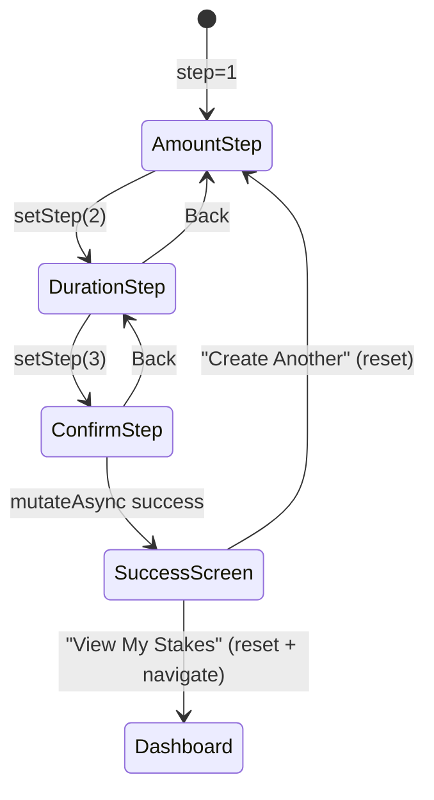

# Stake Components

## Multi-step stake wizard, live bonus preview, penalty calculator, and stake lifecycle cards

### Component Inventory

| Component | File | Purpose |
|-----------|------|---------|
| **StakePage** | `app/dashboard/stake/page.tsx` | Wizard host with step indicator (1-2-3 dots) |
| **AmountStep** | `components/stake/stake-wizard/amount-step.tsx` | Token amount input with MAX button + balance check |
| **DurationStep** | `components/stake/stake-wizard/duration-step.tsx` | Slider (1-5555 days) + presets (1Y/3Y/5Y/Max) + live BonusPreview |
| **ConfirmStep** | `components/stake/stake-wizard/confirm-step.tsx` | Summary + penalty warning + simulation + tx submission |
| **SuccessScreen** | `components/stake/stake-wizard/success-screen.tsx` | Confirmation with Solana Explorer link |
| **BonusPreview** | `components/stake/bonus-preview.tsx` | Live LPB/BPB bars + multiplier + estimated T-shares |
| **PenaltyCalculator** | `components/stake/penalty-calculator.tsx` | Visual penalty breakdown for unstake scenarios |
| **StakeCard** | `components/stake/stake-card.tsx` | Individual stake tile with status, progress, rewards |
| **UnstakeConfirmation** | `components/stake/unstake-confirmation.tsx` | Modal dialog with mandatory checkbox before unstake |

### Wizard Flow



### State Management

The wizard uses a **Zustand store** (`lib/store/ui-store.ts`):

```
interface StakeWizardState {
  step: 1 | 2 | 3 | "success"
  amount: string       // decimal format (e.g., "100.5")
  days: number         // 1-5555, clamped via Math.max/min/floor
}
```

- `amount` is stored as a string (user input) and parsed to BN only when needed
- `days` is validated on set: `Math.max(1, Math.min(5555, Math.floor(days)))`
- `reset()` called on page unmount via `useEffect` cleanup and on wizard completion

### BonusPreview Details

Renders live as the user adjusts amount/duration (no debounce needed):

| Metric | Calculation | Display |
|--------|-------------|---------|
| Duration Bonus (LPB) | `(days - 1) * 2 * PRECISION / LPB_MAX_DAYS` | Progress bar (0-100%) + percentage |
| Size Bonus (BPB) | `(amount / 10) * PRECISION / BPB_THRESHOLD` | Progress bar (0-100%) + percentage |
| Total Multiplier | `PRECISION + LPB + BPB` | e.g., "2.50x" |
| T-Share Price | `globalState.shareRate` | Formatted HELIX amount |
| Estimated T-Shares | `amount * multiplier / shareRate` | Gradient-colored highlight |

### PenaltyCalculator States

Determines stake phase and renders a visual comparison bar:

| Phase | Condition | Penalty | Color |
|-------|-----------|---------|-------|
| **Early** | `currentSlot < endSlot` | 50%-100% (linear, min 50%) | Red/Yellow |
| **Grace** | `endSlot <= currentSlot <= endSlot + 14 days` | 0% | Green |
| **Late** | `currentSlot > endSlot + 14 days` | Linear to 100% over 351 days | Red |

Shows: staked amount, penalty amount, pending rewards, BPD bonus, total receive.

### StakeCard Status Logic

`getStakeStatus()` returns one of 5 states based on slot arithmetic:

| Status | Condition | Badge Color |
|--------|-----------|-------------|
| `active-late` | `<50% served` | Red |
| `active-early` | `>=50% served` | Yellow |
| `matured` | Exactly at end | Green |
| `grace` | Within 14 days of maturity | Green |
| `late` | Past grace period | Red |

### ConfirmStep Transaction Flow

1. Parse amount string to BN via `parseHelix()`
2. Call `useCreateStake().mutateAsync({ amount, days })`
3. Hook fetches fresh `globalState.totalStakesCreated` for stake ID
4. Derives stake PDA, builds tx, simulates, sends, confirms
5. On race condition ("already in use"), retries up to 3 times with 500ms delay
6. On success: `setStep("success")`

### Notable Gotchas

- **BN.js everywhere**: All amounts use `bn.js` BN type, not native BigInt. String serialization via `.toString()` is needed when crossing Anchor boundaries.
- **Stake ID race condition**: If two users stake simultaneously, `totalStakesCreated` may be stale. The retry loop in `useCreateStake` handles this by re-fetching globalState.
- **Explorer link hardcoded to devnet**: `SuccessScreen` links to `explorer.solana.com/tx/...?cluster=devnet`. This must be updated for mainnet.
- **Mandatory checkbox on unstake**: `UnstakeConfirmation` requires a checkbox acknowledgment before the "End Stake" button is enabled. Different text for grace period vs penalty scenarios.
- **No back button from ConfirmStep during tx**: The Back button is disabled while `isPending` is true.

[[frontend-dashboard.md]]
