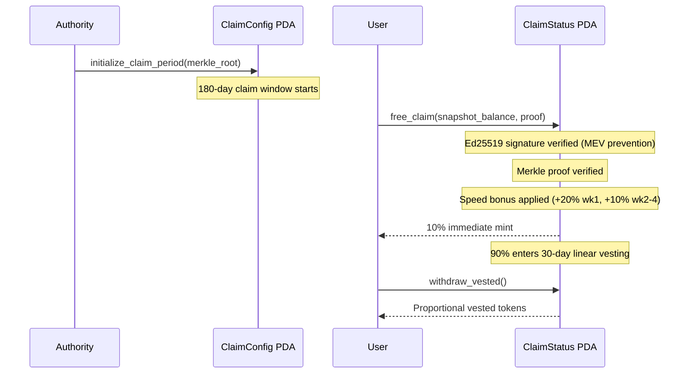
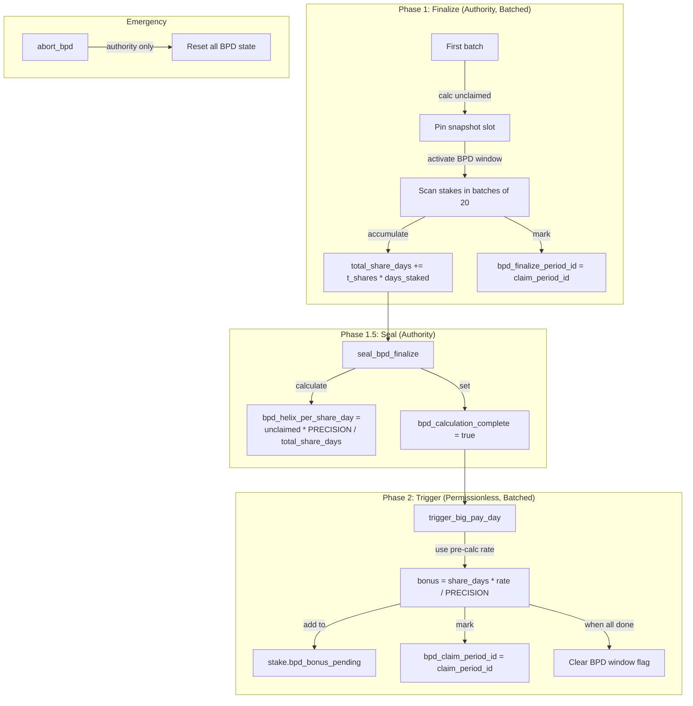

# Free Claim & Big Pay Day (BPD)

## Merkle airdrop, vesting, and unclaimed token redistribution

Complex multi-phase system for token distribution via Merkle proofs with speed bonuses, linear vesting, and redistribution of unclaimed tokens to stakers proportional to share-days.

### Free Claim Flow

### Big Pay Day (BPD) - 3-Phase Process

After the 180-day claim period ends, unclaimed tokens are redistributed to stakes created during that period.

### Security Measures (Post-Audit Fixes)
| Issue | Fix |
|-------|-----|
| Per-batch rate manipulation | Authority-gated finalize + separate seal step |
| Duplicate BPD claims | `bpd_claim_period_id` tracking per stake |
| Stake changes during BPD | BPD window flag blocks unstaking |
| Snapshot consistency | `bpd_snapshot_slot` pinned on first batch |

### Notable Gotchas & Tech Debt
- **Ed25519 introspection** required for free_claim (prevents MEV front-running)
- **Batch size of 20** means large protocols need many finalize/trigger txs
- `abort_bpd` has a known HIGH severity issue (can reset bpd_claim_period_id tracking)
- Two deprecated fields on StakeAccount: `bpd_eligible`, `claim_period_start_slot`
- Counter-based completion (`distributed >= finalized`) prevents rounding exploits
- Complexity score: **HIGH** - most complex subsystem, 3-phase with batching + security constraints

[[run_me.md]]
