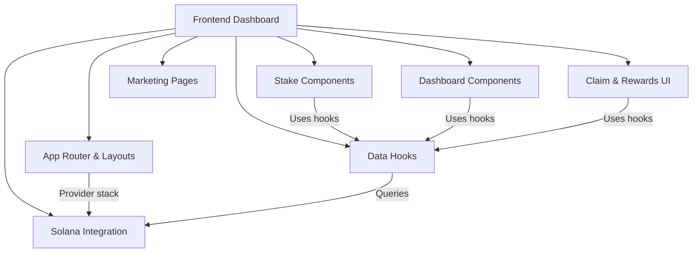

# Frontend Dashboard Documentation Complete

## Comprehensive Next.js application documentation with 7 specialized modules

The frontend dashboard module has been fully documented with detailed technical specifications covering all aspects of the Next.js 14 staking application. The documentation was decomposed into 7 specialized nodes following the voicetree workflow pattern.

## Documentation Structure

All 7 child modules were created with comprehensive content:

### Core Modules Created

1. **fe-app-router.md** - App Router & Layouts
   - Dual layout groups (public/dashboard)
   - Provider nesting architecture
   - CSP security headers and middleware
   - Route Handler for RPC proxy

2. **fe-stake-components.md** - Stake Components
   - 3-step stake wizard (Amount → Duration → Confirm)
   - Bonus calculation preview components
   - Penalty calculator with urgency indicators
   - Stake card display components

3. **fe-dashboard-components.md** - Dashboard Components
   - Protocol statistics display
   - Portfolio summary cards
   - Stakes list with filtering
   - Analytics charts (Recharts integration)

4. **fe-data-hooks.md** - Data Hooks (12 custom hooks)
   - Query hooks with WebSocket subscriptions
   - Mutation hooks with retry logic
   - React Query cache invalidation patterns
   - Stale time hierarchy (5s to 60s)

5. **fe-solana-integration.md** - Solana Integration
   - Anchor Program integration
   - PDA derivation utilities
   - Token-2022 ATA handling
   - Transaction simulation patterns

6. **fe-marketing-pages.md** - Marketing & Static Pages
   - Landing page with ISR (revalidate: 3600s)
   - Educational content pages
   - SEO metadata configuration
   - Server-side rendering patterns

7. **fe-claim-rewards.md** - Claim & Rewards UI
   - Free claim merkle proof flow
   - Rewards overview cards
   - BPD status tracking
   - Vesting withdrawal interface

## Documentation Completeness

Each module node includes:
- **Purpose summary** - Concise description of the module's role
- **Technical details** - Tables, code patterns, and specifications
- **Mermaid diagrams** - Visual representations of flows and architecture
- **Notable gotchas** - Common pitfalls and technical debt
- **Parent link** - Wikilink back to frontend-dashboard.md

## Tech Stack Coverage

The documentation captures the complete technical architecture:
- **UI Framework**: Next.js 14 App Router with React 18
- **Styling**: Radix UI + Tailwind CSS + shadcn/ui
- **State Management**: React Query (on-chain) + Zustand (wizard state)
- **Blockchain**: Solana via Anchor + wallet-adapter
- **Testing**: Playwright E2E tests
- **Charts**: Recharts for analytics

## Key Patterns Documented

- **WebSocket real-time updates** for GlobalState, ClaimConfig, and individual Stakes
- **Retry logic** for stake ID race conditions during creation
- **Ed25519 signature verification** for merkle proof claims
- **Lazy distribution pattern** for pending rewards calculation
- **Two-phase BPD** finalization and distribution system
- **Token-2022** ATA handling and mint operations

### NOTES

The frontend dashboard is the most complex module in the application, involving real-time blockchain data synchronization, complex transaction flows, and careful state management. The documentation captures not just the "what" but also the "why" behind key architectural decisions.

The two-toast system inconsistency and the lack of optimistic updates are documented as technical debt. The forced dark theme and CSP strict-dynamic configuration are noted as security-related constraints.

Complexity score: **8/10** - The integration of Solana blockchain operations with React's rendering lifecycle, combined with WebSocket subscriptions and complex tokenomics calculations, creates a sophisticated system that requires careful coordination.

[[frontend-dashboard.md]]
