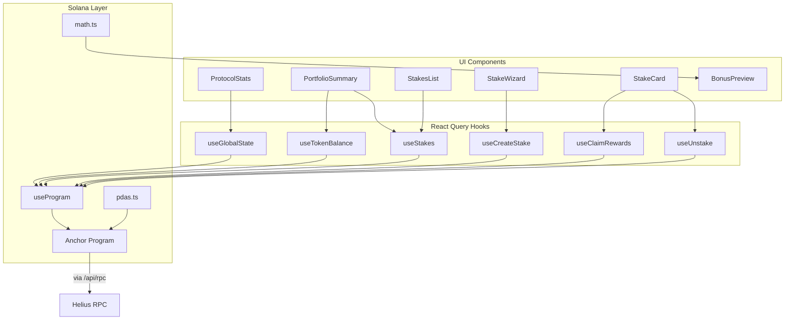

# Frontend Dashboard (Next.js)

## Full-featured staking UI at `app/web/`

Next.js 14 App Router application with Solana wallet integration, real-time on-chain data via React Query + WebSocket subscriptions, and Jupiter swap integration.

### Route Architecture
| Group | Routes | Purpose |
|-------|--------|---------|
| **(public)** | `/`, `/how-it-works`, `/tokenomics` | Marketing & education |
| **dashboard** | `/dashboard` | Portfolio overview + stakes list |
| | `/dashboard/stake` | 3-step stake creation wizard |
| | `/dashboard/stakes/[stakeId]` | Individual stake detail + actions |
| | `/dashboard/rewards` | Pending rewards + BPD status + crank |
| | `/dashboard/claim` | Free claim (merkle airdrop) |
| | `/dashboard/analytics` | Protocol charts (Recharts) |
| | `/dashboard/swap` | Jupiter aggregator widget |
| | `/dashboard/leaderboard` | Top stakers ranking |
| | `/dashboard/whale-tracker` | Large stake feed |
| **api** | `/api/rpc` | RPC proxy (hides Helius API key) |

### 12 Custom Hooks
| Hook | Type | Purpose |
|------|------|---------|
| `useProgram` | Core | Typed `Program<HelixStaking>` (read-only w/o wallet) |
| `useGlobalState` | Query | Protocol state + WebSocket live updates |
| `useStakes` | Query | User stakes via memcmp filter + WebSocket |
| `useTokenBalance` | Query | Token-2022 ATA balance |
| `useCurrentSlot` | Query | Blockchain slot (10s polling) |
| `useClaimConfig` | Query | Claim period + BPD status |
| `useCreateStake` | Mutation | Stake tx with simulation + retry logic |
| `useUnstake` | Mutation | Unstake with penalty handling |
| `useClaimRewards` | Mutation | Claim pending rewards |
| `useCrankDistribution` | Mutation | Permissionless daily inflation |
| `useFreeClaim` | Mutation | Merkle proof claim |
| `useWithdrawVested` | Mutation | Vesting withdrawal |

### Tech Stack
- **UI:** Radix UI + Tailwind CSS + shadcn/ui
- **State:** React Query (on-chain) + Zustand (UI wizard state)
- **Charts:** Recharts
- **Wallet:** Phantom, Solflare via wallet-adapter
- **Testing:** Playwright (UI + transaction tests)

### Notable Gotchas & Tech Debt
- Locked to `@solana/web3.js` v1 (Anchor incompatible with v2)
- `NEXT_PUBLIC_SKIP_WALLET_CHECK` env var bypasses wallet gate (testing only)
- RPC proxy at `/api/rpc` returns placeholder during SSR/build
- Client-side math in `math.ts` must stay in sync with on-chain calculations
- Forced dark theme (`ThemeProvider forcedTheme="dark"`)

[[run_me.md]]
