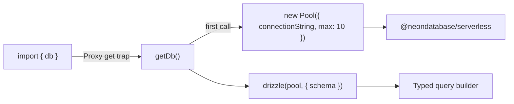

# Database Schema

## Drizzle ORM schema defining 13 PostgreSQL tables (12 event tables + 1 checkpoint table) on Neon serverless Postgres.

### File Roles

| File | Purpose |
|------|---------|
| `db/schema.ts` | All table definitions using `drizzle-orm/pg-core`. Exports one const per table. |
| `db/client.ts` | Lazy-initialized Neon serverless `Pool` (max 10 connections) + Drizzle ORM instance, exposed via `Proxy` for deferred init. |

### Connection Architecture

The `db` and `pool` exports use ES `Proxy` wrappers that defer actual pool creation until first access. This avoids import-time crashes during tests when `DATABASE_URL` is unset. `closePool()` tears down both the pool and the cached Drizzle instance.

### Shared Columns Pattern

Every event table spreads a `sharedColumns` object:

| Column | Type | Notes |
|--------|------|-------|
| `id` | `serial` | Auto-increment PK |
| `signature` | `text NOT NULL UNIQUE` | Solana transaction signature; uniqueness enforces idempotent inserts |
| `slot` | `bigint (mode: number)` | Solana slot number |
| `created_at` | `timestamp DEFAULT NOW()` | DB insertion time |

### Event Tables (12)

| # | Table Name | Extra Columns | Indexes |
|---|-----------|---------------|---------|
| 1 | `protocol_initialized_events` | globalState, mint, mintAuthority, authority, annualInflationBp, minStakeAmount, startingShareRate, slotsPerDay | -- (signature unique only) |
| 2 | `stake_created_events` | user, stakeId, amount, tShares, days, shareRate | `user`, `(user, slot)` |
| 3 | `stake_ended_events` | user, stakeId, originalAmount, returnAmount, penaltyAmount, penaltyType, rewardsClaimed | `user` |
| 4 | `rewards_claimed_events` | user, stakeId, amount | `user` |
| 5 | `inflation_distributed_events` | day, daysElapsed, amount, newShareRate, totalShares | `day` |
| 6 | `admin_minted_events` | authority, recipient, amount | -- |
| 7 | `claim_period_started_events` | timestamp, claimPeriodId, merkleRoot, totalClaimable, totalEligible, claimDeadlineSlot | -- |
| 8 | `tokens_claimed_events` | timestamp, claimer, snapshotWallet, claimPeriodId, snapshotBalance, baseAmount, bonusBps, daysElapsed, totalAmount, immediateAmount, vestingAmount, vestingEndSlot | `claimer` |
| 9 | `vested_tokens_withdrawn_events` | timestamp, claimer, amount, totalVested, totalWithdrawn, remaining | `claimer` |
| 10 | `claim_period_ended_events` | timestamp, claimPeriodId, totalClaimed, claimsCount, unclaimedAmount | -- |
| 11 | `big_pay_day_distributed_events` | timestamp, claimPeriodId, totalUnclaimed, totalEligibleShareDays, helixPerShareDay, eligibleStakers | -- |
| 12 | `bpd_aborted_events` | claimPeriodId, stakesFinalized, stakesDistributed | -- |

### Checkpoint Table

| Column | Type | Notes |
|--------|------|-------|
| `id` | `serial` PK | |
| `program_id` | `text NOT NULL UNIQUE` | One row per tracked program |
| `last_signature` | `text` nullable | Most recently processed tx signature |
| `last_slot` | `bigint` nullable | Slot of that signature |
| `processed_count` | `bigint DEFAULT 0` | Running counter, incremented via SQL `+ 1` on upsert |
| `updated_at` | `timestamp DEFAULT NOW()` | Last upsert time |

### Column Type Conventions

| Solana Type | PG Column | Rationale |
|-------------|-----------|-----------|
| `u64` / `u128` (BN) | `text` | Avoids JS `Number` precision loss beyond 2^53 |
| `Pubkey` | `text` | Stored as base58 string |
| `u8` / `u16` / `u32` | `integer` or `bigint(mode: number)` | Safe within JS number range |
| `[u8; 32]` (merkle root) | `text` | Hex-encoded by `processor.ts` via `Buffer.from(val).toString('hex')` |

### Notable Gotchas

- **No foreign keys between tables**: Event tables are fully independent. The leaderboard query in the API uses a `LEFT JOIN` between `stake_created_events` and `stake_ended_events` via raw SQL, not ORM relations.
- **`bigint(mode: number)`**: Drizzle maps this to JS `number`, which silently loses precision above 2^53. The `slot` column uses this, which is safe (slots are well under 2^53), but it would be dangerous for token amounts -- hence those use `text`.
- **Proxy-based lazy init**: If `DATABASE_URL` is missing at runtime (not just test time), the error only surfaces on the first query, not at import time.
- **No migrations tooling visible**: Schema changes appear to be applied manually or via `drizzle-kit push`. No migration files are tracked in the repo.

[[indexer-service.md]]
