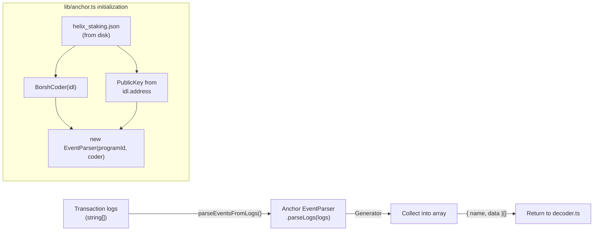

# Event Types & Decoding

## TypeScript interfaces for all 12 Helix program events and Anchor-based log parsing that converts raw transaction logs into typed event objects.

### File Roles

| File | Purpose |
|------|---------|
| `types/events.ts` | 12 TypeScript interfaces (one per event), `EVENT_NAMES` const tuple, `EventDataMap` type map, and `IndexedEvent` discriminated union |
| `lib/anchor.ts` | Loads the Helix Staking IDL from disk, constructs `BorshCoder` + `EventParser`, exports `parseEventsFromLogs()` |

### Event Catalog

| # | Event Name | Key Fields | Category |
|---|-----------|------------|----------|
| 1 | `ProtocolInitialized` | globalState, mint, authority, annualInflationBp, slotsPerDay | Admin |
| 2 | `StakeCreated` | user, stakeId, amount, tShares, days, shareRate | Staking |
| 3 | `StakeEnded` | user, stakeId, originalAmount, returnAmount, penaltyAmount, penaltyType | Staking |
| 4 | `RewardsClaimed` | user, stakeId, amount | Staking |
| 5 | `InflationDistributed` | day, daysElapsed, amount, newShareRate, totalShares | Inflation |
| 6 | `AdminMinted` | authority, recipient, amount | Admin |
| 7 | `ClaimPeriodStarted` | claimPeriodId, merkleRoot, totalClaimable, totalEligible, claimDeadlineSlot | Claims |
| 8 | `TokensClaimed` | claimer, snapshotWallet, claimPeriodId, baseAmount, bonusBps, vestingAmount | Claims |
| 9 | `VestedTokensWithdrawn` | claimer, amount, totalVested, totalWithdrawn, remaining | Claims |
| 10 | `ClaimPeriodEnded` | claimPeriodId, totalClaimed, claimsCount, unclaimedAmount | Claims |
| 11 | `BigPayDayDistributed` | claimPeriodId, totalUnclaimed, totalEligibleShareDays, helixPerShareDay | BPD |
| 12 | `BpdAborted` | claimPeriodId, stakesFinalized, stakesDistributed | BPD |

### Type Conventions

| Solana/Anchor Type | TypeScript Type | Rationale |
|-------------------|-----------------|-----------|
| `Pubkey` | `string` | Base58 after `toBase58()` |
| `u64` / `u128` | `string` | `BN.toString()` avoids JS precision loss |
| `u8` / `u16` / `u32` | `number` | Safe within JS number range |
| `[u8; 32]` | `number[]` | Raw byte array (hex-encoded at storage time by processor) |

### Decoding Pipeline



### IDL Resolution

The IDL path is resolved with fallback logic:
1. `process.env.IDL_PATH` (explicit override, useful for deployments)
2. Default: `../../../../target/idl/helix_staking.json` (relative to `lib/anchor.ts`, resolves to the Anchor build output)

The program ID is extracted from the IDL via `idl.address` (Anchor 0.30+ format) with fallback to `idl.metadata.address` (older format). If neither exists, it throws at startup.

### Discriminated Union

The `IndexedEvent` type is a mapped discriminated union:

```typescript
type IndexedEvent = {
  [K in EventName]: { name: K; data: EventDataMap[K] };
}[EventName];
```

This allows type-safe narrowing in switch statements: when you match `event.name === 'StakeCreated'`, TypeScript narrows `event.data` to `StakeCreated`.

### Notable Gotchas

- **IDL is read synchronously at module load**: `fs.readFileSync` blocks the event loop on startup. If the file is missing, the process crashes immediately with an uncaught exception.
- **EventParser is a generator**: `parseLogs()` returns a generator, not an array. The current code iterates it with a `for...of` loop. If a single log entry causes a parse error, the generator may terminate early and remaining events in the same transaction are lost.
- **Type interfaces are not validated at runtime**: The interfaces in `types/events.ts` are compile-time only. If the on-chain program emits an event with a different shape than expected (e.g., after a program upgrade), the mismatch is silently ignored -- `processor.ts` just calls `toStr(data.fieldName)` which returns `''` for undefined fields.
- **`BpdAborted` lacks `slot` and `timestamp` fields**: Unlike other event interfaces, `BpdAborted` only has `claimPeriodId`, `stakesFinalized`, `stakesDistributed`. The `slot` is added by `decoder.ts` from the transaction metadata, not from the event data itself.

[[indexer-service.md]]
