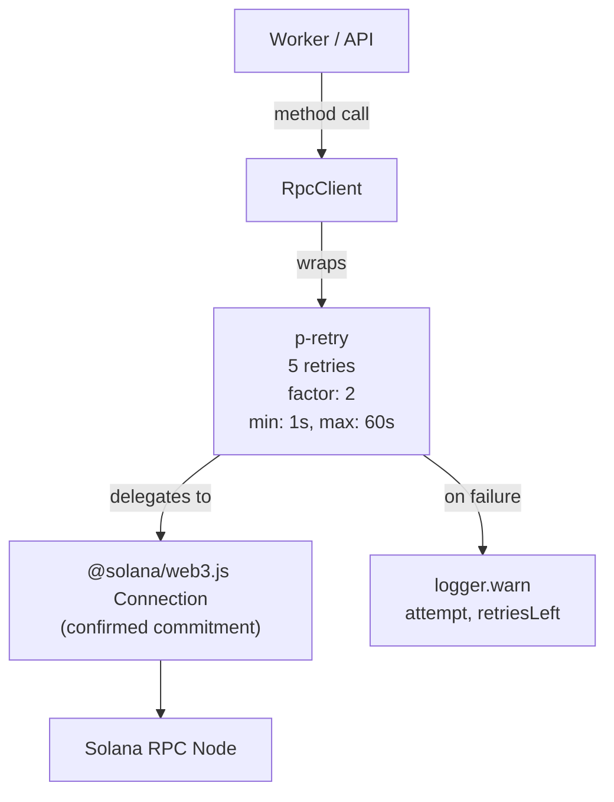

# Infrastructure

## Shared utility layer providing environment validation, retry-enabled RPC client, and structured logging across both worker and API processes.

### File Roles

| File | Purpose |
|------|---------|
| `lib/env.ts` | Zod-validated environment variables with defaults; exits process on validation failure |
| `lib/rpc.ts` | `RpcClient` interface wrapping `@solana/web3.js` `Connection` with `p-retry` (5 retries, exponential backoff) |
| `lib/logger.ts` | Pino logger with pretty-printing in dev, JSON in production |

### Environment Variables

| Variable | Type | Default | Required | Notes |
|----------|------|---------|----------|-------|
| `DATABASE_URL` | string | -- | Yes | Neon Postgres connection string |
| `RPC_URL` | string | `https://api.devnet.solana.com` | No | Solana RPC endpoint |
| `PROGRAM_ID` | string | -- | Yes | Helix Staking program address to index |
| `PORT` | number | `3001` | No | API server listen port |
| `POLL_INTERVAL_MS` | number | `5000` | No | Worker polling interval in milliseconds |
| `LOG_LEVEL` | enum | `info` | No | `debug`, `info`, `warn`, `error` |
| `FRONTEND_URL` | string | `http://localhost:3000` | No | CORS origin for the API |

### RPC Client

The `RpcClient` interface exposes three methods:

| Method | Purpose | Used By |
|--------|---------|---------|
| `getSignaturesForAddress(address, options)` | Fetch transaction signatures for the program | `worker/poller.ts` |
| `getParsedTransaction(signature, commitment)` | Fetch full parsed transaction with logs | `worker/decoder.ts` |
| `getSlot(commitment)` | Get current chain slot number | `api/routes/health.ts` |

All three wrap the underlying `Connection` method in `p-retry` with identical retry options:
- **5 retries** with exponential backoff (factor 2)
- **Min timeout**: 1 second
- **Max timeout**: 60 seconds
- Each failed attempt logs a warning with attempt number and retries remaining

The `connection` property is also exposed directly on the client for any direct access needs, though it is not currently used outside the wrapper methods.

### Logger Configuration

| Environment | Behavior |
|-------------|----------|
| `NODE_ENV !== 'production'` | `pino-pretty` transport with colorized output, human-readable timestamps, `pid` and `hostname` suppressed |
| `NODE_ENV === 'production'` | Raw JSON output (default Pino behavior), structured for log aggregation |

The log level is set from `process.env.LOG_LEVEL` directly (not through the Zod-validated `env` object), defaulting to `'info'`. This means the logger initializes before environment validation runs.

### Notable Gotchas

- **`env.ts` calls `process.exit(1)` on validation failure**: This hard-exits the process. In test environments, importing any module that transitively imports `env.ts` will crash the test runner if the required env vars are not set. The `db/client.ts` Proxy pattern was specifically designed to work around this for the database layer.
- **Logger level set before env validation**: `lib/logger.ts` reads `process.env.LOG_LEVEL` at module load time, independently of `lib/env.ts`. If `env.ts` has not been imported yet, the Zod default (`'info'`) does not apply -- but since the logger also defaults to `'info'`, this is practically a non-issue.
- **RPC client is created per-process**: The worker creates one in `worker/index.ts`, and the health route creates another in `api/routes/health.ts`. These are separate `Connection` instances with independent WebSocket subscriptions (if any). There is no shared singleton.
- **No request timeout on RPC calls**: The retry wrapper handles transient failures but does not enforce a per-request timeout. A hung RPC node could block the worker indefinitely (the retry `maxTimeout` only applies between retries, not to individual request duration).
- **Default RPC URL is devnet**: If `RPC_URL` is not set, the indexer silently connects to devnet. This is safe for development but could cause confusion if deployed without the variable.

[[indexer-service.md]]
