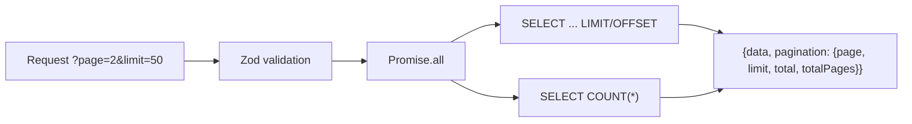

# REST API

## Fastify 5.2 server exposing 10 read-only endpoints for protocol analytics, stake history, claim data, and health checks.

The API is a separate process from the worker (`api/index.ts`). It connects to the same Neon Postgres database and serves pre-built analytical queries to the Next.js frontend.

### File Roles

| File | Purpose |
|------|---------|
| `api/index.ts` | Fastify setup, CORS config (locked to `FRONTEND_URL`), route registration, global error handler, graceful shutdown |
| `api/routes/health.ts` | `/health` -- DB ping + indexer lag detection (slot delta > 1000 = degraded) |
| `api/routes/stats.ts` | `/api/stats`, `/api/stats/history`, `/api/stats/distribution/stakes` -- protocol-wide aggregates |
| `api/routes/distributions.ts` | `/api/distributions`, `/api/distributions/chart` -- inflation distribution history |
| `api/routes/stakes.ts` | `/api/stakes`, `/api/unstakes` -- paginated stake/unstake events with optional user filter |
| `api/routes/claims.ts` | `/api/claims/tokens`, `/api/claims/rewards`, `/api/claims/bpd` -- claim event history |
| `api/routes/leaderboard.ts` | `/api/leaderboard` -- top stakers by active t-shares, total staked, or stake count |
| `api/routes/whale-activity.ts` | `/api/whale-activity` -- large stake/unstake movements above a threshold |

### Endpoint Reference

| Method | Path | Query Params | Description |
|--------|------|-------------|-------------|
| GET | `/health` | -- | DB connectivity + slot lag check (503 if lag > 1000 slots) |
| GET | `/api/stats` | -- | Parallel count queries across 5 tables + latest distribution |
| GET | `/api/stats/history` | `limit` (default 365) | Historical share rate from inflation events |
| GET | `/api/stats/distribution/stakes` | -- | Stake duration bucketing (< 30d, 30-90d, ... > 2y) |
| GET | `/api/distributions` | `page`, `limit` | Paginated inflation events (newest first) |
| GET | `/api/distributions/chart` | -- | All inflation events (oldest first, for charting) |
| GET | `/api/stakes` | `page`, `limit`, `user` | Paginated stake creation events |
| GET | `/api/unstakes` | `page`, `limit`, `user` | Paginated stake ended events |
| GET | `/api/claims/tokens` | `page`, `limit`, `claimer` | Token claim events with optional claimer filter |
| GET | `/api/claims/rewards` | `page`, `limit`, `user` | Reward claim events with optional user filter |
| GET | `/api/claims/bpd` | `page`, `limit` | Big Pay Day distribution events (global) |
| GET | `/api/leaderboard` | `limit`, `sort`, `user` | Active staker rankings (sort: t_shares / total_staked / stake_count) |
| GET | `/api/whale-activity` | `limit`, `minAmount` | Large movements (default threshold: 100 HELIX = 100000000000 raw) |

### Pagination Pattern

Most paginated endpoints follow this structure:

Validation uses Zod schemas inline (`z.coerce.number().int().positive().max(200).default(50)`). All pagination endpoints run the data query and count query in parallel via `Promise.all`.

### Leaderboard Query (Raw SQL)

The leaderboard endpoint uses a raw SQL CTE because it needs a `LEFT JOIN` to identify **active** stakes (created but not ended), which is not trivially expressed in Drizzle's query builder:

1. **`active_stakes` CTE**: Joins `stake_created_events` LEFT JOIN `stake_ended_events` on `(user, stake_id)`, filters where `se.id IS NULL`.
2. **`ranked` CTE**: Applies `RANK() OVER (ORDER BY ...)` with dynamic sort column via `sql.raw()`.
3. Final SELECT includes the user's own rank if `?user=` is provided, regardless of position.

### Notable Gotchas

- **CORS origin is a single string** (`env.FRONTEND_URL`), not an array. Multi-origin support (e.g., staging + production) would require changes.
- **No rate limiting or authentication**: All endpoints are publicly accessible. The frontend URL CORS restriction is trivially bypassed.
- **`sql.raw(sortColumn)` in leaderboard**: The sort column is validated via Zod enum (`t_shares | total_staked | stake_count`), so SQL injection is prevented. But the pattern is fragile -- adding a sort option without updating the Zod enum could introduce risk.
- **`/api/distributions/chart` fetches ALL rows**: No pagination or limit. As the protocol runs longer, this response will grow unbounded.
- **Whale activity default threshold**: `minAmount` defaults to `100000000000` (100 HELIX at 9 decimals). This is a string comparison cast to `::numeric` in SQL, which works correctly but is non-obvious.
- **Fastify logger disabled**: `Fastify({ logger: false })` -- all logging goes through the shared Pino instance from `lib/logger.ts` instead.

[[indexer-service.md]]
