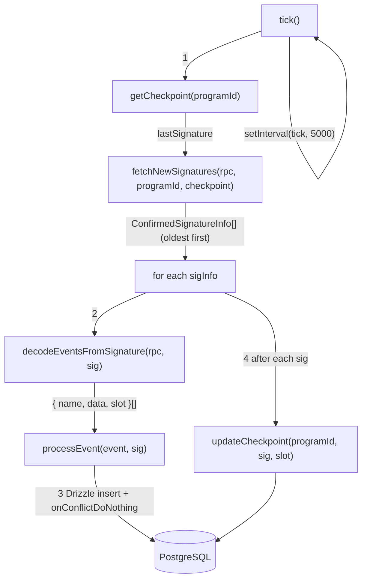

# Worker Pipeline

## Polling loop that fetches on-chain transactions, decodes Anchor events, and writes them to Postgres with per-signature checkpointing.

The worker is a standalone Node.js process (`worker/index.ts`) that runs a `setInterval`-based polling loop. Each tick flows through four stages: checkpoint lookup, signature fetching, event decoding, and database insertion.

### File Roles

| File | Purpose |
|------|---------|
| `worker/index.ts` | Orchestrator -- poll timer, `tick()` loop, graceful shutdown (SIGTERM/SIGINT with 30s drain) |
| `worker/poller.ts` | Calls `getSignaturesForAddress` with `until` cursor from checkpoint, returns results in chronological (oldest-first) order |
| `worker/decoder.ts` | Fetches the parsed transaction via RPC, pipes `logMessages` through Anchor's `EventParser` |
| `worker/processor.ts` | Giant `switch(name)` that routes each decoded event to the correct Drizzle table insert |
| `worker/checkpoint.ts` | Upsert of `(programId, lastSignature, lastSlot, processedCount)` for crash recovery |

### Data Flow

### Processing Model

- **Sequential per-signature**: Signatures are processed one at a time in chronological order. This guarantees checkpoint consistency -- if the process crashes, it resumes from the last successfully checkpointed signature.
- **Parallel within-tick is avoided**: The `isProcessing` flag prevents overlapping ticks if a batch takes longer than `POLL_INTERVAL_MS` (default 5s).
- **Error isolation**: A failure on one signature logs an error and continues to the next. The failed signature's events are lost (no retry queue), but the checkpoint advances only on success.

### Graceful Shutdown

1. Sets `isShuttingDown = true`, clears the interval timer.
2. Busy-waits (250ms polls) up to 30 seconds for `isProcessing` to clear.
3. Calls `closePool()` on the DB connection, then `process.exit(0)`.
4. If the 30s timeout fires while still processing, exits with code 1.

### Notable Gotchas

- **No retry queue**: If `decodeEventsFromSignature` returns `[]` due to a pruned/unavailable transaction, those events are permanently missed. The checkpoint still advances past it.
- **1000-signature limit per poll**: `getSignaturesForAddress` caps at 1000. If more than 1000 txns accumulate between ticks, only the most recent 1000 are fetched (they are reversed to oldest-first). Older ones are never picked up because the next tick uses `until` = the oldest one just fetched. This is a catch-up gap risk.
- **No reorg handling**: If a confirmed slot is reorged, the indexed events remain in the DB. The checkpoint tracks slot numbers but does not compare or roll back.
- **`toStr` / `toNum` helpers in processor**: These silently coerce BN objects, PublicKeys, and byte arrays. If Anchor SDK changes its output types, these helpers may silently produce incorrect values.
- **Inflation gap detection**: `detectInflationGap` in `processor.ts` warns if there is a day gap in `InflationDistributed` events that exceeds `daysElapsed`, but takes no corrective action.

[[indexer-service.md]]
