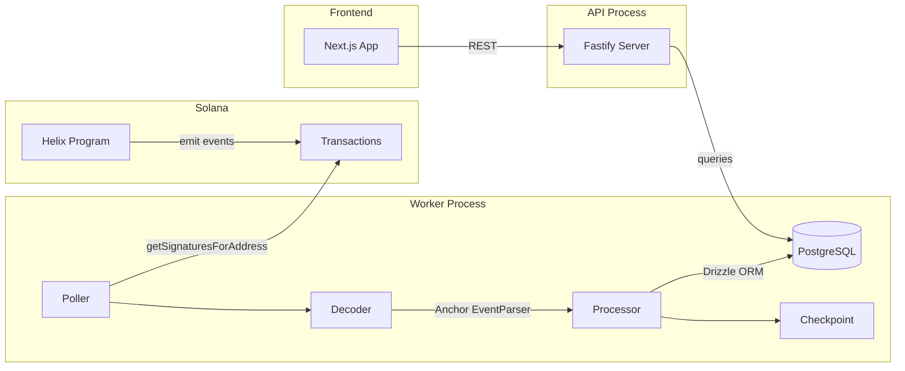

# Indexer Service

## Event polling + REST API at `services/indexer/`

Lightweight dual-process Node.js service that monitors the Helix program for on-chain events, stores them in PostgreSQL, and serves analytics via REST API.

### Architecture

### 12 Event Tables
| Table | Key Indexes | Purpose |
|-------|-------------|---------|
| `protocol_initialized_events` | - | Protocol initialization (singleton) |
| `stake_created_events` | user, user+slot | Stake creation records |
| `stake_ended_events` | user | Unstake records with penalties |
| `rewards_claimed_events` | user | Reward claim history |
| `inflation_distributed_events` | day | Daily distribution log |
| `admin_minted_events` | - | Admin mint audit trail |
| `claim_period_started_events` | - | Claim period lifecycle |
| `tokens_claimed_events` | claimer | Free claim records |
| `vested_tokens_withdrawn_events` | claimer | Vesting withdrawals |
| `claim_period_ended_events` | - | Period completion |
| `big_pay_day_distributed_events` | - | BPD distribution records |
| `bpd_aborted_events` | - | BPD abort audit trail |
| `checkpoints` | program | Cursor for crash recovery |

### REST API Endpoints
| Route | Purpose |
|-------|---------|
| `GET /health` | DB + indexer lag status |
| `GET /api/stats` | Protocol-wide aggregates |
| `GET /api/stats/history` | Historical share rate |
| `GET /api/stakes?user=` | Paginated stake events |
| `GET /api/distributions/chart` | Inflation chart data |
| `GET /api/claims/tokens?claimer=` | Claim events |
| `GET /api/leaderboard` | Top stakers |
| `GET /api/whale-activity` | Large stake events |

### Tech Stack
- **Runtime:** Node.js + TypeScript (tsx)
- **API:** Fastify 5.2
- **Database:** Neon Postgres (serverless) + Drizzle ORM
- **RPC:** `@solana/web3.js` with p-retry (5 retries, exponential backoff)
- **Logging:** Pino

### Notable Gotchas & Tech Debt
- **Polling-based** (5s interval) - not real-time WebSocket subscription
- No reorg handling beyond slot tracking in checkpoint
- All u64/u128 values stored as `text` (avoids JS BigInt precision loss)
- Single program ID per checkpoint (no multi-program support)
- `onConflictDoNothing()` for idempotent inserts (signature unique constraint)

### Sub-Components
- [[idx-worker-pipeline.md]] -- Polling loop, signature processing, checkpoint management
- [[idx-database-schema.md]] -- 13 Drizzle tables (12 events + checkpoint), Neon connection
- [[idx-rest-api.md]] -- 10 Fastify endpoints for analytics, stakes, claims, leaderboard
- [[idx-event-types-and-decoding.md]] -- TypeScript interfaces and Anchor log parsing
- [[idx-infrastructure.md]] -- Env validation, retry-enabled RPC client, Pino logger

### Reference Documentation
- [[idx-environment-reference.md]] -- Complete env vars with defaults and validation
- [[idx-api-reference.md]] -- Detailed endpoint docs with request/response examples
- [[idx-operations-runbook.md]] -- Troubleshooting, deployment, and monitoring guide
- [[idx-validation-report.md]] -- Code validation results and enhancement recommendations

[[run_me.md]]
