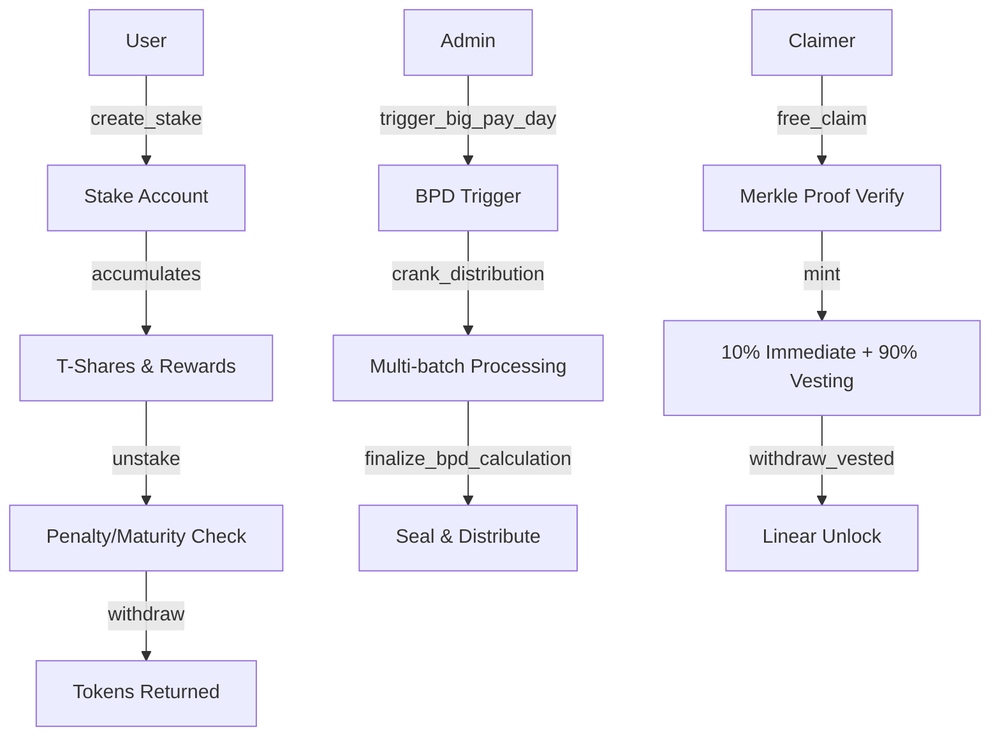
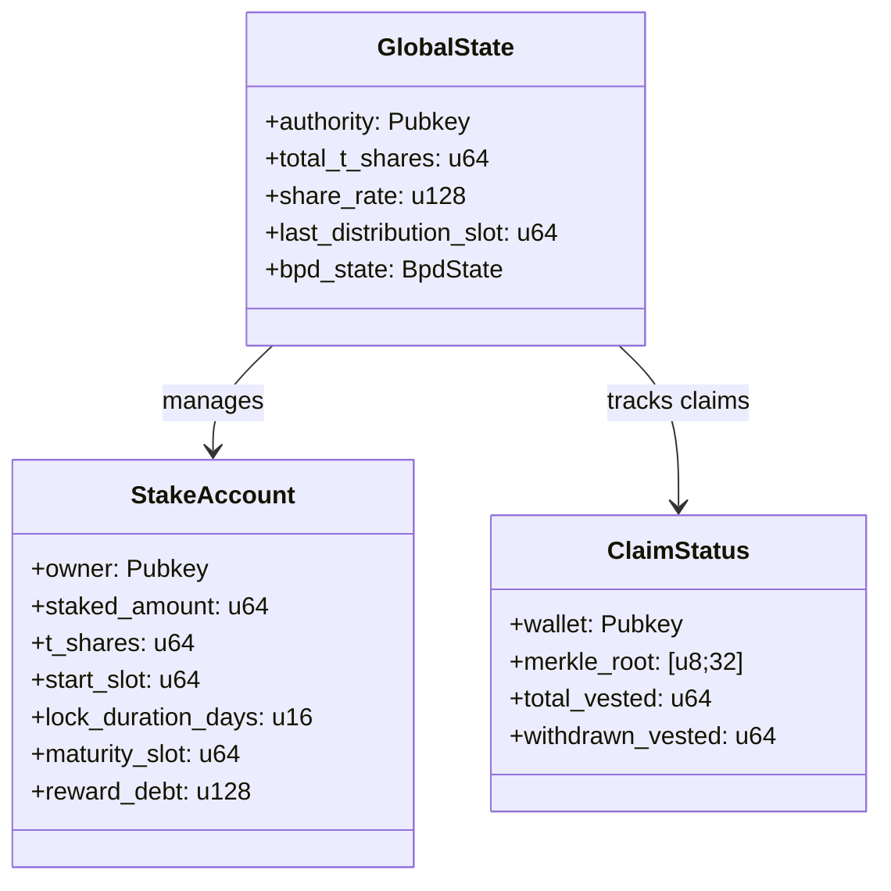

# Module 1: On-Chain Program (Solana Smart Contract)

**Parent**: [[run_me_context_1770768781075.md]]

## Purpose

Anchor-based Solana program implementing T-Share staking with inflation distribution, penalties, Big Pay Day (BPD), and Merkle-based free claims. The program manages global state, individual stakes, and complex tokenomics including vesting schedules and bonus calculations.

## Architecture Flow

## Core Instructions

| Instruction | Purpose | Critical Constraints |
|------------|---------|---------------------|
| `create_stake` | Lock tokens, mint T-Shares | Must be > 0 tokens, duration 1-3653 days |
| `unstake` | End stake, apply penalty/rewards | Time-based penalty schedule |
| `trigger_big_pay_day` | Start BPD cycle | Only if not already in BPD |
| `crank_distribution` | Batch process stakes for BPD | Max 20 stakes/call, idempotent |
| `finalize_bpd_calculation` | Seal BPD, mint bonuses | Admin-only, requires all batches done |
| `free_claim` | Airdrop via Merkle proof | Ed25519 signature + proof verification |
| `withdraw_vested` | Unlock vested tokens | Linear over 365 days |
| `claim_rewards` | Claim staking rewards | Based on share-days accumulated |

## State Accounts

## Notable Gotchas

### 🔴 CRITICAL ISSUES (from audit)

1. **CRIT-NEW-1: Permissionless finalize_bpd_calculation**
   - **Issue**: Attacker can control which stakes are included by gaming batch detection
   - **Status**: FIXED with admin-only constraint + seal instruction
   - **Location**: `finalize_bpd_calculation.rs`

2. **Abort BPD leaves ghost markers**
   - **Issue**: `abort_bpd` doesn't reset per-stake `bpd_finalize_period_id` fields
   - **Impact**: Stakes marked during aborted BPD are skipped in next cycle with same ID
   - **Severity**: HIGH
   - **Workaround**: Use different claim_period_id after abort

3. **Unchecked arithmetic in legacy code**
   - **Issue**: Some early instructions lack overflow protection
   - **Status**: Phase 3.3 added checked math wrappers
   - **Files**: `create_stake.rs`, `unstake.rs`

### ⚠️ Design Constraints

- **Share rate monotonicity**: `share_rate` only increases, never decreases (early stakers get more T-Shares)
- **No delegation**: Stake accounts are PDA-owned, cannot be reassigned
- **Immutable stake parameters**: Duration/amount cannot be modified after creation
- **BPD idempotency**: Stakes can only receive bonus once per cycle via period_id tracking

### 💡 Implementation Details

- **PDA Seeds**: `GLOBAL_STATE_SEED`, `STAKE_SEED = [b"stake", wallet, stake_index]`
- **Precision**: 8 decimals for tokens, u128 for share_rate to prevent precision loss
- **Time units**: Slots (not timestamps), configurable `slots_per_day` for testnet flexibility
- **Merkle proofs**: Keccak256 hashing with sorted leaf pairs

## Key Files

| File | Purpose |
|------|---------|
| `programs/helix-staking/src/lib.rs` | Program entry point, instruction routing |
| `instructions/create_stake.rs` | Stake creation with LPB/BPB bonuses |
| `instructions/unstake.rs` | Maturity check + penalty calculation |
| `instructions/trigger_big_pay_day.rs` | BPD initialization |
| `instructions/crank_distribution.rs` | Batch stake processing for BPD |
| `instructions/finalize_bpd_calculation.rs` | Admin-only BPD seal |
| `instructions/free_claim.rs` | Merkle airdrop with speed bonus |
| `instructions/math.rs` | Checked arithmetic wrappers |
| `state/global_state.rs` | Global state account definition |
| `state/stake_account.rs` | Individual stake account |
| `constants.rs` | Tokenomics constants (LPB, BPB, penalties) |

## Tech Debt

1. **Admin instructions on mainnet**: `admin_set_slots_per_day`, `admin_set_claim_end_slot` should be removed or multi-sig gated
2. **No upgrade path**: Stake account schema changes require migration instruction
3. **Gas optimization**: BPD crank could batch more efficiently with `remaining_accounts` iterator
4. **Event emissions**: Some instructions lack events for indexer tracking

## Security Mitigations

✅ **Implemented**:
- Signer checks on all mutable accounts
- PDA derivation validation
- Overflow protection via checked math
- Reentrancy guards (Anchor's account constraints)
- Admin-only finalize with seal instruction

⚠️ **Residual Risks**:
- Authority key compromise (single-sig, no timelock)
- Slot manipulation by validators (low impact, BPD uses block hashes)
- Economic attacks (whale can inflate share_rate by staking/unstaking)

[[/Users/annon/projects/solhex/voicetree-9-2/module-2-frontend-dashboard.md]]
[[/Users/annon/projects/solhex/voicetree-9-2/module-4-tokenomics-engine.md]]
[[/Users/annon/projects/solhex/voicetree-9-2/module-3-indexer-service.md]]
[[/Users/annon/projects/solhex/voicetree-9-2/module-6-bpd-distribution-system.md]]
[[/Users/annon/projects/solhex/voicetree-9-2/module-5-testing-infrastructure.md]]
[[/Users/annon/projects/solhex/voicetree-9-2/module-7-free-claim-system.md]]
[[/Users/annon/projects/solhex/voicetree-9-2/codebase-architecture-map.md]]