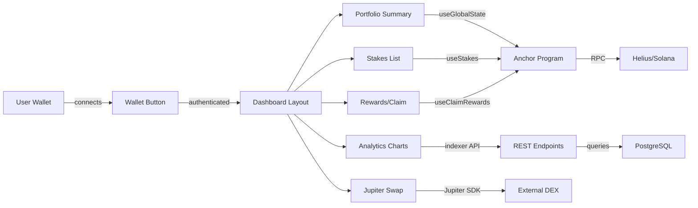
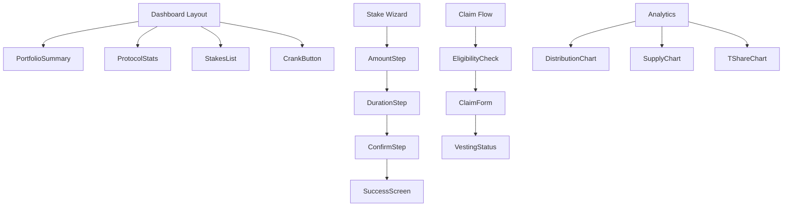

# Module 2: Frontend Dashboard (Next.js Web App)

**Parent**: [[run_me_context_1770768781075.md]]

## Purpose

Next.js 14 App Router dashboard for Helix Staking with wallet integration, stake management, rewards claiming, analytics charts, and Jupiter DEX swap widget. Uses TanStack Query for state management and Solana wallet-adapter for transactions.

## Architecture Flow



## Page Structure

```mermaid
graph TD
    A[/ - Public Landing] --> B[/how-it-works]
    A --> C[/tokenomics]
    
    D[/dashboard - Auth Required] --> E[/dashboard/stake]
    D --> F[/dashboard/stakes/stakeId]
    D --> G[/dashboard/claim]
    D --> H[/dashboard/rewards]
    D --> I[/dashboard/analytics]
    D --> J[/dashboard/swap]
    D --> K[/dashboard/leaderboard]
    D --> L[/dashboard/whale-tracker]
```

## Core Hooks (Solana Integration)

| Hook | Purpose | Returns |
|------|---------|---------|
| `useProgram` | Initialize Anchor program | `{ program, connection }` |
| `useGlobalState` | Fetch on-chain global state | `{ data: GlobalState, isLoading }` |
| `useStakes` | Fetch all user stakes | `{ stakes: StakeAccount[], isLoading }` |
| `useCreateStake` | Create new stake transaction | `{ mutate, isPending, isSuccess }` |
| `useUnstake` | End stake transaction | `{ mutate, isPending }` |
| `useClaimRewards` | Claim accumulated rewards | `{ mutate, isPending }` |
| `useFreeClaim` | Merkle airdrop claim | `{ mutate, isPending }` |
| `useWithdrawVested` | Unlock vested tokens | `{ mutate, isPending }` |
| `useCrankDistribution` | Trigger BPD crank (admin) | `{ mutate }` |

## Component Hierarchy



## Notable Gotchas

### 🔴 SSR & Build Issues

1. **RPC endpoint returns localhost during SSR**
   - **Issue**: `getRpcEndpoint()` returns placeholder `https://localhost/api/rpc` during build
   - **Impact**: No server-side Solana calls possible (wallet-adapter is client-only)
   - **Workaround**: All Solana interactions are client-side only

2. **Wallet connection race condition**
   - **Issue**: `useProgram` hook can execute before wallet connects
   - **Mitigation**: All hooks return `isLoading` state, components handle `!program` gracefully

3. **Legacy peer deps conflict**
   - **Issue**: Solana wallet-adapter needs `@solana/web3.js` v2, Anchor 0.31 needs v1.x
   - **Fix**: Install with `npm install --legacy-peer-deps`

### ⚠️ Data Fetching Patterns

- **Dashboard uses triple loading**: `PortfolioSummary` waits for 3 independent queries (stakes, balance, globalState)
- **Marketing pages use ISR**: Landing page and tokenomics are async server components with revalidation
- **Indexer URL is server-only**: `INDEXER_URL` env var (not `NEXT_PUBLIC_`) for SSR data fetching

### 💡 Implementation Details

- **BN.js everywhere**: All amounts use `bn.js` BN type, not native BigInt
- **String serialization**: `.toString()` needed when crossing Anchor boundaries
- **RPC proxy**: `/api/rpc/route.ts` forwards requests to Helius to hide API key
- **Test wallet setup**: `setup-e2e-wallet.ts` airdrops SOL for local testing

## Key Files

| File | Purpose |
|------|---------|
| `app/layout.tsx` | Root layout with wallet provider |
| `app/providers.tsx` | TanStack Query + wallet-adapter setup |
| `app/dashboard/layout.tsx` | Protected route wrapper |
| `lib/hooks/useCreateStake.ts` | Stake creation mutation |
| `lib/hooks/useStakes.ts` | Fetch user stakes via PDA derivation |
| `lib/solana/program.ts` | Anchor program initialization |
| `lib/solana/pdas.ts` | PDA derivation helpers |
| `lib/solana/math.ts` | Frontend mirrors of on-chain math |
| `lib/utils/format.ts` | Token/date formatting utilities |
| `components/stake/stake-wizard/` | Multi-step stake creation flow |
| `components/swap/JupiterWidget.tsx` | Embedded Jupiter Terminal |

## Environment Variables

| Variable | Purpose | Example |
|----------|---------|---------|
| `NEXT_PUBLIC_SOLANA_NETWORK` | Cluster (devnet/mainnet) | `devnet` |
| `NEXT_PUBLIC_RPC_ENDPOINT` | Solana RPC URL | `http://localhost:8899` |
| `HELIUS_RPC_URL` | Production RPC (server-side) | `https://mainnet.helius-rpc.com/?api-key=...` |
| `INDEXER_URL` | Backend API URL | `http://localhost:3001` |
| `NEXT_PUBLIC_PROGRAM_ID` | Deployed program address | `Helix...` |

## Tech Debt

1. **No error boundary**: App crashes on uncaught React errors (need global error boundary)
2. **No retry logic**: Failed transactions don't auto-retry (TanStack Query supports this)
3. **Hardcoded constants**: Tokenomics constants duplicated from on-chain (should be fetched)
4. **No websocket subscriptions**: Polling-based updates (could use `onAccountChange`)
5. **Chart data from indexer**: Analytics rely on indexer availability (fallback to on-chain?)

## Testing

- **E2E Tests**: Playwright (`app/web/e2e/`) covering dashboard navigation, stake creation, claim flow
- **Global setup**: Spins up local validator, airdrops SOL to test wallet
- **Fixtures**: `e2e/fixtures.ts` provides authenticated page context
- **CI**: GitHub Actions workflow runs E2E suite on PR

## Performance Notes

- **ISR revalidation**: Marketing pages rebuild every 60s
- **Infinite scroll**: Stakes list NOT paginated (could be issue with 1000+ stakes)
- **Chart rendering**: Recharts can be slow with large datasets (consider virtualization)

[[/Users/annon/projects/solhex/voicetree-9-2/module-1-onchain-program.md]]
[[/Users/annon/projects/solhex/voicetree-9-2/module-4-tokenomics-engine.md]]
[[/Users/annon/projects/solhex/voicetree-9-2/module-3-indexer-service.md]]
[[/Users/annon/projects/solhex/voicetree-9-2/module-6-bpd-distribution-system.md]]
[[/Users/annon/projects/solhex/voicetree-9-2/module-5-testing-infrastructure.md]]
[[/Users/annon/projects/solhex/voicetree-9-2/module-7-free-claim-system.md]]
[[/Users/annon/projects/solhex/voicetree-9-2/codebase-architecture-map.md]]