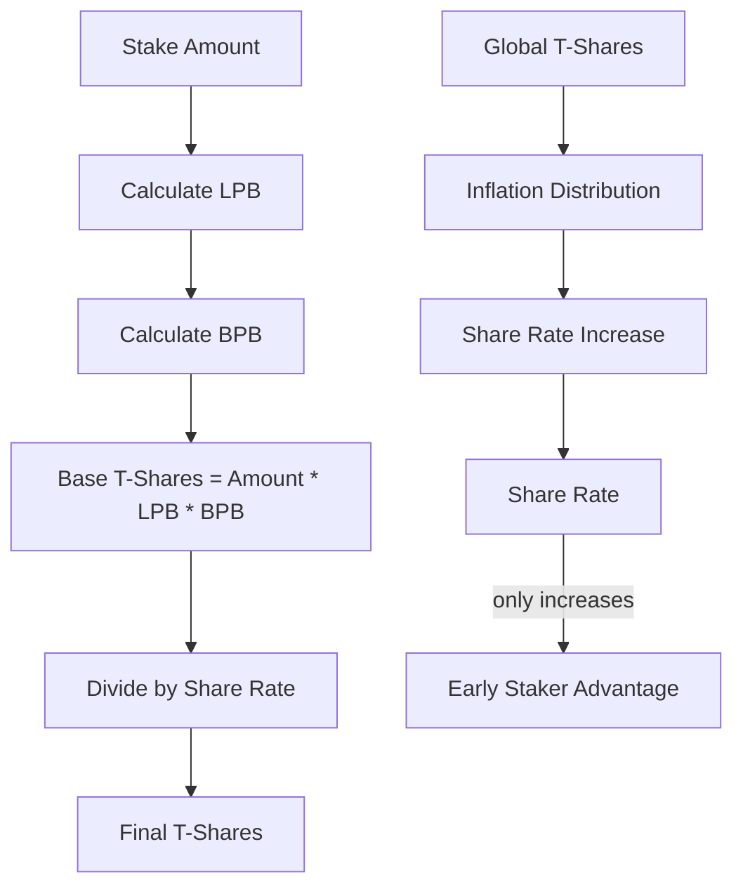
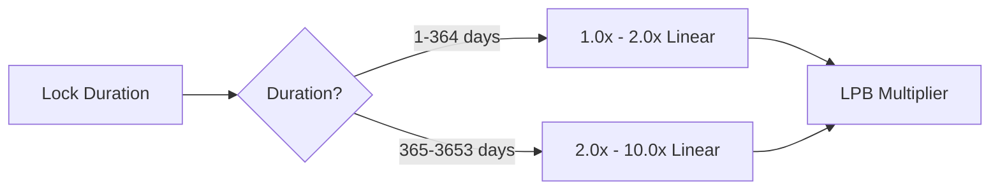
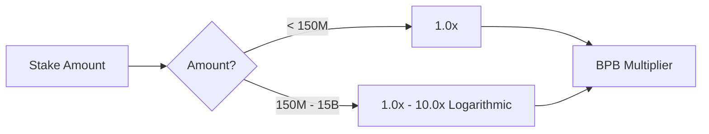
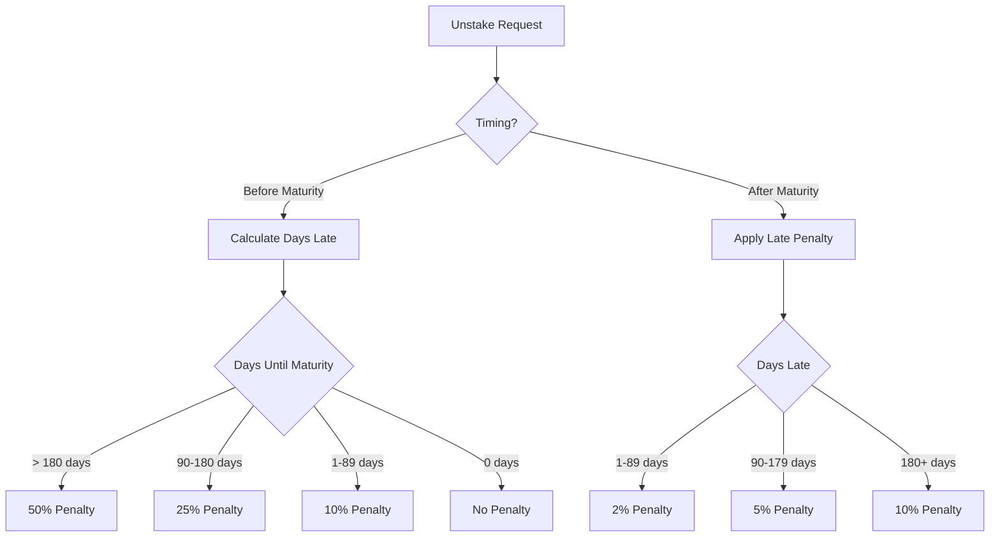
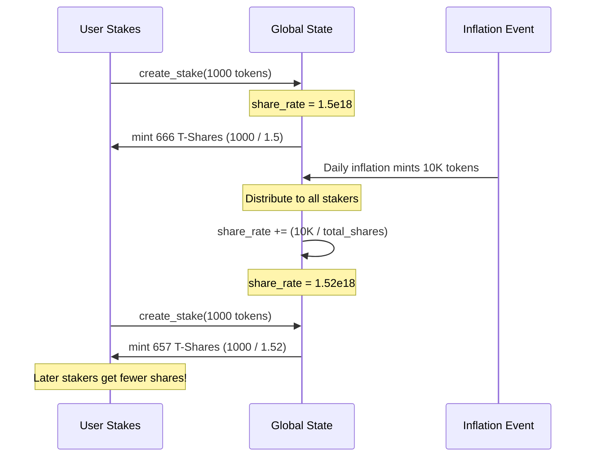
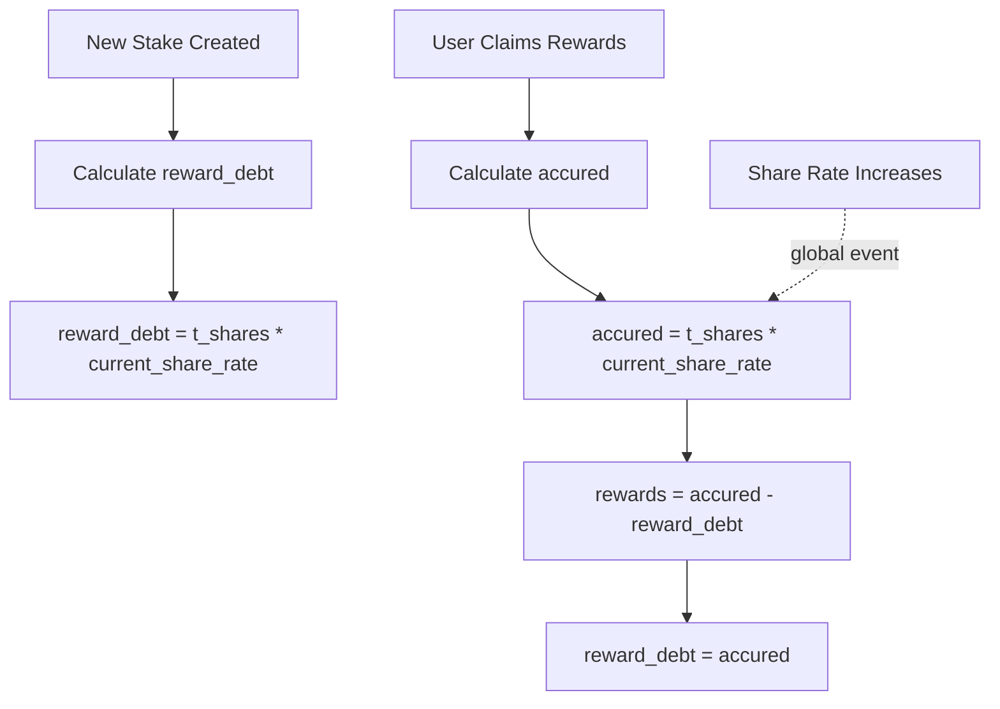
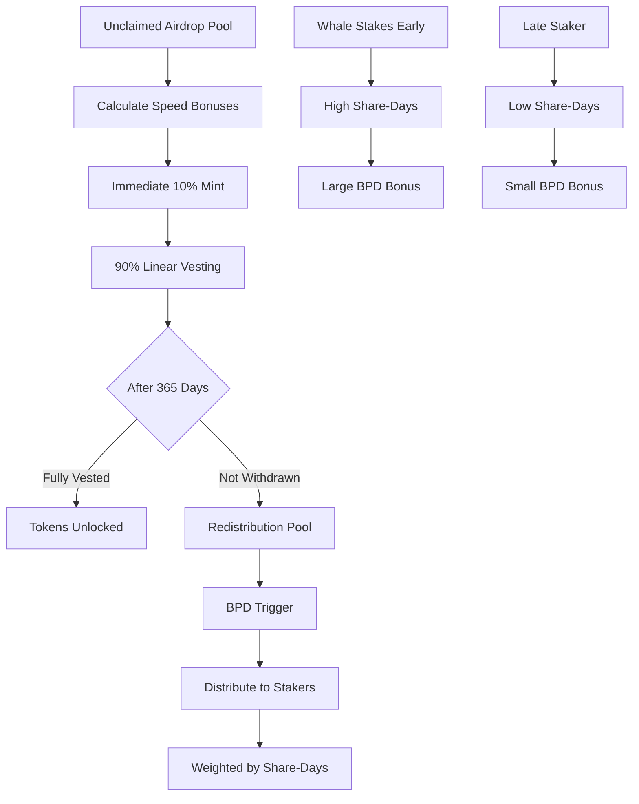

# Module 4: Tokenomics Engine (Mathematical Model)

**Parent**: [[run_me_context_1770768781075.md]]

## Purpose

Core mathematical model implementing T-Share mechanics, inflation distribution, penalty schedules, and bonus calculations. This is the economic foundation of the staking system, mirrored between on-chain Rust and frontend TypeScript.

## T-Share Calculation Flow



## Bonus Systems

### Longer Pays Better (LPB)



**Formula**:
- **Days 1-364**: `LPB = 1.0 + (days / 365)`
- **Days 365-3653**: `LPB = 2.0 + ((days - 365) / 3288 * 8.0)`

**Constants**:
- `LPB_THRESHOLD_DAYS = 365`
- `MIN_LPB = 1.0` (1 day)
- `MID_LPB = 2.0` (365 days)
- `MAX_LPB = 10.0` (3653 days / 10 years)

### Bigger Pays Better (BPB)



**Formula**:
- **Below threshold**: `BPB = 1.0`
- **Above threshold**: `BPB = 1.0 + log10(amount / 150M) * (9 / log10(100))`

**Constants**:
- `BPB_THRESHOLD = 150_000_000 * 10^8` (150M tokens)
- `BPB_MAX_AMOUNT = 15_000_000_000 * 10^8` (15B tokens)
- `MAX_BPB = 10.0`

## Penalty Schedule



**Early Unstake Penalties**:
| Days Before Maturity | Penalty |
|---------------------|---------|
| 181+ | 50% |
| 90-180 | 25% |
| 1-89 | 10% |
| 0 (on time) | 0% |

**Late Unstake Penalties**:
| Days After Maturity | Penalty |
|--------------------|---------|
| 1-89 | 2% |
| 90-179 | 5% |
| 180+ | 10% |

**Constants**:
- `EARLY_PENALTY_GRACE_DAYS = 90`
- `EARLY_PENALTY_MID_DAYS = 180`
- `LATE_PENALTY_GRACE_DAYS = 90`
- `LATE_PENALTY_MID_DAYS = 180`

## Share Rate Dynamics



**Properties**:
- **Monotonic**: Share rate NEVER decreases
- **Precision**: u128 to avoid rounding errors over years
- **Initial value**: `1e18` (10^18)

**Inflation Distribution**:
```rust
share_rate_increase = daily_inflation / total_t_shares
new_share_rate = old_share_rate + share_rate_increase
```

## Reward Debt Mechanism



**Formula**:
```typescript
// On stake creation
reward_debt = t_shares * share_rate

// On reward claim
accured = t_shares * share_rate
claimable = accured - reward_debt
reward_debt = accured // Reset debt
```

## Big Pay Day (BPD) Economics



**Share-Days Calculation**:
```rust
share_days = t_shares * days_staked
total_share_days = sum(all stakes' share_days)
stake_portion = stake_share_days / total_share_days
bpd_bonus = total_pool * stake_portion
```

**Speed Bonus** (Free Claim):
- **Day 1-30**: 100% of base amount
- **Day 31-60**: 80%
- **Day 61-90**: 60%
- **After 90**: 40%

Linear decay formula:
```rust
days_elapsed = (current_slot - claim_start_slot) / slots_per_day
speed_bonus = max(0.4, 1.0 - (days_elapsed / 90 * 0.6))
```

## Constants Comparison (On-chain vs Frontend)

| Constant | On-chain (Rust) | Frontend (TypeScript) | Match? |
|----------|----------------|---------------------|--------|
| `LPB_THRESHOLD_DAYS` | `365` | `365` | ✅ |
| `MAX_LPB` | `10_00` (2 decimals) | `1000` (basis points) | ✅ |
| `BPB_THRESHOLD` | `150_000_000_00_000_000` | `"15000000000000000"` | ✅ |
| `EARLY_PENALTY_GRACE_DAYS` | `90` | `90` | ✅ |
| `BASIS_POINTS` | `10_000` | `10000` | ✅ |

## Notable Gotchas

### 🔴 CRITICAL ISSUES

1. **Overflow in T-Share calculation**
   - **Issue**: Large amount * large LPB * large BPB can overflow u64
   - **Mitigation**: Phase 3.3 added checked_mul wrappers
   - **Status**: FIXED

2. **Share rate precision loss**
   - **Issue**: Using u64 for share_rate loses precision after billions of distributions
   - **Fix**: Upgraded to u128 in Phase 2.1
   - **Status**: FIXED

3. **Penalty redistribution amplification**
   - **Issue**: Penalties increase share_rate → benefits all stakers → creates "early unstake farming" attack
   - **Severity**: ECONOMIC RISK
   - **Status**: DOCUMENTED (not exploitable at current scale)

### ⚠️ Economic Exploits

1. **Whale manipulation**:
   - Large staker can inflate share_rate by staking/unstaking with penalties
   - Attack cost > benefit at current token supply
   - Monitoring recommended

2. **BPD gaming**:
   - Staking right before BPD trigger captures share-days without long commitment
   - Mitigated by minimum stake duration checks

3. **Sybil attack on free claim**:
   - Multiple wallets claiming airdrop to maximize speed bonuses
   - Prevented by Merkle tree (admin controls eligible wallets)

### 💡 Implementation Details

- **Frontend math mirrors on-chain**: `lib/solana/math.ts` duplicates Rust logic
- **BN.js for precision**: JavaScript Number loses precision above 2^53
- **Rate calculations use u128**: Prevents overflow in long-term scenarios
- **Penalty goes to share_rate**: Creates deflationary pressure on circulating supply

## Key Files

| File | Purpose |
|------|---------|
| `programs/helix-staking/src/constants.rs` | On-chain tokenomics constants |
| `programs/helix-staking/src/instructions/math.rs` | Rust math helpers |
| `app/web/lib/solana/math.ts` | Frontend math mirror |
| `app/web/lib/solana/constants.ts` | Frontend constants |
| `programs/helix-staking/src/instructions/create_stake.rs` | LPB/BPB calculation |
| `programs/helix-staking/src/instructions/unstake.rs` | Penalty calculation |
| `programs/helix-staking/src/instructions/crank_distribution.rs` | BPD share-days |

## Testing Coverage

- **Unit tests**: `tests/bankrun/tests/bpd_math.test.ts` validates BPD calculations
- **Fuzz testing**: Random stake amounts/durations to detect overflows
- **Economic simulations**: Large-scale scenarios in `.planning/phases/08.1-game-theory-hardening/`

## Future Improvements

1. **Dynamic penalty schedule**: Adjust based on network activity
2. **Non-linear BPD distribution**: Weight recent share-days more heavily
3. **Share rate decay**: Slow decrease to encourage long-term holding
4. **Multi-token support**: Extend model to other SPL tokens

[[/Users/annon/projects/solhex/voicetree-9-2/module-1-onchain-program.md]]
[[/Users/annon/projects/solhex/voicetree-9-2/module-2-frontend-dashboard.md]]
[[/Users/annon/projects/solhex/voicetree-9-2/module-3-indexer-service.md]]
[[/Users/annon/projects/solhex/voicetree-9-2/module-6-bpd-distribution-system.md]]
[[/Users/annon/projects/solhex/voicetree-9-2/module-5-testing-infrastructure.md]]
[[/Users/annon/projects/solhex/voicetree-9-2/module-7-free-claim-system.md]]
[[/Users/annon/projects/solhex/voicetree-9-2/codebase-architecture-map.md]]