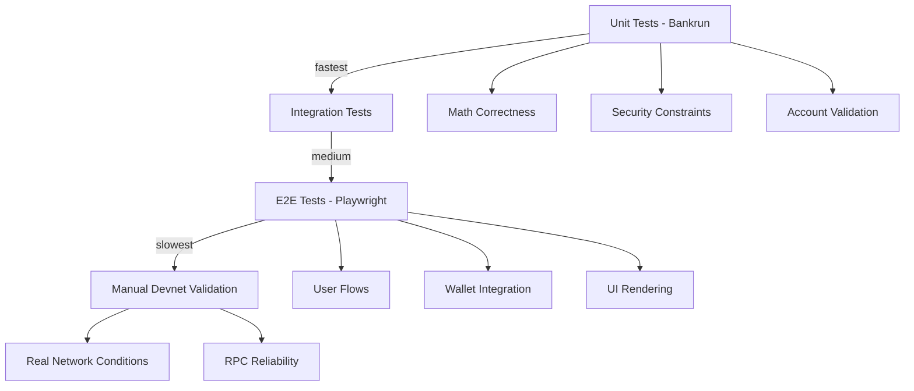
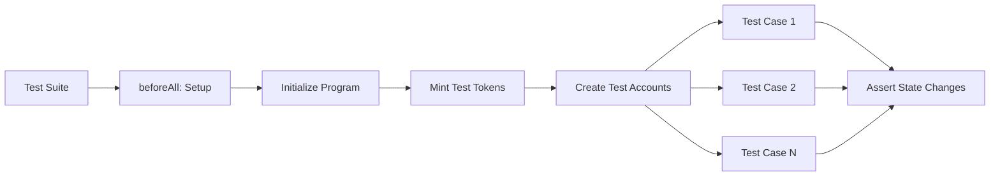
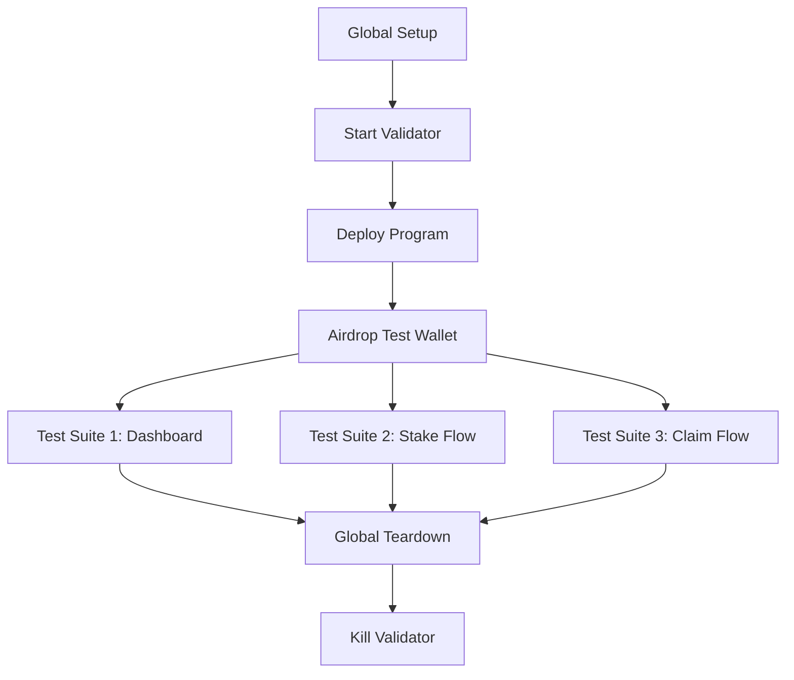
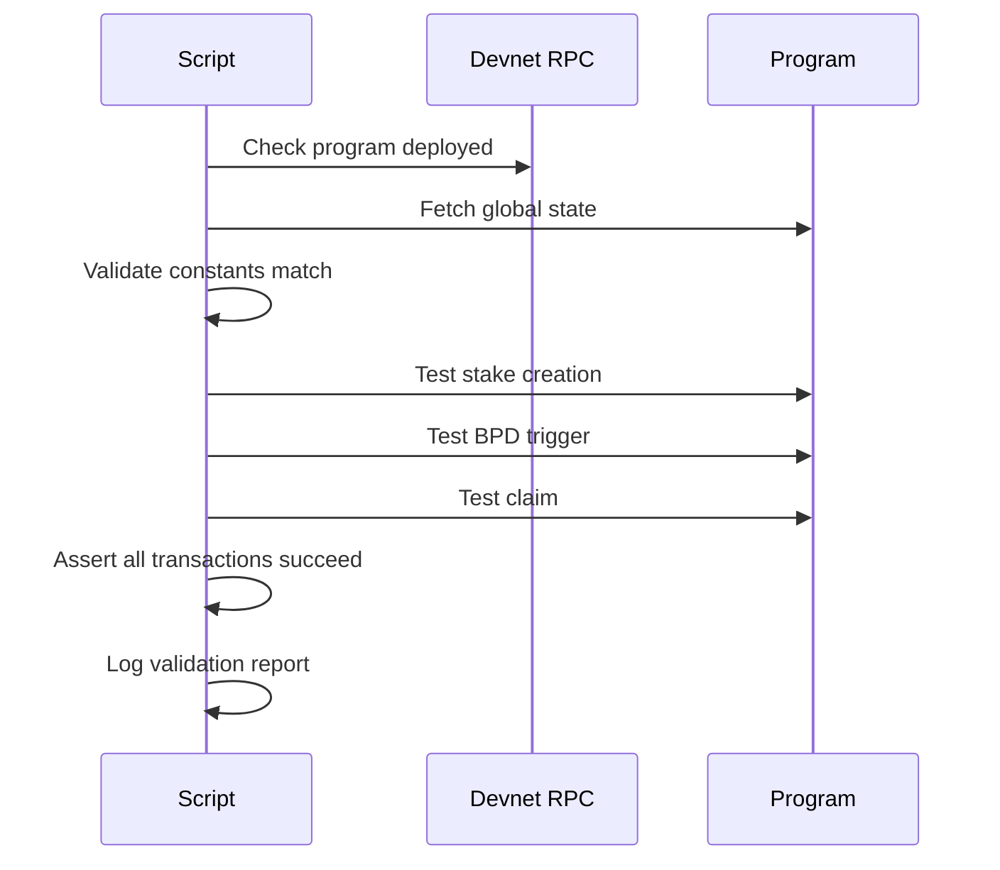

# Module 5: Testing Infrastructure

**Parent**: [[run_me_context_1770768781075.md]]

## Purpose

Multi-layered testing strategy using Bankrun (in-memory Solana) for unit tests, Playwright for E2E frontend tests, and manual validation scripts for devnet. Ensures correctness of tokenomics, security fixes, and user flows.

## Testing Pyramid



## Bankrun Test Structure



## Test Coverage by Phase

| Phase | Test File | Focus | Test Count |
|-------|-----------|-------|-----------|
| Core Staking | `createStake.test.ts` | Stake creation, LPB/BPB | 8 tests |
| Core Staking | `unstake.test.ts` | Penalty calculation, maturity | 6 tests |
| Core Staking | `claimRewards.test.ts` | Reward debt, inflation | 5 tests |
| Phase 3 (BPD) | `triggerBpd.test.ts` | BPD state transitions | 7 tests |
| Phase 3 (BPD) | `crankDistribution.test.ts` | Batch processing, idempotency | 9 tests |
| Phase 3 (Free Claim) | `freeClaim.test.ts` | Merkle proof, speed bonus | 8 tests |
| Phase 3 (Free Claim) | `withdrawVested.test.ts` | Linear vesting unlock | 4 tests |
| Phase 3.3 (Security) | `securityFixes.test.ts` | Overflow protection, constraints | 12 tests |
| Phase 8.1 (Audit) | `auditFixes.test.ts` | CRIT-NEW-1, admin controls | 6 tests |
| Admin | `admin_constraints.test.ts` | Authority checks | 5 tests |
| Math | `bpd_math.test.ts` | Share-days calculation | 4 tests |

**Total**: ~74 unit tests

## Bankrun Test Patterns

### Setup Pattern

```typescript
import { BankrunProvider } from 'anchor-bankrun';
import { startAnchor } from 'solana-bankrun';

let context: BanksTransactionContext;
let provider: BankrunProvider;
let program: Program<HelixStaking>;

beforeAll(async () => {
  context = await startAnchor("", [], []);
  provider = new BankrunProvider(context);
  program = new Program(IDL, provider);
  
  // Initialize program state
  await program.methods.initialize().rpc();
});
```

### Test Isolation

```typescript
describe("Stake Creation", () => {
  it("should create stake with correct T-Shares", async () => {
    const stakePda = findStakePDA(wallet, 0);
    
    await program.methods
      .createStake(new BN(1000), 365)
      .accounts({ stake: stakePda })
      .rpc();
    
    const stake = await program.account.stakeAccount.fetch(stakePda);
    expect(stake.tShares.toNumber()).toBe(expectedShares);
  });
});
```

### Time Manipulation

```typescript
// Advance slots for time-based logic
context.warpToSlot(currentSlot + 365 * 216_000);

// Check maturity
const stake = await program.account.stakeAccount.fetch(stakePda);
expect(stake.maturitySlot.lte(context.slot)).toBe(true);
```

## E2E Test Structure (Playwright)



## E2E Test Coverage

| Test File | Tests | Purpose |
|-----------|-------|---------|
| `dashboard.spec.ts` | 6 | Navigation, portfolio display |
| `navigation.spec.ts` | 4 | Route protection, redirects |
| `analytics.spec.ts` | 3 | Chart rendering, data loading |
| `swap.spec.ts` | 2 | Jupiter widget integration |
| `create-stake.spec.ts` | 5 | Multi-step stake wizard |
| `claim-rewards.spec.ts` | 4 | Reward claiming flow |
| `end-stake.spec.ts` | 3 | Unstake confirmation |

**Total**: ~27 E2E tests

## E2E Test Patterns

### Wallet Setup

```typescript
// e2e/fixtures.ts
export const test = base.extend({
  context: async ({ browser }, use) => {
    const context = await browser.newContext();
    
    // Inject wallet mock
    await context.addInitScript(() => {
      window.solana = new TestWalletAdapter();
    });
    
    await use(context);
  }
});
```

### Transaction Assertions

```typescript
test("should create stake", async ({ page }) => {
  await page.goto("/dashboard/stake");
  
  await page.fill('[name="amount"]', '1000');
  await page.selectOption('[name="duration"]', '365');
  await page.click('button:has-text("Create Stake")');
  
  // Wait for transaction confirmation
  await expect(page.locator('.success-message')).toBeVisible();
  
  // Verify stake appears in list
  const stakeCard = page.locator('[data-testid="stake-card"]').first();
  await expect(stakeCard).toContainText('1,000 HELIX');
});
```

## Validation Scripts

### Devnet Validation



| Script | Purpose | Location |
|--------|---------|----------|
| `devnet-validate.ts` | Core staking flow | `scripts/` |
| `devnet-validate-bpd.ts` | BPD multi-batch | `scripts/` |
| `devnet-validate-claims.ts` | Free claim + vesting | `scripts/` |
| `setup-e2e-wallet.ts` | Airdrop SOL for tests | `scripts/` |

## Notable Gotchas

### 🔴 CRITICAL ISSUES

1. **Bankrun doesn't simulate compute units**
   - **Issue**: Tests pass but transactions fail on-chain with CU limit
   - **Mitigation**: Manual devnet testing required before mainnet
   - **Workaround**: Add `.computeUnits(200_000)` to large transactions

2. **Playwright validator cleanup**
   - **Issue**: Zombie `solana-test-validator` blocks port 8899
   - **Impact**: Subsequent test runs fail with "address already in use"
   - **Fix**: Global teardown kills process, but crashes bypass it
   - **Manual fix**: `pkill -f solana-test-validator`

3. **Test wallet entropy**
   - **Issue**: Bankrun generates random keypairs, no seed phrase
   - **Impact**: Can't reproduce specific test failures
   - **Workaround**: Use fixed keypair in `utils.ts` for debugging

### ⚠️ Test Environment Differences

- **Slots per day**: Testnet uses `1000` vs mainnet `216_000` (for faster time travel)
- **Clock skew**: Bankrun slot advancement is instant, real network has 400ms slot time
- **RPC behavior**: Bankrun returns all data, real RPC can truncate large responses
- **Transaction confirmation**: Bankrun is instant, devnet takes 1-2 seconds

### 💡 Implementation Details

- **Vitest runner**: All unit tests use `describe`/`it`/`expect` from Vitest
- **Anchor workspace**: Tests load program from `Anchor.toml` workspace
- **Merkle tree construction**: `freeClaim.test.ts` builds tree with keccak256 + sorted pairs
- **Time travel**: `context.warpToSlot()` for maturity/vesting tests
- **Admin instructions**: Tests use `admin_set_slots_per_day` to speed up vesting

## Key Files

| File | Purpose |
|------|---------|
| `tests/bankrun/utils.ts` | Common helpers (keypair gen, airdrop) |
| `tests/bankrun/phase3/utils.ts` | BPD-specific helpers (merkle tree) |
| `app/web/e2e/global-setup.ts` | Start validator, deploy program |
| `app/web/e2e/global-teardown.ts` | Kill validator process |
| `app/web/e2e/fixtures.ts` | Wallet mock injection |
| `app/web/lib/testing/test-wallet-adapter.ts` | Fake wallet for E2E |
| `vitest.config.ts` | Vitest configuration |
| `playwright.config.ts` | Playwright configuration |

## Test Execution

### Unit Tests

```bash
# All Bankrun tests
npm test

# Specific suite
npm test createStake.test.ts

# Watch mode
npm test -- --watch

# Coverage
npm test -- --coverage
```

### E2E Tests

```bash
# All Playwright tests
cd app/web && npm run e2e

# Headed mode (see browser)
npm run e2e -- --headed

# Debug mode
npm run e2e -- --debug

# Specific test
npm run e2e -- create-stake.spec.ts
```

### Devnet Validation

```bash
# Core staking
ts-node scripts/devnet-validate.ts

# BPD flow
ts-node scripts/devnet-validate-bpd.ts

# Claims
ts-node scripts/devnet-validate-claims.ts
```

## CI/CD Integration

```yaml
# .github/workflows/build.yml
- name: Run Unit Tests
  run: npm test
  
- name: Run E2E Tests
  run: |
    cd app/web
    npm run e2e
```

## Test Data Management

### Merkle Tree for Free Claim

```typescript
// tests/bankrun/phase3/utils.ts
export function buildMerkleTree(wallets: PublicKey[], amounts: number[]) {
  const leaves = wallets.map((wallet, i) => 
    keccak256(Buffer.concat([wallet.toBuffer(), numberToLeBytes(amounts[i])]))
  );
  
  return new MerkleTree(leaves, keccak256, { sortPairs: true });
}
```

### Test Wallets

- **Alice**: Primary test user (most tests)
- **Bob**: Secondary user (multi-user tests)
- **Admin**: Authority account (admin instruction tests)

## Security Test Coverage

| Finding | Test File | Status |
|---------|-----------|--------|
| CRIT-NEW-1 | `auditFixes.test.ts` | ✅ Covered |
| MEDIUM-1 | `securityFixes.test.ts` | ✅ Covered |
| MEDIUM-2 | `securityFixes.test.ts` | ✅ Covered |
| MEDIUM-3 | `admin_constraints.test.ts` | ✅ Covered |
| BPD race condition | `crankDistribution.test.ts` | ✅ Covered |
| Overflow attacks | `bpd_math.test.ts` | ✅ Covered |

## Performance Benchmarks

- **Unit test suite**: ~15 seconds (74 tests)
- **E2E suite**: ~45 seconds (27 tests + validator startup)
- **Devnet validation**: ~30 seconds per script

## Tech Debt

1. **No mutation testing**: Tests might pass with broken code (consider Stryker)
2. **Low coverage on error paths**: Happy paths tested, edge cases sparse
3. **No load testing**: Indexer/API not tested under high throughput
4. **E2E flakiness**: Occasional timeout failures on slow CI runners
5. **No visual regression**: UI changes not tested (consider Percy/Chromatic)

## Future Improvements

1. **Property-based testing**: Use `fast-check` for fuzz testing tokenomics
2. **Contract invariants**: Add continuous invariant checks (e.g., total supply conservation)
3. **Snapshot testing**: Store account state snapshots for regression detection
4. **Gas benchmarking**: Track compute unit usage over time
5. **Chaos engineering**: Random transaction failures, RPC downtime simulation

[[/Users/annon/projects/solhex/voicetree-9-2/module-1-onchain-program.md]]
[[/Users/annon/projects/solhex/voicetree-9-2/module-2-frontend-dashboard.md]]
[[/Users/annon/projects/solhex/voicetree-9-2/module-4-tokenomics-engine.md]]
[[/Users/annon/projects/solhex/voicetree-9-2/module-3-indexer-service.md]]
[[/Users/annon/projects/solhex/voicetree-9-2/module-6-bpd-distribution-system.md]]
[[/Users/annon/projects/solhex/voicetree-9-2/module-7-free-claim-system.md]]
[[/Users/annon/projects/solhex/voicetree-9-2/codebase-architecture-map.md]]