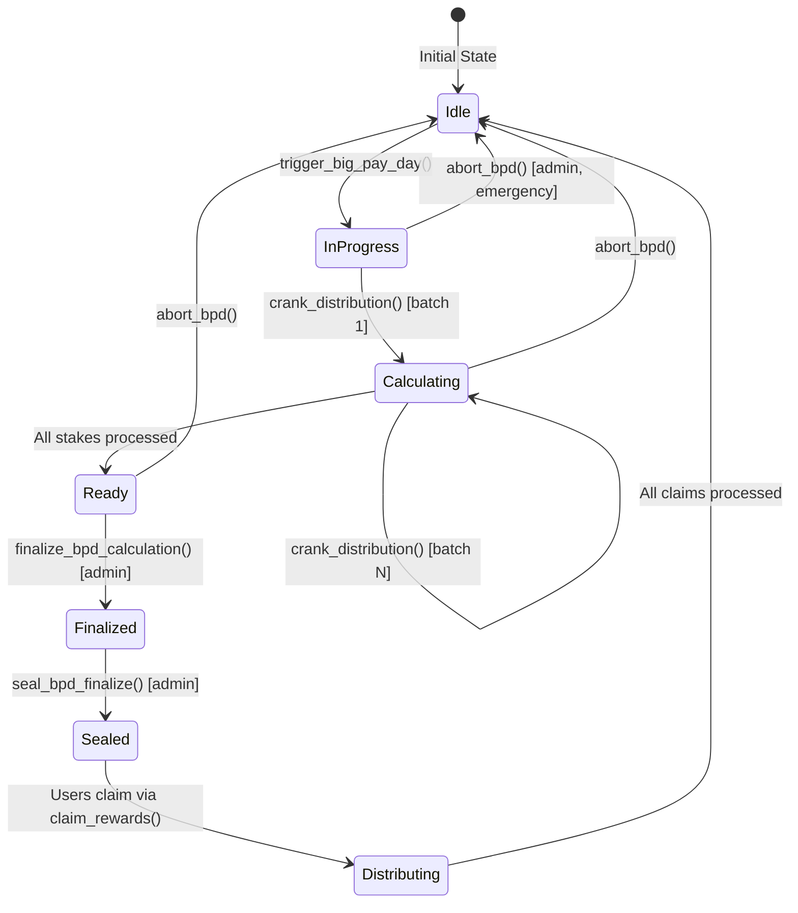
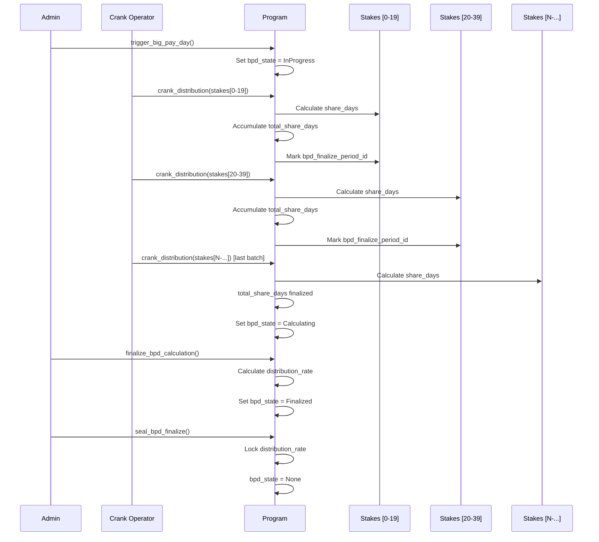
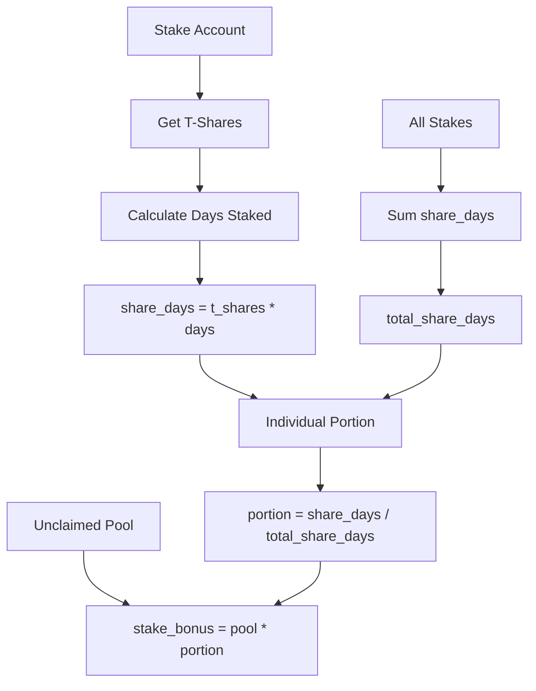
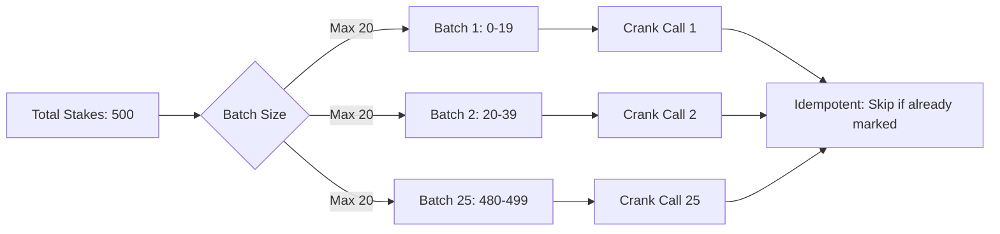
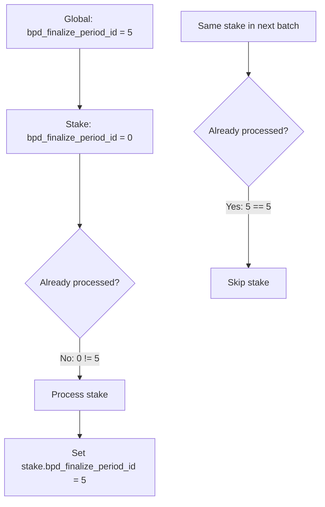
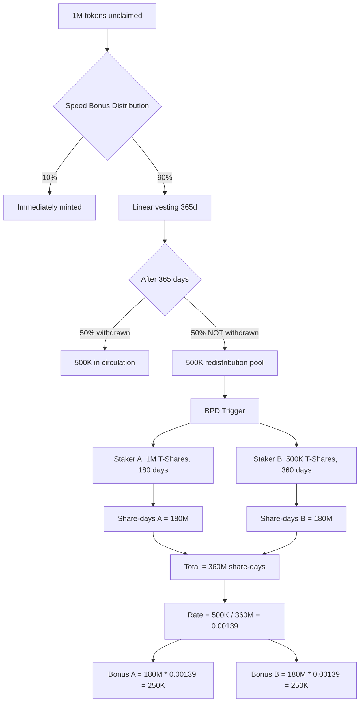

# Module 6: Big Pay Day (BPD) Distribution System

**Parent**: [[run_me_context_1770768781075.md]]

## Purpose

Multi-phase distribution mechanism that redistributes unclaimed airdrop tokens to active stakers based on their share-days (time-weighted stake commitment). Implements batch processing, speed bonuses, and anti-gaming protections.

## BPD Lifecycle



## Multi-Batch Processing Flow



## Share-Days Calculation



**Formula**:
```rust
// Per stake
current_day = (current_slot - stake.start_slot) / slots_per_day;
share_days = stake.t_shares * min(current_day, stake.lock_duration_days);

// Global accumulation
total_share_days += share_days;

// Final distribution (after finalize)
distribution_rate = unclaimed_pool / total_share_days;
stake.bpd_bonus_pending = share_days * distribution_rate;
```

## Batch Processing Strategy



**Constraints**:
- **Max accounts per transaction**: 20 stakes (Solana account limit ~32, minus program/global)
- **Idempotency**: Stakes with matching `bpd_finalize_period_id` are skipped
- **Last batch detection**: Automatically transitions to `Calculating` when no unprocessed stakes remain

## Anti-Gaming Protections

### CRIT-NEW-1 Fix: Permissionless Finalize Attack

**Original Vulnerability**:
```rust
// ❌ BEFORE: Attacker could call finalize with subset of stakes
pub fn finalize_bpd_calculation(ctx: Context<FinalizeBpd>) -> Result<()> {
    // No check on who calls this!
    let rate = global.unclaimed_pool / global.total_share_days;
    global.bpd_distribution_rate = rate;
}
```

**Exploit**:
1. Attacker waits for crank to process 480/500 stakes
2. Calls `finalize_bpd_calculation` before remaining 20 are processed
3. Distribution rate is calculated with incomplete `total_share_days`
4. Remaining 20 stakes get 0% of pool (already finalized)

**Fix**:
```rust
// ✅ AFTER: Admin-only + two-phase seal
#[access_control(only_admin(&ctx))]
pub fn finalize_bpd_calculation(ctx: Context<FinalizeBpd>) -> Result<()> {
    require!(global.bpd_state == BpdState::Calculating, ErrorCode::InvalidBpdState);
    
    let rate = global.unclaimed_pool / global.total_share_days;
    global.bpd_distribution_rate = rate;
    global.bpd_state = BpdState::Finalized; // Not yet distributable!
}

#[access_control(only_admin(&ctx))]
pub fn seal_bpd_finalize(ctx: Context<SealBpd>) -> Result<()> {
    require!(global.bpd_state == BpdState::Finalized, ErrorCode::InvalidBpdState);
    global.bpd_state = BpdState::None; // Now distributable
}
```

### Period ID Tracking



**Prevention**:
- Duplicate processing within same BPD cycle
- Accidental inclusion in multiple batches

### Abort Recovery Issue

**Known Bug** (HIGH severity):
```rust
// ❌ PROBLEM: abort_bpd does NOT reset per-stake fields
pub fn abort_bpd(ctx: Context<AbortBpd>) -> Result<()> {
    global.bpd_state = BpdState::None;
    global.total_share_days = 0;
    global.bpd_distribution_rate = 0;
    // Missing: Reset all stake.bpd_finalize_period_id to 0!
}
```

**Impact**:
1. BPD cycle 1 starts: `global.bpd_finalize_period_id = 1`
2. Crank processes 100 stakes: They get `stake.bpd_finalize_period_id = 1`
3. Admin aborts due to bug: `abort_bpd()`
4. New BPD cycle starts with SAME `claim_period_id`: `global.bpd_finalize_period_id = 1`
5. Those 100 stakes are skipped (already marked as processed)!

**Workaround**: Always increment `claim_period_id` after abort

## State Transitions

| Instruction | From State | To State | Admin Only? |
|-------------|-----------|----------|-------------|
| `trigger_big_pay_day` | None | InProgress | ❌ |
| `crank_distribution` [mid] | InProgress | InProgress | ❌ |
| `crank_distribution` [last] | InProgress | Calculating | ❌ |
| `finalize_bpd_calculation` | Calculating | Finalized | ✅ |
| `seal_bpd_finalize` | Finalized | None | ✅ |
| `abort_bpd` | Any | None | ✅ |

## Notable Gotchas

### 🔴 CRITICAL ISSUES

1. **Last batch detection relies on account list**
   - **Issue**: Crank operator must provide ALL remaining stakes in final batch
   - **Risk**: Missing stakes → stuck in `InProgress` forever
   - **Mitigation**: Off-chain indexer tracks unprocessed stakes

2. **No time limit on BPD duration**
   - **Issue**: BPD can stay `InProgress` for days/weeks
   - **Impact**: New stakes during BPD might not be included
   - **Design**: Intentional (snapshot at trigger time)

3. **Finalize before seal window**
   - **Issue**: `Finalized` state blocks new BPD trigger
   - **Impact**: If admin delays `seal_bpd_finalize`, system is paused
   - **Workaround**: Abort and restart

### ⚠️ Operational Considerations

- **Crank coordination**: Multiple crank operators can cause duplicate work (idempotent but wasteful)
- **Gas costs**: 500 stakes = 25 crank calls = ~0.025 SOL in fees
- **Ordering matters**: Process oldest stakes first to maximize share-days accuracy
- **Claim window**: Users can claim BPD bonuses anytime after seal (no expiry)

### 💡 Implementation Details

- **Share-days capped at lock_duration**: Prevents infinite accumulation from very old stakes
- **Distribution rate precision**: Uses u128 to avoid rounding errors
- **Bonus stored in `bpd_bonus_pending`**: Not auto-distributed (user must `claim_rewards`)
- **Emit events**: `BpdTriggered`, `BpdFinalized`, `BpdSealed` for indexer tracking

## Key Files

| File | Purpose |
|------|---------|
| `instructions/trigger_big_pay_day.rs` | BPD initialization |
| `instructions/crank_distribution.rs` | Batch stake processing |
| `instructions/finalize_bpd_calculation.rs` | Rate calculation (admin) |
| `instructions/seal_bpd_finalize.rs` | Enable distribution (admin) |
| `instructions/abort_bpd.rs` | Emergency reset (admin) |
| `state/global_state.rs` | BPD state enum + fields |
| `tests/bankrun/phase3/triggerBpd.test.ts` | State transition tests |
| `tests/bankrun/phase3/crankDistribution.test.ts` | Batch processing tests |
| `tests/bankrun/tests/bpd_math.test.ts` | Share-days calculation |

## Economic Model



**Incentive Alignment**:
- Early stakers accumulate more share-days → larger BPD portion
- Long lock durations grant more T-Shares → higher share-days
- Encourages NOT withdrawing vested tokens (more to redistribute)

## Monitoring & Alerts

**Recommended alerts**:
- BPD stuck in `InProgress` for > 24 hours
- `total_share_days` not increasing during crank
- `finalize_bpd_calculation` called with < 90% stakes processed
- Abort events (investigate why)

## Performance Benchmarks

- **Crank processing**: ~200ms per batch (20 stakes)
- **Total BPD duration**: ~10 minutes for 1000 stakes
- **Compute units**: ~50K CU per crank call
- **Storage growth**: +8 bytes per stake (period ID field)

## Future Improvements

1. **Automatic finalize detection**: Remove admin requirement, auto-finalize when all stakes processed
2. **Partial BPD**: Allow BPD while some stakes are excluded (opt-in flag)
3. **Time-weighted decay**: Recent share-days count more than old ones
4. **Multi-token BPD**: Distribute multiple SPL tokens in single cycle
5. **Penalty-funded BPD**: Add early unstake penalties to redistribution pool

[[/Users/annon/projects/solhex/voicetree-9-2/module-1-onchain-program.md]]
[[/Users/annon/projects/solhex/voicetree-9-2/module-2-frontend-dashboard.md]]
[[/Users/annon/projects/solhex/voicetree-9-2/module-4-tokenomics-engine.md]]
[[/Users/annon/projects/solhex/voicetree-9-2/module-3-indexer-service.md]]
[[/Users/annon/projects/solhex/voicetree-9-2/module-5-testing-infrastructure.md]]
[[/Users/annon/projects/solhex/voicetree-9-2/module-7-free-claim-system.md]]
[[/Users/annon/projects/solhex/voicetree-9-2/codebase-architecture-map.md]]