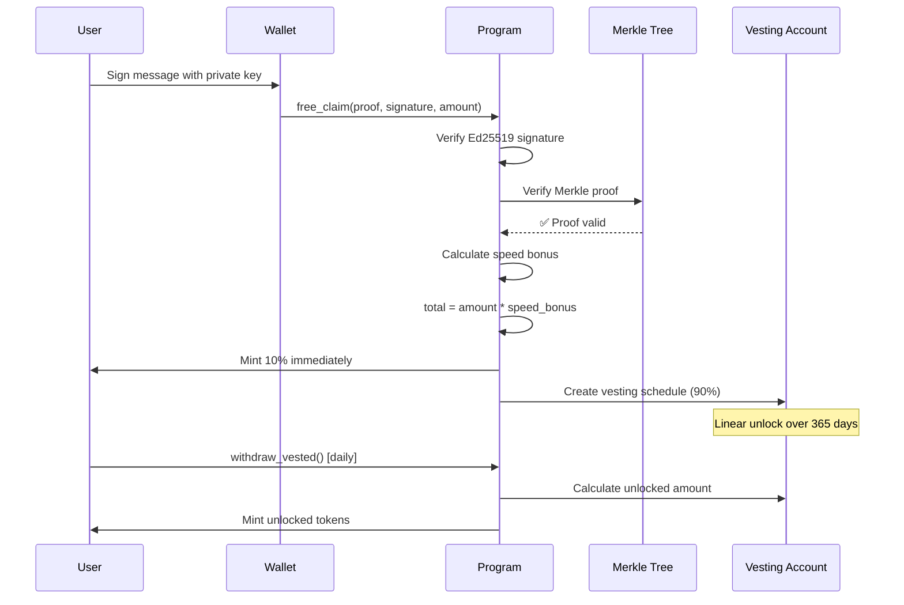
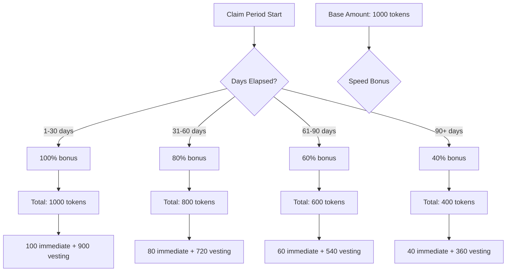
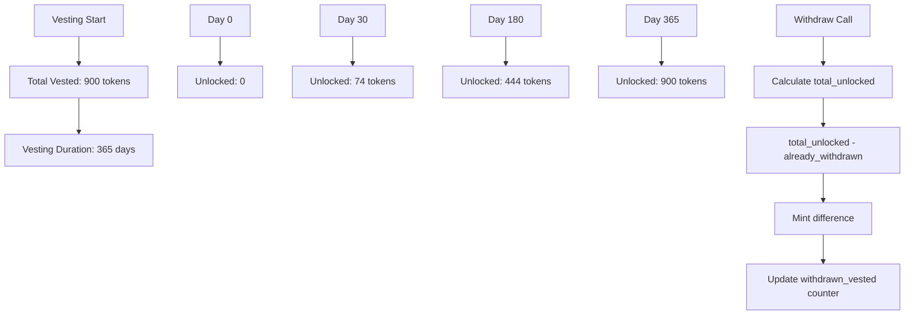
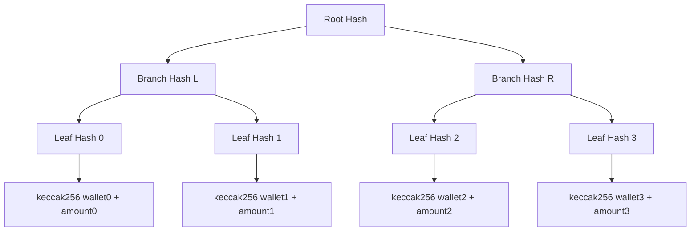
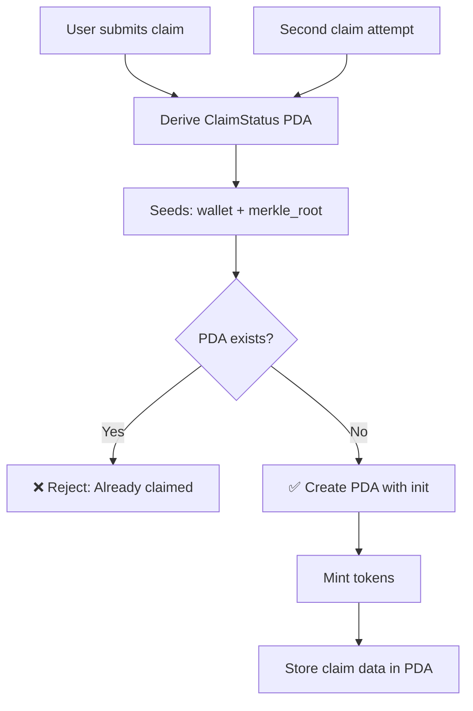
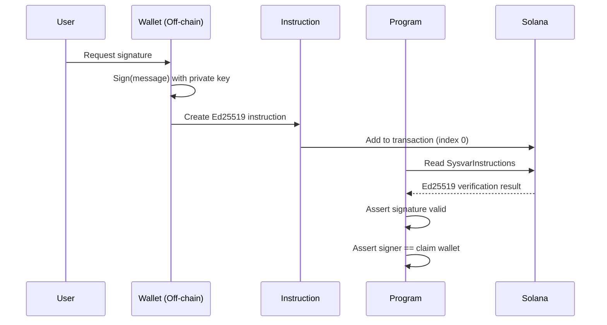

# Module 7: Free Claim System (Merkle Airdrop)

**Parent**: [[run_me_context_1770768781075.md]]

## Purpose

Merkle tree-based token airdrop with Ed25519 signature verification, time-based speed bonuses, and linear vesting. Enables permissionless claims while preventing double-claims through PDA-based claim status tracking.

## Claim Flow



## Speed Bonus Mechanics



**Speed Bonus Formula**:
```rust
days_elapsed = (current_slot - claim_start_slot) / slots_per_day;

if days_elapsed <= 30 {
    speed_bonus = 1.0; // 100%
} else if days_elapsed <= 60 {
    speed_bonus = 0.8; // 80%
} else if days_elapsed <= 90 {
    speed_bonus = 0.6; // 60%
} else {
    speed_bonus = 0.4; // 40% (minimum)
}

final_amount = base_amount * speed_bonus;
immediate = final_amount * 0.1; // 10%
vesting = final_amount * 0.9; // 90%
```

## Linear Vesting Unlock



**Vesting Formula**:
```rust
elapsed_slots = current_slot - claim_slot;
vesting_duration = VESTING_PERIOD_DAYS * slots_per_day; // 365 days

if elapsed_slots >= vesting_duration {
    total_vested = claim_status.total_vested; // 100%
} else {
    // Linear unlock: (vesting_portion * elapsed) / total_duration
    immediate = total_amount * 10 / 100;
    vesting_portion = total_amount - immediate;
    
    total_vested = immediate + (vesting_portion * elapsed_slots / vesting_duration);
}

claimable = total_vested - claim_status.withdrawn_vested;
```

## Merkle Tree Structure



**Leaf Construction**:
```typescript
// Off-chain (TypeScript)
const leaf = keccak256(
  Buffer.concat([
    wallet.toBuffer(),        // 32 bytes
    numberToLeBytes(amount)   // 8 bytes (u64)
  ])
);

// Merkle tree with sorted pairs (deterministic)
const tree = new MerkleTree(leaves, keccak256, { sortPairs: true });
const proof = tree.getProof(leaf);
```

**On-chain Verification**:
```rust
// Reconstruct leaf hash
let leaf = keccak256(&[wallet.as_ref(), &amount.to_le_bytes()].concat());

// Verify proof path to root
let computed_hash = leaf;
for proof_element in merkle_proof.iter() {
    computed_hash = if computed_hash < *proof_element {
        keccak256(&[&computed_hash, proof_element].concat())
    } else {
        keccak256(&[proof_element, &computed_hash].concat())
    };
}

require!(computed_hash == merkle_root, ErrorCode::InvalidProof);
```

## Double-Claim Prevention



**PDA Derivation**:
```rust
// Seeds: [b"claim_status", wallet, merkle_root]
let (claim_status_pda, bump) = Pubkey::find_program_address(
    &[
        b"claim_status",
        ctx.accounts.wallet.key().as_ref(),
        &merkle_root,
    ],
    &ctx.program_id,
);
```

**Account Constraint**:
```rust
#[account(
    init,  // ✅ Fails if account already exists!
    payer = payer,
    space = 8 + ClaimStatus::INIT_SPACE,
    seeds = [b"claim_status", wallet.key().as_ref(), &merkle_root],
    bump
)]
pub claim_status: Account<'ctx, ClaimStatus>,
```

## Ed25519 Signature Verification



**Off-chain Signature**:
```typescript
const message = Buffer.from("Claim Helix Airdrop");
const signature = nacl.sign.detached(message, wallet.secretKey);

// Create Ed25519 instruction (MUST be first in transaction)
const ed25519Ix = Ed25519Program.createInstructionWithPublicKey({
  publicKey: wallet.publicKey.toBytes(),
  message,
  signature,
});

// Transaction order matters!
const tx = new Transaction()
  .add(ed25519Ix)           // Index 0
  .add(freeClaimIx);        // Index 1
```

**On-chain Verification**:
```rust
let ix_sysvar = ctx.accounts.instruction_sysvar.to_account_info();
let current_index = load_current_index_checked(&ix_sysvar)?;

// Ed25519 instruction must be at index current_index - 1
let ed25519_ix = load_instruction_at_checked(
    (current_index - 1) as usize, 
    &ix_sysvar
)?;

// Verify it's an Ed25519 instruction
require!(
    ed25519_ix.program_id == ED25519_PROGRAM_ID,
    ErrorCode::MissingEd25519Instruction
);

// Verify signature is for the claiming wallet
require!(
    &ed25519_ix.data[16..48] == ctx.accounts.wallet.key().as_ref(),
    ErrorCode::InvalidSignature
);
```

## Claim Status Account

```rust
#[account]
pub struct ClaimStatus {
    pub wallet: Pubkey,           // 32 bytes - Claimer's wallet
    pub merkle_root: [u8; 32],    // 32 bytes - Which airdrop claimed
    pub claim_slot: u64,          // 8 bytes - When claimed
    pub total_vested: u64,        // 8 bytes - Total tokens (immediate + vesting)
    pub withdrawn_vested: u64,    // 8 bytes - Amount already withdrawn
}
// Total: 88 bytes + 8 discriminator = 96 bytes
```

**Vesting State Progression**:

| Time | total_vested | withdrawn_vested | Claimable |
|------|--------------|------------------|-----------|
| Claim (Day 0) | 1000 | 100 (immediate) | 0 |
| Day 30 | 1000 | 100 | 74 |
| Day 180 | 1000 | 174 (after 1 withdraw) | 444 - 174 = 270 |
| Day 365 | 1000 | 444 (after 2 withdraws) | 1000 - 444 = 556 |
| Day 365+ | 1000 | 1000 (fully withdrawn) | 0 |

## Notable Gotchas

### 🔴 CRITICAL ISSUES

1. **Ed25519 instruction MUST be first**
   - **Issue**: Program reads `instruction_sysvar` at index `current_index - 1`
   - **Impact**: Wrong order → signature verification fails
   - **Fix**: Always insert Ed25519 instruction at index 0

2. **Merkle root rotation not supported**
   - **Issue**: ClaimStatus PDA is keyed by `[wallet, merkle_root]`
   - **Impact**: Changing merkle_root for new airdrop requires different PDA
   - **Design**: Intentional (each airdrop is separate claim period)

3. **No partial claims**
   - **Issue**: User must claim full amount in single transaction
   - **Impact**: Cannot split claim across multiple transactions
   - **Workaround**: None (design constraint)

### ⚠️ Edge Cases

- **Speed bonus timing**: Calculated at claim time, NOT withdraw time
- **Vesting starts immediately**: Even if user waits 60 days to claim, vesting begins from claim slot
- **No claim expiry**: Users can claim years later (but speed bonus caps at 40%)
- **Withdrawn amount tracks total**: Includes both immediate AND vesting portions

### 💡 Implementation Details

- **keccak256 hashing**: Uses `solana_program::keccak` (not SHA256)
- **Sorted pairs**: Merkle tree uses sorted hashing for deterministic proofs
- **PDA bump stored**: `claim_status` account stores bump seed for future lookups
- **Events emitted**: `FreeClaimed`, `VestedWithdrawn` for indexer tracking
- **No admin override**: Once claimed, vesting schedule is immutable

## Key Files

| File | Purpose |
|------|---------|
| `instructions/free_claim.rs` | Merkle proof + Ed25519 verification |
| `instructions/initialize_claim_period.rs` | Set merkle root (admin) |
| `instructions/withdraw_vested.rs` | Linear vesting unlock |
| `state/claim_status.rs` | Claim status account definition |
| `state/claim_config.rs` | Global claim configuration |
| `tests/bankrun/phase3/freeClaim.test.ts` | Merkle proof tests |
| `tests/bankrun/phase3/withdrawVested.test.ts` | Vesting unlock tests |
| `tests/bankrun/phase3/utils.ts` | Merkle tree helpers |

## Admin Configuration

### Initialize Claim Period

```rust
pub fn initialize_claim_period(
    ctx: Context<InitializeClaimPeriod>,
    merkle_root: [u8; 32],
    total_claimable: u64,
    claim_start_slot: u64,
    claim_end_slot: u64,
) -> Result<()>
```

**Purpose**: Set up new airdrop campaign with:
- Merkle root (off-chain computed)
- Total claimable pool size
- Claim window (start/end slots)

**Admin-only**: Yes (authority check)

### Update Claim End Slot (Devnet Only)

```rust
#[access_control(only_admin(&ctx))]
pub fn admin_set_claim_end_slot(
    ctx: Context<AdminSetClaimEndSlot>,
    new_end_slot: u64,
) -> Result<()>
```

**Purpose**: Extend/shorten claim period for testing
**Mainnet**: Should be REMOVED (enables admin to rug-pull claims)

## Security Considerations

✅ **Implemented**:
- Ed25519 signature prevents impersonation
- Merkle proof prevents unauthorized claims
- PDA init constraint prevents double-claims
- Speed bonus incentivizes early claims

⚠️ **Risks**:
- **Merkle tree generation**: Off-chain process must be audited (wrong tree = wrong distribution)
- **Unclaimed token custody**: Tokens remain in program until claimed (admin could mint more)
- **Vesting immutability**: No emergency withdrawal (user must wait full 365 days)

## Off-chain Merkle Tree Generation

```typescript
// Example: Generate tree for 10,000 wallets
const wallets = [...]; // Array of PublicKey
const amounts = [...]; // Array of u64 amounts

const leaves = wallets.map((wallet, i) => {
  const amountBuffer = Buffer.alloc(8);
  amountBuffer.writeBigUInt64LE(BigInt(amounts[i]));
  
  return keccak256(
    Buffer.concat([wallet.toBuffer(), amountBuffer])
  );
});

const tree = new MerkleTree(leaves, keccak256, { sortPairs: true });
const root = tree.getRoot();

// Store root on-chain via initialize_claim_period
await program.methods
  .initializeClaimPeriod(root, totalClaimable, startSlot, endSlot)
  .rpc();

// Distribute proofs to users (via API/frontend)
const proof = tree.getProof(leaves[userIndex]);
```

## Frontend Integration

```typescript
// app/web/lib/hooks/useFreeClaim.ts
export function useFreeClaim() {
  const { program } = useProgram();
  const wallet = useWallet();
  
  return useMutation({
    mutationFn: async ({ proof, amount }: { proof: Buffer[], amount: BN }) => {
      // 1. Sign message
      const message = Buffer.from("Claim Helix Airdrop");
      const signature = await wallet.signMessage(message);
      
      // 2. Create Ed25519 instruction
      const ed25519Ix = Ed25519Program.createInstructionWithPublicKey({
        publicKey: wallet.publicKey.toBytes(),
        message,
        signature,
      });
      
      // 3. Create claim instruction
      const claimIx = await program.methods
        .freeClaim(proof, amount)
        .accounts({ wallet: wallet.publicKey })
        .instruction();
      
      // 4. Send transaction (Ed25519 MUST be first!)
      const tx = new Transaction().add(ed25519Ix).add(claimIx);
      return await program.provider.sendAndConfirm(tx);
    }
  });
}
```

## Performance Benchmarks

- **Merkle proof size**: ~10 hashes for 1024 wallets, ~20 hashes for 1M wallets
- **Claim transaction cost**: ~0.005 SOL (includes PDA creation)
- **Withdraw transaction cost**: ~0.0001 SOL (account already exists)
- **Compute units**: ~30K CU for claim, ~10K CU for withdraw

## Tech Debt

1. **No claim aggregation**: Each user creates separate PDA (10K users = 10K accounts)
2. **Vesting inflexibility**: Linear only (no cliff, no exponential decay)
3. **No claim delegation**: User must claim with wallet that received allocation
4. **Admin can change claim_end_slot**: Devnet-only instruction should be removed for mainnet

## Future Improvements

1. **Compressed Merkle tree**: Use Solana state compression for 1M+ wallets
2. **Tiered vesting**: Different schedules for different allocation sizes
3. **Claim bundling**: Multi-claim in single transaction (save on fees)
4. **Vesting transfer**: Allow users to sell unvested allocations
5. **Auto-compound**: Redirect vested tokens to staking automatically

[[/Users/annon/projects/solhex/voicetree-9-2/module-1-onchain-program.md]]
[[/Users/annon/projects/solhex/voicetree-9-2/module-2-frontend-dashboard.md]]
[[/Users/annon/projects/solhex/voicetree-9-2/module-4-tokenomics-engine.md]]
[[/Users/annon/projects/solhex/voicetree-9-2/module-3-indexer-service.md]]
[[/Users/annon/projects/solhex/voicetree-9-2/module-6-bpd-distribution-system.md]]
[[/Users/annon/projects/solhex/voicetree-9-2/module-5-testing-infrastructure.md]]
[[/Users/annon/projects/solhex/voicetree-9-2/codebase-architecture-map.md]]