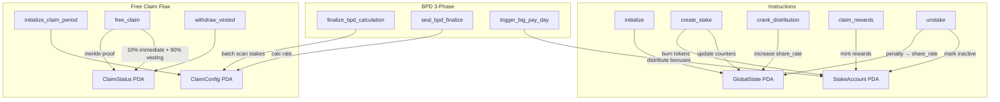

# On-Chain Program (Anchor/Rust)

## Core staking protocol at `programs/helix-staking/`

The Helix Staking program is a Solana Anchor-based protocol (v0.31) implementing HEX-inspired tokenomics with Token-2022 integration, burn-and-mint mechanics, and lazy reward distribution.

**Program ID:** `E9B7BsxdPS89M66CRGGbsCzQ9LkiGv6aNsra3cNBJha7`

### 16 Instructions
| Category | Instructions |
|----------|-------------|
| **Core Staking** | `initialize`, `create_stake`, `unstake`, `claim_rewards`, `crank_distribution` |
| **Free Claim** | `initialize_claim_period`, `free_claim`, `withdraw_vested` |
| **BPD (3-phase)** | `finalize_bpd_calculation`, `seal_bpd_finalize`, `trigger_big_pay_day`, `abort_bpd` |
| **Admin** | `admin_mint`, `admin_set_claim_end_slot`, `admin_set_slots_per_day` |
| **Migration** | `migrate_stake` |

### 4 PDA State Accounts
| Account | Size | Seeds | Purpose |
|---------|------|-------|---------|
| `GlobalState` | 247B | `["global_state"]` | Protocol params, share rate, aggregate metrics |
| `StakeAccount` | 117B | `["stake", user, id]` | Per-stake data, T-shares, reward debt, BPD tracking |
| `ClaimConfig` | 184B | `["claim_config"]` | Merkle root, BPD calculation state, period metadata |
| `ClaimStatus` | 76B | `["claim_status", root_prefix, wallet]` | Per-user claim tracking + vesting |

### Key Design Patterns
- **Burn-and-mint:** Tokens burned on stake, minted on claim/unstake (no custody risk)
- **Lazy distribution:** Rewards via `share_rate` increase, calculated on-demand via `reward_debt`
- **Separate PDAs per stake:** No Vec storage, unlimited stakes per user
- **u128 intermediates:** All financial math uses u128 to prevent overflow
- **Check-Effects-Interactions:** State updated before all CPIs

### Notable Gotchas & Tech Debt
- `StakeAccount.bpd_eligible` is **DEPRECATED** (set but never checked)
- `StakeAccount.claim_period_start_slot` is **DEPRECATED** (never read)
- `GlobalState.reserved[0]` repurposed as BPD window flag (blocks unstake during BPD)
- Account migrated 3 times: 92B -> 113B -> 117B (lazy migration on `claim_rewards`)
- BPD batch size: 20 stakes/tx (compute limit constraint)
- ~2,435 lines of instruction code across 16 modules

[[run_me.md]]
