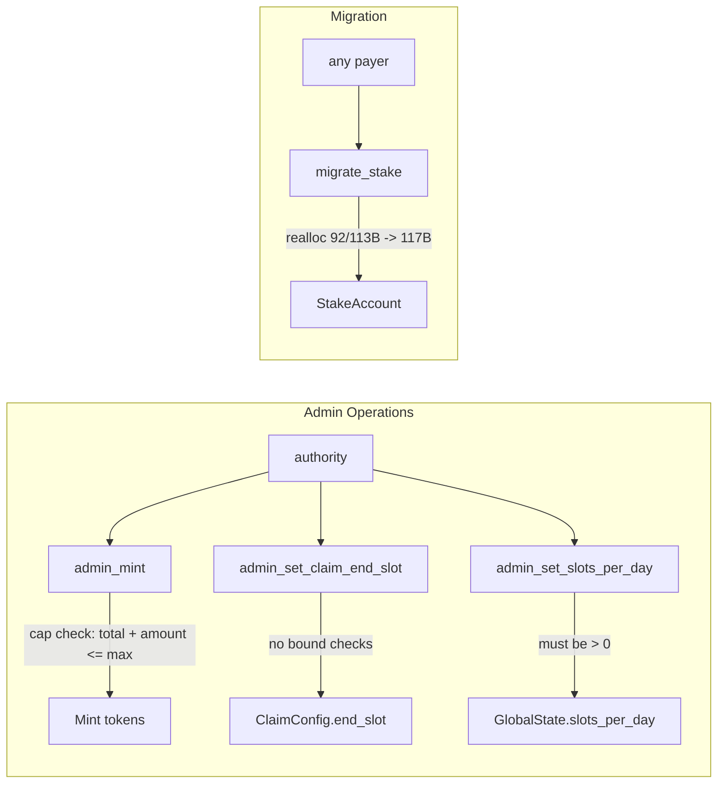

# Program Admin & Migration Instructions

## admin_mint, admin_set_*, and migrate_stake -- privileged operations and account migration

These instructions are restricted to the protocol authority (stored in `GlobalState.authority`) and handle token minting for operational needs, parameter tuning, and legacy account migration.

### Instruction Overview

| Instruction | Auth | Mutates | Purpose |
|-------------|------|---------|---------|
| `admin_mint` | Authority | GlobalState, Mint | Mint tokens to any recipient (capped) |
| `admin_set_claim_end_slot` | Authority | ClaimConfig | Override claim period end slot |
| `admin_set_slots_per_day` | Authority | GlobalState | Override slots-per-day parameter |
| `migrate_stake` | Anyone (payer) | StakeAccount | Realloc old stake accounts to current size |

### admin_mint (admin_mint.rs)

Authority-gated instruction to mint tokens directly to any token account, subject to a lifetime cap.

**Parameter:** `amount: u64`

**Flow:**
1. Calculate `new_total = total_admin_minted + amount`
2. Require `new_total <= max_admin_mint`
3. **Update `total_admin_minted` BEFORE CPI** (MED-6 fix: Check-Effects-Interactions pattern)
4. Mint via Token-2022 PDA signer
5. Emit `AdminMinted` event

**Cap enforcement:** `max_admin_mint` is set at `initialize` and cannot be changed after deployment. `total_admin_minted` is monotonically increasing.

**Note:** The recipient can be any Token-2022 token account for the HLX mint -- not limited to the authority's own account.

### admin_set_claim_end_slot (admin_set_claim_end_slot.rs)

Authority-gated override for the claim period's end slot.

**Parameter:** `new_end_slot: u64`

**Purpose:** Primarily for devnet/testing to fast-forward claim period expiry so the BPD flow can be tested without waiting 180 days.

**Constraints:**
- `claim_config.claim_period_started` must be true
- No validation on `new_end_slot` (can be set to any value, including past slots)

### admin_set_slots_per_day (admin_set_slots_per_day.rs)

Authority-gated override for the `slots_per_day` parameter in GlobalState.

**Parameter:** `new_slots_per_day: u64`

**Constraints:**
- `new_slots_per_day > 0` (prevents division by zero in day calculations)

**Purpose:** Testing helper to make "days" pass faster. Changing this in production would affect all time-dependent calculations: stake maturity, inflation distribution, vesting, penalty windows, and BPD eligibility.

### migrate_stake (migrate_stake.rs)

Permissionless instruction to resize old `StakeAccount` PDAs to the current 117-byte layout.

**Flow:** Uses Anchor's `realloc` to resize the account. The `payer` signer pays for any additional rent. The instruction body is literally empty (`Ok(())`) -- all the work is done by Anchor's realloc macro.

**Migration history:**
| Version | Size | New Fields |
|---------|------|------------|
| v1 (Phase 1) | 92B | Original fields |
| v2 (Phase 3) | 113B | `bpd_bonus_pending`, `bpd_eligible`, `claim_period_start_slot` |
| v3 (Phase 3.3) | 117B | `bpd_claim_period_id`, `bpd_finalize_period_id` |

**Realloc behavior (`realloc::zero = false`):** New bytes are NOT zeroed. Since Anchor deserializes the full struct, the new fields get whatever bytes happen to be in the extended space. In practice, Solana zeros new account space during realloc, but the `zero = false` flag means Anchor won't explicitly zero it.

**Alternative migration path:** `claim_rewards` also performs the same realloc (with `realloc::payer = user`), so stakes are lazily migrated when users claim. The dedicated `migrate_stake` instruction exists for batch migration by an operator.

### Notable Gotchas
- `admin_mint` has no time-lock, multi-sig requirement, or rate-limiting on-chain -- the only guard is the lifetime cap set at `initialize`. Production should use a multisig as the authority.
- `admin_set_claim_end_slot` has NO validation on the new value -- it can be set to 0 (already expired) or `u64::MAX` (never expires). In production, this is an escape hatch but also a risk vector.
- `admin_set_slots_per_day` affects ALL time-dependent calculations retroactively. Changing it mid-operation could cause inconsistent day calculations between different instructions.
- `migrate_stake` uses `realloc::zero = false`, which means the new `bpd_claim_period_id` and `bpd_finalize_period_id` fields default to 0 after migration. Since valid `claim_period_id` starts at 1, this is safe -- 0 means "never processed."
- The `migrate_stake` instruction's `payer` does NOT need to be the stake owner. Any account can pay to migrate any stake. This allows batch migration scripts to be run by operators.
- `ClaimConfig.authority` (set by `initialize_claim_period`) is deprecated and not used for auth checks -- all admin instructions check against `GlobalState.authority` instead.

[[on-chain-program.md]]
