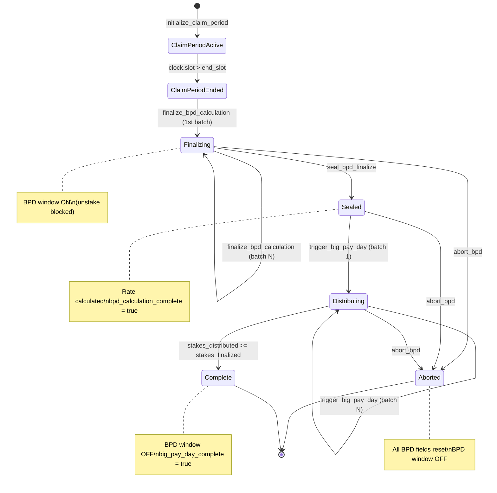

# Program BPD Instructions

## finalize_bpd_calculation, seal_bpd_finalize, trigger_big_pay_day, abort_bpd -- the 3-phase Big Pay Day pipeline

Big Pay Day (BPD) redistributes unclaimed free-claim tokens to active stakers proportional to their T-share-days. It uses a 3-phase design to work within Solana's compute limits, processing stakes in batches of 20 per transaction.

### Phase Overview

| Phase | Instruction | Auth | Purpose |
|-------|-------------|------|---------|
| 1. Finalize | `finalize_bpd_calculation` | Authority only | Scan stakes in batches, accumulate total share-days |
| 2. Seal | `seal_bpd_finalize` | Authority only | Calculate global BPD rate from accumulated data |
| 3. Trigger | `trigger_big_pay_day` | Permissionless | Distribute bonuses to individual stakes in batches |
| Abort | `abort_bpd` | Authority only | Emergency reset of BPD state |

### Phase 1: finalize_bpd_calculation (finalize_bpd_calculation.rs)

Scans up to 20 stake accounts per call, accumulating their share-days into `ClaimConfig.bpd_total_share_days`.

**Preconditions:**
- Claim period ended (`clock.slot > claim_config.end_slot`)
- `bpd_calculation_complete == false`
- `big_pay_day_complete == false`
- Caller is `GlobalState.authority`

**First batch behavior:**
- Calculates `bpd_remaining_unclaimed = total_claimable - total_claimed`
- Pins `bpd_snapshot_slot = clock.slot` (used consistently across all batches)
- Sets BPD window active (`global_state.reserved[0] = 1`), which **blocks all unstaking**

**Per-stake processing:**
1. Verify account is owned by program
2. Skip accounts < 117 bytes (un-migrated)
3. Deserialize as `StakeAccount`
4. **Skip if `bpd_finalize_period_id == claim_period_id`** (duplicate prevention, CRIT-NEW-1)
5. Verify PDA derivation matches
6. Check eligibility: `is_active`, `start_slot` within claim period range
7. Calculate `days_staked = min(snapshot_slot, end_slot) - start_slot / slots_per_day`
8. Calculate `share_days = t_shares * days_staked` (u128)
9. Set `stake.bpd_finalize_period_id = claim_period_id`
10. Write updated stake back via `try_serialize`
11. Increment `bpd_stakes_finalized`

**If unclaimed = 0:** Marks complete immediately, clears BPD window.

### Phase 2: seal_bpd_finalize (seal_bpd_finalize.rs)

Authority-gated instruction that calculates the global BPD rate after all finalize batches are done.

**Preconditions:**
- Claim period ended
- `bpd_stakes_finalized > 0` (HIGH-2 fix: prevents sealing with no data)
- `bpd_calculation_complete == false`

**Calculation:**
```
bpd_helix_per_share_day = (bpd_remaining_unclaimed * PRECISION) / bpd_total_share_days
```

Both operands are `u128` to handle overflow. Sets `bpd_calculation_complete = true`.

**Edge case:** If `bpd_total_share_days == 0` (all stakes had 0 days), sets rate to 0 and marks complete.

### Phase 3: trigger_big_pay_day (trigger_big_pay_day.rs)

Permissionless instruction that distributes BPD bonuses to individual stakes using the pre-calculated rate.

**Preconditions:**
- `bpd_calculation_complete == true` (enforced by constraint)
- `big_pay_day_complete == false`

**Per-stake processing:**
1. Same ownership and PDA verification as finalize
2. **Skip if `bpd_claim_period_id == claim_period_id`** (already received BPD)
3. **Require `bpd_finalize_period_id == claim_period_id`** (CRIT-NEW-1: only distribute to finalized stakes)
4. Check eligibility (active, within claim period, > 0 days staked)
5. Calculate: `bonus = share_days * helix_per_share_day / PRECISION`
6. Safe cast via `u64::try_from` (MED-1 fix)
7. Add `bonus` to `stake.bpd_bonus_pending`
8. Set `stake.bpd_claim_period_id = claim_period_id`
9. Track `bpd_total_distributed` and `bpd_remaining_unclaimed`

**Completion detection:** `bpd_stakes_distributed >= bpd_stakes_finalized` (counter-based, not pool-exhaustion-based). When complete:
- Sets `big_pay_day_complete = true`
- Clears BPD window (`global_state.reserved[0] = 0`)
- Emits `ClaimPeriodEnded` event

**Zero-bonus handling (H-1 fix):** Stakes with calculated bonus = 0 are still marked as processed (`bpd_claim_period_id` set) and counted in `bpd_stakes_distributed` to prevent infinite resubmission.

### abort_bpd (abort_bpd.rs)

Emergency instruction for authority to reset BPD state if the pipeline gets stuck.

**Resets all BPD fields:**
- `bpd_calculation_complete = false`
- `bpd_helix_per_share_day = 0`
- `bpd_total_share_days = 0`
- `bpd_snapshot_slot = 0`
- `bpd_stakes_finalized = 0`
- `bpd_stakes_distributed = 0`
- `bpd_remaining_unclaimed = 0`
- Clears BPD window flag

**Precondition:** BPD window must be active (`global_state.is_bpd_window_active()`).

**Warning:** Does NOT reset individual `StakeAccount.bpd_finalize_period_id` values, which means re-running finalize after abort will re-scan and re-count stakes correctly (they won't be skipped because the period IDs won't match a fresh attempt -- unless the same `claim_period_id` is reused, in which case previously-finalized stakes would be skipped).



### Batch Size Constraint

Both `finalize_bpd_calculation` and `trigger_big_pay_day` process at most **20 stakes per transaction** (`MAX_STAKES_PER_FINALIZE = 20`, `MAX_STAKES_PER_BPD = 20`). This is a Solana compute budget constraint. For N eligible stakes, the full pipeline requires:
- `ceil(N/20)` finalize calls
- 1 seal call
- `ceil(N/20)` trigger calls

### Notable Gotchas
- **Unstaking is blocked** during the entire BPD window (from first finalize to completion/abort). This is necessary to prevent share-count manipulation but means users cannot exit their positions during BPD processing.
- `finalize_bpd_calculation` was originally permissionless but was gated to authority-only (M-1 fix) to prevent griefing attacks where an attacker could submit empty or malicious batches
- `seal_bpd_finalize` exists as a separate instruction (not auto-triggered) because the original design allowed last-batch detection to be gamed by sending fewer than 20 accounts
- `abort_bpd` does NOT undo `bpd_bonus_pending` already written to individual stakes during the trigger phase -- partially-distributed bonuses remain on stake accounts even after abort
- `bpd_remaining_unclaimed` is decremented with `checked_sub` (MED-3 fix) to catch over-distribution, which would indicate a rate calculation bug
- The `bpd_snapshot_slot` is pinned on the first finalize batch for consistent days_staked across all batches, even if finalization spans multiple slots
- Stakes created between `ClaimConfig.start_slot` and `ClaimConfig.end_slot` are eligible; stakes created before the period are excluded even if they overlap
- The event `BigPayDayDistributed` truncates u128 values to u64 via `.min(u64::MAX as u128) as u64`, which loses precision for very large values

[[on-chain-program.md]]
