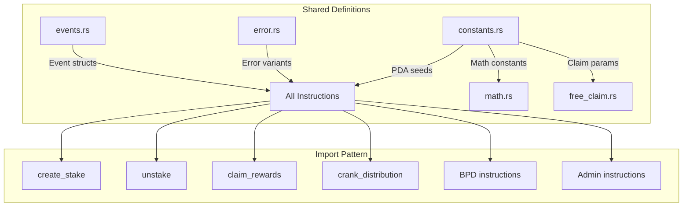

# Program Constants, Errors & Events

## constants.rs, error.rs, and events.rs -- the shared protocol definitions

These three files define the protocol's configuration values, error codes, and indexer-facing event structures. They are imported by every instruction module.

### Constants (constants.rs)

**Token Configuration:**

| Constant | Value | Description |
|----------|-------|-------------|
| `TOKEN_DECIMALS` | 8 | HLX token decimals |
| `TOKEN_NAME` / `TOKEN_SYMBOL` | "HLX" | Token metadata |

**Protocol Defaults:**

| Constant | Value | Description |
|----------|-------|-------------|
| `DEFAULT_ANNUAL_INFLATION_BP` | 3,690,000 | 3.69% annual inflation (basis points * 100) |
| `DEFAULT_MIN_STAKE_AMOUNT` | 10,000,000 | 0.1 HLX minimum stake |
| `DEFAULT_STARTING_SHARE_RATE` | 10,000 | 1:1 ratio at launch |
| `DEFAULT_SLOTS_PER_DAY` | 216,000 | ~400ms per slot |
| `DEFAULT_CLAIM_PERIOD_DAYS` | 180 | 6-month claim window |

**PDA Seeds:**

| Constant | Value | Used By |
|----------|-------|---------|
| `GLOBAL_STATE_SEED` | `b"global_state"` | GlobalState PDA |
| `MINT_AUTHORITY_SEED` | `b"mint_authority"` | Mint authority PDA |
| `MINT_SEED` | `b"helix_mint"` | Token mint PDA |
| `STAKE_SEED` | `b"stake"` | StakeAccount PDAs |
| `CLAIM_CONFIG_SEED` | `b"claim_config"` | ClaimConfig PDA |
| `CLAIM_STATUS_SEED` | `b"claim_status"` | ClaimStatus PDAs |

**Staking Math:**

| Constant | Value | Description |
|----------|-------|-------------|
| `PRECISION` | 1,000,000,000 | 1e9 fixed-point scaling |
| `MAX_STAKE_DAYS` | 5,555 | Maximum stake duration |
| `LPB_MAX_DAYS` | 3,641 | Full 2x LPB bonus (~10 years) |
| `BPB_THRESHOLD` | 150,000,000_00_000_000 | 150M tokens for full BPB bonus |
| `MIN_PENALTY_BPS` | 5,000 | 50% minimum early penalty |
| `BPS_SCALER` | 10,000 | Basis point denominator |
| `GRACE_PERIOD_DAYS` | 14 | Late penalty grace window |
| `LATE_PENALTY_WINDOW_DAYS` | 351 | 365 - 14 days for linear late penalty |

**Free Claim:**

| Constant | Value | Description |
|----------|-------|-------------|
| `VESTING_DAYS` | 30 | 30-day graduated release |
| `IMMEDIATE_RELEASE_BPS` | 1,000 | 10% available immediately |
| `VESTED_RELEASE_BPS` | 9,000 | 90% vests over 30 days |
| `CLAIM_PERIOD_DAYS` | 180 | 6-month claim window |
| `SPEED_BONUS_WEEK1_BPS` | 2,000 | +20% for days 1-7 |
| `SPEED_BONUS_WEEK2_4_BPS` | 1,000 | +10% for days 8-28 |
| `HELIX_PER_SOL` | 10,000 | Claim ratio |
| `MIN_SOL_BALANCE` | 100,000,000 | 0.1 SOL minimum (9 decimals) |
| `MAX_MERKLE_PROOF_LEN` | 20 | Supports 1M+ claimants |
| `MERKLE_ROOT_PREFIX_LEN` | 8 | First 8 bytes of root for PDA seed |

### Error Codes (error.rs)

30 error variants organized by domain:

**Arithmetic (generic):**
- `Overflow`, `Underflow`, `DivisionByZero`

**Authorization:**
- `Unauthorized`, `UnauthorizedStakeAccess`

**Staking:**
- `StakeBelowMinimum`, `InvalidStakeDuration`, `StakeNotActive`, `StakeAlreadyClosed`
- `AlreadyDistributedToday`, `NoActiveShares`, `NoRewardsToClaim`
- `RewardDebtOverflow` -- t_shares * share_rate exceeds u64

**Claim Period:**
- `ClaimPeriodActive`, `ClaimPeriodEnded`, `ClaimPeriodNotStarted`, `ClaimPeriodAlreadyStarted`
- `InvalidMerkleProof`, `AlreadyClaimed`, `SnapshotBalanceTooLow`
- `InvalidClaimPeriodId` -- claim_period_id must be > 0

**Signature:**
- `InvalidSignature`, `MissingEd25519Instruction`

**Vesting:**
- `NoVestedTokens`, `InsufficientVestedBalance`

**BPD:**
- `BigPayDayAlreadyTriggered`, `BigPayDayNotAvailable`, `NoEligibleStakers`, `StakeNotBpdEligible`
- `BpdCalculationNotComplete`, `BpdCalculationAlreadyComplete`
- `UnstakeBlockedDuringBpd`, `BpdOverDistribution`, `StakeNotFinalized`, `BpdFinalizationIncomplete`
- `BpdWindowNotActive`

**Admin:**
- `AdminMintCapExceeded`, `InvalidParameter`, `AlreadyInitialized`, `InvalidMintSpace`

### Events (events.rs)

13 event types emitted for indexer consumption. Every event includes a `slot: u64` field for reorg correlation.

| Event | Emitted By | Key Fields |
|-------|-----------|------------|
| `ProtocolInitialized` | `initialize` | global_state, mint, authority, params |
| `StakeCreated` | `create_stake` | user, stake_id, amount, t_shares, days, share_rate |
| `StakeEnded` | `unstake` | user, stake_id, return_amount, penalty_amount, penalty_type |
| `RewardsClaimed` | `claim_rewards` | user, stake_id, amount (includes BPD bonus) |
| `InflationDistributed` | `crank_distribution` | day, days_elapsed, amount, new_share_rate, total_shares |
| `AdminMinted` | `admin_mint` | authority, recipient, amount |
| `ClaimPeriodStarted` | `initialize_claim_period` | claim_period_id, merkle_root, total_claimable, deadline |
| `TokensClaimed` | `free_claim` | claimer, snapshot_wallet, amounts, bonus_bps, vesting_end |
| `VestedTokensWithdrawn` | `withdraw_vested` | claimer, amount, total_vested, total_withdrawn, remaining |
| `ClaimPeriodEnded` | `trigger_big_pay_day` | claim_period_id, total_claimed, unclaimed_amount |
| `BigPayDayDistributed` | `trigger_big_pay_day` | total_unclaimed, helix_per_share_day, eligible_stakers |
| `BpdAborted` | `abort_bpd` | claim_period_id, stakes_finalized, stakes_distributed |

**Event design pattern:**
- All events include `slot` for indexer reorg handling
- Claim/vesting events also include `timestamp` (from `Clock::get().unix_timestamp`)
- `StakeEnded.penalty_type` is an enum-as-u8: 0=None, 1=Early, 2=Late
- `BigPayDayDistributed` truncates u128 fields to u64 for event compatibility

### Notable Gotchas
- `annual_inflation_bp` is NOT standard basis points (1 bp = 0.01%). The value 3,690,000 means 3.69%, requiring division by `100_000_000` (not the usual `10_000`). This is basis points with 2 extra decimals of precision.
- `CLAIM_PERIOD_DAYS` exists as both a `u8` constant (180) in `DEFAULT_CLAIM_PERIOD_DAYS` and a `u64` constant (180) in `CLAIM_PERIOD_DAYS`. The `u64` version is used in calculations.
- `BPB_THRESHOLD` is `150_000_000_00_000_000` which looks like 150 quadrillion but is actually 150 million tokens with 8 decimal places. The underscore grouping is misleading.
- `HELIX_PER_SOL = 10,000` combined with the 9-to-8 decimal conversion means the effective multiplier is `* 1000` in the claim formula, not `* 10,000`.
- Several error variants (`AlreadyInitialized`, `InvalidMintSpace`, `StakeNotBpdEligible`) exist in the enum but are no longer used by any instruction -- they remain for backward compatibility with client-side error matching.
- The `slot` field in events is critical for the indexer's reorg handling. If an event is emitted without it, the indexer cannot correlate the event with a specific block.

[[on-chain-program.md]]
