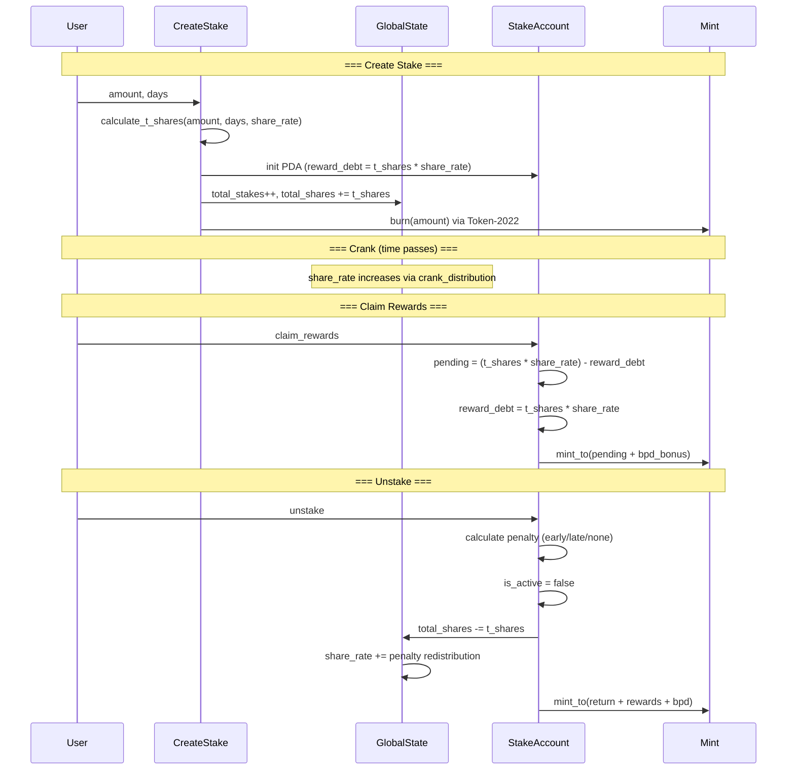

# Program Core Staking Instructions

## create_stake, unstake, and claim_rewards -- the three user-facing staking operations

These three instructions implement the burn-and-mint staking lifecycle. Tokens are burned on stake creation, and new tokens are minted on claim/unstake. No token vault or escrow is needed.

### Instruction Overview

| Instruction | Signer | Mutates | CPI | Permissionless? |
|-------------|--------|---------|-----|-----------------|
| `create_stake` | user | GlobalState, StakeAccount (init), Mint | `token_2022::burn` | Yes |
| `unstake` | user (owner) | GlobalState, StakeAccount, Mint | `token_2022::mint_to` | Yes (owner only) |
| `claim_rewards` | user (owner) | GlobalState, StakeAccount, Mint | `token_2022::mint_to` | Yes (owner only) |

### create_stake (create_stake.rs)

Creates a new stake position by burning tokens from the user.

**Parameters:** `amount: u64`, `days: u16`

**Flow:**
1. Validate `amount >= min_stake_amount` and `1 <= days <= 5555`
2. Calculate T-shares via `calculate_t_shares(amount, days, share_rate)` -- applies LPB + BPB bonuses
3. Calculate `end_slot = current_slot + days * slots_per_day`
4. Calculate `reward_debt = t_shares * share_rate` (snapshot for lazy distribution)
5. Initialize `StakeAccount` PDA (seeded by `["stake", user, total_stakes_created]`)
6. Optionally check `remaining_accounts[0]` for `ClaimConfig` to set BPD eligibility flags (DEPRECATED -- fields set but never read)
7. Update GlobalState counters: `total_stakes_created++`, `total_tokens_staked += amount`, `total_shares += t_shares`
8. **Burn** tokens from user's token account via Token-2022 CPI
9. Emit `StakeCreated` event

**Key detail:** The stake_id comes from `global_state.total_stakes_created` *before* incrementing, making it 0-indexed.

### unstake (unstake.rs)

Closes a stake, applying early/late penalties, and mints return + rewards + BPD bonus.

**Flow:**
1. **Block if BPD window active** (`global_state.is_bpd_window_active()` check, HIGH-2 fix)
2. Calculate `pending_rewards = (t_shares * share_rate) - reward_debt`
3. Determine penalty:
   - **Early** (current_slot < end_slot): Linear penalty based on time not served, minimum 50%
   - **Late** (current_slot > end_slot + 14 days grace): Linear penalty from 0% to 100% over 351 days
   - **On-time** (within grace period): No penalty
4. `return_amount = staked_amount - penalty`
5. `total_mint = return_amount + pending_rewards + bpd_bonus_pending`
6. **Mark `is_active = false` BEFORE CPI** (reentrancy prevention)
7. Clear `bpd_bonus_pending`
8. Update GlobalState: decrement `total_shares`, `total_tokens_staked`; increment `total_unstakes_created`, `total_tokens_unstaked`
9. **Redistribute penalty** to remaining stakers: `share_rate += (penalty * PRECISION) / total_shares`
10. Mint `total_mint` to user via Token-2022 CPI
11. Emit `StakeEnded` event

### claim_rewards (claim_rewards.rs)

Claims accumulated inflation rewards (and any BPD bonus) without closing the stake.

**Flow:**
1. Calculate `pending_rewards = (t_shares * share_rate) - reward_debt`
2. Add `bpd_bonus_pending` to get `total_rewards`
3. Require `total_rewards > 0`
4. **Update `reward_debt = t_shares * share_rate` BEFORE CPI** (double-claim prevention)
5. Clear `bpd_bonus_pending`
6. Increment `total_claims_created`
7. Mint `total_rewards` to user

**Lazy migration:** Uses `realloc = StakeAccount::LEN` + `realloc::payer = user` to transparently resize old stake accounts (92B or 113B) to the current 117B layout.

### Penalty Mechanics

| Timing | Penalty | Formula |
|--------|---------|---------|
| Early (< end_slot) | 50%-100% of principal | `max(50%, 100% - served_fraction)` of staked_amount (rounded up) |
| Grace period (end_slot to end_slot + 14 days) | 0% | No penalty |
| Late (14-365 days after end_slot) | 0%-100% linear | `(late_days - 14) / 351 * staked_amount` (rounded up, capped at 100%) |

Penalties are redistributed to remaining stakers by increasing `share_rate`, not burned.

### Notable Gotchas
- `unstake` is blocked during BPD window (`reserved[0] != 0`) to prevent share-count manipulation mid-distribution
- The `create_stake` ClaimConfig check via `remaining_accounts` sets `bpd_eligible` and `claim_period_start_slot`, but these fields are DEPRECATED and never read by BPD instructions -- eligibility is determined by slot range checks instead
- `claim_rewards` performs lazy realloc from 92B/113B to 117B, so the user pays rent for the size increase
- Early penalty uses `mul_div_up` (round-up) to favor the protocol; a user unstaking immediately gets exactly 0% back (100% penalty)
- Reward calculation uses `u128` intermediates but stores `reward_debt` as `u64`, which can overflow for very large t_shares * share_rate combinations (returns `RewardDebtOverflow`)

[[on-chain-program.md]]
