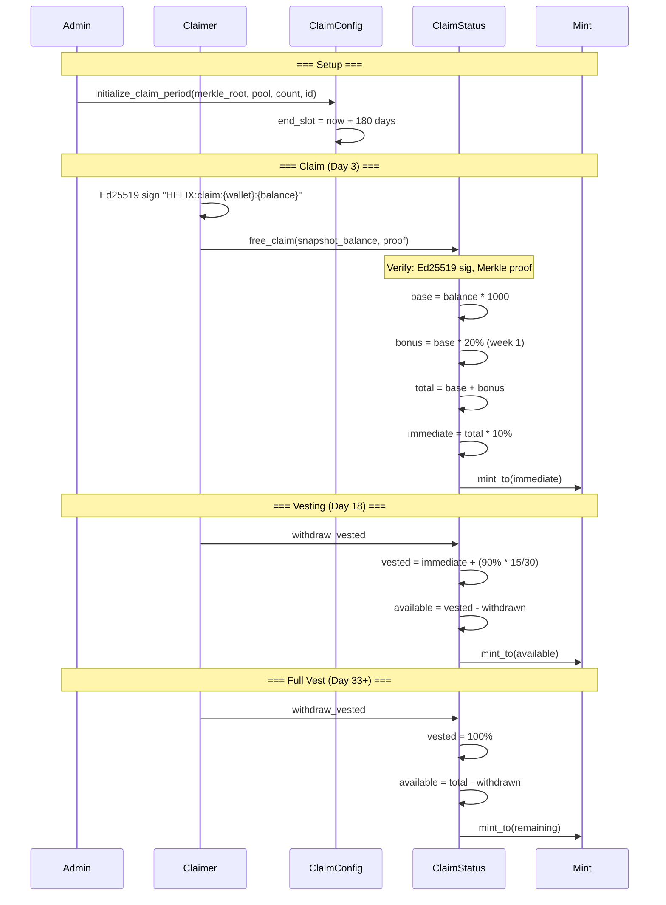

# Program Free Claim System

## initialize_claim_period, free_claim, and withdraw_vested -- the airdrop distribution pipeline

The free claim system distributes HLX tokens to Solana holders based on a snapshot. It uses a Merkle tree for eligibility verification, Ed25519 signature introspection for MEV prevention, speed bonuses for early claimers, and a 30-day linear vesting schedule.

### Instruction Overview

| Instruction | Signer | Auth | Purpose |
|-------------|--------|------|---------|
| `initialize_claim_period` | authority | Admin only | Set Merkle root, start 180-day window |
| `free_claim` | claimer | Merkle proof + Ed25519 sig | Claim tokens, get 10% immediately |
| `withdraw_vested` | claimer (original) | Must match `snapshot_wallet` | Withdraw unlocked vesting tokens |

### initialize_claim_period (initialize_claim_period.rs)

Admin-only setup for a new claim period. Creates the `ClaimConfig` PDA.

**Parameters:** `merkle_root: [u8; 32]`, `total_claimable: u64`, `total_eligible: u32`, `claim_period_id: u32`

**Key validations:**
- `claim_period_id > 0` (MED-5 fix: 0 would collide with StakeAccount default `bpd_claim_period_id`)
- Authority must match `GlobalState.authority`

**Initializes:**
- `end_slot = current_slot + 180 * slots_per_day`
- All BPD pagination fields zeroed
- `claim_period_started = true` (makes Merkle root immutable)

### free_claim (free_claim.rs)

The core claim instruction. Four security checks, then token math and minting.

**Parameters:** `snapshot_balance: u64` (lamports), `proof: Vec<[u8; 32]>`

**Security checks (in order):**
1. **Claim period active:** `clock.slot <= claim_config.end_slot`
2. **Minimum balance:** `snapshot_balance >= 0.1 SOL` (100,000,000 lamports)
3. **Ed25519 signature:** Verifies the immediately-preceding instruction is an Ed25519 verify for message `"HELIX:claim:{pubkey}:{amount}"` signed by `snapshot_wallet`
4. **Merkle proof:** Leaf = `keccak256(wallet || amount || claim_period_id)`, walks up tree to verify root

**Token calculation:**
1. `base_amount = snapshot_balance * HELIX_PER_SOL / 10` (= snapshot_balance * 1000, converting 9-decimal SOL to 8-decimal HLX at 10,000:1 ratio)
2. Speed bonus:
   - Days 0-7: +20% (2000 bps)
   - Days 8-28: +10% (1000 bps)
   - Days 29+: 0%
3. `total_amount = base_amount + bonus_amount`
4. Split: 10% immediate (`mul_div(total, 1000, 10000)`), 90% vesting over 30 days

**Post-calculation:**
- Initialize `ClaimStatus` PDA (double-claim prevented by PDA init)
- `withdrawn_amount = immediate_amount` (immediate portion counts as already withdrawn)
- Update `ClaimConfig.total_claimed` and `claim_count`
- Mint immediate portion via Token-2022

**Important constraint:** `snapshot_wallet.key() == claimer.key()` -- no delegation allowed (MEDIUM-3 security fix). The claimer must be the actual snapshot wallet holder.

### withdraw_vested (withdraw_vested.rs)

Allows claimer to withdraw tokens that have vested since the claim.

**Flow:**
1. Calculate total vested: `immediate + (vesting_portion * elapsed / vesting_duration)`
2. `available = total_vested - withdrawn_amount`
3. Require `available > 0`
4. Update `withdrawn_amount` BEFORE CPI (reentrancy prevention)
5. Mint `available` to claimer

**Vesting formula:** Linear release over 30 days from claim slot. After `vesting_end_slot`, 100% is available.

### Speed Bonus Tiers

| Window | Days Elapsed | Bonus | Example (1 SOL snapshot) |
|--------|-------------|-------|------------------------|
| Week 1 | 0-7 | +20% | 12,000 HLX |
| Weeks 2-4 | 8-28 | +10% | 11,000 HLX |
| After month 1 | 29+ | 0% | 10,000 HLX |

### Notable Gotchas
- The Ed25519 signature must be the instruction **immediately before** `free_claim` in the transaction (index = current - 1). If not, it fails.
- `ClaimStatus` PDA seeds include `merkle_root[0..8]` -- this means different claim periods (with different roots) produce different PDAs, enabling future multi-period support
- `snapshot_wallet == claimer` constraint (no delegation) was a MEDIUM-3 security fix to prevent front-running attacks where an attacker could claim on behalf of someone else
- `total_claimable` is not enforced on-chain per claim (no `require(total_claimed <= total_claimable)`). The Merkle tree is the trust boundary.
- Overflow fixes (ADDL-1, ADDL-2, ADDL-3) use `mul_div` throughout to handle large snapshot balances via u128 intermediates
- `withdrawn_amount` starts at `immediate_amount` (not 0), so the vesting math correctly tracks cumulative withdrawals including the initial release

[[on-chain-program.md]]
