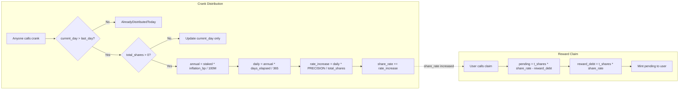

# Program Inflation & Distribution

## crank_distribution and math.rs -- the permissionless inflation engine

The inflation system uses a "lazy distribution" pattern: instead of iterating over all stakes, it increases a global `share_rate` scalar. Each stake's pending rewards are computed on-demand as `(t_shares * share_rate) - reward_debt`.

### crank_distribution (crank_distribution.rs)

A permissionless instruction that anyone can call to advance the protocol's day counter and increase the share rate.

**Accounts:** Cranker (signer, anyone), GlobalState (mut), Mint (read), MintAuthority (read)

**Flow:**

1. Calculate `current_day = (current_slot - init_slot) / slots_per_day`
2. Require `current_day > global_state.current_day` (prevent double-distribution)
3. Calculate `days_elapsed = current_day - global_state.current_day` (supports multi-day catch-up)
4. If `total_shares == 0`: just update `current_day` and return (no division by zero)
5. Calculate inflation:
   - `annual_inflation = total_tokens_staked * annual_inflation_bp / 100_000_000`
   - `daily_inflation_total = annual_inflation * days_elapsed / 365`
   - `share_rate_increase = daily_inflation_total * PRECISION / total_shares`
6. Update `share_rate += share_rate_increase`
7. Update `current_day = current_day`
8. Emit `InflationDistributed` event

**Key design decision:** Inflation is based on `total_tokens_staked` (not `mint.supply`) because in the burn-and-mint model, supply does not reflect locked value.

### math.rs -- Core Financial Functions

All financial math lives in `instructions/math.rs`. Every function uses `u128` intermediates to prevent overflow.

| Function | Signature | Purpose |
|----------|-----------|---------|
| `mul_div(a, b, c)` | `u64 -> u64` | `(a * b) / c` via u128, floors |
| `mul_div_up(a, b, c)` | `u64 -> u64` | `((a * b) + (c-1)) / c` via u128, rounds up |
| `calculate_lpb_bonus(days)` | `u64 -> u64` | Longer Pays Better: 0x at 1 day, 2x at 3641+ days |
| `calculate_bpb_bonus(amount)` | `u64 -> u64` | Bigger Pays Better: 0x at 0, 1x at 150M+ tokens |
| `calculate_t_shares(amount, days, rate)` | `u64 -> u64` | `amount * (1 + LPB + BPB) / share_rate` |
| `calculate_early_penalty(...)` | `u64 -> u64` | Linear penalty, min 50%, rounded up |
| `calculate_late_penalty(...)` | `u64 -> u64` | Linear from 0% to 100% over 351 days, rounded up |
| `calculate_pending_rewards(...)` | `u64 -> u64` | `(t_shares * share_rate) - reward_debt` |
| `calculate_reward_debt(...)` | `u64 -> u64` | `t_shares * share_rate`, returns `RewardDebtOverflow` if > u64::MAX |
| `get_current_day(...)` | `u64 -> u64` | `(current_slot - init_slot) / slots_per_day` |

### T-Share Calculation Detail

```
t_shares = staked_amount * total_multiplier / share_rate

where total_multiplier = PRECISION + lpb_bonus + bpb_bonus
```

**LPB (Longer Pays Better):**
- 1 day: 0 bonus
- Linear scale: `(days - 1) * 2 * PRECISION / 3641`
- 3641+ days: exactly `2 * PRECISION` (capped)

**BPB (Bigger Pays Better):**
- Linear: `(amount / 10) * PRECISION / BPB_THRESHOLD`
- Threshold: 150M tokens (8 decimals) = `150_000_000_00_000_000`
- At threshold: exactly `PRECISION` (100% bonus, capped)

**Maximum multiplier:** `1x (base) + 2x (LPB) + 1x (BPB) = 4x` for a 3641+ day stake of 150M+ tokens.



### Constants Used

| Constant | Value | Purpose |
|----------|-------|---------|
| `PRECISION` | 1,000,000,000 (1e9) | Fixed-point scaling factor |
| `LPB_MAX_DAYS` | 3,641 | ~10 years for full 2x LPB |
| `BPB_THRESHOLD` | 150,000,000_00_000_000 | 150M tokens at 8 decimals |
| `MAX_STAKE_DAYS` | 5,555 | Maximum stake duration |
| `BPS_SCALER` | 10,000 | Basis point denominator |
| `MIN_PENALTY_BPS` | 5,000 | 50% minimum early penalty |
| `GRACE_PERIOD_DAYS` | 14 | No late penalty within grace |
| `LATE_PENALTY_WINDOW_DAYS` | 351 | 365 - 14 = linear to 100% |

### Notable Gotchas
- `crank_distribution` supports multi-day catch-up: if nobody cranks for 3 days, the next crank distributes all 3 days at once using `days_elapsed`
- Inflation is computed against `total_tokens_staked`, not circulating supply. This means inflation compounds relative to locked value.
- `mul_div` floors (truncates) by default; `mul_div_up` rounds up and is used only for penalties (protocol-favorable rounding)
- `calculate_pending_rewards` uses `saturating_sub` for the case where `reward_debt > current_value` -- this should never happen but is defensive
- `calculate_reward_debt` can return `RewardDebtOverflow` if `t_shares * share_rate > u64::MAX` -- this would permanently lock a stake's rewards. The overflow threshold is approximately when share_rate has increased ~4.3 billion times from starting rate (unlikely in practice but not impossible over very long timeframes)
- All math is deterministic and matches the frontend TypeScript implementations using `BigInt` (documented in function comments)

[[on-chain-program.md]]
