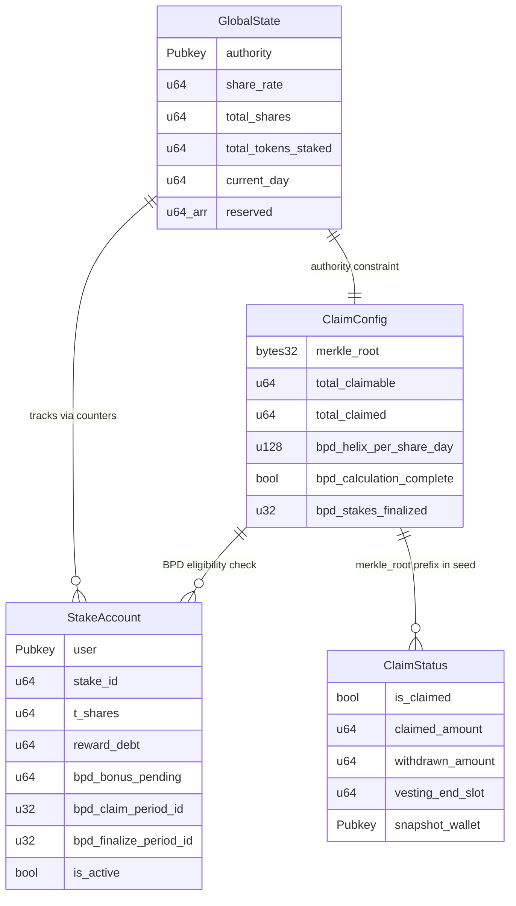

# Program State Accounts

## Four PDA-based accounts that store all on-chain protocol state

The Helix Staking program uses four Anchor `#[account]` structs, each stored as a PDA with deterministic seeds. There are no token vaults -- the protocol uses burn-and-mint, so state accounts only track accounting, not custody.

### Account Summary

| Account | Size | Seeds | Singleton? | Purpose |
|---------|------|-------|------------|---------|
| `GlobalState` | 247B | `["global_state"]` | Yes | Protocol params, share rate, aggregate counters |
| `StakeAccount` | 117B | `["stake", user, stake_id]` | No (1 per stake) | Per-stake position data |
| `ClaimConfig` | 184B | `["claim_config"]` | Yes | Free claim period + BPD calculation state |
| `ClaimStatus` | 76B | `["claim_status", root_prefix[0..8], wallet]` | No (1 per claimer per period) | Per-user claim tracking + vesting |

### GlobalState (global_state.rs)

The protocol singleton. Holds all tunable parameters and aggregate metrics.

**Key fields:**

| Field | Type | Purpose |
|-------|------|---------|
| `authority` | `Pubkey` | Admin key (future governance) |
| `mint` | `Pubkey` | HLX Token-2022 mint address |
| `share_rate` | `u64` | Tokens-per-share, starts at 10,000. Increases via crank + penalties |
| `annual_inflation_bp` | `u64` | 3,690,000 = 3.69% (basis points with 2 extra decimals) |
| `total_shares` | `u64` | Sum of all active T-shares |
| `total_tokens_staked` | `u64` | Sum of staked amounts (used as inflation base) |
| `current_day` | `u64` | Last day that received inflation distribution |
| `reserved[0]` | `u64` | **Repurposed** as BPD window flag (0 = inactive, 1 = active) |

**Helper methods:**
- `is_bpd_window_active()` -- reads `reserved[0]` to check if unstaking is blocked
- `set_bpd_window_active(bool)` -- sets the flag; called by `finalize_bpd_calculation` (on) and `trigger_big_pay_day`/`abort_bpd` (off)

### StakeAccount (stake_account.rs)

One account per stake position. Seeded by user pubkey + auto-incrementing stake_id.

**Key fields:**

| Field | Type | Purpose |
|-------|------|---------|
| `user` | `Pubkey` | Owner |
| `stake_id` | `u64` | Unique ID from `GlobalState.total_stakes_created` |
| `staked_amount` | `u64` | Tokens burned on creation |
| `t_shares` | `u64` | T-shares (includes LPB + BPB bonuses) |
| `reward_debt` | `u64` | `t_shares * share_rate` at last claim/creation |
| `is_active` | `bool` | False after unstake |
| `bpd_bonus_pending` | `u64` | BPD bonus written by `trigger_big_pay_day`, claimed via `claim_rewards` or `unstake` |
| `bpd_claim_period_id` | `u32` | Prevents duplicate BPD distribution per period |
| `bpd_finalize_period_id` | `u32` | Prevents duplicate counting in `finalize_bpd_calculation` |

**Deprecated fields (kept for layout compatibility):**
- `bpd_eligible` -- set by `create_stake` but never checked
- `claim_period_start_slot` -- set by `create_stake` but never read

**Migration history:** 92B -> 113B -> 117B. The `claim_rewards` instruction uses `realloc` to lazily migrate old accounts. A dedicated `migrate_stake` instruction also exists.

### ClaimConfig (claim_config.rs)

Singleton that tracks one free-claim period and the BPD calculation state machine.

**Key fields:**

| Field | Type | Purpose |
|-------|------|---------|
| `merkle_root` | `[u8; 32]` | Snapshot Merkle root (immutable after init) |
| `total_claimable` / `total_claimed` | `u64` | Pool accounting |
| `start_slot` / `end_slot` | `u64` | Claim window (180 days) |
| `claim_period_id` | `u32` | Must be > 0 (MED-5 fix) |
| `bpd_remaining_unclaimed` | `u64` | Unclaimed tokens for BPD pool |
| `bpd_total_share_days` | `u128` | Accumulated across finalize batches |
| `bpd_helix_per_share_day` | `u128` | Rate set by `seal_bpd_finalize` |
| `bpd_calculation_complete` | `bool` | Gate for `trigger_big_pay_day` |
| `bpd_snapshot_slot` | `u64` | Pinned on first finalize batch for consistent days_staked |
| `bpd_stakes_finalized` / `bpd_stakes_distributed` | `u32` | Counter-based completion detection |

### ClaimStatus (claim_status.rs)

One per claimer per claim period. Seeds use the first 8 bytes of the Merkle root to allow future multi-period support.

**Key fields:**

| Field | Type | Purpose |
|-------|------|---------|
| `is_claimed` | `bool` | Double-claim guard (PDA init also prevents this) |
| `claimed_amount` | `u64` | Total amount (base + speed bonus) |
| `withdrawn_amount` | `u64` | Cumulative withdrawals (prevents double-withdrawal) |
| `vesting_end_slot` | `u64` | `claimed_slot + 30 days` |
| `snapshot_wallet` | `Pubkey` | Must match claimer (no delegation, MEDIUM-3 fix) |
| `bonus_bps` | `u16` | 0, 1000, or 2000 (speed bonus tier) |

### Notable Gotchas
- `GlobalState.reserved[0]` is secretly the BPD window flag -- not documented in the struct definition comments, only via helper methods
- `StakeAccount` has been migrated 3 times (92B -> 113B -> 117B); old accounts in the wild need realloc before the new fields can be read
- `ClaimConfig.authority` is DEPRECATED -- authority is checked via `GlobalState.authority` constraint, but the field remains for layout compatibility
- `claim_period_id` must be > 0; a value of 0 would collide with `StakeAccount.bpd_claim_period_id`'s default, causing all stakes to be skipped during BPD distribution
- `bpd_total_share_days` and `bpd_helix_per_share_day` are `u128` to handle overflow, but the BPD event emits them truncated to `u64` via `.min(u64::MAX as u128) as u64`

[[on-chain-program.md]]
