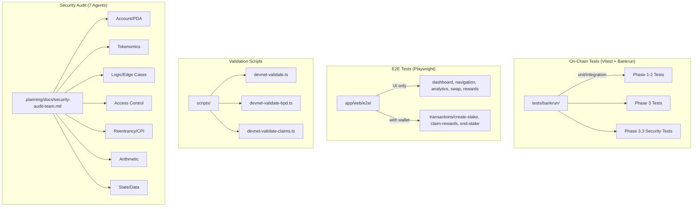

# Test & Audit Infrastructure

## Bankrun tests, Playwright E2E, security audits, validation scripts

Multi-layered testing spanning on-chain program tests (Vitest + Bankrun), frontend E2E (Playwright), devnet validation scripts, and a 7-agent security audit system.

### Test Architecture

### Test Coverage
| Suite | Count | Coverage |
|-------|-------|----------|
| Bankrun (Phase 1-2) | ~20 | Core staking lifecycle |
| Bankrun (Phase 3) | ~15 | Free claim, BPD, migration |
| Security (Phase 3.3) | 10/10 | CRIT-1, HIGH-1/2, MED-1 |
| Playwright UI | 5 suites | Dashboard, nav, analytics, swap, rewards |
| Playwright Tx | 3 suites | Create stake, claim, end stake |

### Notable Gotchas & Tech Debt
- Bankrun uses `forks` pool mode - no parallel test execution
- 1000s timeout needed for long-running BPD batch tests
- E2E transaction tests need real SOL (separate from UI tests)
- No CI/CD pipeline configured yet (Phase 8 remaining work)
- `TestWalletAdapter` only loaded when env var set (production-safe)

## Child Nodes

- [[test-bankrun-core.md]] -- Core staking lifecycle tests (initialize, createStake, unstake, claimRewards, crankDistribution)
- [[test-bankrun-phase3.md]] -- Free claim, BPD distribution, vesting, and account migration tests
- [[test-security.md]] -- Security audit finding regression tests (CRIT-1, HIGH-1/2, MED-1, CRIT-NEW-1)
- [[test-playwright-e2e.md]] -- Browser E2E tests for Next.js dashboard, navigation, and transaction flows
- [[test-validation-audit.md]] -- Devnet validation scripts and 7-agent security audit configuration

[[run_me.md]]
