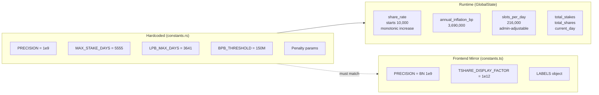

# Constants & Configuration

## All protocol parameters, PDA seeds, precision factors, and configurable admin values in one reference

Protocol constants are defined in on-chain `constants.rs` and mirrored in frontend `constants.ts`. Some values are hardcoded; others are stored in `GlobalState` and admin-adjustable at runtime.

### Hardcoded Protocol Constants

| Constant | On-chain Value | Frontend Value | Purpose |
|---|---|---|---|
| `PRECISION` | `1_000_000_000` (1e9) | `new BN(1_000_000_000)` | Fixed-point scaling for bonuses/rates |
| `MAX_STAKE_DAYS` | `5555` | `5555` | Maximum stake duration (~15.2 years) |
| `LPB_MAX_DAYS` | `3641` | `3641` | Days for full 2x duration bonus (~10 years) |
| `BPB_THRESHOLD` | `150_000_000_00_000_000` | `new BN("15000000000000000")` | 150M tokens (8 decimals) for BPB calculation |
| `MIN_PENALTY_BPS` | `5000` | `5000` | 50% minimum early unstake penalty |
| `BPS_SCALER` | `10_000` | `10_000` | Basis points denominator |
| `GRACE_PERIOD_DAYS` | `14` | `14` | Post-maturity grace period |
| `LATE_PENALTY_WINDOW_DAYS` | `351` | `351` | Days for late penalty to reach 100% |
| `TOKEN_DECIMALS` | `8` | `8` | HELIX token decimal places |
| `DEFAULT_ANNUAL_INFLATION_BP` | `3_690_000` | -- | 3.69% in extended basis points |
| `DEFAULT_STARTING_SHARE_RATE` | `10_000` | -- | 1:1 at launch |
| `DEFAULT_SLOTS_PER_DAY` | `216_000` | `216_000` | ~400ms per slot |
| `DEFAULT_MIN_STAKE_AMOUNT` | `10_000_000` | -- | 0.1 HELIX minimum |

### Display Constants (Frontend Only)

| Constant | Value | Purpose |
|---|---|---|
| `TSHARE_DISPLAY_FACTOR` | `new BN("1000000000000")` (1e12) | Scale raw T-Shares for human display |
| `PROGRAM_ID` | `E9B7Bs...` | Deployed program address |
| `LABELS.*` | User-facing strings | LPB="Duration Bonus", BPB="Size Bonus", etc. |

### Claim & Vesting Constants

| Constant | Value | Purpose |
|---|---|---|
| `CLAIM_PERIOD_DAYS` | `180` | 6-month claim window |
| `VESTING_DAYS` | `30` | 30-day graduated release |
| `IMMEDIATE_RELEASE_BPS` | `1000` (10%) | Portion available immediately |
| `VESTED_RELEASE_BPS` | `9000` (90%) | Portion that vests over 30 days |
| `SPEED_BONUS_WEEK1_BPS` | `2000` (+20%) | Bonus for claiming in week 1 |
| `SPEED_BONUS_WEEK2_4_BPS` | `1000` (+10%) | Bonus for claiming in weeks 2-4 |
| `HELIX_PER_SOL` | `10_000` | Snapshot claim ratio |
| `MIN_SOL_BALANCE` | `100_000_000` | 0.1 SOL minimum for claim |
| `MAX_MERKLE_PROOF_LEN` | `20` | Supports 1M+ claimants |

### PDA Seeds

| Seed | On-chain | Frontend |
|---|---|---|
| `GLOBAL_STATE_SEED` | `b"global_state"` | `Buffer.from("global_state")` |
| `MINT_SEED` | `b"helix_mint"` | `Buffer.from("helix_mint")` |
| `MINT_AUTHORITY_SEED` | `b"mint_authority"` | `Buffer.from("mint_authority")` |
| `STAKE_SEED` | `b"stake"` | `Buffer.from("stake")` |
| `CLAIM_CONFIG_SEED` | `b"claim_config"` | `Buffer.from("claim_config")` |
| `CLAIM_STATUS_SEED` | `b"claim_status"` | `Buffer.from("claim_status")` |

### Admin-Adjustable Parameters (in GlobalState)

These are set at `initialize` and can be changed by the authority:

| Field | Default | Admin Instruction |
|---|---|---|
| `annual_inflation_bp` | 3,690,000 | (future governance) |
| `min_stake_amount` | 10,000,000 | (future governance) |
| `slots_per_day` | 216,000 | `admin_set_slots_per_day` |
| `claim_period_days` | 180 | (set at init) |

### Mermaid: Configuration Hierarchy

### Notable Gotchas

- **BPB_THRESHOLD representation differs**: On-chain uses `150_000_000_00_000_000` (Rust underscore grouping for 150M at 8 decimals). Frontend uses `"15000000000000000"` (string for BN). Same numeric value, different literal formats.
- **PRECISION vs TSHARE_DISPLAY_FACTOR**: `PRECISION` (1e9) is for internal math scaling. `TSHARE_DISPLAY_FACTOR` (1e12) is purely for UI display. Confusing them will produce wildly wrong numbers.
- **Extended basis points**: `annual_inflation_bp = 3_690_000` is NOT standard basis points (which use 10,000 = 100%). It uses 100,000,000 as the denominator for extra precision. This is why the divisor in `crank_distribution.rs` is `100_000_000`, not `10_000`.
- **`reserved[0]` double-duty**: `GlobalState.reserved[0]` is used as the BPD window active flag (`is_bpd_window_active`). The other 5 reserved slots are truly unused.
- **Seeds must be byte-identical** between on-chain and frontend. Any discrepancy means PDA derivation fails silently (wrong address, account not found).
- **`slots_per_day` can drift**: If Solana's actual slot time changes, admin can update this. But changing it affects all future day calculations, penalty windows, and inflation timing retroactively for in-progress stakes.

### Key Source Files

- On-chain: `programs/helix-staking/src/constants.rs`
- Frontend: `app/web/lib/solana/constants.ts`
- State: `programs/helix-staking/src/state/global_state.rs`

[[tokenomics-engine.md]]
