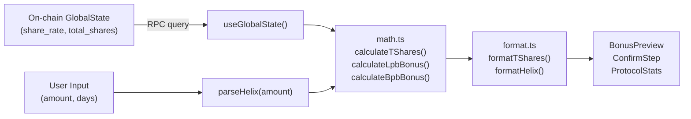

# Frontend Math Mirror

## TypeScript reimplementation of on-chain math using BN.js for real-time previews and display formatting

The frontend must replicate on-chain calculations exactly so that bonus previews, penalty estimates, and reward displays match what the blockchain will compute. Any divergence is a user-visible bug.

### Architecture

```
math.ts          -- Pure BN arithmetic functions (mirrors math.rs)
constants.ts     -- Protocol parameters (mirrors constants.rs)
format.ts        -- Display formatting (HELIX amounts, T-Shares, BPS, days)
```

Components consume these via:
- `bonus-preview.tsx` -- Live T-Share preview as user adjusts amount/days
- `confirm-step.tsx` -- Final review before stake submission
- `protocol-stats.tsx` -- Dashboard stats (total staked, share rate, etc.)

### Function Parity Table

| On-chain (math.rs) | Frontend (math.ts) | Notes |
|---|---|---|
| `mul_div(a, b, c)` | `mulDiv(a, b, c)` | u128 vs BN (both safe from overflow) |
| `mul_div_up(a, b, c)` | `mulDivUp(a, b, c)` | Ceiling division for penalties |
| `calculate_lpb_bonus(days)` | `calculateLpbBonus(stakeDays)` | Identical formula |
| `calculate_bpb_bonus(amount)` | `calculateBpbBonus(stakedAmount)` | Both do `/10` first |
| `calculate_t_shares(amt, days, rate)` | `calculateTShares(amt, days, rate)` | Same formula |
| `calculate_early_penalty(...)` | `calculateEarlyPenalty(...)` | Same slot-based |
| `calculate_late_penalty(...)` | `calculateLatePenalty(...)` | Same slot-based |
| `calculate_pending_rewards(...)` | `calculatePendingRewards(...)` | Same lazy diff |
| `calculate_reward_debt(...)` | (not mirrored) | Only needed on-chain at stake creation |
| `get_current_day(...)` | (not mirrored) | Only needed by crank |

### BN.js Arithmetic Patterns

The frontend uses `bn.js` for arbitrary-precision integers:

```typescript
// mulDiv: (a * b) / c -- no overflow risk with BN
function mulDiv(a: BN, b: BN, c: BN): BN {
  return a.mul(b).div(c);
}

// mulDivUp: ceiling division -- matches on-chain rounding
function mulDivUp(a: BN, b: BN, c: BN): BN {
  return a.mul(b).add(c.sub(ONE)).div(c);
}
```

On-chain uses `u128` intermediates to prevent overflow in `u64 * u64 / u64`. BN.js is arbitrary precision so this is not a concern, but the **truncation behavior** (integer floor division) must match.

### Display Formatting (format.ts)

| Function | Input | Output Example | Notes |
|---|---|---|---|
| `formatHelix(bn)` | `BN(100_000_000)` | `"1.00 HELIX"` | Trims trailing zeros, keeps min 2 decimals |
| `formatHelixCompact(bn)` | `BN(1.5e14)` | `"1.50M"` | K/M/B suffixes for large values |
| `parseHelix(str)` | `"1.5"` | `BN(150_000_000)` | Truncates to 8 decimals (no rounding) |
| `formatBps(n)` | `5000` | `"50.00%"` | Basis points to percentage |
| `formatDays(n)` | `365` | `"365 days"` | Years for large values |
| `formatTShares(bn)` | raw T-Shares | `"123.45"` | Divides by 1e12 display factor |
| `truncateAddress(s)` | `"AbCdEf...6789"` | `"AbCd...6789"` | 4+4 chars |

### Mermaid: Data Flow from Chain to Display



### Bonus-to-Percentage Conversion Pattern

Both `bonus-preview.tsx` and `confirm-step.tsx` convert PRECISION-scaled bonuses to display percentages:

```typescript
const lpbPercent = lpbBonus.mul(new BN(10000)).div(PRECISION).toNumber() / 100;
//  e.g., PRECISION (1e9) -> 10000 -> / 100 -> 100.00%
```

This is `bonus * 10000 / 1e9` then divide by 100 for percentage with 2 decimal places. The intermediate `* 10000` preserves 2 decimal digits of precision before converting to JS `number`.

### parseHelix: Truncation (Not Rounding)

```typescript
// "1.123456789" with TOKEN_DECIMALS=8 -> truncates to "1.12345678"
if (decimalPart.length > TOKEN_DECIMALS) {
  decimalPart = decimalPart.slice(0, TOKEN_DECIMALS);  // truncate, don't round
}
```

This matches on-chain behavior where amounts are always in base units (integers). The frontend never rounds user input -- it floors to the nearest base unit.

### Notable Gotchas

- **BN.js vs BigInt**: The codebase uses `bn.js` (not native `BigInt`). This is because `@solana/web3.js` and Anchor use BN. Mixing BN and BigInt will cause silent type errors.
- **PRECISION vs TSHARE_DISPLAY_FACTOR confusion**: `PRECISION = 1e9` is for math scaling. `TSHARE_DISPLAY_FACTOR = 1e12` is only for `formatTShares`. Using the wrong one produces 1000x errors.
- **`shareRate` type mismatch**: On-chain it is `u64`. The frontend receives it as a `BN` (from Anchor deserialization) but some paths convert via `.toString()` and back (`new BN(globalState.shareRate.toString())`). Ensure consistency.
- **Slot-based not timestamp-based**: All penalty calculations use slot numbers, not Unix timestamps. The frontend must fetch `Clock.slot` for accurate penalty previews (or approximate via `slots_per_day`).
- **Compact formatting truncates**: `formatHelixCompact` uses integer division for K/M/B, losing precision. `1,999,999 HELIX` displays as `"1.99M"` not `"2.00M"`. This is cosmetic only.
- **`addCommas` regex**: The comma-insertion regex `\B(?=(\d{3})+(?!\d))` is correct for positive integers but breaks on decimal parts if called incorrectly. It is only called on the whole-number portion.
- **No server-side math**: All calculations run client-side. There is no API endpoint that computes T-Shares or penalties. If the frontend math diverges from on-chain, the user sees incorrect previews until the transaction confirms (or fails).

### Key Source Files

- Math: `app/web/lib/solana/math.ts`
- Constants: `app/web/lib/solana/constants.ts`
- Formatting: `app/web/lib/utils/format.ts`
- Bonus Preview: `app/web/components/stake/bonus-preview.tsx`
- Confirm Step: `app/web/components/stake/stake-wizard/confirm-step.tsx`
- Protocol Stats: `app/web/components/dashboard/protocol-stats.tsx`

[[tokenomics-engine.md]]
