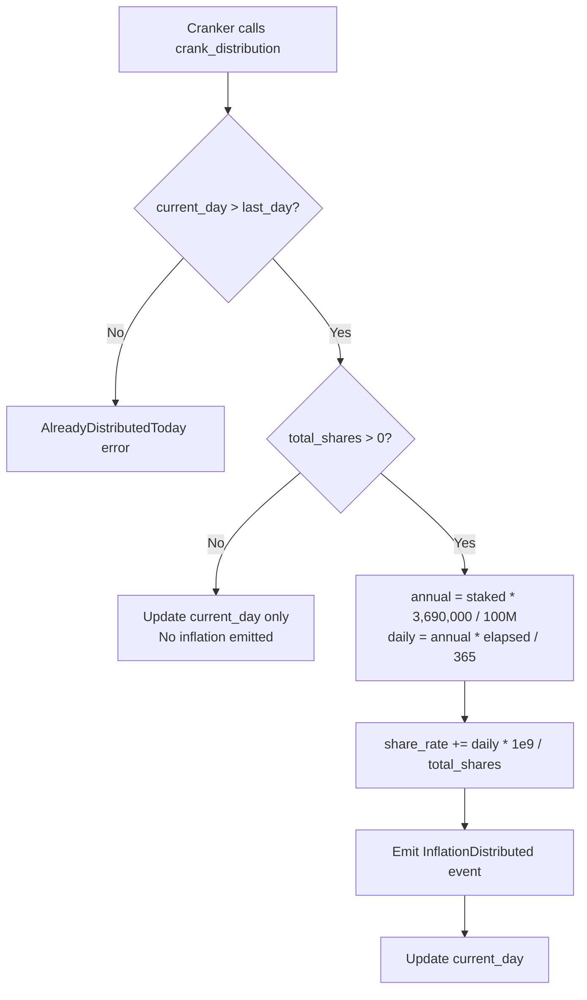

# Inflation & Distribution

## Permissionless daily crank mints virtual inflation by increasing share_rate, distributing rewards proportionally to all T-Share holders

The protocol inflates at 3.69% annually. Rather than minting tokens to each staker individually, the crank bumps a global `share_rate`. Each staker's pending rewards are computed lazily: `pending = t_shares * current_share_rate - reward_debt`.

### Core Parameters

| Parameter | Value | Stored In |
|---|---|---|
| `annual_inflation_bp` | 3,690,000 (= 3.69%) | `GlobalState` |
| `slots_per_day` | 216,000 (~400ms/slot) | `GlobalState` (admin-adjustable) |
| `share_rate` | Starts at 10,000 (1:1) | `GlobalState` (monotonically increasing) |
| `current_day` | 0-indexed from `init_slot` | `GlobalState` |

### Crank Distribution Formula

The crank (`crank_distribution.rs`) runs once per logical day. Anyone can call it (permissionless).

```
current_day = (current_slot - init_slot) / slots_per_day

days_elapsed = current_day - global_state.current_day

annual_inflation = total_tokens_staked * annual_inflation_bp / 100_000_000

daily_inflation = annual_inflation * days_elapsed / 365

share_rate_increase = daily_inflation * PRECISION / total_shares

share_rate += share_rate_increase
```

Key detail: `annual_inflation_bp = 3_690_000` with a divisor of `100_000_000` means the basis points have 2 extra digits of precision beyond the standard 10,000-based BPS.

### Lazy Distribution Model

No tokens are minted during the crank. The `share_rate` increase encodes future value:

```
pending_rewards = t_shares * current_share_rate - reward_debt
```

Actual minting only happens at **unstake** or **claim_rewards**, when the protocol mints `return_amount + pending_rewards + bpd_bonus` to the user.

### Mermaid: Daily Distribution Cycle



### Multi-Day Catch-Up

If the crank is missed for N days, the next call uses `days_elapsed = N` and distributes the full accumulated inflation in one shot. The formula `annual_inflation * days_elapsed / 365` handles this correctly, as `mul_div` preserves precision via u128 intermediates.

### Interaction with Staking/Unstaking

- **New stake**: `reward_debt = t_shares * share_rate` locks in entry point
- **Unstake**: `pending_rewards = t_shares * share_rate - reward_debt` captures all accrued inflation
- **Penalty redistribution**: When someone unstakes with a penalty, `share_rate += penalty * PRECISION / remaining_shares` gives the penalty to everyone else (see `tok-penalty-system.md`)

### Token Economics (Burn-and-Mint)

The protocol uses a burn-and-mint model:
- **Stake**: Tokens are **burned** from the user's wallet
- **Unstake**: Tokens are **minted** back (principal - penalty + rewards + BPD)
- The crank does NOT mint; it only updates `share_rate`
- `total_tokens_staked` (not `mint.supply`) is the inflation base, since supply is deflated by burns

### Notable Gotchas

- **Uses `total_tokens_staked` not mint supply** for inflation base. In a burn-and-mint model, supply does not reflect locked value.
- **Multiply before divide** (`annual * days / 365` not `(annual / 365) * days`) to preserve precision with integer arithmetic.
- **Zero-shares guard**: If no active stakes, the crank just updates `current_day` without dividing by zero.
- **HIGH-1 fix**: The `annual_inflation` calculation uses `mul_div` (u128 intermediate) to prevent overflow. Without this, overflow occurs at ~50K HELIX staked because `staked * 3_690_000` exceeds u64::MAX.
- **share_rate never decreases** -- this is a protocol invariant. It increases from inflation and from penalty redistribution.
- **Slots per day is admin-adjustable** (`admin_set_slots_per_day`), which changes the effective day length. This means the inflation rate in wall-clock time can shift if Solana's slot time drifts.

### Key Source Files

- On-chain: `programs/helix-staking/src/instructions/crank_distribution.rs`
- Math helpers: `programs/helix-staking/src/instructions/math.rs` (lines 9-17, 260-276)
- State: `programs/helix-staking/src/state/global_state.rs`
- Constants: `programs/helix-staking/src/constants.rs` (line 8)

[[tokenomics-engine.md]]
