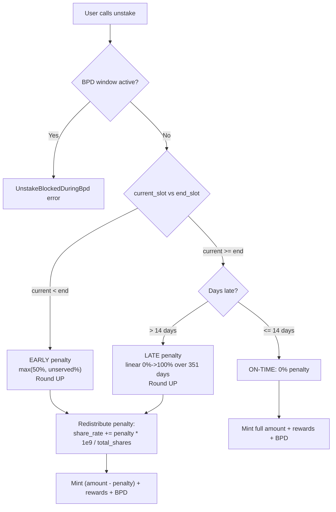

# Penalty System

## Early and late unstake penalties enforced via basis-point calculations, with forfeited tokens redistributed to remaining stakers through share_rate increases

Three timing scenarios exist at unstake: early (before maturity), on-time (within grace period), and late (after grace). Penalties are computed in both on-chain Rust and frontend TypeScript with identical formulas.

### Penalty Schedule

```
            |<--- Stake Duration --->|<- Grace ->|<--- Late Penalty Window --->|
  start_slot                     end_slot    +14 days                    +365 days
            [  EARLY: 50%-100%  ]   [ 0%  ]   [    LINEAR 0% -> 100%    ]
```

### Early Unstake Penalty

Triggered when `current_slot < end_slot`.

```
served_fraction_bps = (elapsed * 10,000) / total_duration
penalty_bps = 10,000 - served_fraction_bps
penalty_bps = max(penalty_bps, 5,000)          // enforce 50% floor
penalty_amount = ceil(staked_amount * penalty_bps / 10,000)
```

| Time Served | Natural Penalty | After 50% Floor |
|---|---|---|
| 0% | 100% | 100% |
| 25% | 75% | 75% |
| 50% | 50% | 50% |
| 75% | 25% | **50%** (floor) |
| 90% | 10% | **50%** (floor) |
| 100% | 0% (not early) | 0% |

The 50% minimum (`MIN_PENALTY_BPS = 5000`) means serving more than half your term still costs at least half. This strongly discourages early exit.

### Late Unstake Penalty

Triggered when `current_slot > end_slot + grace_period_slots`.

```
slots_late = current_slot - end_slot
late_days = slots_late / slots_per_day
if late_days <= 14:  penalty = 0     // grace period
else:
  penalty_days = late_days - 14
  penalty_bps = penalty_days * 10,000 / 351
  penalty_bps = min(penalty_bps, 10,000)    // cap at 100%
  penalty_amount = ceil(staked_amount * penalty_bps / 10,000)
```

| Days After Maturity | Penalty |
|---|---|
| 0-14 (grace) | 0% |
| 15 | ~0.28% |
| 100 | ~24.5% |
| 200 | ~53.0% |
| 365 (14 grace + 351 window) | 100% |

The late penalty window is **exactly 351 days** so that `351 * 10,000 / 351 = 10,000 bps = 100%` at day 365 post-maturity.

### Mermaid: Penalty Decision Flow



### Penalty Redistribution

Penalties are not burned; they flow back to remaining stakers via `share_rate`:

```rust
// In unstake.rs, after removing unstaker's shares:
if penalty > 0 && global_state.total_shares > 0 {
    let penalty_share_increase = mul_div(penalty, PRECISION, global_state.total_shares)?;
    global_state.share_rate += penalty_share_increase;
}
```

**Order matters**: The unstaker's `t_shares` are subtracted from `total_shares` BEFORE the redistribution, so the penalty-payer does not benefit from their own penalty.

### Rounding Direction

All penalty amounts use `mul_div_up` (ceiling division):
```
penalty = ((staked_amount * penalty_bps) + (BPS_SCALER - 1)) / BPS_SCALER
```
This rounds UP in favor of the protocol. A penalty of 50% on 101 tokens yields 51 (not 50).

### Notable Gotchas

- **50% floor on early exit** means even at 99% term completion, leaving early costs half your stake. This is a design choice inherited from HEX.
- **Round-UP arithmetic** (`mul_div_up`) means the protocol always gets the extra fractional token. Both Rust and TypeScript implement this identically.
- **BPD window blocks unstaking** (`is_bpd_window_active()` check). During Big Pay Day calculation, all unstakes are rejected to prevent share-rate manipulation.
- **Penalty type encoding**: `0` = None, `1` = Early, `2` = Late. Emitted in the `StakeEnded` event for indexer consumption.
- **Slots-per-day dependency**: Late penalty uses `slots_per_day` from GlobalState. If admin changes this value, existing late-penalty calculations shift.
- **Integer division in late_days** means partial days are truncated (floor). Being 13.9 days late still counts as 13 days (within grace).
- **Total payout**: `total_mint = (staked_amount - penalty) + pending_rewards + bpd_bonus_pending`. All three components are summed and minted in a single CPI call.

### Key Source Files

- On-chain formulas: `programs/helix-staking/src/instructions/math.rs` (lines 129-227)
- Unstake logic: `programs/helix-staking/src/instructions/unstake.rs`
- Frontend mirror: `app/web/lib/solana/math.ts` (lines 116-193)
- Constants: `programs/helix-staking/src/constants.rs` (lines 29-33)

[[tokenomics-engine.md]]
