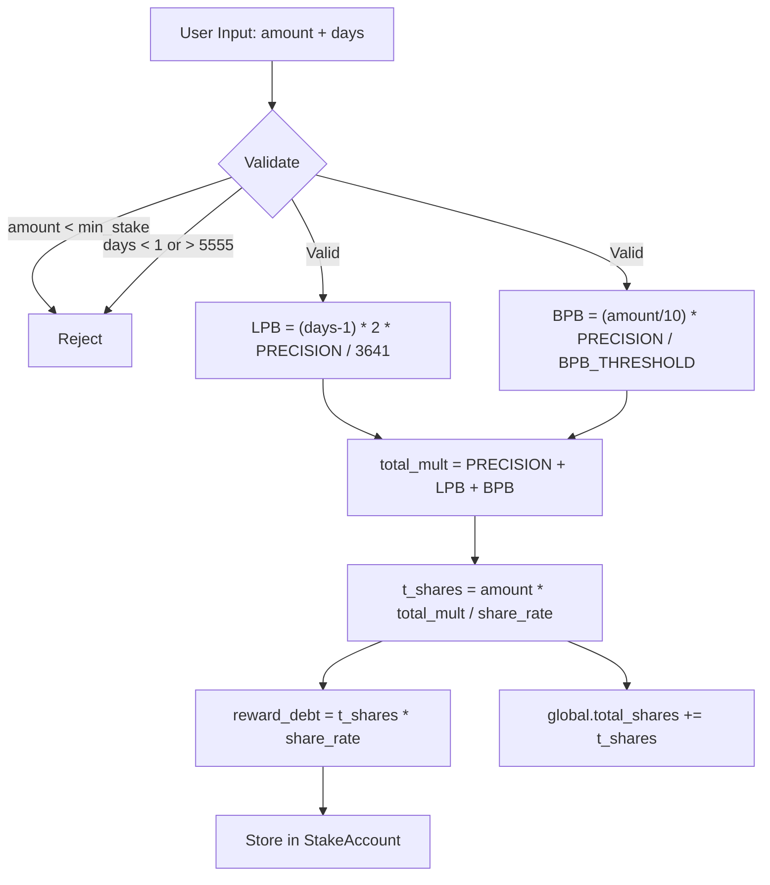

# T-Share Calculation

## Converts staked amount + duration into T-Shares using LPB and BPB bonus curves, divided by the ever-increasing share rate

T-Shares are the core accounting unit of the protocol. They determine a staker's proportional claim on daily inflation rewards. The calculation lives on-chain in `math.rs` and is mirrored exactly in the frontend `math.ts` for preview display.

### Master Formula

```
t_shares = staked_amount * (PRECISION + LPB_bonus + BPB_bonus) / share_rate
```

Where `PRECISION = 1_000_000_000` (1e9) represents the base 1x multiplier. The total multiplier therefore ranges from **1x** (no bonuses) to **4x** (max LPB 2x + max BPB 1x + base 1x).

### Duration Bonus (LPB -- Longer Pays Better)

```
if days == 0:        bonus = 0
if days >= 3641:     bonus = 2 * PRECISION   (200% cap)
else:                bonus = (days - 1) * 2 * PRECISION / 3641
```

- 1-day stake earns **zero** LPB (days-1 = 0)
- 3,641 days (~10 years) earns the full **200%** bonus
- Stakes beyond 3,641 days (up to MAX_STAKE_DAYS=5555) still cap at 200%
- Linear interpolation between 1 and 3,641

### Size Bonus (BPB -- Bigger Pays Better)

```
if amount == 0:              bonus = 0
if amount/10 >= threshold:   bonus = PRECISION   (100% cap)
else:                        bonus = (amount / 10) * PRECISION / BPB_THRESHOLD
```

Where `BPB_THRESHOLD = 150,000,000_00_000_000` (150M tokens in 8-decimal base units).

- The `/10` divisor means you need **1.5 Billion** tokens staked for 100% BPB
- Linear between 0 and the threshold
- Integer division (`amount / 10`) happens first, which loses up to 9 base units of precision

### Reward Debt (Lazy Distribution)

At stake creation, `reward_debt = t_shares * current_share_rate` is stored. This anchors the staker's entry point so that `pending_rewards = (t_shares * current_share_rate) - reward_debt` correctly reflects only post-stake inflation.

On-chain (`math.rs`):
```rust
pub fn calculate_reward_debt(t_shares: u64, share_rate: u64) -> Result<u64> {
    let result = (t_shares as u128).checked_mul(share_rate as u128)...;
    u64::try_from(result)  // RewardDebtOverflow if > u64::MAX
}
```

### Mermaid: T-Share Calculation Flow



### On-Chain vs Frontend Parity

| Function | On-chain (`math.rs`) | Frontend (`math.ts`) |
|---|---|---|
| `calculate_lpb_bonus` | `u64` with checked arithmetic | `BN` with same formula |
| `calculate_bpb_bonus` | `u64`, integer `/10` first | `BN.div(TEN)` first |
| `calculate_t_shares` | `u128` intermediate for multiply | `BN.mul()` (arbitrary precision) |
| `calculate_reward_debt` | `u128` intermediate, `RewardDebtOverflow` | Not in frontend (on-chain only) |

### Notable Gotchas

- **Share rate only increases** -- later stakers get fewer T-Shares per token, which is the core incentive to stake early.
- **BPB `/10` integer division** loses up to 9 base units (negligible but technically a floor). Both on-chain and frontend do this identically.
- **u128 intermediates** on-chain prevent overflow. Frontend BN is arbitrary-precision, so no overflow risk, but the results must match the truncation behavior of u128->u64 conversion.
- **Display scaling**: Raw on-chain T-Shares are divided by `TSHARE_DISPLAY_FACTOR = 1e12` for user display. A 10 HELIX stake at 1:1 rate shows as ~100 display T-Shares. This is purely cosmetic and separate from PRECISION.
- **1-day stake = zero LPB**: The `days - 1` formula means you need at least 2 days for any duration bonus.

### Key Source Files

- On-chain: `programs/helix-staking/src/instructions/math.rs` (lines 38-127)
- Frontend: `app/web/lib/solana/math.ts` (lines 42-106)
- UI: `app/web/components/stake/bonus-preview.tsx`

[[tokenomics-engine.md]]
