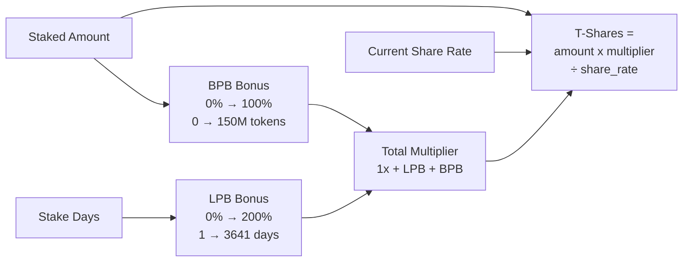

# Tokenomics Engine

## Share rate, bonuses, penalties & inflation math

Cross-cutting module spanning on-chain program (`constants.rs`, `math.rs`, instruction logic) and frontend (`lib/solana/math.ts`, `lib/utils/format.ts`). Implements HEX-inspired economic model with burn-and-mint mechanics.

### Core Parameters
| Parameter | Value |
|-----------|-------|
| Annual inflation | 3.69% (3,690,000 bp) |
| Min stake | 0.1 HELIX (10M base units) |
| Starting share rate | 10,000 (1:1) |
| Max stake duration | 5,555 days (~15.2 years) |
| LPB max days | 3,641 (10 years for 2x) |
| BPB threshold | 150M tokens (100% bonus) |
| Precision | 1e9 (fixed-point scaling) |

### T-Share Calculation

### Penalty System
| Scenario | Formula | Range |
|----------|---------|-------|
| **Early exit** | `max(50%, time_unserved%)` | 50% - 100% |
| **On-time** | 0% | 0% |
| **Late (grace)** | 0% for 14 days | 0% |
| **Late (penalty)** | Linear over 351 days | 0% → 100% |

Penalties are **redistributed** to remaining stakers via share_rate increase.

### Key Invariants
- All math uses u128 intermediates (overflow prevention)
- Division AFTER multiplication (precision preservation)
- Penalties round UP (protocol-favorable)
- share_rate only increases (monotonic)

### Notable Gotchas & Tech Debt
- Frontend `math.ts` must mirror on-chain calculations exactly - divergence = UI bugs
- `TSHARE_DISPLAY_FACTOR = 1e12` for human-readable display (separate from PRECISION)
- Slot-based time: 216,000 slots/day assumes 400ms/slot (configurable via admin)
- Penalty window: exactly 365 days late = 100% penalty (351 days after 14-day grace)

### Sub-Components

- [[tok-tshare-calculation.md]] -- LPB + BPB bonuses, share rate division, reward debt
- [[tok-inflation-distribution.md]] -- Daily crank, share_rate increase, lazy distribution model
- [[tok-penalty-system.md]] -- Early/on-time/late penalties, grace period, redistribution
- [[tok-constants-config.md]] -- All protocol parameters, PDA seeds, precision factors
- [[tok-frontend-math-mirror.md]] -- math.ts parity with on-chain, format.ts display utilities

[[run_me.md]]
